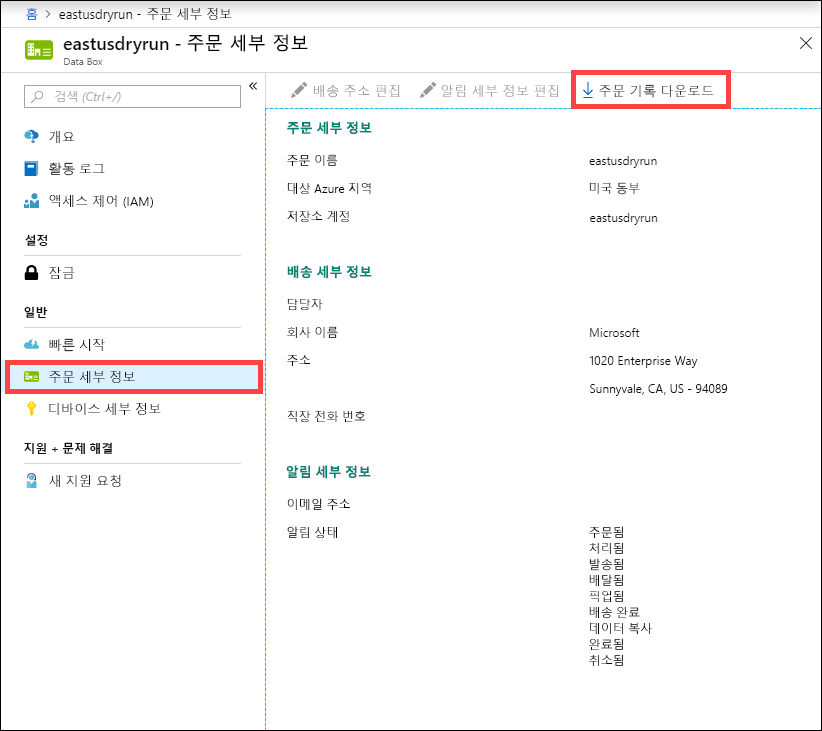
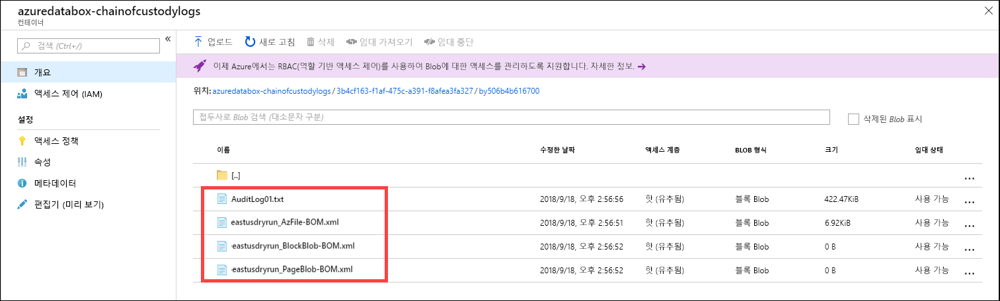

# <a name="use-the-azure-portal-to-administer-your-data-box"></a>Azure Portal을 사용하여 Data Box 관리

이 문서에서는 Data Box에서 수행할 수 있는 몇 가지 복잡한 워크플로 및 관리 작업을 설명합니다. 로컬 웹 UI 또는 Azure Portal을 통해 Data Box를 관리할 수 있습니다. 

이 아티클은 Azure Portal을 사용하여 수행할 수 있는 작업에 중점을 둡니다. Azure Portal을 사용하여 주문과 Data Box를 관리하고 주문이 완료될 때까지의 상태를 추적합니다.


## <a name="cancel-an-order"></a>주문 취소

주문을 배치한 후 다양한 이유로 주문을 취소해야 할 수 있습니다. 주문은 처리되기 전까지만 취소할 수 있습니다. 주문이 처리되어 Data Box가 준비된 후에는 주문을 취소할 수 없습니다. 

다음 단계에 따라 주문을 취소합니다.

1.  **개요 > 취소**로 이동합니다. 

    

2.  주문을 취소하는 이유를 채웁니다.  

    

3.  주문이 취소되면 포털은 주문의 상태를 업데이트하고 **취소됨**으로 표시합니다. 

## <a name="clone-an-order"></a>주문 복제

복제는 특정 상황에서 유용합니다. 사용자가 Data Box를 사용하여 데이터를 전송했는데 데이터가 많이 생성되어 해당 데이터를 Azure로 전송하기 위한 다른 Data Box가 필요한 경우를 예로 들어 보겠습니다. 이 경우 동일한 주문이 복제될 수 있습니다.

다음 단계에 따라 주문을 복제합니다.

1.  **개요 > 복제**로 이동합니다. 

    

2.  주문의 모든 세부 사항을 동일하게 유지합니다. 주문 이름은 *-Clone*으로 추가된 원래 주문 이름입니다. 확인란을 선택하여 개인 정보 취급 방침을 검토한 것을 확인합니다. **만들기**를 클릭합니다.

잠시 후에 복제가 생성되고 포털에서 새 주문을 표시하도록 업데이트합니다.


## <a name="delete-order"></a>주문 삭제

주문이 완료되면 주문을 삭제할 수 있습니다. 주문은 이름, 주소 및 연락처 정보 등의 개인 정보를 포함합니다. 이 개인 정보는 주문이 삭제될 때 삭제됩니다.

완료되거나 취소된 주문을 삭제할 수 있습니다. 주문을 삭제하려면 다음 단계를 수행합니다.

1. **모든 리소스**로 이동합니다. 주문을 검색합니다.

2. 삭제하려는 주문을 클릭하고 **개요**로 이동합니다. 명령 모음에서 **삭제**를 클릭합니다.

    

3. 주문 삭제를 확인하라는 메시지가 나타나면 주문의 이름을 입력합니다. **삭제**를 클릭합니다.

## <a name="download-shipping-label"></a>포장용 레이블 다운로드

Data Box의 E-ink 디스플레이가 작동하지 않아 반송 레이블이 표시되지 않는 경우에는 배송 레이블을 다운로드해야 할 수 있습니다. 

다음 단계에 따라 포장용 레이블을 다운로드합니다.

1.  **개요 > 포장용 레이블 다운로드**로 이동합니다. 이 옵션은 디바이스가 배송된 후에만 사용 가능합니다. 

    

2.  다음 반송 포장용 레이블을 다운로드합니다. 레이블을 저장 및 인쇄합니다. 레이블을 접어 디바이스의 투명 슬리브 안에 넣습니다. 레이블이 표시되는지 확인합니다. 이전 배송 시 부착된 디바이스의 스티커를 제거합니다.

    

## <a name="edit-shipping-address"></a>배송 주소 편집

주문이 배치되면 배송 주소를 편집해야 할 수 있습니다. 주소는 디바이스가 발송될 때까지만 편집할 수 있습니다. 디바이스가 발송되고 나면 이 옵션은 더 이상 제공되지 않습니다.

주문을 편집하려면 다음 단계를 수행합니다.

1. **주문 세부 정보 > 배송 주소 편집**으로 이동합니다.

    

2. 배송 주소를 편집하고 유효성을 검사한 다음 변경 내용을 저장합니다.

    

## <a name="edit-notification-details"></a>알림 세부 정보 편집

주문 상태 전자 메일을 수신하도록 할 사용자를 변경해야 할 수 있습니다. 예를 들어 디바이스가 배달되거나 수령되면 특정 사용자가 알림을 받아야 하는데, 다른 사용자는 원본에서 삭제하기 전에 데이터가 Azure 저장소 계정에 있는 것을 확인할 수 있도록 데이터 복사가 완료되면 알림을 받아야 할 수 있습니다. 이러한 경우에 알림 세부 정보를 편집할 수 있습니다.

알림 세부 정보를 편집하려면 다음 단계를 수행합니다.

1. **주문 세부 정보 > 알림 세부 정보 편집**으로 이동합니다.

    

2. 이제 알림 세부 정보를 편집한 다음, 변경 내용을 저장할 수 있습니다.
 
    


## <a name="download-order-history"></a>주문 기록 다운로드

Data Box 주문이 완료되면 디바이스 디스크의 데이터가 삭제됩니다. 디바이스 정리가 완료되면 Azure Portal에서 주문 내역을 다운로드할 수 있습니다.

주문 내역을 다운로드하려면 다음 단계를 수행합니다.

1. Data Box 주문에서 **개요**로 이동합니다. 주문이 완료되었는지 확인합니다. 주문이 완료되고 디바이스 정리가 완료되면 **주문 세부 정보**로 이동합니다. **주문 기록 다운로드** 옵션을 사용할 수 있습니다.

    

2. **주문 기록 다운로드**를 클릭합니다. 다운로드된 기록에는 운송업체 추적 로그 기록이 나와 있습니다. 이 로그의 맨 아래로 스크롤하면 다음 링크를 볼 수 있습니다.
    
    - **로그 복사** - Data Box에서 Azure 저장소 계정으로 데이터 복사 중 오류가 발생한 파일 목록이 있습니다.
    - **감사 로그** - 데이터 센터 외부에 있는 경우 전원 켜기 및 공유 액세스에 대한 정보를 포함합니다.
    - **BOM 파일** - **배송 준비 중** 다운로드할 수 있는 파일 목록(또는 파일 매니페스트)과 파일 이름, 파일 크기 및 파일 체크섬이 있습니다.

        ```
        -------------------------------
        Microsoft Data Box Order Report
        -------------------------------
        
        Name                                               : eastusdryrun                                      
        StartTime(UTC)                                     : 9/6/2018 12:54:47 PM +00:00                       
        DeviceType                                         : ImolaPod                                          
        
        -------------------
        Data Box Activities
        -------------------
        
        Time(UTC)             | Activity                       | Status          | Description                                                                                                                                           
        
        9/6/2018 12:54:51 PM  | OrderCreated         | Completed  |                                                                                                                              
        9/11/2018 8:57:38 PM  | DevicePrepared       | Completed  |                                                                                                                                                       
        9/12/2018 7:28:15 PM  | ShippingToCustomer   | InProgress | Pickup Scan. Local Time : 9/12/2018 2:52:31 PM at Chantilly                                                                                           
        9/13/2018 2:33:04 AM  | ShippingToCustomer   | InProgress | Departure Scan. Local Time : 9/12/2018 9:00:00 PM at Chantilly                                                                                                                                                                                                                                                              
        9/13/2018 12:40:31 PM | ShippingToCustomer   | InProgress | Arrival Scan. Local Time : 9/13/2018 5:00:00 AM at Oakland                                                                                            
        9/13/2018 2:42:10 PM  | ShippingToCustomer   | InProgress | Departure Scan. Local Time : 9/13/2018 6:08:00 AM at Oakland                                                                                          
        9/13/2018 3:42:12 PM  | ShippingToCustomer   | InProgress | Destination Scan. Local Time : 9/13/2018 8:14:08 AM at Sunnyvale                                                                                      
        9/13/2018 4:43:05 PM  | ShippingToCustomer   | InProgress | Destination Scan. Local Time : 9/13/2018 8:56:54 AM at Sunnyvale                                                                                      
        9/13/2018 4:43:05 PM  | ShippingToCustomer   | InProgress | Out For Delivery Today. Local Time : 9/13/2018 9:11:21 AM at Sunnyvale                                                                                
        9/13/2018 5:43:07 PM  | ShippingToCustomer   | Completed  | Delivered. Local Time : 9/13/2018 9:44:17 AM at SUNNYVALE                                                                                             
        9/14/2018 11:48:35 PM | ShippingToDataCenter | InProgress | Pickup Scan. Local Time : 9/14/2018 3:55:37 PM at Sunnyvale                                                                                                                                                                                 
        9/15/2018 1:52:35 AM  | ShippingToDataCenter | InProgress | Arrival Scan. Local Time : 9/14/2018 6:31:00 PM at San Jose                                                                                           
        9/15/2018 2:52:39 AM  | ShippingToDataCenter | InProgress | Departure Scan. Local Time : 9/14/2018 7:17:00 PM at San Jose                                                                                                                                                                             
        9/17/2018 8:23:31 AM  | ShippingToDataCenter | InProgress | Destination Scan. Local Time : 9/17/2018 4:14:37 AM at Chantilly                                                                                      
        9/17/2018 12:24:42 PM | ShippingToDataCenter | InProgress | Loaded on Delivery Vehicle. Local Time : 9/17/2018 7:45:36 AM at Chantilly                                                                            
        9/17/2018 1:25:11 PM  | ShippingToDataCenter | InProgress | Out For Delivery Today. Local Time : 9/17/2018 8:27:11 AM at Chantilly                                                                                
        9/17/2018 2:25:51 PM  | ShippingToDataCenter | Completed | Delivered. Local Time : 9/17/2018 9:56:32 AM at STERLING                                                                                              
        9/18/2018 9:55:41 PM  | DeviceBoot           | Completed | Appliance booted up successfully                                                                                                                      
        9/18/2018 11:00:25 PM | DataCopy             | Started   |                                                                                                                                                       
        9/18/2018 11:01:33 PM | DataCopy             | Completed | Copy Completed.                                                                                                                                       
        9/18/2018 11:20:58 PM | SecureErase          | Started   |                                                                                                                                                       
        9/18/2018 11:28:46 PM | SecureErase          | Completed | Azure Data Box:BY506B4B616700 has been sanitized according to NIST 800 -88 Rev 1.                                                                     
        
        ----------------------
        Data Box Job Log Links
        ----------------------
        
        Account Name         : eastusdryrun                                         
        Copy Logs Path       : copylog/copylogd695869a2a294396b7b903296c208388.xml                                                                                                                                                     
        Audit Logs Path      : azuredatabox-chainofcustodylogs\3b4cf163-f1af-475c-a391-f8afea3fa327\by506b4b616700                                                                                                                     
        BOM Files Path       : azuredatabox-chainofcustodylogs\3b4cf163-f1af-475c-a391-f8afea3fa327\by506b4b616700
        ```
그런 다음, 저장소 계정으로 이동하여 복사 로그를 볼 수 있습니다.


또한 감사 로그와 BOM 파일을 포함하는 커스터디 로그 체인도 볼 수 있습니다.



## <a name="view-order-status"></a>주문 상태 보기

포털에서 디바이스 상태가 변경되면 전자 메일을 통해 알림이 전송됩니다.

|주문 상태 |설명 |
|---------|---------|
|주문됨     | 주문을 성공적으로 배치했습니다. <br>디바이스 재고가 있으면 Microsoft에서 배송할 디바이스를 확인하여 준비합니다. <br> 디바이스를 즉시 배송할 수 없는 경우에는 디바이스가 배송 가능해지면 주문이 처리됩니다. 주문 처리 과정은 며칠에서 몇 달까지 걸릴 수 있습니다. 90일 이내에 처리할 수 없는 주문은 취소되며 취소 알림이 전송됩니다.         |
|처리됨     | 주문 처리가 완료되었습니다. 주문에 따라 데이터 센터에서 디바이스 배송이 준비됩니다.         |
|발송됨     | 주문이 배송되었습니다. 포털에서 주문에 표시된 추적 ID를 사용하여 배송을 추적합니다.        |
|배달됨     | 배송한 장치가 주문에 지정된 주소로 배달되었습니다.        |
|선택됨     |반송한 장치가 수령되어 운송업체에서 스캔을 했습니다.         |
|수신됨     | 디바이스가 Azure 데이터 센터에서 수신되어 스캔되었습니다. <br> 배송된 디바이스 검사가 완료되면 디바이스 업로드가 시작됩니다.      |
|데이터 복사     | 데이터 복사가 진행 중입니다. Azure Portal에서 주문에 대한 복사 진행률을 추적합니다. <br> 데이터 복사가 완료될 때까지 기다립니다. |
|Completed       |주문이 성공적으로 완료되었습니다.<br> 서버에서 온-프레미스 데이터를 삭제하기 전에 Azure에 데이터가 있는지 확인합니다.         |
|오류와 함께 완료됨| 데이터 복사가 완료되었지만 복사 중에 오류가 발생했습니다. <br> Azure Portal에 제공된 경로를 사용하여 복사 로그를 검토합니다.   |
|Canceled            |주문이 취소되었습니다. <br> 주문을 취소했거나 오류가 발생했고 서비스에서 주문을 취소했습니다. 90일 이내에 처리할 수 없는 주문도 취소되며 취소 알림이 전송됩니다.     |
|정리 | 디바이스 디스크의 데이터가 지워집니다. Azure Portal에서 다운로드에 주문 기록을 사용할 수 있게 되면 디바이스 정리가 완료된 것으로 간주됩니다.|


## <a name="next-steps"></a>다음 단계

- [Data Box 문제를 해결](data-box-faq.md)하는 방법을 알아봅니다.
