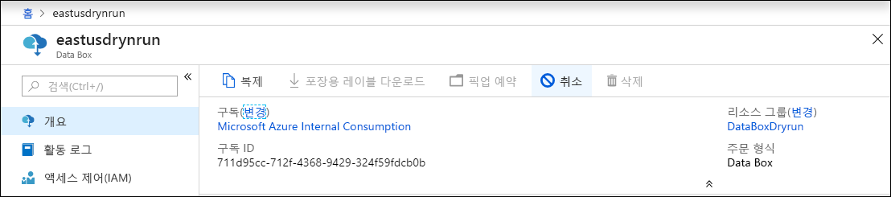
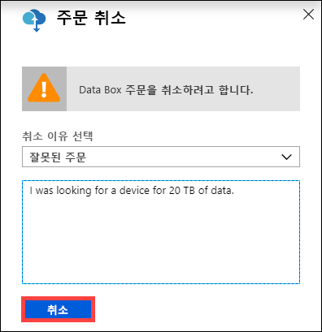
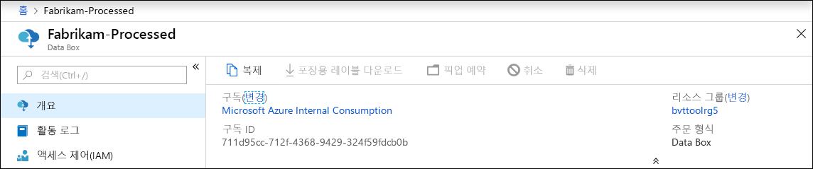
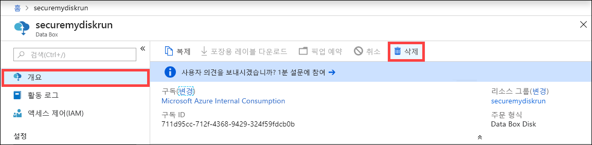
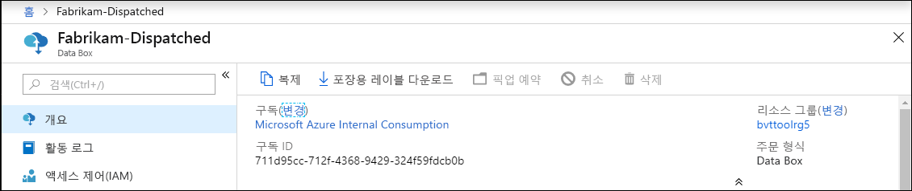
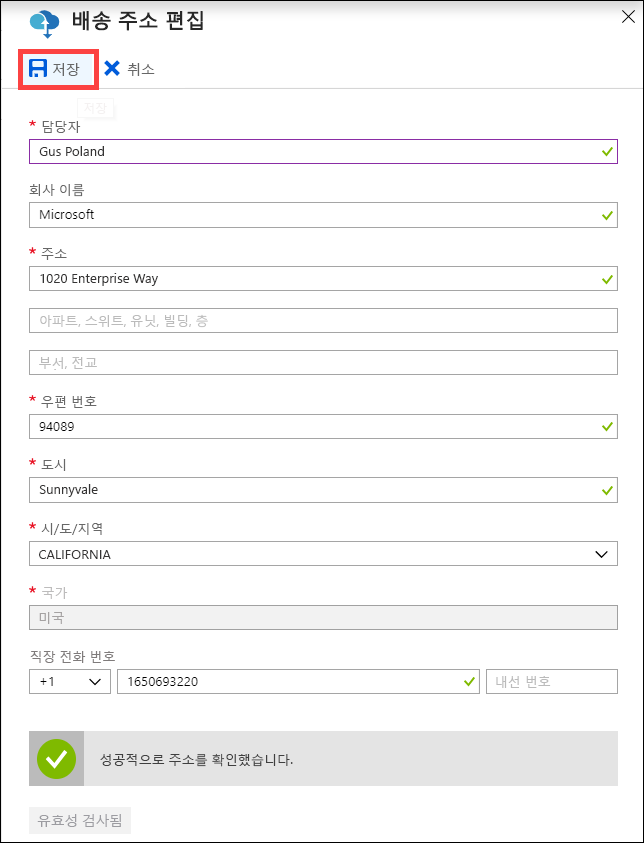
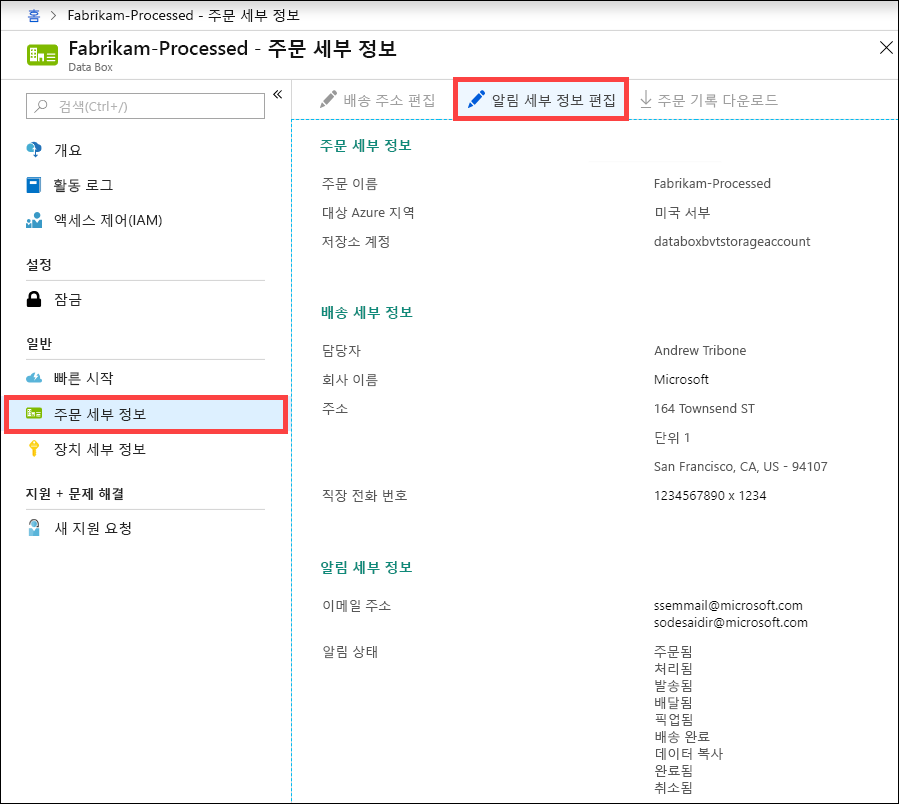
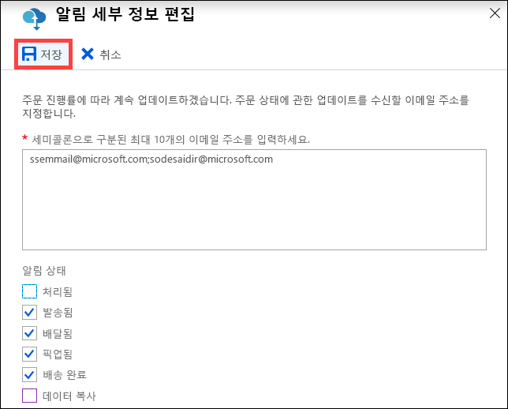

# Azure Portal을 사용하여 Data Box 관리

이 문서에서는 Data Box에서 수행할 수 있는 몇 가지 복잡한 워크플로 및 관리 작업을 설명합니다. 로컬 웹 UI 또는 Azure Portal을 통해 Data Box를 관리할 수 있습니다. 

이 아티클은 Azure Portal을 사용하여 수행할 수 있는 작업에 중점을 둡니다. Azure Portal을 사용하여 주문과 Data Box를 관리하고 주문이 완료될 때까지의 상태를 추적합니다.

## 주문 취소

주문을 배치한 후 다양한 이유로 주문을 취소해야 할 수 있습니다. 주문은 처리되기 전까지만 취소할 수 있습니다. 주문이 처리되어 Data Box가 준비된 후에는 주문을 취소할 수 없습니다. 

다음 단계에 따라 주문을 취소합니다.

1.  **개요 > 취소**로 이동합니다. 

    

2.  주문을 취소하는 이유를 채웁니다.  

    

3.  주문이 취소되면 포털은 주문의 상태를 업데이트하고 **취소됨**으로 표시합니다. 

## 주문 복제

복제는 특정 상황에서 유용합니다. 사용자가 Data Box를 사용하여 데이터를 전송했는데 데이터가 많이 생성되어 해당 데이터를 Azure로 전송하기 위한 다른 Data Box가 필요한 경우를 예로 들어 보겠습니다. 이 경우 동일한 주문이 복제될 수 있습니다.

다음 단계에 따라 주문을 복제합니다.

1.  **개요 > 복제**로 이동합니다. 

    

2.  주문의 모든 세부 사항을 동일하게 유지합니다. 주문 이름은 *-Clone*으로 추가된 원래 주문 이름입니다. 확인란을 선택하여 개인 정보 취급 방침을 검토한 것을 확인합니다. **만들기**를 클릭합니다.    

잠시 후에 복제가 생성되고 포털에서 새 주문을 표시하도록 업데이트합니다.

## 주문 삭제

주문이 완료되면 주문을 삭제할 수 있습니다. 주문은 이름, 주소 및 연락처 정보 등의 개인 정보를 포함합니다. 이 개인 정보는 주문이 삭제될 때 삭제됩니다.

완료되거나 취소된 주문을 삭제할 수 있습니다. 주문을 삭제하려면 다음 단계를 수행합니다.

1. **모든 리소스**로 이동합니다. 주문을 검색합니다.

2. 삭제하려는 주문을 클릭하고 **개요**로 이동합니다. 명령 모음에서 **삭제**를 클릭합니다.

    

3. 주문 삭제를 확인하라는 메시지가 나타나면 주문의 이름을 입력합니다. **삭제**를 클릭합니다.

## 포장용 레이블 다운로드

Data Box의 E-ink 디스플레이가 작동하지 않아 반송 레이블이 표시되지 않는 경우에는 배송 레이블을 다운로드해야 할 수 있습니다. 

다음 단계에 따라 포장용 레이블을 다운로드합니다.
1.  **개요 > 포장용 레이블 다운로드**로 이동합니다. 이 옵션은 장치가 배송된 후에만 사용 가능합니다. 

    

2.  다음 반송 포장용 레이블을 다운로드합니다. 레이블을 저장 및 인쇄합니다. 레이블을 접어 장치의 투명 슬리브 안에 넣습니다. 레이블이 표시되는지 확인합니다. 이전 배송 시 부착된 장치의 스티커를 제거합니다.

    

## 배송 주소 편집

주문이 배치되면 배송 주소를 편집해야 할 수 있습니다. 주소는 장치가 발송될 때까지만 편집할 수 있습니다. 장치가 발송되고 나면 이 옵션은 더 이상 제공되지 않습니다.

주문을 편집하려면 다음 단계를 수행합니다.

1. **주문 세부 정보 > 배송 주소 편집**으로 이동합니다.

    

2. 배송 주소를 편집하고 유효성을 검사한 다음 변경 내용을 저장합니다.

    

## 알림 세부 정보 편집

주문 상태 전자 메일을 수신하도록 할 사용자를 변경해야 할 수 있습니다. 예를 들어 장치가 배달되거나 수령되면 특정 사용자가 알림을 받아야 하는데, 다른 사용자는 원본에서 삭제하기 전에 데이터가 Azure 저장소 계정에 있는 것을 확인할 수 있도록 데이터 복사가 완료되면 알림을 받아야 할 수 있습니다. 이러한 경우에 알림 세부 정보를 편집할 수 있습니다.

알림 세부 정보를 편집하려면 다음 단계를 수행합니다.

1. **주문 세부 정보 > 알림 세부 정보 편집**으로 이동합니다.

    

2. 이제 알림 세부 정보를 편집한 다음, 변경 내용을 저장할 수 있습니다.
 
    

## 주문 상태 보기

포털에서 장치 상태가 변경되면 전자 메일을 통해 알림이 전송됩니다.

|주문 상태 |설명 |
|---------|---------|
|주문됨     | 주문을 성공적으로 배치했습니다.  장치 재고가 있으면 Microsoft에서 배송할 장치를 확인하여 준비합니다.   장치를 즉시 배송할 수 없는 경우에는 장치가 배송 가능해지면 주문이 처리됩니다. 주문 처리 과정은 며칠에서 몇 달까지 걸릴 수 있습니다. 90일 이내에 처리할 수 없는 주문은 취소되며 취소 알림이 전송됩니다.         |
|처리됨     | 주문 처리가 완료되었습니다. 주문에 따라 데이터 센터에서 장치 배송이 준비됩니다.         |
|발송됨     | 주문이 배송되었습니다. 포털에서 주문에 표시된 추적 ID를 사용하여 배송을 추적합니다.        |
|배달됨     | 배송한 장치가 주문에 지정된 주소로 배달되었습니다.        |
|선택됨     |반송한 장치가 수령되어 운송업체에서 스캔을 했습니다.         |
|수신됨     | 장치가 Azure 데이터 센터에서 수신되어 스캔되었습니다.   배송된 장치 검사가 완료되면 장치 업로드가 시작됩니다.      |
|데이터 복사     | 데이터 복사가 진행 중입니다. Azure Portal에서 주문에 대한 복사 진행률을 추적합니다.   데이터 복사가 완료될 때까지 기다립니다. |
|Completed       |주문이 성공적으로 완료되었습니다.  서버에서 온-프레미스 데이터를 삭제하기 전에 Azure에 데이터가 있는지 확인합니다.         |
|오류와 함께 완료됨| 데이터 복사가 완료되었지만 복사 중에 오류가 발생했습니다.   Azure Portal에 제공된 경로를 사용하여 복사 로그를 검토합니다.   |
|Canceled            |주문이 취소되었습니다.   주문을 취소했거나 오류가 발생했고 서비스에서 주문을 취소했습니다. 90일 이내에 처리할 수 없는 주문도 취소되며 취소 알림이 전송됩니다.     |
|정리 | 장치 디스크의 데이터가 지워집니다. Azure Portal에서 주문 로그 보고서를 사용할 수 있게 되면 장치 정리가 완료된 것으로 간주됩니다.|

## 다음 단계

- [Data Box 문제를 해결](data-box-faq.md)하는 방법을 알아봅니다.
