# Azure Portal을 사용하여 Data Box 관리

이 문서의 자습서는 미리 보기 기간 동안 Microsoft Azure Data Box Disk에 적용됩니다. 이 문서는 Data Box Disk에서 수행할 수 있는 복잡한 워크플로 및 관리 작업 중 일부를 설명합니다. 

Azure Portal을 통해 Data Box Disk를 관리할 수 있습니다. 이 문서는 Azure Portal을 사용하여 수행할 수 있는 작업에 중점을 둡니다. Azure Portal을 사용하여 주문을 관리하고, 디스크를 관리하고, 터미널 단계로 진행될 때 주문의 상태를 추적합니다.

## 주문 취소

주문을 배치한 후 다양한 이유로 주문을 취소해야 할 수 있습니다. 디스크 준비를 시작하기 전에만 주문을 취소할 수 있습니다. 디스크가 준비되고 주문이 처리되면 주문을 취소할 수 없습니다. 

다음 단계에 따라 주문을 취소합니다.

1.  **개요 > 취소**로 이동합니다. 

    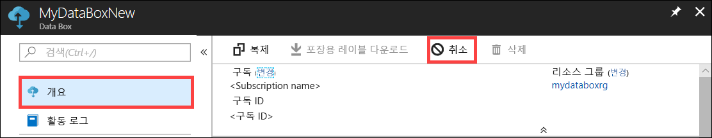

2.  주문을 취소하는 이유를 채웁니다.  

    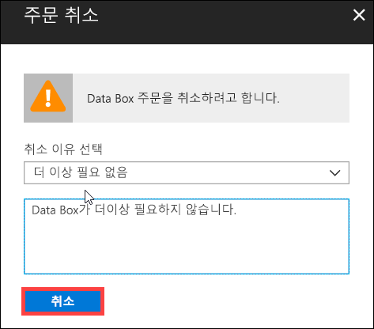

3.  주문이 취소되면 포털은 주문의 상태를 업데이트하고 **취소됨**으로 표시합니다.

    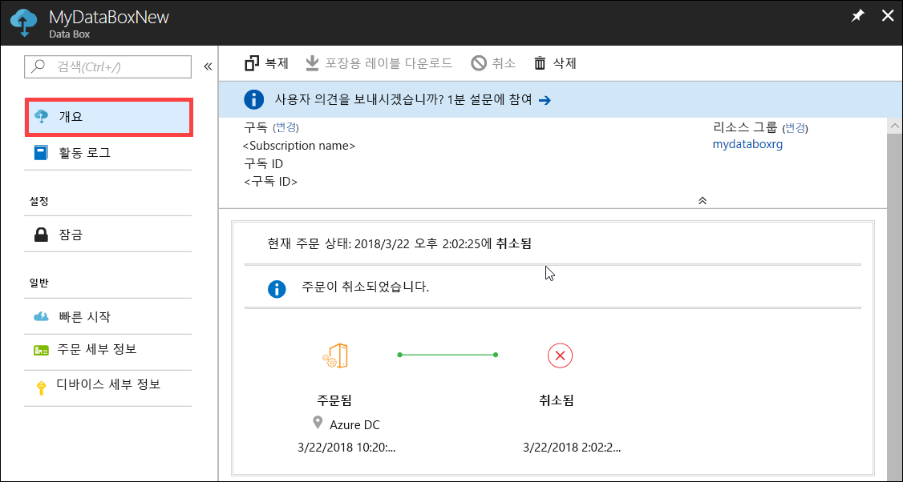

주문이 취소된 경우 이메일 알림을 받지 않습니다.

## 주문 복제

복제는 특정 상황에서 유용합니다. 예를 들어 사용자는 일부 데이터를 전송하는 데 Data Box Disk를 사용했습니다. 더 많은 데이터가 생성되면 해당 데이터를 Azure로 전송하는 데 더 많은 디스크가 필요합니다. 이 경우 동일한 주문이 복제될 수 있습니다.

다음 단계에 따라 주문을 복제합니다.

1.  **개요 > 복제**로 이동합니다. 

    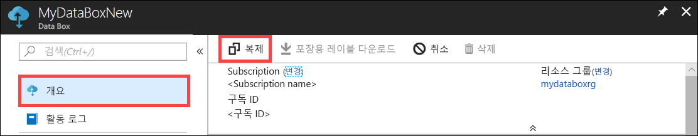

2.  주문의 모든 세부 사항을 동일하게 유지합니다. 주문 이름은 *-Clone*으로 추가된 원래 주문 이름입니다. 확인란을 선택하여 개인 정보 취급 방침을 검토한 것을 확인합니다. **만들기**를 클릭합니다.    

잠시 후에 복제가 생성되고 포털에서 새 주문을 표시하도록 업데이트합니다.

[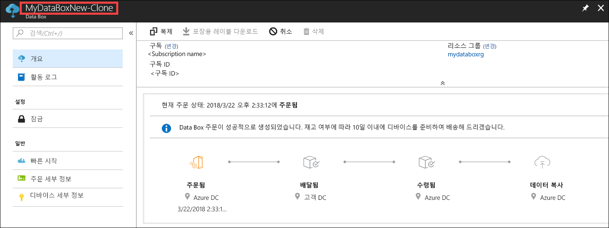](media/data-box-portal-ui-admin/clone-order3.png#lightbox) 

## 주문 삭제

주문이 완료되면 주문을 삭제할 수 있습니다. 주문은 이름, 주소 및 연락처 정보 등의 개인 정보를 포함합니다. 이 개인 정보는 주문이 삭제될 때 삭제됩니다.

완료되거나 취소된 주문을 삭제할 수 있습니다. 주문을 삭제하려면 다음 단계를 수행합니다.

1. **모든 리소스**로 이동합니다. 주문을 검색합니다.

    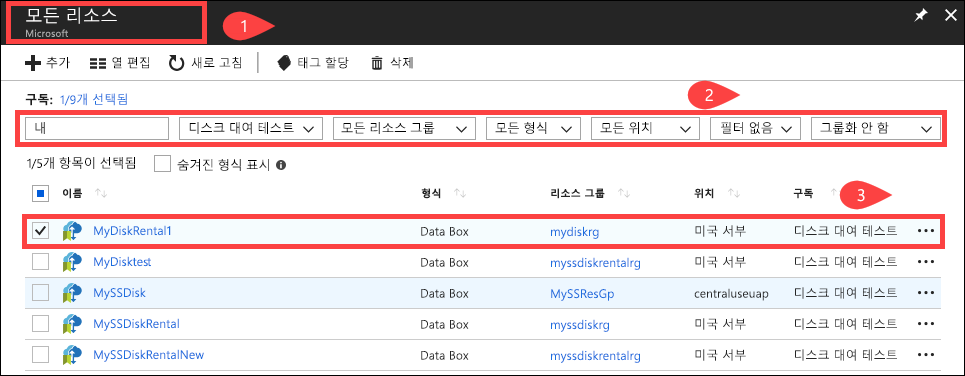

2. 삭제하려는 주문을 클릭하고 **개요**로 이동합니다. 명령 모음에서 **삭제**를 클릭합니다.

    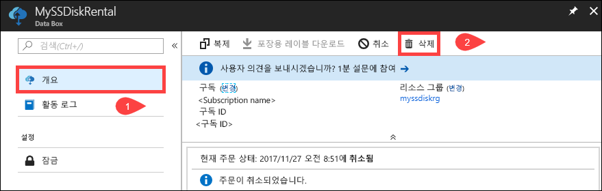

3. 주문 삭제를 확인하라는 메시지가 나타나면 주문의 이름을 입력합니다. **삭제**를 클릭합니다.

     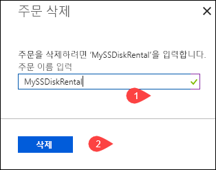

## 포장용 레이블 다운로드

디스크와 함께 제공된 반송 포장용 레이블의 위치가 잘못되거나 손실된 경우 포장용 레이블을 다운로드해야 할 수 있습니다. 

다음 단계에 따라 포장용 레이블을 다운로드합니다.
1.  **개요 > 포장용 레이블 다운로드**로 이동합니다. 이 옵션은 디스크가 배송된 후에만 사용할 수 있습니다. 

    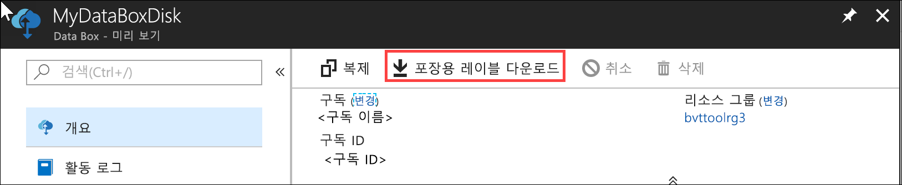

2.  다음 반송 포장용 레이블을 다운로드합니다. 레이블을 저장하고, 인쇄하고, 반송 배송에 붙입니다.

    

## 배송 주소 편집

주문이 배치되면 배송 주소를 편집해야 할 수 있습니다. 디스크가 디스패치될 때까지만 제공됩니다. 디스크가 디스패치되면 이 옵션은 더 이상 사용할 수 없습니다.

주문을 편집하려면 다음 단계를 수행합니다.

1. **주문 세부 정보 > 배송 주소 편집**으로 이동합니다.

    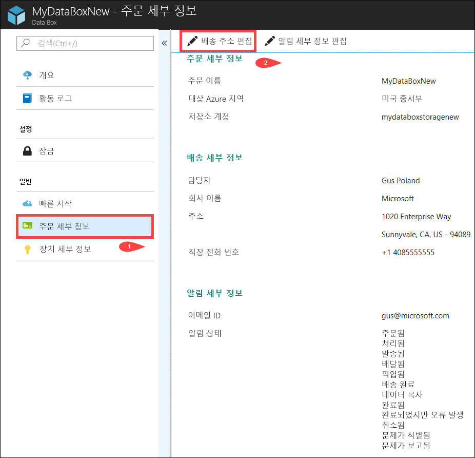

2. 이제 배송 주소를 편집한 다음, 변경 내용을 저장할 수 있습니다.

    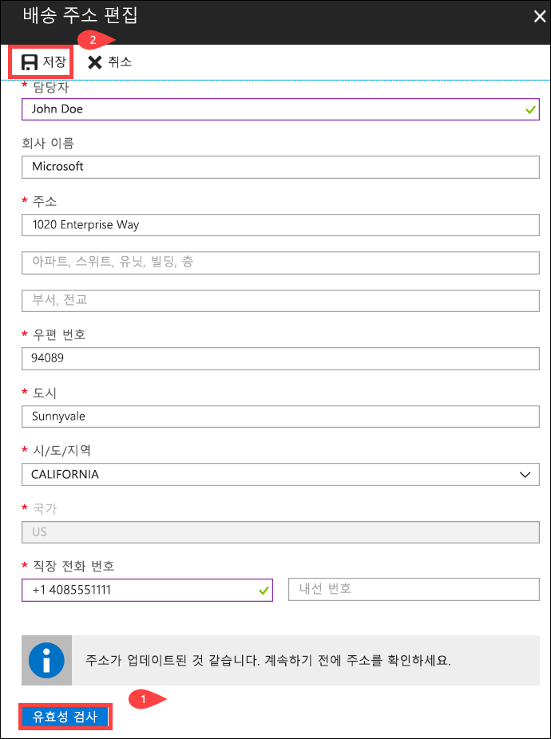

## 알림 세부 정보 편집

주문 상태 전자 메일을 수신하도록 할 사용자를 변경해야 할 수 있습니다. 예를 들어 사용자는 디스크가 배달되거나 선택되면 알림을 받아야 합니다. 다른 사용자는 원본에서 삭제하기 전에 데이터가 Azure 스토리지 계정에 있는 것을 확인할 수 있도록 데이터 복사가 완료되면 알림을 받아야 할 수 있습니다. 이러한 경우에 알림 세부 정보를 편집할 수 있습니다.

알림 세부 정보를 편집하려면 다음 단계를 수행합니다.

1. **주문 세부 정보 > 알림 세부 정보 편집**으로 이동합니다.

    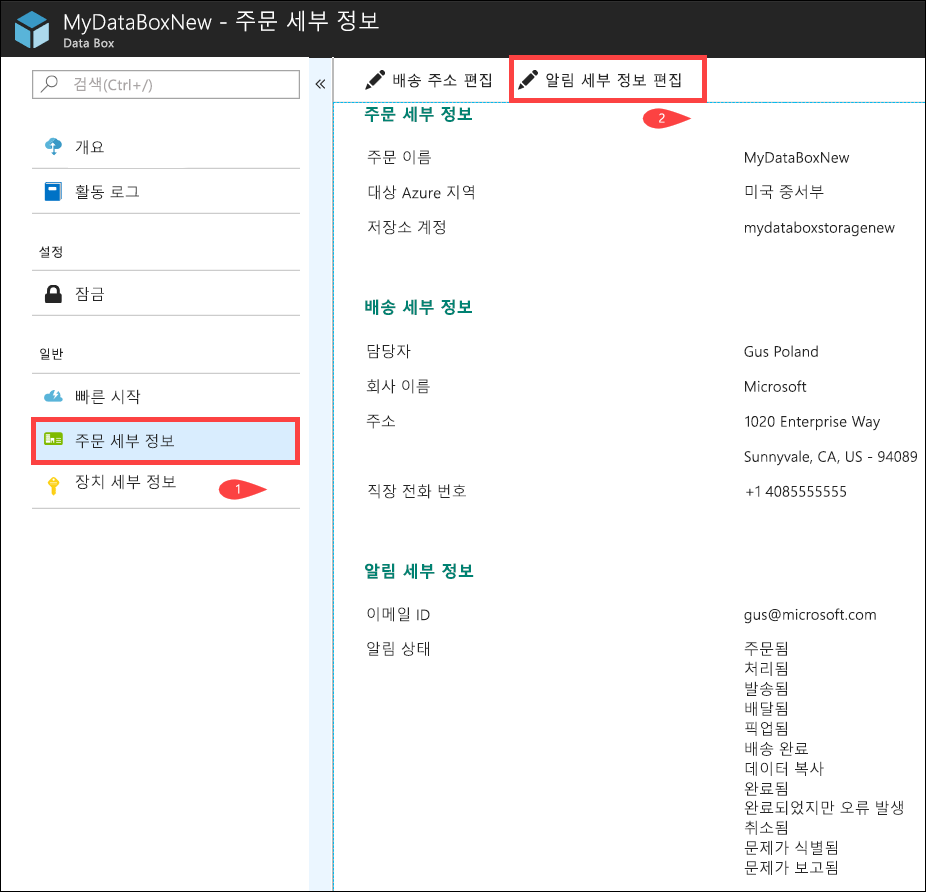

2. 이제 알림 세부 정보를 편집한 다음, 변경 내용을 저장할 수 있습니다.
 
    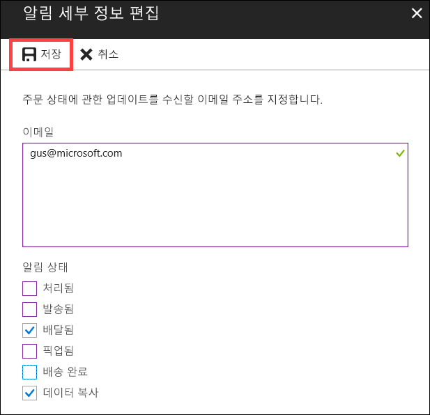

## 주문 상태 보기

|주문 상태 |설명 |
|---------|---------|
|주문됨     | 주문을 성공적으로 배치했습니다.   디스크를 사용할 수 없는 경우 알림을 받습니다.  디스크를 사용할 수 있으면 Microsoft에서 배송할 디스크를 확인하고 디스크 패키지를 준비합니다.        |
|처리됨     | 주문 처리가 완료되었습니다.   주문을 처리하는 동안 다음 작업이 발생합니다.<li>디스크는 AES-128 BitLocker 암호화를 사용하여 암호화됩니다. </li> <li>Data Box Disk는 무단 액세스를 방지하기 위해 잠겨 있습니다.</li><li>이 과정에서 디스크 잠금을 해제하는 지원 암호가 생성됩니다.</li>        |
|발송됨     | 주문이 배송되었습니다. 1~2일 이내에 주문을 받게 됩니다.        |
|배달됨     | 주문이 주문에서 지정된 주소로 배달되었습니다.        |
|선택됨     |반송 배송이 선택되었습니다.   Azure 데이터 센터에 배송이 수신되면 데이터는 Azure에 자동으로 업로드됩니다.         |
|수신됨     | Azure 데이터 센터에서 디스크를 받았습니다. 데이터 복사가 곧 시작됩니다.        |
|데이터가 복사됨     |데이터 복사가 진행 중입니다.  데이터 복사가 완료될 때까지 기다립니다.         |
|Completed       |주문이 성공적으로 완료되었습니다.  서버에서 온-프레미스 데이터를 삭제하기 전에 Azure에 데이터가 있는지 확인합니다.         |
|오류와 함께 완료됨| 데이터 복사가 완료되었지만 오류가 발생했습니다.   **개요**에 제공된 경로를 사용하여 복사 로그를 검토합니다. 자세한 내용은 [진단 로그 다운로드](data-box-disk-troubleshoot.md#download-diagnostic-logs)로 이동합니다.   |
|Canceled            |주문이 취소되었습니다.   주문을 취소했거나 오류가 발생했고 서비스에서 주문을 취소했습니다.     |

## 다음 단계

- [Data Box Disk 문제를 해결](data-box-disk-troubleshoot.md)하는 방법을 알아봅니다.
