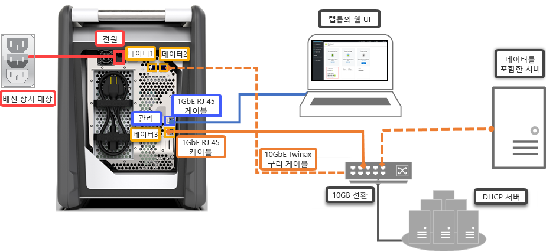

# 빠른 시작: Azure Portal을 사용하여 Azure Data Box 배포

이 빠른 시작에서는 Azure Portal을 사용하여 Azure Data Box를 배포하는 방법을 설명합니다. 여기서는 Data Box를 케이블로 연결 및 구성하고 Azure에 업로드되도록 Data Box에 데이터를 복사하는 단계를 수행합니다. 디바이스의 로컬 웹 UI와 Azure Portal에서 이 빠른 시작을 수행합니다.

자세한 단계별 배포 및 추적 지침을 확인하려면 [자습서: Azure Data Box 주문](data-box-deploy-ordered.md)을 방문하세요.

## 필수 조건

시작하기 전에

- Data Box 서비스에 사용할 구독이 다음 형식 중 하나인지 확인합니다.
    - Microsoft EA(기업계약). [EA 구독](https://azure.microsoft.com/pricing/enterprise-agreement/)에 대해 자세히 알아보세요.
    - CSP(클라우드 솔루션 공급자). [CSP 프로그램](https://docs.microsoft.com/azure/cloud-solution-provider/overview/azure-csp-overview)에 대해 자세히 알아보세요.
    - 소비 - 종량제. Azure [종량제 구독](https://azure.microsoft.com/offers/ms-azr-0003p/)에 대해 자세히 알아보세요.
    - Microsoft Azure 스폰서쉽. [Azure 스폰서쉽 프로그램](https://azure.microsoft.com/offers/ms-azr-0036p/)에 대해 자세히 알아보세요. 

- Data Box 주문을 작성할 구독에 대한 소유자 또는 참가자 권한이 있는지 확인합니다.
- [Data Box 관련 보안 지침](data-box-safety.md)을 검토하세요.
- Data Box에 복사할 데이터가 포함된 호스트 컴퓨터가 있습니다. 호스트 컴퓨터는 다음 사항이 필수입니다.
    - [지원되는 운영 체제](data-box-system-requirements.md)를 실행합니다.
    - 고속 네트워크에 연결되어 있어야 합니다. 10GbE 연결이 하나 이상 있는 것이 좋습니다. 10GbE 연결을 사용할 수 없으면 1GbE 데이터 링크를 사용할 수 있지만, 이 경우 복사 속도가 떨어집니다. 
- Data Box를 놓을 평평한 표면이 있어야 합니다. 표준 랙 선반에 디바이스를 놓으려면 데이터 센터 랙에 7U 슬롯이 있어야 합니다. 디바이스는 랙에 평평하게 놓거나 똑바로 세울 수 있습니다.
- Data Box를 호스트 컴퓨터에 연결하기 위해 다음과 같은 케이블을 준비해 둔 상태여야 합니다.
    - 10GbE SFP+ Twinax 동 케이블 2개(DATA 1, DATA 2 네트워크 인터페이스에 사용)
    - RJ-45 CAT 6 네트워크 케이블 1개(MGMT 네트워크 인터페이스에 사용)
    - RJ-45 CAT 6A 1개 또는 RJ-45 CAT 6 네트워크 케이블 1개(각각 10Gbps 또는 1Gbps로 구성된 DATA 3 네트워크 인터페이스에 사용)

## Azure에 로그인

[http://portal.azure.com](http://portal.azure.com)에서 Azure Portal에 로그인합니다.

## 순서

이 단계에는 약 5분 정도가 걸립니다.

1. Azure Portal에서 새 Azure Data Box 리소스를 만듭니다.
2. 이 서비스에 대해 활성화된 기존 구독을 선택하고 전송 형식을 **가져오기**로 선택합니다. 데이터가 있는 **원본 국가** 및 데이터 전송에 대한 **Azure 대상 지역**을 제공합니다.
3. **Data Box**를 선택합니다. 사용 가능한 최대 용량은 80TB이며, 데이터가 더 크면 주문을 여러 개 작성할 수 있습니다.
4. 주문 세부 정보 및 배송 정보를 입력합니다. 해당 지역에서 서비스를 사용할 수 있는 경우 알림 이메일 주소를 제공하고, 요약을 검토한 다음, 주문을 만듭니다.

주문을 작성하고 나면 디바이스가 배송 가능하도록 준비됩니다.

## 케이블 

이 단계에는 약 10분 정도가 걸립니다.

Data Box를 받으면 다음 단계를 수행하여 디바이스에 케이블을 꽂고 디바이스를 연결한 다음 전원을 켭니다. 이 단계에는 약 10분 정도가 걸립니다.

1. 디바이스가 변조되었거나 손상된 듯하면 이 단계를 진행하지 말고 Microsoft 지원에 교체용 디바이스 배송을 요청하세요.
2. 디바이스에 케이블을 꽂기 전에 다음 케이블이 있는지 확인합니다.
    
    - (포함) 디바이스에 연결할 수 있는 IEC60320 C-13 커넥터가 한쪽 끝에 부착된 정격 10A 이상의 접지 전원 코드
    - RJ-45 CAT 6 네트워크 케이블 1개(MGMT 네트워크 인터페이스에 사용)
    - 10GbE SFP+ Twinax 동 케이블 2개(10Gbps DATA 1, DATA 2 네트워크 인터페이스에 사용)
    - RJ-45 CAT 6A 1개 또는 RJ-45 CAT 6 네트워크 케이블 1개(각각 10Gbps 또는 1Gbps로 구성된 DATA 3 네트워크 인터페이스에 사용)

3. 디바이스를 꺼내 평평한 표면에 놓습니다. 
    
4. 아래 그림과 같이 디바이스에 케이블을 꽂습니다.  

      

    1. 디바이스에 전원 케이블을 연결합니다.
    2. RJ-45 CAT 6 네트워크 케이블을 사용하여 호스트 컴퓨터를 디바이스의 관리 포트(MGMT)에 연결합니다. 
    3. SFP+ Twinax 동 케이블을 사용하여 데이터용 10Gbps(1Gbps 초과 권장) 네트워크 인터페이스(DATA 1 또는 DATA 2)를 하나 이상 연결합니다. 
    4. 디바이스를 켭니다. 전원 단추는 디바이스의 전면 패널에 있습니다.

## 연결

이 단계는 완료하는 데 약 5~7분이 걸립니다.

1. 장치 암호를 확인하려면 [Azure Portal](http://portal.azure.com)에서 **일반 > 장치 정보**로 이동합니다.
2. Data Box에 연결하는 데 사용 중인 컴퓨터의 이더넷 어댑터에서 고정 IP 주소 192.168.100.5 및 서브넷 255.255.255.0을 할당합니다. `https://192.168.100.10`에서 장치의 로컬 웹 UI에 액세스합니다. 디바이스를 켠 후 연결이 될 때까지 최대 5분이 소요될 수 있습니다. 
3. Azure Portal에서 암호를 사용하여 로그인합니다. 웹 사이트의 보안 인증서 문제를 나타내는 오류가 표시됩니다. 브라우저별 지침에 따라 웹 페이지로 이동합니다.
4. 기본적으로 10Gbps 또는 1Gbps 데이터 인터페이스의 네트워크 설정은 DHCP로 구성됩니다. 필요한 경우 이 인터페이스를 정적으로 구성하고 IP 주소를 제공할 수 있습니다. 

## 데이터 복사

이 작업을 완료하는 시간은 데이터 크기와 네트워크 속도에 따라 달라집니다.
 
1. Windows 호스트를 사용하는 경우 Robocopy와 같은 SMB 호환 파일 복사 도구를 사용합니다. NFS 호스트의 경우에는 `cp` 명령 또는 `rsync`를 사용하여 데이터를 복사합니다. 디바이스에 도구를 연결하고 공유에 데이터를 복사하는 과정을 시작합니다. Robocopy를 사용하여 데이터를 복사하는 방법에 대한 자세한 내용을 확인하려면 [Robocopy](https://technet.microsoft.com/library/ee851678.aspx)를 방문하세요.
2. `\\<IP address of your device>\ShareName` 경로를 사용하여 공유에 연결합니다. 공유 액세스 자격 증명을 가져오려면 Data Box의 로컬 웹 UI에 있는 **연결 및 복사** 페이지로 이동합니다.
3. 공유 및 폴더 이름과 데이터가 [Azure Storage 및 Data Box 서비스 제한](data-box-limits.md)에서 설명하는 지침을 따르는지 확인합니다.

## Azure에 배송 

이 작업은 완료하는 데 약 10~15분이 걸립니다.

1. 로컬 웹 UI에서 **배송 준비** 페이지로 이동하여 배송 준비를 시작합니다. 
2. 로컬 웹 UI에서 디바이스를 끕니다. 디바이스에서 케이블을 뽑습니다. 
3. E-ink 디스플레이에 반송 레이블이 표시되어 있어야 합니다. E-ink 디스플레이에 레이블이 표시되어 있지 않으면 Azure Portal에서 배송 레이블을 다운로드한 다음 디바이스에 부착된 투명 슬리브 안에 넣으세요.
4. 케이스를 잠그고 Microsoft로 배송합니다. 

## 데이터 확인

이 작업을 완료하는 시간은 데이터 크기에 따라 달라집니다.

1. Data Box 디바이스가 Azure 데이터 센터 네트워크에 연결되면 Azure에 데이터 업로드가 자동으로 시작됩니다. 
2. Azure Data Box 서비스는 Azure Portal을 통해 데이터 복사가 완료되었음을 알립니다. 

    1. 모든 오류에 대한 오류 로그를 확인하고 적절한 조치를 수행합니다.
    2. 원본에서 데이터를 삭제하기 전에 데이터 저장소 계정에 있는지 확인합니다.

## 리소스 정리

이 단계를 완료하려면 2-3분이 걸립니다.

- 주문이 처리되기 전에 Azure Portal에서 Data Box 주문을 취소할 수 있습니다. 주문이 처리되면 주문을 취소할 수 없습니다. 완료된 단계에 도달할 때까지 주문이 진행됩니다. 주문을 취소하려면 **개요**로 이동하고 명령 모음에서 **취소**를 클릭합니다.

- 상태가 Azure Portal에서 **완료됨** 또는 **취소됨**으로 표시되면 주문을 삭제할 수 있습니다. 주문을 삭제하려면 **개요**로 이동하고 명령 모음에서 **삭제**를 클릭합니다.

## 다음 단계

이 빠른 시작에서는 데이터를 Azure로 가져올 수 있도록 Azure Data Box를 배포했습니다. Azure Data Box 관리에 대해 자세히 알아보려면 다음 자습서를 계속 진행하세요. 

> [!div class="nextstepaction"]
> [Azure Portal을 사용하여 Data Box 관리](data-box-portal-admin.md)

