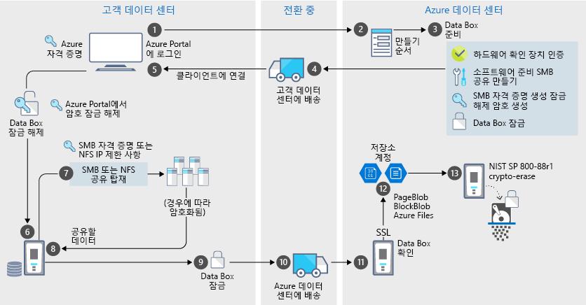

# Azure Data Box 보안 및 데이터 보호

Data Box는 인증된 엔터티만 데이터를 확인, 수정 또는 삭제할 수 있도록 하는 방식으로 데이터 보호용 보안 솔루션을 제공합니다. 이 문서에서는 각 Data Box 솔루션 구성 요소 및 저장된 데이터를 보호하는 데 사용할 수 있는 Azure Data Box 보안 기능에 대해 설명합니다. 

[!INCLUDE [GDPR-related guidance](../../includes/gdpr-intro-sentence.md)]

## 구성 요소를 통한 데이터 흐름

Microsoft Azure Data Box 솔루션은 서로 상호 작용 하는 네 가지 기본 구성 요소로 이루어져 있습니다.

- **Azure에서 호스팅되는 Azure Data Box 서비스** - 장치 주문을 작성하고 장치를 구성한 다음 주문이 완료될 때까지의 과정을 추적하는 데 사용하는 관리 서비스입니다.
- **Data Box 장치** – Azure로 온-프레미스 데이터를 가져올 수 있도록 함께 제공되는 전송 장치입니다. 
- **장치에 연결된 클라이언트/호스트** – Data Box 디스크에 연결하고 보호되어야 하는 데이터를 포함하는 인프라 내의 클라이언트입니다.
- **클라우드 저장소** – 데이터가 저장되는 Azure 클라우드의 위치입니다. 이것이 일반적으로 사용자가 만든 Azure Data Box 리소스에 연결된 저장소 계정입니다.

다음 다이어그램에는 Azure Data Box 솔루션을 통과하는 온-프레미스에서 Azure로의 데이터 흐름이 나와 있습니다.

## 보안 기능

Data Box는 인증된 엔터티만 데이터를 확인, 수정 또는 삭제할 수 있도록 하는 방식으로 데이터 보호용 보안 솔루션을 제공합니다. 이 솔루션에 대한 보안 기능은 저장된 데이터의 보안을 보장하는 디스크 및 연결된 서비스를 위한 것입니다. 

### Data Box 디바이스 보호

Data Box 디바이스는 다음 기능을 통해 보호됩니다.

- 충격, 운송 과정의 부적절한 취급 및 환경 상황으로부터 디바이스를 보호하는 견고한 디바이스 케이스 
- 운송 중의 디바이스 변조를 확인할 수 있는 봉인(변조 시 훼손됨)
- 추가적인 디바이스 작동을 방지하는 하드웨어 및 소프트웨어 변조 검색 기능
- Data Box용 소프트웨어만 실행 가능
- 잠긴 상태로 부팅됨
- 디바이스 잠금 해제 암호를 통해 디바이스 액세스 제어
- 디바이스 내부에서/외부로 데이터를 복사하는 데 필요한 액세스 자격 증명

### Data Box 데이터 보호

Data Box 내부에서/외부로 전송되는 데이터는 다음 기능을 통해 보호됩니다.

- 미사용 데이터용 AES 256비트 암호화 
- 처리 중인 데이터에 암호화된 프로토콜 사용 가능
- Azure로의 업로드가 완료되면 디바이스에서 안전한 데이터 지우기 수행 데이터 지우기는 NIST 800-88r1 표준을 따릅니다.

### Data Box 서비스 보호

Data Box 서비스는 다음 기능을 통해 보호됩니다.

- Data Box 서비스에 액세스하려면 조직에 Data Box를 포함하는 Azure 구독이 있어야 합니다. 구독은 Azure Portal에서 액세스할 수 있는 기능을 제어합니다.
- Data Box Disk 서비스는 Azure에서 호스팅되므로 Azure 보안 기능으로 보호됩니다. Microsoft Azure에서 제공하는 보안 기능에 대한 자세한 내용은 [Microsoft Azure 보안 센터](https://www.microsoft.com/TrustCenter/Security/default.aspx)로 이동합니다. 
- Data Box 서비스는 서비스에서 디바이스를 잠금 해제하는 데 사용되는 잠금 해제 암호를 저장합니다. 
- Data Box 서비스에는 주문 세부 정보 및 상태가 저장됩니다. 이 정보는 주문이 삭제될 때 삭제됩니다. 

## 개인 데이터 관리

Azure Data Box는 서비스의 다음 주요 인스턴스에서 개인 정보를 수집하고 표시합니다.

- **알림 설정** - 주문을 만들 때 알림 설정에 따라 사용자의 이메일 주소를 구성합니다. 이 정보는 관리자가 볼 수 있습니다. 이 정보는 작업이 종료 상태에 도달하거나 주문을 삭제하면 서비스에서 삭제됩니다.

- **주문 세부 정보** – 주문이 만들어지면 사용자의 배송 주소, 이메일, 연락처 정보가 Azure Portal에 저장됩니다. 저장되는 정보는 다음과 같습니다.

    - 담당자 이름
    - 전화 번호
    - Email
    - 주소
    - City
    - 우편 번호
    - 시스템 상태
    - 국가/시/도/지역
    - 운송업체 계정 번호
    - 배송 추적 번호

    주문 세부 정보는 작업이 완료되거나 주문을 삭제하면 Data Box 서비스에 의해 삭제됩니다.

- **배송 주소** – 주문이 완료되면 Data Box 서비스는 UPS 또는 DHL과 같은 타사 운송업체에 배송 주소를 제공합니다. 

자세한 내용은 [보안 센터](https://www.microsoft.com/trustcenter)에서 Microsoft 개인 정보 취급 방침을 검토합니다.

## 보안 지침 참조

Data Box에서 구현되는 보안 지침은 다음과 같습니다. 

|지침   |설명   |
|---------|---------|
|[IEC 60529 IP52](http://www.iec.ch/)    | 방수/방진         |
|[ISTA 2A](https://ista.org/docs/2Aoverview.pdf)     | 배송 중의 부적절한 취급으로부터 장치 보호          |
|[NIST SP 800-147](http://nvlpubs.nist.gov/nistpubs/Legacy/SP/nistspecialpublication800-147.pdf)      | 보안 펌웨어 업데이트         |
|[FIPS 140-2 수준 2](https://csrc.nist.gov/csrc/media/publications/fips/140/2/final/documents/fips1402.pdf)      | 데이터 보호         |
|[NIST SP 800-88r1](http://nvlpubs.nist.gov/nistpubs/SpecialPublications/NIST.SP.800-88r1.pdf)      | 데이터 삭제         |

## 다음 단계

- [Data Box 요구 사항](data-box-system-requirements.md)을 검토합니다.
- [Data Box 제한](data-box-limits.md)을 알아봅니다.
- Azure Portal에서 [Azure Data Box](data-box-quickstart-portal.md)를 빠르게 배포합니다.
