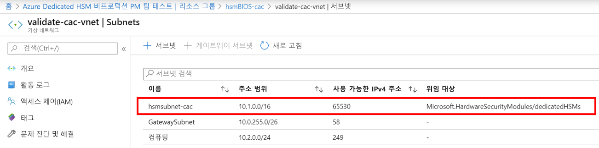
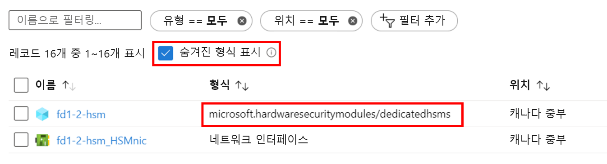

# <a name="troubleshooting-the-azure-dedicated-hsm-service"></a>Azure Dedicated HSM 서비스 문제 해결

Azure Dedicated HSM 서비스에는 고유한 두 가지 측면이 있습니다. 먼저, Azure에서 기본 네트워크 구성 요소를 사용하여 HSM 디바이스를 등록하고 배포합니다. 다음으로, 지정된 워크로드 또는 애플리케이션을 사용하고 통합하도록 준비하는 데 필요한 HSM 디바이스를 구성합니다. Thales Luna Network HSM 디바이스는 Thales에서 직접 구입하는 것처럼 Azure에서 동일하지만, Azure의 리소스라는 사실로 인해 몇 가지 고유한 고려 사항이 있습니다. 중요한 정보에 대한 높은 가시성과 액세스를 보장하기 위해 이러한 고려 사항과 이에 따른 문제 해결 인사이트 또는 모범 사례를 여기서 문서화하고 있습니다. 서비스를 사용하고 있으면 Microsoft 또는 Thales에 대한 지원 요청을 통해 최종 정보를 직접 사용할 수 있습니다. 

> [!NOTE]
> 새로 배포된 HSM 디바이스에서 구성을 수행하기 전에 관련 패치로 업데이트해야 합니다. 특정 필수 패지는 재부팅 중에 시스템이 응답하지 않는 문제를 해결하는 Thales 지원 포털의 [KB0019789](https://supportportal.gemalto.com/csm?id=kb_article_view&sys_kb_id=19a81c8bdb9a1fc8d298728dae96197d&sysparm_article=KB0019789)입니다.

## <a name="hsm-registration"></a>HSM 등록

Dedicated HSM은 클라우드에서 하드웨어 리소스를 제공하므로 무료로 사용할 수 없으며, 이에 따라 보호해야 하는 소중한 리소스입니다. 따라서 HSMrequest@microsoft.com을 사용하는 이메일을 통해 허용 목록 프로세스를 사용합니다. 

### <a name="getting-access-to-dedicated-hsm"></a>Dedicated HSM에 액세스

Dedicated HSM이 주요 스토리지 요구 사항에 적합하다고 생각되면 액세스를 요청하는 이메일을 HSMrequest@microsoft.com으로 보냅니다. 애플리케이션, HSM을 원하는 지역 및 찾고 있는 HSM 볼륨을 간략히 설명합니다. 예를 들어 영업 책임자 또는 클라우드 솔루션 설계자와 같은 Microsoft 담당자와 협력하는 경우 요청에 포함시킵니다.

## <a name="hsm-provisioning"></a>HSM 프로비저닝

HSM 디바이스 프로비저닝은 Azure에서 CLI 또는 PowerShell을 통해 수행할 수 있습니다. 서비스에 등록할 때 ARM 템플릿 샘플과 초기 사용자 지정을 위한 지원이 제공됩니다. 

### <a name="hsm-deployment-failure-information"></a>HSM 배포 실패 정보

Dedicated HSM은 배포에 대해 CLI 및 PowerShell을 지원하므로 포털 기반 실패 정보가 제한되고 자세한 정보는 표시되지 않습니다. 리소스 탐색기를 사용하여 더 나은 정보를 확인할 수 있습니다. 포털 홈 페이지에는 이에 대한 아이콘이 있으며 자세한 실패 정보를 사용할 수 있습니다. 이 정보는 배포 문제와 관련된 지원 요청을 만들 때 붙여넣으면 많은 도움이 됩니다.


### <a name="hsm-subnet-delegation"></a>HSM 서브넷 위임
배포 실패의 이유 중 하나는 HSM이 프로비저닝될 고객 정의 서브넷에 대한 적절한 위임을 설정하지 않은 것입니다. 위임은 배포를 위한 VNet 및 서브넷 필수 구성 요소의 일부이며 자세한 내용은 자습서에서 확인할 수 있습니다.



### <a name="hsm-deployment-race-condition"></a>HSM 배포 경합 상태

배포에 제공되는 표준 ARM 템플릿에는 HSM 및 ExpressRoute 게이트웨이 관련 리소스가 있습니다. 네트워킹 리소스는 성공적인 HSM 배포에 대한 종속성이며 타이밍이 중요할 수 있습니다.  경우에 따라 종속성 문제와 관련된 배포 실패가 표시되고, 배포를 다시 실행하면 문제가 해결되는 경우가 많습니다. 그렇지 않으면 리소스를 삭제한 다음, 성공적으로 다시 배포하는 경우가 많습니다. 이렇게 시도했지만 여전히 문제가 발견되면 Azure Portal에서 "Azure 설정을 구성하는 문제"의 문제 유형을 선택하여 지원 요청을 제출합니다.

### <a name="hsm-deployment-using-terraform"></a>Terraform을 사용하여 HSM 배포

일부 고객은 이 서비스에 등록할 때 제공되는 ARM 템플릿 대신 Terraform을 자동화 환경으로 사용했습니다. HSM은 이 방식으로 배포할 수 없지만 종속 네트워킹 리소스는 배포할 수 있습니다. Terraform에는 jut에서 HSM을 배포하는 최소 ARM 템플릿을 호출하는 모듈이 있습니다.  이 경우 HSM을 배포하기 전에 필요한 ExpressRoute 게이트웨이와 같은 네트워킹 리소스가 완전히 배포되도록 주의해야 합니다. 다음 CLI 명령을 사용하여 완료된 배포를 테스트하고 필요에 따라 통합할 수 있습니다. 특정 명명에 맞게 꺾쇠 괄호 자리 표시자를 바꿉니다. "provisioningState가 성공했습니다."의 결과가 표시됩니다.

```azurecli
az resource show --ids /subscriptions/<subid>/resourceGroups/<myresourcegroup>/providers/Microsoft.Network/virtualNetworkGateways/<myergateway>
```

### <a name="deployment-failure-based-on-quota"></a>할당량 기반 배포 실패
스탬프당 2개의 HSM 및 지역당 4개의 HSM을 초과하면 배포가 실패할 수 있습니다. 이 상황을 방지하려면 이전에 실패한 배포에서 리소스를 삭제한 후 다시 배포해야 합니다. 리소스를 확인하려면 아래의 "HSM을 확인하는 방법" 항목을 참조하세요. 주로 보호 수단인 이 할당량을 초과해야 하는 경우 세부 정보가 포함된 이메일을 HSMrequest@microsoft.com으로 보내세요.

### <a name="deployment-failure-based-on-capacity"></a>용량 기반 배포 실패
특정 스탬프 또는 지역이 가득 차면, 즉 거의 모든 사용 가능한 HSM이 프로비저닝되면 배포 실패가 발생할 수 있습니다. 각 스탬프에는 고객이 사용할 수 있는 11개의 HSM이 있으며, 이는 지역당 22개를 의미합니다. 각 스탬프에는 3개의 예비 디바이스 및 1개의 테스트 디바이스가 있습니다. 제한에 도달하는 경우 특정 스탬프의 채우기 수준에 대한 정보를 얻기 위해 이메일을 HSMrequest@microsoft.com으로 보내세요.

###  <a name="how-do-i-see-hsms-when-provisioned"></a>프로비저닝할 때 HSM이 어떻게 표시되나요?
Dedicated HSM은 허용 목록 서비스이므로 Azure Portal에서 "숨겨진 형식"으로 간주됩니다. HSM 리소스를 표시하려면 아래와 같이 "숨겨진 형식 표시" 확인란을 선택해야 합니다. NIC 리소스는 항상 HSM을 따르며, 먼저 HSM의 IP 주소를 확인한 후에 SSH를 사용하여 연결하는 것이 좋습니다.



## <a name="networking-resources"></a>네트워킹 리소스

Dedicated HSM의 배포에는 네트워킹 리소스에 대한 종속성 및 이에 따라 알고 있어야 하는 몇 가지 제한 사항이 있습니다.

### <a name="provisioning-expressroute"></a>ExpressRoute 프로비저닝

Dedicated HSM은 ExpressRoute 게이트웨이를 고객 개인 IP 주소 공간과 Azure 데이터 센터의 물리적 HSM 간의 통신을 위한 "터널"로 사용합니다.  Vnet당 하나의 게이트웨이로 제한되는 것을 고려하여 ExpressRoute를 통해 온-프레미스 리소스에 연결해야 하는 고객은 다른 Vnet을 해당 연결에 사용해야 합니다.  

### <a name="hsm-private-ip-address"></a>HSM 개인 IP 주소

Dedicated HSM에 제공되는 템플릿 샘플은 지정된 서브넷 범위에서 HSM IP를 자동으로 가져온다고 가정합니다. HSM에 대한 명시적 IP 주소는 ARM 템플릿의 "NetworkInterfaces" 특성을 통해 지정할 수 있습니다. 


## <a name="hsm-initialization"></a>HSM 초기화

초기화는 새 HSM을 사용하거나 기존 HSM을 다시 사용할 수 있도록 준비합니다. 개체를 생성 또는 저장하거나 클라이언트에서 연결하도록 허용하거나 암호화 작업을 수행하려면 먼저 HSM 초기화를 완료해야 합니다.

### <a name="lost-credentials"></a>자격 증명 손실

셸 관리자 암호가 손실되면 HSM 키 자료가 손실됩니다. HSM을 다시 설정하기 위한 지원 요청을 수행해야 합니다.
HSM을 초기화하는 경우 자격 증명을 안전하게 저장합니다. 셸 및 HSM 자격 증명은 회사 정책에 따라 유지해야 합니다.

### <a name="failed-logins"></a>로그인 실패

HSM에 잘못된 자격 증명을 제공하면 파괴적인 결과가 발생할 수 있습니다. HSM 역할의 기본 동작은 다음과 같습니다.

| 역할 | 임계값(시도 횟수) | 너무 많은 잘못된 로그인 시도로 인한 결과 | 복구 |
|--|--|--|--|
| HSM SO | 3 |  HSM이 0으로 초기화됩니다(모든 HSM 개체 ID 및 모든 파티션이 사라짐).  |  HSM을 다시 초기화해야 합니다. 콘텐츠는 백업에서 복원할 수 있습니다. | 
| 파티션 SO | 10 |  파티션이 0으로 초기화됩니다. |  파티션을 다시 초기화해야 합니다. 콘텐츠는 백업에서 복원할 수 있습니다. |  
| 감사 | 10 | 잠금 | 10분 후에 잠금이 자동으로 해제됩니다. |  
| 암호화 담당자 | 10(감소 가능) | HSM 정책 15의 경우: 파티션 PIN의 SO 다시 설정 사용이 1(사용)로 설정되고, CO 및 CU 역할이 잠깁니다.<br>HSM 정책 15의 경우: 파티션 PIN의 SO 다시 설정 사용이 0(사용 안 함)으로 설정되고, CO 및 CU 역할이 영구적으로 잠기고, 파티션 콘텐츠에 더 이상 액세스할 수 없습니다. 이 값은 기본 설정입니다. | `role resetpw -name co`를 사용하여 파티션 SO가 CO 역할을 잠금 해제하고 자격 증명을 다시 설정해야 합니다.<br>파티션을 다시 초기화하고 백업 디바이스에서 키 자료를 복원해야 합니다. |  

## <a name="hsm-configuration"></a>HSM 구성 

다음 항목은 구성 오류가 일반적이거나 호출의 영향을 받는 경우입니다.

### <a name="hsm-documentation-and-software"></a>HSM 설명서 및 소프트웨어
Thales SafeNet Luna 7 HSM 디바이스에 대한 소프트웨어 및 설명서는 Microsoft에서 사용할 수 없으며, Thales에서 직접 다운로드해야 합니다. 등록 프로세스 중에 받은 Thales 고객 ID를 사용하여 등록해야 합니다. Microsoft에서 제공하는 디바이스에는 소프트웨어 7.2 버전 및 펌웨어 7.0.3 버전이 있습니다. Thales는 2020년 초에 설명서를 공개했으며 [여기](https://thalesdocs.com/gphsm/luna/7.2/docs/network/Content/Home_network.htm)서 찾을 수 있습니다.  

### <a name="hsm-networking-configuration"></a>HSM 네트워킹 구성

HSM 내에서 네트워킹을 구성하는 경우에는 주의해야 합니다.  HSM은 ExpressRoute 게이트웨이를 통해 고객의 개인 IP 주소 공간에서 HSM으로 직접 연결됩니다.  이 통신 채널은 고객 통신 전용이며 Microsoft는 이 채널에 액세스할 수 없습니다. HSM이 이 네트워크 경로에 영향을 주는 방식으로 구성되면 HSM과의 모든 통신이 제거됩니다.  이 경우 유일한 옵션은 Azure Portal을 통해 Microsoft 지원 요청을 제출하여 디바이스를 다시 설정하는 것입니다. 이 다시 설정 절차로 인해 HSM이 초기 상태로 다시 설정되고 모든 구성 및 키 자료가 손실됩니다.  구성을 다시 만들어야 하며, 디바이스가 HA 그룹에 조인하면 키 자료가 복제됩니다.  

### <a name="hsm-device-reboot"></a>HSM 디바이스 다시 부팅

일부 구성을 변경하려면 HSM의 전원을 껐다 켜거나 다시 부팅해야 합니다. Microsoft에서 Azure의 HSM을 테스트한 결과 경우에 따라 다시 부팅이 응답하지 않을 수 있는 것으로 확인되었습니다. 즉, Azure Portal에서 하드 다시 부팅을 요청하는 지원 요청을 만들어야 하며, Azure 데이터 센터의 수동 프로세스임을 고려하여 이를 완료하는 데 최대 48시간이 걸릴 수 있습니다.  이러한 상황을 방지하려면 Thales에서 제공하는 다시 부팅 패치를 직접 배포해야 합니다. 재부팅 중에 시스템이 응답하지 않는 문제에 대한 권장 패치는 Thales Luna Network HSM 7.2 다운로드의 [KB0019789](https://supportportal.gemalto.com/csm?sys_kb_id=d66911e2db4ffbc0d298728dae9619b0&id=kb_article_view&sysparm_rank=1&sysparm_tsqueryId=d568c35bdb9a4850d6b31f3b4b96199e&sysparm_article=KB0019789)를 참조하세요(참고: 다운로드하려면 Thales 지원 포털에 등록되어 있어야 함).

### <a name="ntls-certificates-out-of-sync"></a>NTLS 인증서 동기화되지 않음
인증서가 만료되거나 구성 업데이트를 통해 덮어쓴 경우 클라이언트에서 HSM에 대한 연결이 끊어질 수 있습니다. 인증서 교환 클라이언트 구성을 각 HSM에 다시 적용해야 합니다.
잘못된 인증서를 사용한 NTLS 로깅의 예는 다음과 같습니다.

> NTLS[8508]: 정보 : 0 : 들어오는 연결 요청... : 192.168.50.2/59415 NTLS[8508]: SSLAccept의 오류 메시지: error:14094418:SSL routines:ssl3_read_bytes:tlsv1 경고 알 수 없는 ca NTLS[8508]: SSL 수락 중 오류( RC_SSL_ERROR ) NTLS[8508]: 정보 : 0xc0000711 : 클라이언트에서 보안 채널을 설정하지 못했습니다. : 192.168.50.2/59415 : RC_SSL_FAILED_HANDSHAKE NTLS[8508]: 정보 : 0 : NTLS 클라이언트 "알 수 없는 호스트 이름" 연결 인스턴스가 제거되었습니다. : 192.168.50.2/59415

### <a name="failed-tcp-communication"></a>TCP 통신 실패

Luna 클라이언트 설치에서 HSM으로 통신하려면 최소 1792 TCP 포트가 필요합니다. 환경에서 네트워크 구성이 변경되는 경우 이를 고려합니다.

### <a name="failed-ha-group-member-doesnt-recover"></a>실패한 HA 그룹 멤버가 복구되지 않음

실패한 HA 그룹 멤버가 복구되지 않으면 hagroup recover 명령을 사용하여 Luna 클라이언트에서 수동으로 복구해야 합니다.
자동 복구를 사용하도록 설정하려면 HA 그룹에 대한 재시도 횟수를 구성해야 합니다. 기본적으로 HA 그룹은 복구 시 HA 멤버를 그룹으로 복구하려고 시도하지 않습니다.

### <a name="ha-group-doesnt-sync"></a>HA 그룹이 동기화되지 않음

동일한 복제 도메인이 멤버 파티션에 없는 경우 ha synchronize 명령에서 다음 경고를 표시합니다. 경고: 동기화가 실패할 수 있습니다.  슬롯 0과 슬롯 1의 멤버에는 프라이빗 키 복제에 대해 충돌하는 설정이 있습니다.
올바른 복제 도메인이 있는 새 파티션을 HA 그룹에 추가한 다음, 잘못 구성된 파티션을 제거해야 합니다.

## <a name="hsm-deprovisioning"></a>HSM 프로비전 해제 

HSM을 사용하여 완전히 완료한 경우에만 프로비전을 해제할 수 있습니다. 그러면 Microsoft에서 이를 다시 설정하여 사용 가능한 풀에 반환합니다. 

### <a name="how-to-delete-an-hsm-resource"></a>HSM 리소스를 삭제하는 방법

HSM이 "0으로 초기화됨" 상태인 경우에만 HSM에 대한 Azure 리소스를 삭제할 수 있습니다.  따라서 모든 키 자료를 먼저 삭제한 후에 리소스를 삭제해야 합니다. 0으로 초기화하는 가장 빠른 방법은 HSM 관리자 암호를 3회 잘못 가져오는 것입니다(참고: 어플라이언스 수준 관리자가 아니라 HSM 관리자를 나타냄). Luna 셸에는 0으로 초기화하는 `hsm -factoryreset` 명령이 있지만 직렬 포트의 콘솔을 통해서만 실행할 수 있으며, 고객은 이에 액세스할 수 없습니다.

## <a name="next-steps"></a>다음 단계

이 문서에서는 HSM 배포 수명 주기 전반에 걸쳐 문제가 있거나 문제를 해결해야 하거나 신중하게 고려해야 하는 영역에 대한 인사이트를 제공했습니다. 이 문서를 통해 불필요한 지연과 실패를 방지하고, 관련 추가 또는 변경 내용이 있는 경우 Microsoft에 지원 요청을 제출하여 알려주세요. 
