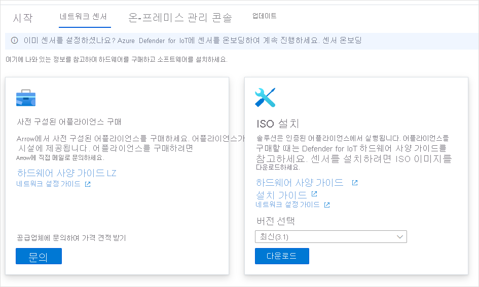
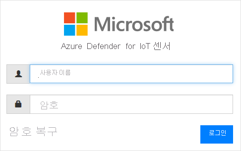
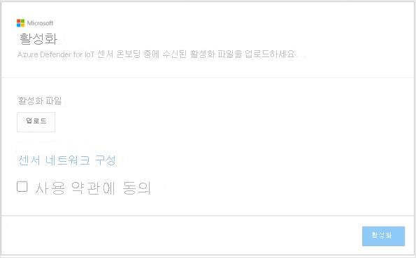

# 빠른 시작: 센서 배포 및 온보딩

이 문서에서는 센서 배포 프로세스의 개요를 제공합니다. Azure Defender for IoT 포털에 센서를 온보딩해야 합니다.

이 프로세스를 수행하려면 미리 구성된 센서를 취득하거나 인증된 센서 어플라이언스를 취득하고 센서 소프트웨어를 직접 설치해야 합니다.

인증된 센서 어플라이언스를 사용하는 경우 시작하기 전에 [Azure Defender for IoT 하드웨어 사양 가이드](https://aka.ms/AzureDefenderforIoTBareMetalAppliance)를 검토하는 것이 좋습니다.

> [!NOTE]
> Azure Defender for IoT 온-프레미스 관리 콘솔은 온보딩할 필요가 없습니다.

센서를 온보딩하면 다음을 수행할 수 있습니다.

|||
|------ | ----------- |
| **센서 이름 정의** | 온보딩하는 센서의 이름을 지정하고 IoT Hub 또는 구독과 연결합니다.  자세한 내용은 **센서 온보딩** 을 참조하세요.|
|**구독 및 커밋된 디바이스 수 선택**|구독을 선택하고, 해당 구독에 포함되는 디바이스 수를 선택합니다. 디바이스 수를 1000 단위로 입력합니다.|
| **센서 관리 모드 정의** | 센서가 탐지한 자산, 경고 및 기타 정보를 표시할 위치를 정의합니다. 이 위치는 사용자가 정의하는 **센서 관리 모드** 에 따라 결정됩니다.  **로컬 관리형 모드**: 센서에서 탐지한 정보는 센서 콘솔에 표시됩니다. 탐지 정보는 센서가 연결된 온-프레미스 관리 콘솔과 공유됩니다.  **클라우드 관리형 모드**: 센서에서 탐지한 정보는 센서 콘솔에 표시됩니다. 뿐만 아니라 경고 정보는 IoT Hub를 통해 전달되며 다른 Azure 서비스(예: Azure Sentinel)와 공유할 수 있습니다. 자세한 내용은 **센서 온보딩** 을 참조하세요. |
| **센서 활성화 파일 획득** | **로컬 관리형** 센서의 경우 권한이 부여된 센서 활성화 기간을 관리하기 위해 활성화 파일이 사용됩니다.  **클라우드 관리형** 센서의 경우 센서와 IoT Hub를 연결하는 수단으로 활성화 파일이 사용됩니다. 자세한 내용은 **센서 온보딩** 을 참조하세요. |
| **센서에 활성화 파일 업로드** | 활성화 파일을 엔터프라이즈 센서에 업로드해야 합니다. 활성화 파일이 업로드되기 전에는 네트워크 모니터링 및 센서 콘솔 기능을 사용할 수 없습니다. 자세한 내용은 **센서 활성화 파일 업로드** 를 참조하세요. |
| **활성화하기 전에 센서 네트워크 매개 변수 업데이트** | 센서 설치 중에 정의된 매개 변수를 업데이트합니다. 자세한 내용은 **센서 활성화 파일 업로드** 를 참조하세요.|

**센서를 배포하는 방법은 다음과 같습니다.**

1. Azure Portal에서 Azure Defender for IoT로 이동합니다.

2. **시작** 을 선택합니다.

3. **네트워크 검색** 섹션에서 **설정** 을 선택합니다.

   

4. 센서 획득 옵션을 선택합니다.

   

  - **미리 구성된 센서 구입**: Microsoft와 Arrow는 파트너 관계를 맺고 미리 구성된 센서를 제공합니다. 미리 구성된 센서를 구매하려면 <hardware.sales@arrow.com>을 통해 Arrow로 문의하세요. 센서는 구매자의 시설로 배달됩니다. 최신 버전이 설치됩니다.

  - **사용자 고유의 어플라이언스 가져오기(ISO 설치)** : 솔루션은 인증된 어플라이언스에서 실행됩니다. 인증된 어플라이언스를 구매할 때 [Azure Defender for IoT 하드웨어 사양 가이드](https://aka.ms/AzureDefenderforIoTBareMetalAppliance)를 참조하세요.

    - **버전 선택** 메뉴에서 버전을 선택합니다.

    - **다운로드** 를 선택하고 파일을 저장합니다. ISO 이미지를 다운로드하고 센서 소프트웨어를 설치하는 방법에 대한 자세한 내용은 **Azure Defender for IoT 설치 가이드** 를 참조하세요.

5. 센서에 소프트웨어를 설치한 후 또는 미리 구성된 센서를 받은 후에는 네트워크 설정 작업을 수행합니다. 자세한 내용은 [네트워크 설정 가이드](https://aka.ms/AzureDefenderForIoTNetworkSetup)를 참조하세요.

## 센서 온보딩

센서를 Azure Defender for IoT 포털에 온보딩해야 합니다. 온보딩은 다음과 같은 두 단계로 수행됩니다.

1. 센서를 Azure Defender for IoT 포털에 등록합니다.

2. 센서 활성화 파일을 다운로드합니다. 나중에 이 파일을 센서에 업로드할 것입니다.

**온보딩 페이지에 액세스하는 방법은 다음과 같습니다.**

1. Microsoft Azure Defender for IoT **시작** 페이지로 이동합니다.

2. Azure Defender for IoT에서 **2) 온보딩** 을 선택합니다.

   ![[온보딩] 페이지 보기의 스크린샷](media/updates/image7.png)

3. **센서 온보딩** 페이지가 열립니다. 이 페이지에는 센서를 등록하고 활성화 파일을 다운로드하는 옵션이 제공됩니다.

   ![[센서 온보딩] 페이지 보기의 스크린샷](media/quickstart/onboard-sensors.png)

**센서를 등록하는 방법은 다음과 같습니다.**

1. 센서 이름을 선택합니다. 클라우드 관리형 센서의 경우 여기에 정의된 이름이 적용되어 센서 콘솔에 표시되며, 이 이름은 콘솔에서 변경할 수 없습니다. 로컬 관리형 센서의 경우 여기에 적용된 이름이 Azure에 저장되지만, 센서 콘솔에서 업데이트할 수 있습니다. 이름의 일부로 설치한 센서의 IP 주소를 포함하거나 쉽게 식별할 수 있는 이름을 사용하는 것이 좋습니다. 이렇게 하면 Azure Defender for IoT 포털의 등록 이름과 센서 콘솔에 표시되는 배포된 센서의 IP 간에 일관적인 이름을 지정하고 더 쉽게 추적할 수 있습니다.

2. 구독 드롭다운에서 구독을 선택합니다.
3. **커밋된 디바이스** 필드에서, 구독에 포함된 디바이스 수를 입력합니다. 동일한 구독과 연결된 센서를 온보딩할 때마다 이 숫자를 다시 입력해야 합니다.  예를 들어 구독 "A"가 디바이스 6000개와 연결된 경우 구독 "A"와 연결된 센서마다 6000을 입력합니다.   
4. **클라우드 연결** 토글을 사용하여 센서 관리 모드를 선택합니다. 토글이 켜져 있으면 센서는 **클라우드 관리형** 입니다. 토글이 꺼져 있으면 센서는 **로컬 관리형** 입니다.

| 센서 관리 모드 | 설명                                                |
| ---------------------- | ---------------------------------------------------------  |
| **클라우드 관리형**          | 센서에서 탐지한 정보는 센서 콘솔에 표시됩니다. 뿐만 아니라 경고 정보는 IoT Hub를 통해 전달되며 다른 Azure 서비스(예: Azure Sentinel)와 공유할 수 있습니다.  이 센서와 연결할 IoT Hub를 선택합니다.  클라우드 관리형 활성화 파일을 클라우드 관리형 센서에 업로드해야 합니다.  자세한 내용은 **센서 활성화 파일 업로드** 를 참조하세요. |
| **로컬 관리형**        | 로컬 관리형 센서가 탐지한 정보는 센서 콘솔에 표시됩니다. 에어-갭 네트워크에서 작업 중이고 여러 로컬 관리형 센서가 탐지한 모든 정보를 통합 보기에서 확인하려는 경우에는 온-프레미스 관리 콘솔을 사용합니다.  *로컬 관리형* 센서는 Azure 구독과 연결되며 센서 활성화 만료 기간에 대한 지침을 포함하고 있습니다.  이 센서와 연결할 구독을 선택합니다.  로컬 관리형 활성화 파일을 각 센서에 업로드해야 합니다. 자세한 내용은 **센서 활성화 파일 업로드** 를 참조하세요. |

5. **등록** 을 선택합니다.

6. [활성화 파일 다운로드] 페이지에서 **활성화 파일 다운로드** 를 선택합니다.

   ![[센서 온보딩] 보기의 스크린샷](media/updates/image9.png)

7. 파일을 저장합니다. 파일 이름은 `<hub_name>_<sensor_name>` 형식입니다. 센서 이름은 위에서 정의한 이름을 나타냅니다.

8. **완료** 를 선택합니다.

9. 센서 온보딩 프로세스를 완료하려면 Azure Defender for IoT 콘솔에서 센서에 파일을 업로드합니다.
 
## 센서 활성화 파일 업로드

이 문서에서는 활성화 파일을 센서에 업로드하는 방법을 설명합니다. 센서를 업로드할 때 활성화 파일을 받았을 것입니다.

**로컬 관리형 활성화 파일**

로컬 관리형 센서는 Azure 구독과 연결됩니다.  로컬 관리형 센서의 활성화 파일에는 만료 날짜가 포함되어 있습니다. 이 날짜로부터 한 달 전에 센서 콘솔 상단에 경고 메시지가 표시됩니다. 활성화 파일을 업데이트할 때까지 이 경고 메시지가 유지됩니다.

활성화 파일이 만료된 후에도 Azure Defender for IoT 기능을 계속 사용할 수 있습니다.

**클라우드 관리형 활성화 파일**

클라우드 관리형 센서는 Azure IoT Hub와 연결됩니다. 이러한 센서는 활성화 파일 기간의 영향을 받지 않습니다. 클라우드 관리형 센서의 활성화 파일은 IoT Hub에 대한 연결을 보장하는 데 사용됩니다.

IoT Hub에 대한 자세한 내용은 [IoT Hub 정보](../iot-hub/about-iot-hub.md)를 참조하세요.

**활성화 파일을 업로드하는 방법은 다음과 같습니다.**

1. 다음 항목을 갖고 있는지 확인합니다.

   - 설치하는 동안 정의된 센서의 IP 주소

   - 센서에 필요한 사용자 로그인 자격 증명

2. 이 센서의 IP 주소를 사용하여 브라우저에서 Azure Defender for IoT 콘솔에 액세스합니다.

3. Azure Defender for IoT 콘솔에 로그인합니다.

   

4. 로그인에 성공하면 [활성화] 화면이 열립니다. [업로드]를 선택하고, 저장한 활성화 파일을 선택합니다.

   

5. 사용 약관에 동의합니다.

6. **활성화** 를 선택합니다. 센서 네트워크 구성 매개 변수는 소프트웨어를 설치하는 동안 또는 미리 구성된 센서를 구매할 때 정의되었습니다. 다음 매개 변수가 정의되었습니다.
   - IP 주소
   - DNS  
   - 기본 게이트웨이
   - 서브넷 마스크
   - 호스트 이름
 
   다음과 같은 이유로 센서를 활성화하기 전에 이 정보를 업데이트해야 할 수도 있습니다.
   - 미리 구성된 매개 변수 정의를 변경해야 합니다.  
   - 네트워크 매개 변수 사후 설치를 다시 구성하려고 합니다. 센서를 활성화하기 전에 프록시 설정을 정의할 수도 있습니다.

7. [활성화] 대화 상자에서 **센서 네트워크 구성** 링크를 선택합니다.  

   ![[네트워크 구성 편집] 보기의 스크린샷](media/updates/image13.png)

8. 설치 중에 정의된 매개 변수가 표시됩니다. 프록시를 정의하는 옵션도 제공됩니다. 필요한 대로 업데이트하고 **저장** 을 선택합니다.
 
 
## 다음 단계

이 문서에서는 센서를 배포하고 온보딩하는 방법을 알아보았습니다. 시작하는 방법에 대해 자세히 알아보려면 다음 문서를 참조하세요.

- [시작](getting-started.md)
