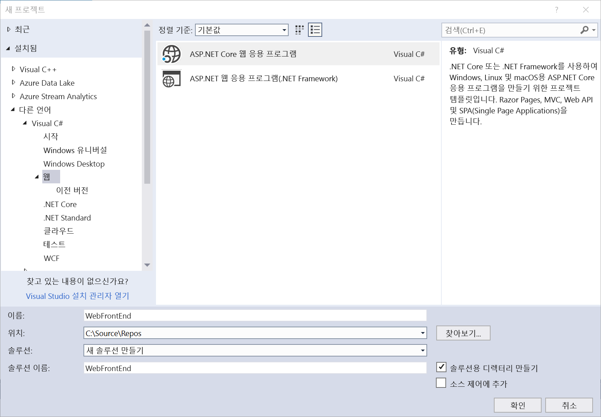
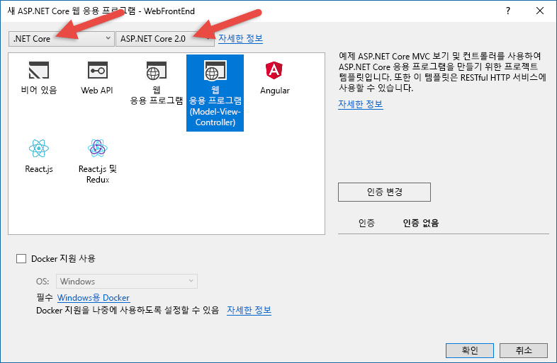
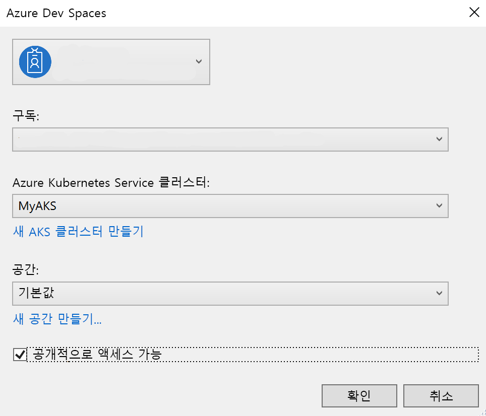

# <a name="get-started-on-azure-dev-spaces-with-net-core-and-visual-studio"></a>Azure Dev Spaces에서 .NET Core 및 Visual Studio를 사용하여 시작

이 가이드에서는 다음을 수행하는 방법을 배우게 됩니다.

- Azure에서 관리되는 Kubernetes 클러스터를 사용하여 Azure Dev Spaces를 설정합니다.
- Visual Studio를 사용하여 컨테이너에서 반복적으로 코드를 개발합니다.
- 독립적으로 별도의 두 서비스를 개발하고, Kubernetes의 DNS 서비스 검색을 사용하여 다른 서비스를 호출합니다.
- 팀 환경에서 코드를 생산적으로 개발하고 테스트합니다.

[!INCLUDE[](includes/see-troubleshooting.md)]

[!INCLUDE[](includes/portal-aks-cluster.md)]

## <a name="get-the-visual-studio-tools"></a>Visual Studio 도구 가져오기
1. 최신 버전의 [Visual Studio 2017](https://www.visualstudio.com/vs/) 설치
1. Visual Studio 설치 관리자에서 다음 워크로드가 선택되어 있는지 확인합니다.
    * ASP.NET 및 웹 개발
1. [Visual Studio Tools for Kubernetes](https://aka.ms/get-azds-visualstudio) 설치

## <a name="create-a-web-app-running-in-a-container"></a>컨테이너에서 실행되는 웹앱 만들기

이 섹션에서는 ASP.NET Core 웹앱을 만들어 Kubernetes의 컨테이너에서 실행합니다.

### <a name="create-an-aspnet-web-app"></a>ASP.NET 웹앱 만들기

Visual Studio 2017에서 새 프로젝트를 만듭니다. 현재 프로젝트는 **ASP.NET Core 웹 응용 프로그램**이어야 합니다. 프로젝트의 이름을 '**webfrontend**'로 지정합니다.



대화 상자의 상단에 있는 두 개의 드롭다운에서 **웹 응용 프로그램 (모델-보기-컨트롤러)** 템플릿을 선택하고, **.NET Core** 및 **ASP.NET Core 2.0**을 대상으로 하고 있는지 확인합니다. **확인**을 클릭하여 프로젝트를 만듭니다.




### <a name="enable-dev-spaces-for-an-aks-cluster"></a>AKS 클러스터에 대한 개발 환경을 사용하도록 설정

방금 만든 프로젝트를 사용하여 아래 그림과 같이 시작 설정 드롭다운에서 **Azure Dev Spaces**를 선택합니다.


다음에 표시되는 대화 상자에서 적절한 계정으로 로그인했는지 확인한 다음, 기존 Kubernetes 클러스터를 선택합니다.



지금은 **공간** 드롭다운을 기본값인 `default`로 그대로 둡니다. 나중에 이 옵션에 대해 자세히 알아보겠습니다. 공용 엔드포인트를 통해 웹앱에 액세스할 수 있도록 **공용 액세스 가능** 확인란을 선택합니다. 이 설정은 필요한 것은 아니지만 이 연습의 뒷부분에서 몇 가지 개념을 보여주는 데 도움이 될 것입니다. 두 경우 모두 Visual Studio를 사용하여 웹 사이트를 디버깅할 수는 있으니 걱정하지 마세요.


클러스터를 선택하거나 만들려면 **확인**을 클릭합니다.

Azure Dev Spaces에서 작동하도록 설정되지 않은 클러스터를 선택하면 구성할 것인지 묻는 메시지가 표시됩니다.


**확인**을 선택합니다.

 이 작업을 수행하기 위한 백그라운드 작업이 시작됩니다. 완료하는 데 몇 분 정도 걸립니다. 아직 생성 중인지 확인하려면 다음 그림과 같이 상태 표시줄의 왼쪽 아래 모서리에 있는 **백그라운드 작업** 아이콘 위로 포인터를 이동합니다.


> [!Note]
> 개발 환경이 성공적으로 만들어질 때까지는 응용 프로그램을 디버깅할 수 없습니다.

### <a name="look-at-the-files-added-to-project"></a>프로젝트에 추가된 파일 확인
개발 환경이 생성될 때까지 기다리는 동안 개발 환경을 사용하도록 선택할 때 프로젝트에 추가된 파일을 확인합니다.

먼저, `charts`라는 폴더가 추가되었으며, 이 폴더 내에는 응용 프로그램에 대한 [Helm 차트](https://docs.helm.sh)가 스캐폴딩되어 있습니다. 이러한 파일은 개발 환경에 응용 프로그램을 배포하는 데 사용됩니다.

`Dockerfile`이라는 파일이 추가되었습니다. 이 파일에는 응용 프로그램을 표준 Docker 형식으로 패키징하는 데 필요한 정보가 있습니다.

마지막으로 개발 환경에서 필요한 개발 시간 구성을 포함하는 `azds.yaml`라는 파일이 표시됩니다.


## <a name="debug-a-container-in-kubernetes"></a>Kubernetes에서 컨테이너 디버깅
개발 환경이 성공적으로 만들어지면 응용 프로그램을 디버깅할 수 있습니다. 코드에서 중단점을 설정합니다(예: `Message` 변수가 설정된 파일 `HomeController.cs`의 줄 20). **F5** 키를 클릭하여 디버깅을 시작합니다. 

Visual Studio는 개발 환경과 통신하여 응용 프로그램을 빌드 및 배포한 다음, 웹앱이 실행되는 브라우저를 엽니다. 컨테이너가 로컬에서 실행되는 것처럼 보일 수도 있지만, 실제로는 Azure의 개발 환경에서 실행됩니다. 로컬 호스트 주소인 이유는 Azure Dev Spaces가 AKS에서 실행 중인 컨테이너에 임시 SSH 터널을 생성하기 때문입니다.

중단점을 트리거하려면 페이지 상단에 있는 **정보** 링크를 클릭합니다. 호출 스택, 지역 변수, 예외 정보 등과 같은 코드가 로컬에서 실행되는 경우와 마찬가지로 디버그 정보에 대한 모든 액세스 권한을 갖습니다.

## <a name="iteratively-develop-code"></a>반복적으로 코드 개발

Azure Dev Spaces는 Kubernetes에서 단순히 코드를 실행하는 것이 아니라, 클라우드의 Kubernetes 환경에서 코드 변경 내용을 신속하고 반복적으로 확인할 수 있게 해주는 것입니다.

### <a name="update-a-content-file"></a>콘텐츠 파일 업데이트
1. `./Views/Home/Index.cshtml` 파일을 찾고 이 HTML 파일을 편집합니다. 예를 들어 `<h2>Application uses</h2>`를 읽는 행 70을 `<h2>Hello k8s in Azure!</h2>`로 변경합니다.
1. 파일을 저장합니다.
1. 브라우저로 이동하여 페이지를 새로 고칩니다. 웹 페이지에 업데이트된 HTML이 표시되어야 합니다.

어떻게 된 건가요? HTML 및 CSS와 같은 콘텐츠 파일을 편집하는 경우 .NET Core 웹앱에서 다시 컴파일을 수행할 필요가 없기 때문에 활성 F5 세션은 수정된 콘텐츠 파일을 AKS에서 실행 중인 컨테이너에 자동으로 동기화하므로 콘텐츠 편집 내용을 바로 볼 수 있습니다.

### <a name="update-a-code-file"></a>코드 파일 업데이트
.NET Core 앱이 업데이트된 응용 프로그램 이진 파일을 다시 빌드하고 생성해야 하기 때문에 코드 파일을 업데이트하려면 작업이 좀 더 필요합니다.

1. Visual Studio에서 디버거를 중지합니다.
1. `Controllers/HomeController.cs`라는 코드 파일을 열고, 정보 페이지(`ViewData["Message"] = "Your application description page.";`)에 표시될 메시지를 편집합니다.
1. 파일을 저장합니다.
1. **F5** 키를 눌러 다시 디버깅을 시작합니다. 

코드 편집이 완료될 때마다 상당한 시간이 소요되는 새 컨테이너 이미지 다시 빌드 및 다시 배포 작업을 수행하는 대신 Azure Dev Spaces는 기존 컨테이너 내에서 코드를 점진적으로 다시 컴파일하여 더 빠른 편집/디버그 루프를 제공합니다.

브라우저에서 웹앱을 새로 고치고 정보 페이지로 이동합니다. 사용자 지정 메시지가 UI에 표시되어야 합니다.


## <a name="call-another-container"></a>다른 컨테이너 호출
이 섹션에서는 두 번째 서비스인 `mywebapi`를 만들고 `webfrontend`에서 이 서비스를 호출하도록 합니다. 각 서비스는 별도의 컨테이너에서 실행됩니다. 그런 다음, 두 컨테이너 모두에서 디버그합니다.


### <a name="download-sample-code-for-mywebapi"></a>*mywebapi* 샘플 코드 다운로드
이제 GitHub 리포지토리에서 샘플 코드를 다운로드해 보겠습니다. https://github.com/Azure/dev-spaces로 이동하고 **복제 또는 다운로드**를 선택하여 GitHub 리포지토리를 다운로드합니다. 이 섹션에서 사용할 코드는 `samples/dotnetcore/getting-started/mywebapi`에 있습니다.

### <a name="run-mywebapi"></a>*mywebapi*를 실행합니다.
1. *별도의 Visual Studio 창*에서 `mywebapi` 프로젝트를 엽니다.
1. 이전에 `webfrontend` 프로젝트에 대해 수행한 대로 시작 설정 드롭다운에서 **Azure Dev Spaces**를 선택합니다. 이번에는 새 AKS 클러스터를 만드는 대신, 이미 만든 것과 동일한 클러스터를 선택합니다. 이전과 마찬가지로, [공간]을 기본값인 `default`로 그대로 두고 **확인**을 클릭합니다. 출력 창에서는 Visual Studio에서 디버깅을 시작할 때 속도를 높이기 위해 개발 환경의 이 새로운 서비스를 "준비"하기 시작한다는 것을 알 수 있습니다.
1. F5 키를 누르고, 서비스가 빌드되고 배포될 때까지 기다립니다. Visual Studio 상태 표시줄이 주황색으로 바뀌면 준비가 되었음을 알 수 있습니다.
1. **출력** 창의 **AKS용 Azure Dev Spaces** 분할 창에 표시된 엔드포인트 URL을 적어둡니다. 이는 http://localhost:\<portnumber\>과 비슷합니다. 컨테이너가 로컬에서 실행되는 것처럼 보일 수도 있지만, 실제로는 Azure의 개발 환경에서 실행됩니다.
2. `mywebapi`가 준비되면 브라우저를 localhost 주소로 열고, `ValuesController`에 대한 기본 GET API를 호출하기 위해 URL에 `/api/values`를 추가합니다. 
3. 모든 단계가 성공적으로 완료되면 다음과 같은 `mywebapi` 서비스의 응답이 표시될 수 있습니다.

    

### <a name="make-a-request-from-webfrontend-to-mywebapi"></a>*webfrontend*에서 *mywebapi*로 요청
이제 `mywebapi`에 요청하는 코드를 `webfrontend`에 작성해 보겠습니다. `webfrontend` 프로젝트가 있는 Visual Studio 창으로 전환합니다. `HomeController.cs` 파일에서 About 메서드에 대한 코드를 다음 코드로 *바꿉니다*.

   ```csharp
   public async Task<IActionResult> About()
   {
      ViewData["Message"] = "Hello from webfrontend";

      using (var client = new System.Net.Http.HttpClient())
            {
                // Call *mywebapi*, and display its response in the page
                var request = new System.Net.Http.HttpRequestMessage();
                request.RequestUri = new Uri("http://mywebapi/api/values/1");
                if (this.Request.Headers.ContainsKey("azds-route-as"))
                {
                    // Propagate the dev space routing header
                    request.Headers.Add("azds-route-as", this.Request.Headers["azds-route-as"] as IEnumerable<string>);
                }
                var response = await client.SendAsync(request);
                ViewData["Message"] += " and " + await response.Content.ReadAsStringAsync();
            }

      return View();
   }
   ```

위의 코드 예제는 `azds-route-as` 헤더를 수신 요청에서 발신 요청으로 전달합니다. 나중에 팀 시나리오에서 이를 통해 더 생산적인 개발 환경을 용이하게 하는 방법을 살펴보겠습니다.

### <a name="debug-across-multiple-services"></a>여러 서비스에서 디버깅
1. 이 시점에서 `mywebapi`는 디버거가 연결된 상태로 계속 실행되고 있습니다. 그렇지 않으면 `mywebapi` 프로젝트에서 F5 키를 누릅니다.
1. `api/values/{id}` GET 요청을 처리하는 `Controllers/ValuesController.cs` 파일의 `Get(int id)` 메서드에 중단점을 설정합니다.
1. 위 코드를 붙여넣은 `webfrontend` 프로젝트에서 GET 요청을 `mywebapi/api/values`로 보내기 바로 전에 중단점을 설정합니다.
1. `webfrontend` 프로젝트에서 F5 키를 누릅니다. Visual Studio에서 브라우저를 해당 localhost 포트로 다시 열고, 웹앱이 표시됩니다.
1. `webfrontend` 프로젝트에서 중단점을 트리거하려면 페이지 위쪽에 있는 **정보** 링크를 클릭합니다. 
1. F10 키를 눌러 계속 진행합니다. 이제 `mywebapi` 프로젝트의 중단점이 트리거됩니다.
1. F5 키를 눌러 계속 진행하고 `webfrontend` 프로젝트의 코드로 돌아갑니다.
1. 한 번 더 F5 키를 누르면 요청이 완료되고 브라우저에서 페이지가 반환됩니다. 웹앱의 [정보] 페이지에는 두 서비스로 연결된 "Hello from webfrontend and Hello from mywebapi.(webfrontend에서 보낸 Hello 및 mywebapi에서 보낸 Hello입니다.)"라는 메시지가 표시됩니다.

모두 완료되었습니다! 이제 각 컨테이너를 개별적으로 개발하고 배포할 수 있는 다중 컨테이너 응용 프로그램이 있습니다.

## <a name="learn-about-team-development"></a>팀 개발 알아보기

지금까지 응용 프로그램에서 작업하는 유일한 개발자인 것처럼 응용 프로그램 코드를 실행했습니다. 이 섹션에서는 Azure Dev Spaces에서 팀 개발을 간소화하는 방법에 대해 알아봅니다.
* 필요에 따라 공유 개발 공간 또는 고유한 개발 공간에서 작업하여 개발자 팀이 동일한 환경에서 작업하도록 설정합니다.
* 각 개발자가 다른 개발자를 방해하지 않고 격리된 상태에서 자신의 코드를 반복할 수 있도록 지원합니다.
* 모의 개체를 만들거나 종속성을 시뮬레이션할 필요 없이 코드를 커밋하기 전에 종단 간 코드를 테스트합니다.

### <a name="challenges-with-developing-microservices"></a>마이크로 서비스 개발 문제
현재 샘플 응용 프로그램은 그다지 복잡하지 않습니다. 하지만 실제 개발 환경에서는 더 많은 서비스를 추가하고 개발 팀이 성장함에 따라 문제가 곧 발생합니다.

수십 개의 다른 서비스와 상호 작용하는 서비스를 사용하는 자신을 상상해 보세요.

- 개발을 위해 모든 작업을 로컬로 실행하는 것은 현실적이지 않습니다. 개발 컴퓨터에는 전체 앱을 실행할 수 있을 만큼 충분한 리소스가 없을 수 있습니다. 또는 앱에 공용으로 연결할 수 있는 엔드포인트가 있을 수 있습니다(예: 앱에서 SaaS 앱의 웹후크에 응답하는 경우).
- 사용하는 서비스만 실행하려고 할 수는 있지만, 이 경우 종속성, 즉 종속성의 종속성까지 완전히 종료해야 합니다. 또는 작업을 수행하지 않았기 때문에 종속성을 작성하고 실행하는 방법을 쉽게 알지 못하는 것이 문제입니다.
- 일부 개발자는 서비스 종속성 대부분을 시뮬레이션하거나 모델링하는 데 의존합니다. 이렇게 하면 도움이 되는 경우도 있지만, 그러한 모의 개체를 관리하는 것은 곧 자체의 개발 노력에 착수해야 할 수도 있습니다. 더욱이 이로 인해 개발 환경을 프로덕션 환경과 다르게 보이도록 하고, 감지하기 어려운 버그의 영향이 미칠 수 있습니다.
- 따라서 모든 종류의 종단 간 테스트를 수행하는 것이 어려워집니다. 통합 테스트는 현실적으로 커밋 후에만 수행할 수 있습니다. 이는 나중에 개발 주기에서 문제가 발생한다는 것을 의미합니다.

    

### <a name="work-in-a-shared-dev-space"></a>공유 개발 공간에서 작업
Azure Dev Spaces를 사용하면 Azure에서 *공유* 개발 공간을 설정할 수 있습니다. 각 개발자는 응용 프로그램의 일부에만 집중할 수 있으며, 시나리오에 종속된 다른 모든 서비스와 클라우드 리소스가 이미 포함되어 있는 개발 공간에서 *사전 커밋 코드*를 반복적으로 개발할 수 있습니다. 종속성은 항상 최신이며, 개발자는 프로덕션을 미러하는 방식으로 작업합니다.

### <a name="work-in-your-own-space"></a>개발자 고유의 공간에서 작업
서비스에 대한 코드를 개발하고 이 코드를 체크 인할 준비가 되기 전에 코드 상태가 좋지 않은 경우가 많습니다. 아직도 코드를 반복적으로 만들고, 테스트하고, 솔루션에서 실험합니다. Azure Dev Spaces는 **공간**이라는 개념을 제공합니다. 이 공간을 사용하면 팀 구성원을 방해할 염려 없이 격리된 상태에서 작업할 수 있습니다.

**`default`개발 환경**에서 `webfrontend` 및 `mywebapi` 서비스가 모두 실행되고 있는지 확인하려면 다음을 수행합니다.
1. 두 서비스에 대한 F5/디버그 세션은 모두 닫고, 프로젝트는 Visual Studio 창에서 열어 둡니다.
2. `mywebapi` 프로젝트가 있는 Visual Studio 창으로 전환하고, Ctrl+F5를 눌러 디버거가 연결되지 않은 상태로 서비스를 실행합니다.
3. 마찬가지로, `webfrontend` 프로젝트가 있는 Visual Studio 창으로 전환하고, Ctrl+F5를 눌러 이 프로젝트를 실행합니다.

> [!Note]
> Ctrl+F5를 눌러 웹 페이지를 처음 표시한 후에 브라우저를 새로 고쳐야 하는 경우가 가끔 있습니다.

공용 URL을 열고 웹앱으로 이동하는 모든 사용자는 기본 `default` 공간을 사용하여 작성한 코드 경로를 호출하며, 이 코드는 두 서비스를 통해 실행됩니다. 이제 `mywebapi`를 계속 개발하려고 한다고 가정합니다. 개발 환경을 사용하는 다른 개발자를 방해하지 않고 수행하려면 어떻게 해야 할까요? 이렇게 하려면 자신만의 고유한 공간을 설정합니다.

### <a name="create-a-new-dev-space"></a>새 개발 환경 만들기
Visual Studio 내에서 서비스를 F5 또는 Ctrl+F5로 누르면 사용할 공간을 추가로 만들 수 있습니다. 원하는 공간을 호출할 수 있으며 그 의미(예: `sprint4` 또는 `demo`)에 대해 유연하게 고려할 수 있습니다.

새 공간을 만들려면 다음을 수행합니다.
1. `mywebapi` 프로젝트가 있는 Visual Studio 창으로 전환합니다.
2. **솔루션 탐색기**에서 프로젝트를 마우스 오른쪽 단추로 클릭하고 **속성**을 선택합니다.
3. 왼쪽의 **디버그** 탭을 선택하여 Azure Dev Spaces 설정을 표시합니다.
4. 여기서 F5 또는 Ctrl+F5를 누르면 사용할 클러스터 및/또는 공간을 변경하거나 만들 수 있습니다. *이전에 만든 Azure 개발 공간이 선택되어 있는지 확인합니다*.
5. [공간] 드롭다운에서 **<새 공간 만들기...>** 를 선택합니다.

    

6. **공간 추가** 대화 상자에서 공간에 대한 이름을 입력하고 **확인**을 클릭합니다. 새 공간 이름에 사용자 이름(예: "scott")을 사용하면 해당 사용자가 작업 중인 공간이 동료에게 식별될 수 있습니다.

    

7. 이제 프로젝트 속성 페이지에서 선택한 AKS 클러스터와 새 공간이 표시됩니다.

    

### <a name="update-code-for-mywebapi"></a>*mywebapi*에 대한 코드 업데이트

1. `mywebapi` 프로젝트에서 다음과 같이 코드를 `Controllers/ValuesController.cs` 파일의 `string Get(int id)` 메서드로 변경합니다.
 
    ```csharp
    [HttpGet("{id}")]
    public string Get(int id)
    {
        return "mywebapi now says something new";
    }
    ```

2. 이 업데이트된 코드 블록에 중단점을 설정합니다(이미 이전에 설정한 중단점일 수 있음).
3. F5 키를 눌러 `mywebapi` 서비스를 시작합니다. 그러면 선택한 공간(이 경우 `scott`)을 사용하여 클러스터에서 서비스가 시작됩니다.

서로 다른 공간이 작동하는 방식을 이해하는 데 도움이 되는 다이어그램은 다음과 같습니다. 자주색 경로는 `default` 공간을 통한 요청을 나타내며, URL 앞에 공백이 없는 경우 사용되는 기본 경로입니다. 분홍색 경로는 `default/scott` 공간을 통한 요청을 나타냅니다.


기본 제공되는 Azure Dev Spaces 기능을 사용하면 각 개발자가 자신의 공간에서 서비스의 전체 스택을 다시 만들 필요 없이 공유 환경에서 코드를 종단 간에 테스트할 수 있습니다. 이 라우팅에서는 이 가이드의 이전 단계에서 설명한 대로 앱 코드에서 전파 헤더를 전달해야 합니다.

### <a name="test-code-running-in-the-defaultscott-space"></a>`default/scott` 공간에서 실행 중인 코드 테스트
`webfrontend`와 함께 새 버전의 `mywebapi`를 테스트하려면 브라우저를 `webfrontend`에 대한 공용 액세스 지점 URL(예: http://webfrontend.123456abcdef.eastus.aksapp.io))로 열고, [정보] 페이지로 이동합니다. "webfrontend에서 보낸 Hello 및 mywebapi에서 보낸 Hello입니다."라는 원래 메시지가 표시됩니다.

이제 URL에 "scott.s" 부분을 추가하여 http://scott.s.webfrontend.123456abcdef.eastus.aksapp.io와 비슷한 내용을 읽고 브라우저를 새로 고칩니다. `mywebapi` 프로젝트에서 설정한 중단점에 적중되어야 합니다. F5 키를 클릭하여 계속 진행합니다. 그러면 브라우저에서 "webfrontend 및 mywebapi를 통한 Hello"라는 새 메시지가 표시됩니다. 이는 `mywebapi`의 업데이트된 코드 경로가 `default/scott` 공간에서 실행되기 때문입니다.

[!INCLUDE[](includes/well-done.md)]

[!INCLUDE[](includes/clean-up.md)]
