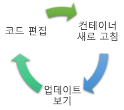
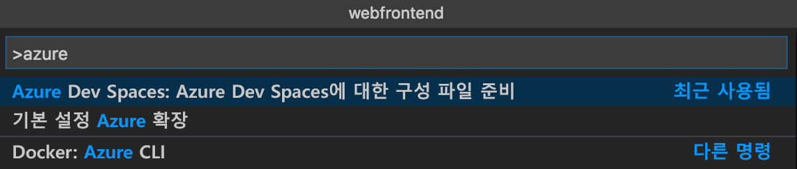
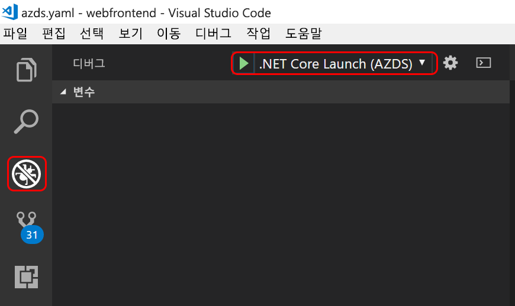

# <a name="get-started-on-azure-dev-spaces-with-net-core"></a>Azure Dev Spaces에서 .NET Core를 사용하여 시작

이 가이드에서는 다음을 수행하는 방법을 배우게 됩니다.

- 개발용으로 최적화된 Azure의 Kubernetes 기반 환경인 _개발 공간_을 만듭니다.
- VS Code 및 명령줄을 사용하여 컨테이너에서 반복적으로 코드를 개발합니다.
- 팀 환경에서 코드를 생산적으로 개발하고 테스트합니다.

> [!Note]
> **의문 사항이 있으면** 언제든지 [문제 해결](troubleshooting.md) 섹션을 참조하세요.

## <a name="install-the-azure-cli"></a>Azure CLI 설치
Azure Dev Spaces에는 최소한의 로컬 컴퓨터 설정이 필요합니다. 개발 환경의 구성은 대부분 클라우드에 저장되며 다른 사용자와 공유할 수 있습니다. 먼저 [Azure CLI](/cli/azure/install-azure-cli?view=azure-cli-latest)를 다운로드하고 실행하여 시작합니다.

### <a name="sign-in-to-azure-cli"></a>Azure CLI에 로그인
Azure에 로그인합니다. 터미널 창에 다음 명령을 입력합니다.

```cmd
az login
```

> [!Note]
> Azure 구독이 없는 경우 [체험 계정](https://azure.microsoft.com/free)을 만들 수 있습니다.

#### <a name="if-you-have-multiple-azure-subscriptions"></a>여러 Azure 구독이 있는 경우...
다음을 실행하여 구독을 볼 수 있습니다. 

```cmd
az account list
```
JSON 출력에서 `isDefault: true`이 포함된 구독을 찾습니다.
사용하려는 구독이 없으면 기본 구독을 변경할 수 있습니다.

```cmd
az account set --subscription <subscription ID>
```

## <a name="create-a-kubernetes-cluster-enabled-for-azure-dev-spaces"></a>Azure Dev Space에 사용하도록 설정된 Kubernetes 클러스터 만들기

명령 프롬프트에서 [Azure Dev Spaces를 지원하는 영역](https://docs.microsoft.com/azure/dev-spaces/#a-rapid,-iterative-kubernetes-development-experience-for-teams)에 리소스 그룹을 만듭니다.

```cmd
az group create --name MyResourceGroup --location <region>
```

다음 명령을 사용하여 Kubernetes 클러스터를 만듭니다.

```cmd
az aks create -g MyResourceGroup -n MyAKS --location <region> --generate-ssh-keys
```

클러스터를 만드는 데 몇 분이 걸립니다.

### <a name="configure-your-aks-cluster-to-use-azure-dev-spaces"></a>Azure Dev Spaces를 사용하도록 AKS 클러스터 구성

AKS 클러스터를 포함하는 리소스 그룹을 사용하여 다음 Azure CLI 명령 및 AKS 클러스터 이름을 입력합니다. 명령은 Azure Dev Spaces에 대한 지원을 통해 클러스터를 구성합니다.

   ```cmd
   az aks use-dev-spaces -g MyResourceGroup -n MyAKS
   ```
   
> [!IMPORTANT]
> Azure Dev Spaces 구성 프로세스는 클러스터에서 `azds` 네임스페이스를 제거합니다(있는 경우).

## <a name="get-kubernetes-debugging-for-vs-code"></a>VS Code용 Kubernetes 디버깅 가져오기
Kubernetes 디버깅과 같은 다양한 기능은 VS Code를 사용하는 .NET Core 및 Node.js 개발자가 사용할 수 있습니다.

1. [VS Code](https://code.visualstudio.com/Download)가 없으면 이를 설치합니다.
1. [VS Azure Dev Spaces 확장](https://marketplace.visualstudio.com/items?itemName=azuredevspaces.azds)을 다운로드하여 설치합니다. 확장의 Marketplace 페이지 및 VS Code에서 [설치]를 한 번 클릭합니다. 

## <a name="create-a-web-app-running-in-a-container"></a>컨테이너에서 실행되는 웹앱 만들기

이 섹션에서는 ASP.NET Core 웹앱을 만들어 Kubernetes의 컨테이너에서 실행합니다.

### <a name="create-an-aspnet-core-web-app"></a>ASP.NET Core 웹앱 만들기
[Azure Dev Spaces 샘플 애플리케이션](https://github.com/Azure/dev-spaces)을 복제하거나 다운로드합니다. 이 문서에서는 *samples/dotnetcore/getting-started/webfrontend* 디렉터리의 코드를 사용합니다.

## <a name="preparing-code-for-docker-and-kubernetes-development"></a>Docker 및 Kubernetes 개발을 위한 코드 준비
지금까지 로컬로 실행할 수 있는 기본 웹앱이 있었습니다. 이제 앱의 컨테이너 및 Kubernetes에 배포되는 방법을 정의하는 자산을 만들어 컨테이너화합니다. 이 작업은 Azure Dev Spaces를 사용하여 쉽게 할 수 있습니다. 

1. VS Code를 시작하고 `webfrontend` 폴더를 엽니다. (디버그 자산을 추가하거나 프로젝트를 복원하라는 모든 기본 프롬프트를 무시할 수 있습니다.)
1. VS Code에서 통합 터미널을 엽니다(**보기 > 통합 터미널** 메뉴 사용).
1. 이 명령을 실행합니다(**webfrontend**가 현재 폴더인지 확인).

    ```cmd
    azds prep --public
    ```

Azure CLI의 `azds prep` 명령은 기본 설정으로 Docker 및 Kubernetes 자산을 생성합니다.
* `./Dockerfile`은 앱의 컨테이너 이미지 및 원본 코드가 빌드되는 방법을 설명하고 컨테이너 내에서 실행됩니다.
* `./charts/webfrontend` 아래의 [Helm 차트](https://docs.helm.sh)는 Kubernetes에 컨테이너를 배포하는 방법을 설명합니다.

지금은 이러한 파일의 전체 컨텐츠를 이해할 필요가 없습니다. 언급할 가치가 있지만 **코드 자산으로 동일한 Kubernetes 및 Docker 구성을 개발에서 프로덕션까지 사용할 수 있으므로 서로 다른 환경에서 더 나은 일관성을 제공합니다.**
 
또한 `./azds.yaml`이라는 파일이 `prep` 명령으로 생성되며, 이는 Azure Dev Spaces에 대한 구성 파일입니다. Azure에서 반복 개발 환경을 활성화하는 추가 구성으로 Docker 및 Kubernetes 아티팩트를 보완합니다.

## <a name="build-and-run-code-in-kubernetes"></a>Kubernetes에서 코드 빌드 및 실행
코드를 실행해 보겠습니다! 터미널 창의 **루트 코드 폴더**인 webfrontend에서 다음 명령을 실행합니다.

```cmd
azds up
```

명령의 출력을 계속 지켜보면 명령이 진행될 때 몇 가지 사항을 확인할 수 있습니다.
- 소스 코드는 Azure의 개발 공간에 동기화됩니다.
- 코드 폴더의 Docker 자산에 지정된 대로 Azure에서 컨테이너 이미지가 만들어집니다.
- 또한 코드 폴더의 Helm 차트에 지정된 대로 컨테이너 이미지를 활용하는 Kubernetes 개체가 만들어집니다.
- 컨테이너의 엔드포인트에 대한 정보가 표시됩니다. 이 예제에서는 공용 HTTP URL이 표시됩니다.
- 위 단계가 성공적으로 완료되었다고 가정하면 컨테이너가 시작될 때 `stdout`(및 `stderr`) 출력이 표시되기 시작해야 합니다.

> [!Note]
> `up` 명령을 처음 실행할 때는 이러한 단계가 오래 걸리지만 후속 실행은 더 빨라집니다.

### <a name="test-the-web-app"></a>웹앱 테스트
콘솔 출력에서 `up` 명령으로 생성된 공용 URL에 대한 정보를 검색합니다. 다음과 같은 형식입니다. 

```
(pending registration) Service 'webfrontend' port 'http' will be available at <url>
Service 'webfrontend' port 80 (TCP) is available at 'http://localhost:<port>'
```

브라우저 창에서 이 URL을 열고 웹앱 로드를 확인합니다. 컨테이너가 실행될 때 `stdout` 및 `stderr` 출력이 터미널 창으로 스트리밍됩니다.

> [!Note]
> 첫 번째 실행 시 공용 DNS를 준비하는 데 몇 분 정도 걸릴 수 있습니다. 공용 URL이 확인되지 않으면 콘솔 출력에 표시되는 `http://localhost:<portnumber>` URL을 대신 사용할 수 있습니다. localhost URL을 사용하는 경우 컨테이너가 로컬로 실행되는 것처럼 보이지만, 실제로는 AKS에서 실행되고 있습니다. 편의상 로컬 컴퓨터에서 서비스와 쉽게 상호 작용할 수 있도록 Azure Dev Spaces는 Azure에서 실행되는 컨테이너에 대한 임시 SSH 터널을 만듭니다. DNS 레코드 준비되면 돌아와서 나중에 공용 URL을 시도해볼 수 있습니다.

### <a name="update-a-content-file"></a>콘텐츠 파일 업데이트
Azure Dev Spaces는 Kubernetes에서 단순히 코드를 실행하는 것이 아니라, 클라우드의 Kubernetes 환경에서 코드 변경 내용을 신속하고 반복적으로 확인할 수 있게 해주는 것입니다.

1. `./Views/Home/Index.cshtml` 파일을 찾고 이 HTML 파일을 편집합니다. 예를 들어 `<h2>Application uses</h2>`를 읽는 행 70을 `<h2>Hello k8s in Azure!</h2>`로 변경합니다.
1. 파일을 저장합니다. 잠시 후, 터미널 창에 실행 중인 컨테이너의 파일이 업데이트되었다는 메시지가 표시됩니다.
1. 브라우저로 이동하여 페이지를 새로 고칩니다. 웹 페이지에 업데이트된 HTML이 표시되어야 합니다.

어떻게 된 건가요? HTML 및 CSS와 같은 콘텐츠 파일을 편집하는 경우 .NET Core 웹앱에서 다시 컴파일을 수행할 필요가 없기 때문에 활성 `azds up` 명령은 수정된 콘텐츠 파일을 Azure의 실행 중인 컨테이너에 자동으로 동기화하므로 콘텐츠 편집 내용을 바로 볼 수 있습니다.

### <a name="update-a-code-file"></a>코드 파일 업데이트
.NET Core 앱이 업데이트된 애플리케이션 이진 파일을 다시 빌드하고 생성해야 하기 때문에 코드 파일을 업데이트하려면 작업이 좀 더 필요합니다.

1. 터미널 창에서 `Ctrl+C`(`azds up` 중지)를 누릅니다.
1. `Controllers/HomeController.cs`라는 코드 파일을 열고, 정보 페이지(`ViewData["Message"] = "Your application description page.";`)에 표시될 메시지를 편집합니다.
1. 파일을 저장합니다.
1. 터미널 창에서 `azds up`를 실행합니다. 

이 명령은 컨테이너 이미지를 다시 빌드하고 Helm 차트를 다시 배포합니다. 실행 중인 애플리케이션에서 코드 변경 내용을 적용하려면 웹앱의 정보 메뉴로 이동합니다.


하지만 코드 개발에 사용할 수 있는 *훨씬 더 빠른 방법*이 있으며, 이에 대해서는 다음 섹션에서 살펴볼 예정입니다. 

## <a name="debug-a-container-in-kubernetes"></a>Kubernetes에서 컨테이너 디버깅

이 섹션에서는 VS Code를 사용하여 Azure에서 실행 중인 컨테이너를 직접 디버그합니다. 또한 편집-실행-테스트를 더 빠르게 반복하는 방법도 알아봅니다.



> [!Note]
> **의문 사항이 있으면** 언제든지 [문제 해결](troubleshooting.md) 섹션을 참조하거나 이 페이지에 의견을 게시하세요.

### <a name="initialize-debug-assets-with-the-vs-code-extension"></a>VS Code 확장을 사용하여 디버그 자산 초기화
먼저 VS Code가 Azure에서 개발 환경과 통신하도록 코드 프로젝트를 구성해야 합니다. Azure Dev Spaces에 대한 VS Code 확장은 디버그 구성을 설정하는 도우미 명령을 제공합니다. 

**명령 팔레트**(**보기 | 명령 팔레트** 메뉴를 사용하여)를 열고, 자동 완성을 사용하여 입력하고 이 명령을 선택합니다. `Azure Dev Spaces: Prepare configuration files for Azure Dev Spaces` 

이렇게 하면 `.vscode` 폴더 아래에 Azure Dev Spaces에 대한 디버그 구성이 추가됩니다. 이 명령은 배포 프로젝트를 구성하는 `azds prep` 명령과 혼동하면 안됩니다.




### <a name="select-the-azds-debug-configuration"></a>AZDS 디버그 구성 선택
1. 디버그 보기를 열려면 VS Code 측면의 **활동 표시줄**에서 디버그 아이콘을 클릭합니다.
1. 활성 디버그 구성으로 **.NET Core 시작(AZDS)** 을 선택합니다.



> [!Note]
> 명령 팔레트에 Azure Dev Spaces 명령이 보이지 않으면 Azure Dev Spaces용 VS Code 확장 프로그램을 설치했는지 확인합니다. VS Code에서 연 작업 영역이 azds.yaml을 포함하는 폴더인지 확인합니다.


### <a name="debug-the-container-in-kubernetes"></a>Kubernetes에서 컨테이너 디버깅
**F5** 키를 눌러 Kubernetes에서 코드를 디버깅하세요.

`up` 명령과 마찬가지로 코드가 개발 환경에 동기화되고 컨테이너가 빌드되어 Kubernetes에 배포됩니다. 물론 이번에는 디버거가 원격 컨테이너에 연결됩니다.

> [!Tip]
> VS Code 상태 표시줄에 클릭 가능한 URL이 표시됩니다.


예를 들어 `Controllers/HomeController.cs` 원본 파일의 `Index()` 함수 내에서 서버 측 코드 파일에 중단점을 설정합니다. 브라우저 페이지를 새로 고치면 중단점에 도달합니다.

코드가 로컬에서 실행되는 경우처럼 호출 스택, 지역 변수, 예외 정보 등과 같은 디버그 정보에 대한 전체 액세스 권한이 있습니다.

### <a name="edit-code-and-refresh"></a>코드 편집 및 새로 고침
디버거를 활성화한 상태에서 코드를 편집합니다. 예를 들어 `Controllers/HomeController.cs`에서 정보 페이지의 메시지를 수정합니다. 

```csharp
public IActionResult About()
{
    ViewData["Message"] = "My custom message in the About page.";
    return View();
}
```

파일을 저장하고, **디버그 작업 창**에서 **새로 고침** 단추를 클릭합니다. 


코드 편집이 완료될 때마다 상당한 시간이 소요되는 새 컨테이너 이미지 다시 빌드 및 다시 배포 작업을 수행하는 대신 Azure Dev Spaces는 기존 컨테이너 내에서 코드를 점진적으로 다시 컴파일하여 더 빠른 편집/디버그 루프를 제공합니다.

브라우저에서 웹앱을 새로 고치고 정보 페이지로 이동합니다. 사용자 지정 메시지가 UI에 표시되어야 합니다.

**이제 코드를 신속하게 반복하고 Kubernetes에서 직접 디버깅할 수 있는 방법이 있습니다.** 다음으로, 두 번째 컨테이너를 만들고 호출하는 방법을 살펴보겠습니다.

## <a name="next-steps"></a>다음 단계

> [!div class="nextstepaction"]
> [다중 서비스 개발에 대해 알아보기](multi-service-netcore.md)
