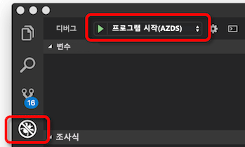

# <a name="how-azure-dev-spaces-works-and-is-configured"></a>Azure 개발 공간 작동 하 고는 하는 방법 구성

Kubernetes 응용 프로그램을 개발 하는 것은 어려울 수 있습니다. Docker 및 Kubernetes 구성 파일을 해야합니다. 응용 프로그램을 로컬로 테스트 및 다른 종속 서비스와 상호 작용 하는 방법을 파악 해야 합니다. 개발 및 테스트 한 번에 여러 서비스 및 개발자 팀을 사용 하 여 처리 해야 합니다.

Azure 개발 공간을 사용 하면 개발, 배포 하 고 직접 Azure Kubernetes Service (AKS)에서 Kubernetes 응용 프로그램을 디버그 합니다. Azure 개발 공간에는 팀을 개발 공간을 공유할 수 있습니다. 팀 개발 공간을 공유할 수 개별 팀 멤버를를 복제 하거나 종속성 또는 클러스터의 다른 응용 프로그램의 모형을 않고도 격리를 개발할 수 있습니다.

Azure 개발 공간 만들고, 배포, 실행 및 AKS에서 Kubernetes 응용 프로그램 디버깅에 대 한 구성 파일을 사용 합니다. 이 구성 파일은 응용 프로그램의 코드를 사용 하 여 있고 버전 제어 시스템에 추가할 수 있습니다.

이 문서는 전원 Azure 개발 공간 및 Azure 개발 공간 구성 파일에서 해당 프로세스 구성 방법 프로세스를 설명 합니다. 신속 하 게 실행 하는 Azure 개발 공간을 실제로 참조를 하려면 빠른 시작 중 하나를 완료 합니다.

* [CLI 및 Visual Studio Code를 사용 하 여 Java](quickstart-java.md)
* [.NET core CLI 및 Visual Studio Code를 사용 하 여](quickstart-netcore.md)
* [Visual Studio 2017을 사용 하 여.NET core](quickstart-netcore-visualstudio.md)
* [CLI 및 Visual Studio Code를 사용 하 여 Node.js](quickstart-nodejs.md)

## <a name="how-azure-dev-spaces-works"></a>Azure 개발 공간의 작동 원리

Azure 개발 공간에 상호 작용 하는 두 가지 구성 요소가: 컨트롤러 및 클라이언트 쪽 도구입니다.


컨트롤러에는 다음 작업을 수행합니다.

* 개발 공간 만들기 및 선택 영역을 관리합니다.
* 응용 프로그램의 Helm 차트를 설치 하 고 Kubernetes 개체를 만듭니다.
* 응용 프로그램의 컨테이너 이미지를 빌드합니다.
* AKS에 응용 프로그램을 배포합니다.
* 소스 코드 변경 되 면 다시 시작 되 고 증분 빌드를 수행 합니다.
* 로그 및 HTTP 추적을 관리합니다.
* Stdout 및 stderr을 클라이언트 쪽 도구에 전달합니다.
* 팀 멤버를를 부모 개발 공간에서 파생 된 자식 개발 공간을 만들 수 있습니다.
* 부모 및 자식 공간에서 뿐만 아니라 공간 내에서 응용 프로그램에 대 한 라우팅을 구성 합니다.

컨트롤러는 AKS 외부에 상주합니다. 클라이언트 쪽 도구와 AKS 클러스터 간에 동작 및 통신을 구동 합니다. 컨트롤러는 Azure 개발 공간을 사용 하 여 클러스터를 준비 하는 경우 Azure CLI를 사용 하 여 활성화 됩니다. 활성화 되 면 클라이언트 쪽 도구를 사용 하 여 상호 작용할 수 있습니다.

클라이언트 쪽 도구를 사용 하면:
* Dockerfile 생성 Helm 차트 및 응용 프로그램에 대 한 Azure 개발 공간 구성 파일입니다.
* 부모 및 자식 개발 공간을 만듭니다.
* 빌드 및 응용 프로그램을 시작 하는 컨트롤러를 알립니다.

응용 프로그램이 실행 되는 동안 클라이언트 쪽도 도구:
* 수신 하 고 AKS에서 실행 중인 응용 프로그램에서 stderr 및 stdout를 표시 합니다.
* 사용 하 여 [포트 정방향](https://kubernetes.io/docs/tasks/access-application-cluster/port-forward-access-application-cluster/) http를 사용 하 여 응용 프로그램에 대 한 웹 액세스를 허용 하도록:\//localhost 합니다.
* AKS에서 실행 중인 응용 프로그램에 디버거를 연결합니다.
* 신속 하 게 반복할 수 있게 하는 증분 빌드에 대 한 변경이 감지 될 때 소스 개발 공간에는 코드를 동기화 합니다.

클라이언트 쪽의 일환으로 명령줄에서 도구를 사용할 수는 `azds` 명령입니다. 또한 클라이언트 쪽 도구를 사용할 수 있습니다.

* Visual Studio Code를 사용 하는 [Azure 개발 공간 확장](https://marketplace.visualstudio.com/items?itemName=azuredevspaces.azds)합니다.
* Visual Studio 2017 [Visual Studio Tools for Kubernetes](https://aka.ms/get-vsk8stools)합니다.

기본 흐름을 설정 하 고 Azure 개발 공간을 사용 하는 다음과 같습니다.
1. Azure 개발 공간에 대 한 AKS 클러스터를 준비 합니다.
1. Azure 개발 공간에서 실행 하기 위한 코드를 준비
1. 개발 공간에서 코드를 실행 합니다.
1. 개발 공간에서 코드를 디버그
1. 개발 공간을 공유

각각의 Azure 개발 공간의 작동 방식을 자세히 다룰 것은 아래 섹션에서는 합니다.

## <a name="prepare-your-aks-cluster"></a>AKS 클러스터를 준비 합니다.

AKS 클러스터를 준비 하는 작업에 포함 됩니다.
* 확인에 AKS 클러스터가 지역의 [Azure 개발 공백으로 지원](https://docs.microsoft.com/azure/dev-spaces/#a-rapid,-iterative-kubernetes-development-experience-for-teams)합니다.
* 1.10.3 Kubernetes를 실행 하는 확인 이상.
* 사용 하 여 클러스터에서 Azure 개발 공간을 사용 하도록 설정 `az aks use-dev-spaces`

만들기 및 Azure 개발 공간에 대 한 AKS 클러스터를 구성 하는 방법에 대 한 자세한 내용은 시작 가이드 중 하나를 참조 합니다.
* [Java 사용 하 여 Azure 개발 공간 시작](get-started-java.md)
* [.NET Core 및 Visual Studio를 사용 하 여 Azure 개발 공간 시작](get-started-netcore-visualstudio.md)
* [.NET Core 사용 하 여 Azure 개발 공간 시작](get-started-netcore.md)
* [Node.js 사용 하 여 Azure 개발 공간 시작](get-started-nodejs.md)

Azure 개발 공간 AKS 클러스터에서 사용 하는 경우 클러스터에 대 한 컨트롤러를 설치 합니다. 컨트롤러는 클러스터 외부에서 별도 Azure 리소스 및 클러스터의 리소스에 다음을 수행 합니다.

* 페이지를 만들거나 개발 공간으로 사용 하는 Kubernetes 네임 스페이스를 지정 합니다.
* 명명 된 모든 Kubernetes 네임 스페이스를 제거 *azds*, 있는 경우 새로 만듭니다.
* Kubernetes 웹 후크 구성을 배포합니다.
* 웹 후크 입학 허가 서버를 배포합니다.
    

또한 다른 Azure 개발자 공간 구성 요소에 대 한 서비스 호출을 위해 AKS 클러스터를 사용 하는 동일한 서비스 주체를 사용 합니다.


Azure 개발 공간을 사용 하려면 하나 이상의 개발 공간 이어야 합니다. Azure 개발 공간 개발 공간에 대 한 AKS 클러스터 내에서 Kubernetes 네임 스페이스를 사용합니다. 컨트롤러를 설치 하면 새 Kubernetes 네임 스페이스를 만들거나, 첫 번째 개발 공간으로 사용할 기존 네임 스페이스를 선택 하 라는 메시지가 나타납니다. 네임 스페이스 개발 공간을 지정 하는 경우 컨트롤러를 추가 합니다 *azds.io/space=true* 개발 공간으로 식별 하는 네임 스페이스에는 레이블. 만들거나 지정 된 초기 개발 공간 클러스터를 준비한 후 기본적으로 선택 됩니다. 공간을 선택 하면 Azure 개발 공백을 사용 하 여 새 워크 로드를 만들기 위한 사용 됩니다.

기본적으로 컨트롤러 이라는 개발 공간을 만듭니다 *기본* 기존 업그레이드 *기본* Kubernetes 네임 스페이스입니다. 새 개발 공간을 만들 기존 개발 공백을 제거 하는 클라이언트 쪽 도구를 사용할 수 있습니다. Kubernetes에서 제한으로 인해 합니다 *기본* 개발 공간을 제거할 수 없습니다. 컨트롤러 라는 모든 기존 Kubernetes 네임 스페이스 제거 *azds* 사용 하 여 충돌을 방지 하는 `azds` 클라이언트 쪽 도구에서 사용 되는 명령입니다.

Kubernetes 웹 후크 입학 허가 서버 계측에 대 한 배포 하는 동안 세 개의 컨테이너가 있는 pod를 삽입할 사용: devspaces 프록시 컨테이너, devspaces-프록시-init 컨테이너 및 devspaces 빌드 컨테이너입니다. **이러한 컨테이너의 세 가지 모두 루트 액세스를 사용 하 여 AKS 클러스터에서 실행합니다.** 또한 다른 Azure 개발자 공간 구성 요소에 대 한 서비스 호출을 위해 AKS 클러스터를 사용 하는 동일한 서비스 주체를 사용 합니다.


Devspaces 프록시 컨테이너에 응용 프로그램 컨테이너에서 모든 TCP 트래픽을 처리 하는 사이드카 컨테이너 이며 라우팅을 통해 수행 합니다. Devspaces 프록시 컨테이너를 다시 특정 공간을 사용 하는 경우 HTTP 메시지를 라우팅합니다. 예를 들어, 부모 및 자식 공간에서 응용 프로그램 간의 HTTP 메시지를 라우팅할 수 있습니다. 수정 되지 않은 devspaces-프록시를 통해 모든 비 HTTP 트래픽을 전달 합니다. Devspaces 프록시 컨테이너는 또한 모든 인바운드 및 아웃 바운드 HTTP 메시지를 기록 하 고 클라이언트 쪽 추적으로 도구에 보냅니다. 그런 다음 응용 프로그램의 동작을 검사 하는 개발자가 이러한 추적을 볼 수 있습니다.

Devspaces-프록시-init 컨테이너는 [init 컨테이너](https://kubernetes.io/docs/concepts/workloads/pods/init-containers/) 응용 프로그램의 컨테이너에 공간 계층 구조를 기반으로 하는 추가 라우팅 규칙 추가 합니다. 응용 프로그램 컨테이너를 업데이트 하 여 라우팅 규칙 추가 */etc/resolv.conf* 시작 하기 전에 파일과 iptables 구성 합니다. 업데이트가 */etc/resolv.conf* 부모 공간에서 서비스의 DNS 확인을 허용 합니다. Iptables 구성 업데이트를 모든 TCP 트래픽에 확인 하 고 응용 프로그램의 컨테이너에서 라우팅됩니다 하지만 devspaces 프록시입니다. 모든 업데이트 devspaces-프록시-init에서 Kubernetes를 추가 하는 규칙 외에도 발생 합니다.

Devspaces 빌드 컨테이너는 init 컨테이너가 하며 프로젝트 소스 코드 및 Docker 소켓 탑재 합니다. 프로젝트 소스 코드 및 Docker에 대 한 액세스를 응용 프로그램 컨테이너를 pod에서 직접 빌드할 수 있습니다.

> [!NOTE]
> Azure 개발 공간 응용 프로그램의 컨테이너를 빌드하고 실행 하는 동일한 노드를 사용 합니다. 결과적으로, Azure 개발 공간 빌드 및 응용 프로그램을 실행 하기 위한 외부 container registry를 필요 하지 않습니다.

Kubernetes 웹 후크 입학 허가 서버 AKS 클러스터에서 만든 모든 새 pod에 대 한 수신 대기 합니다. 해당 pod 모든 네임 스페이스를 배포 하는 경우는 *azds.io/space=true* 레이블을 추가 컨테이너를 사용 하 여 해당 pod를 삽입 합니다. Devspaces 빌드 컨테이너는 컨테이너 응용 프로그램의 클라이언트 쪽 도구를 사용 하 여 실행 되는 경우에 삽입 됩니다.

AKS 클러스터를 준비 했으면 준비 하 고, 개발 공간에서 코드를 실행 하는 클라이언트 쪽 도구를 사용할 수 있습니다.

## <a name="prepare-your-code"></a>코드를 준비 합니다.

응용 프로그램을 개발 공간에서 실행 하기 위해 컨테이너 화 된, 해야 하며 Kubernetes에 배포 해야 하는 방법을 정의 해야 합니다. 응용 프로그램을 컨테이너 화 하는 Dockerfile이 필요 합니다. Kubernetes에 응용 프로그램을 배포 하는 방법을 정의 하려면를 [Helm 차트](https://docs.helm.sh/)합니다. 을 지원 하기 위해 응용 프로그램에 대 한 Dockerfile과 Helm 차트를 만드는 클라이언트 쪽 도구를 제공 합니다 `prep` 명령:

```cmd
azds prep --public
```

`prep` 명령은 프로젝트의 파일에서 확인 하 고 Kubernetes에서 응용 프로그램을 실행 하는 것에 대 한 Dockerfile과 Helm 차트를 만들려고 시도 합니다. 현재는 `prep` 명령 언어를 사용 하 여 Dockerfile과 Helm 차트를 생성 합니다.

* 자바
* Node.js
* .NET Core

있습니다 *해야 합니다* 실행을 `prep` 소스 코드를 포함 하는 디렉터리에서 명령을 합니다. 실행 된 `prep` 올바른 디렉터리에서 명령을 응용 프로그램을 컨테이너 화 하는 적절 한 Dockerfile을 만들고 언어를 식별 하는 클라이언트 쪽 도구를 사용 합니다. 실행할 수도 있습니다는 `prep` 명령을 포함 하는 디렉터리를 *pom.xml* Java 프로젝트에 대 한 파일입니다.

실행 하는 경우는 `prep` 명령 소스 코드, 클라이언트 쪽 도구를 포함 하지 않는 디렉터리에서 Dockerfile을 생성 하지 것입니다. 오류 라는 표시 됩니다. *지원 되지 않는 언어 인해 Dockerfile을 생성할 수 없습니다*합니다. 이 오류는 클라이언트 쪽 도구 프로젝트 형식을 인식 하지 못하는 경우에 발생 합니다.

실행 하는 경우는 `prep` 명령에 지정 하는 옵션이 있습니다를 `--public` 플래그입니다. 이 플래그는이 서비스에 대 한 인터넷 액세스가 가능한 끝점을 만드는 컨트롤러를 알립니다. 이 플래그를 지정 하지 않으면 경우 서비스가 클러스터 내에서 액세스할 수만 또는 localhost 터널을 사용 하 여 클라이언트 쪽 도구에서 만들었습니다. 실행 한 후이 동작을 사용 하지 않도록 설정 하거나 설정할 수 있습니다는 `prep` 생성 된 Helm 차트를 업데이트 하 여 명령입니다.

`prep` 명령 프로젝트에 있는 모든 기존 Dockerfile 또는 Helm 차트를 대체 하지 것입니다. 기존 Dockerfile 또는 Helm 차트에서 생성 된 파일과 동일한 명명 규칙을 사용 하는 경우는 `prep` 명령인은 `prep` 해당 파일을 생성 명령을 건너뜁니다. 그렇지 않은 경우는 `prep` Helm 차트에 있는 기존 파일 또는 명령 자체 Dockerfile을 생성 합니다.

합니다 `prep` 명령에서는 생성을 `azds.yaml` 프로젝트의 루트에 있는 파일입니다. Azure 개발 공간 빌드, 설치, 구성 및 응용 프로그램을 실행 하려면이 파일을 사용 합니다. 이 구성 파일 Dockerfile과 Helm 차트의 위치를 표시 하 고 아티팩트 추가 구성을 제공 합니다.

사용 하 여 만든 예제 azds.yaml 파일 다음과 같습니다 [.NET Core 샘플 응용 프로그램](https://github.com/Azure/dev-spaces/tree/master/samples/dotnetcore/getting-started/webfrontend):

```yaml
kind: helm-release
apiVersion: 1.1
build:
  context: .
  dockerfile: Dockerfile
install:
  chart: charts/webfrontend
  values:
  - values.dev.yaml?
  - secrets.dev.yaml?
  set:
    replicaCount: 1
    image:
      repository: webfrontend
      tag: $(tag)
      pullPolicy: Never
    ingress:
      annotations:
        kubernetes.io/ingress.class: traefik-azds
      hosts:
        # This expands to [space.s.][rootSpace.]webfrontend.<random suffix>.<region>.azds.io
        # Customize the public URL by changing the 'webfrontend' text between the $(rootSpacePrefix) and $(hostSuffix) tokens
        # For more information see https://aka.ms/devspaces/routing
        - $(spacePrefix)$(rootSpacePrefix)webfrontend$(hostSuffix)
configurations:
  develop:
    build:
      dockerfile: Dockerfile.develop
      useGitIgnore: true
      args:
        BUILD_CONFIGURATION: ${BUILD_CONFIGURATION:-Debug}
    container:
      sync:
      - "**/Pages/**"
      - "**/Views/**"
      - "**/wwwroot/**"
      - "!**/*.{sln,csproj}"
      command: [dotnet, run, --no-restore, --no-build, --no-launch-profile, -c, "${BUILD_CONFIGURATION:-Debug}"]
      iterate:
        processesToKill: [dotnet, vsdbg]
        buildCommands:
        - [dotnet, build, --no-restore, -c, "${BUILD_CONFIGURATION:-Debug}"]
```

합니다 `azds.yaml` 에서 생성 된 파일을 `prep` 명령 간단 하 고 단일 프로젝트 개발 시나리오에 대해 제대로 작동 해야 합니다. 실행 한 후이 파일을 업데이트 해야 특정 프로젝트 복잡성이 증가 하는 경우는 `prep` 명령입니다. 예를 들어, 프로젝트가 빌드에 조정 필요 수도 개발 또는 디버깅 요구 하는 프로세스를 시작 있습니다. 해야 할 수 있습니다 여러 빌드 프로세스 또는 다른 빌드 콘텐츠는 프로젝트에서 여러 응용 프로그램입니다.

## <a name="run-your-code"></a>코드를 실행 합니다.

개발 공간에서 코드를 실행 하려면 실행 합니다 `up` 와 같은 디렉터리에서 명령에 `azds.yaml` 파일:

```cmd
azds up
```

`up` 명령으로 응용 프로그램 소스 파일 및 빌드 및 개발 공간에 프로젝트를 실행 하는 데 필요한 기타 아티팩트를 업로드 합니다. 여기서 개발 공간에 컨트롤러:

1. 응용 프로그램을 배포 하려면 Kubernetes 개체를 만듭니다.
1. 응용 프로그램에 대 한 컨테이너를 만듭니다.
1. 응용 프로그램 개발 공간을 배포합니다.
1. 구성 된 경우 응용 프로그램 끝점에 공개적으로 액세스할 수 있는 DNS 이름을 만듭니다.
1. 사용 하 여 *포트 정방향* 사용 하 여 응용 프로그램 끝점에 대 한 액세스를 제공 하기 http://locahost합니다.
1. Stdout 및 stderr을 클라이언트 쪽 도구에 전달합니다.


### <a name="starting-a-service"></a>서비스 시작

개발 공간에서 서비스를 시작 하면 클라이언트 쪽 도구 및 컨트롤러를 소스 파일을 동기화, 사용자 컨테이너 및 Kubernetes 개체를 만들고, 응용 프로그램을 실행 하는 조정에서 작동 합니다.

보다 세부적인 수준에서 다음은 실행할 때 발생 하는 새로운 `azds up`:

1. 파일은 사용자의 AKS 클러스터에 고유한 Azure 파일 저장소에 사용자의 컴퓨터에서 동기화 됩니다. 소스 코드, Helm 차트 및 구성 파일 업로드 됩니다. 동기화 프로세스에 대 한 자세한 내용은 다음 섹션에서 사용할 수 있습니다.
1. 컨트롤러는 새 세션을 시작 하는 요청을 만듭니다. 이 요청에는 고유 ID, 공간 이름, 소스 코드에 대 한 경로 및 디버깅 플래그를 비롯 한 여러 속성을 포함 합니다.
1. 컨트롤러 대체 합니다 *$(tag)* 고유한 세션 ID 및 서비스에 대 한 Helm 차트 설치를 사용 하 여 Helm 차트에 자리 표시자입니다. Helm 차트에 고유한 세션 ID에 대 한 참조는 컨테이너를 사용 하면 추가 세션 요청에 다시 연결 하려면이 특정 세션에 대 한 AKS 클러스터에 배포 하 고 관련 정보입니다.
1. Helm 차트를 설치 하는 동안 Kubernetes 웹 후크 입학 허가 서버 계측 및 프로젝트의 소스 코드에 대 한 액세스에 대 한 응용 프로그램 pod에 추가 컨테이너를 추가합니다. Devspaces 프록시와 devspaces-프록시-init 컨테이너 HTTP 추적 및 공간 라우팅을 제공 하기 위해 추가 됩니다. Devspaces 빌드 컨테이너 응용 프로그램의 컨테이너를 빌드하기 위한 Docker 인스턴스 및 프로젝트 소스 코드에 대 한 액세스를 사용 하 여 pod를 제공에 추가 됩니다.
1. 응용 프로그램의 pod를 시작할 때 devspaces 빌드 컨테이너 및 devspaces-프록시-init 컨테이너 응용 프로그램 컨테이너 빌드에 사용 됩니다. 그런 다음 응용 프로그램 컨테이너 및 devspaces 프록시 컨테이너 시작 됩니다.
1. Kubernetes 클라이언트 쪽 기능을 사용 하 여 응용 프로그램 컨테이너 시작 되 면 *포트 정방향* 를 통해 응용 프로그램에 대 한 HTTP 액세스를 제공 하는 기능이 http://localhost합니다. 이 포트 전달을 개발 공간에서 서비스를 개발 컴퓨터를 연결합니다.
1. Pod의 모든 컨테이너를 시작한 서비스 실행 중입니다. 이 시점에서 클라이언트 쪽 기능을 HTTP 추적, stdout 및 stderr를 스트림 하기 시작 합니다. 이 정보는 개발자를 위한 클라이언트 쪽 기능으로 표시 됩니다.

### <a name="updating-a-running-service"></a>실행 중인 서비스 업데이트

서비스가 실행 되는 동안 Azure 개발 공간 프로젝트 소스 파일의 변경 되 면 해당 서비스를 업데이트할 수가 있습니다. 개발 공간 변경 된 파일의 유형에 따라 다르게 서비스 업데이트도 처리 합니다. 세 가지 방법으로 개발자 공간에서 실행 중인 서비스를 업데이트할 수 있습니다.

* 파일을 직접 업데이트
* 다시 작성 하 고 실행 중인 응용 프로그램의 컨테이너 내에서 응용 프로그램의 프로세스를 다시 시작
* 응용 프로그램의 컨테이너를 다시 빌드하고 배포


특정 프로젝트 파일을 html, css 및 cshtml 파일 같은 정적 자산을 다시 시작 하지 않고 응용 프로그램의 컨테이너에서 직접 업데이트할 수 있습니다. 정적 자산을 변경 하는 경우에 새 파일 개발 공간에 동기화 및 실행 중인 컨테이너에서 사용 합니다.

실행 중인 컨테이너 내에서 응용 프로그램의 프로세스를 다시 시작 하 여 소스 코드와 같은 파일 또는 응용 프로그램 구성 파일에 변경 내용은 적용할 수 있습니다. 응용 프로그램의 프로세스를 사용 하 여 실행 중인 컨테이너 내에서 다시 시작 후 이러한 파일은 동기화 된 *devhostagent* 프로세스입니다. 컨트롤러 라고 하는 다른 프로세스를 사용 하 여 응용 프로그램에 대 한 시작 명령은 대체 응용 프로그램의 컨테이너를 처음 만들 때 *devhostagent*합니다. 응용 프로그램의 실제 프로세스에서 자식 프로세스로 실행 됩니다 *devhostagent*, 및를 사용 하 여 해당 출력이 *devhostagent*의 출력 합니다. 합니다 *devhostagent* 프로세스 개발 공간의 일부 이기도 및 개발 공백 대신 하 여 실행 중인 컨테이너에서 명령을 실행할 수 있습니다. 다시 시작을 수행 하는 경우 *devhostagent*:

* 현재 프로세스 또는 응용 프로그램을 사용 하 여 연결 된 프로세스를 중지 합니다.
* 응용 프로그램을 다시 작성
* 응용 프로그램을 사용 하 여 연결 하는 프로세스를 다시 시작

방식을 *devhostagent* 이전 실행 단계에서 구성 됩니다는 `azds.yaml` 구성 파일입니다. 이 구성은 이후 섹션에서 자세히 설명 되어 있습니다.

Dockerfile, csproj 파일, Helm 차트의 일부 등 프로젝트 파일에 대 한 업데이트 응용 프로그램의 컨테이너를 다시 빌드하고 다시 배포 해야 합니다. 이러한 파일 중 하나는 dev 공간와 동기화 되 면 컨트롤러를 실행 합니다 [helm 업그레이드가](https://helm.sh/docs/helm/#helm-upgrade) 명령 및 응용 프로그램의 컨테이너는 다시 작성 하 고 다시 배포 합니다.

### <a name="file-synchronization"></a>파일 동기화

처음 응용 프로그램이 개발 공간에서 시작 되는 모든 응용 프로그램의 소스 파일이 업로드 됩니다. 응용 프로그램이 실행 되는 동안 한 이후 다시 시작, 변경된 된 파일만 업로드 됩니다. 이 프로세스를 조정 하기 위해 두 파일을 사용 합니다: 클라이언트 쪽 파일과 컨트롤러 쪽 파일입니다.

클라이언트 쪽 파일을 임시 디렉터리에 저장 되 고 개발 공간에서 실행 하는 프로젝트 디렉터리의 해시에 따라 명명 됩니다. 예를 들어, Windows에는 파일이 있는 같은 *Users\USERNAME\AppData\Local\Temp\1234567890abcdef1234567890abcdef1234567890abcdef1234567890abcdef.synclog* 프로젝트에 대 한 합니다. Linux에서 클라이언트 쪽 파일에 저장 되는 */tmp* 디렉터리입니다. 실행 하 여 macOS에서 디렉터리를 찾을 수 있습니다는 `echo $TMPDIR` 명령입니다.

이 파일은 JSON 형식이 없고 포함 됩니다.

* 개발 공간와 동기화 되는 각 프로젝트 파일에 대 한 항목
* 동기화 ID
* 마지막 동기화 작업의 타임 스탬프

각 프로젝트 파일 항목의 경로 파일 및 해당 타임 스탬프를 포함합니다.

컨트롤러 쪽 파일은 AKS 클러스터에 저장 됩니다. 동기화 ID 및 마지막 동기화의 타임 스탬프를 포함합니다.

동기화는 클라이언트 쪽 및 컨트롤러 쪽 파일 간의 동기화 타임 스탬프가 일치 하지 않을 때 발생 합니다. 클라이언트 쪽 도구를 동기화 하는 동안 클라이언트 쪽 파일에서 파일 항목을 반복합니다. 파일의 타임 스탬프 동기화 타임 스탬프 이후 이면 해당 파일 개발 공간에 동기화 됩니다. 동기화 완료 되 면 클라이언트 쪽 및 컨트롤러 쪽 파일에서 동기화 한 타임 스탬프 업데이트 됩니다.

프로젝트 파일의 모든 클라이언트 쪽 파일이 있는 경우 동기화 됩니다. 이 동작을 사용 하면 클라이언트 쪽 파일을 삭제 하 여 전체 동기화를 강제로 수 있습니다.

### <a name="how-routing-works"></a>라우팅의 작동 원리

개발자는 AKS을 기반으로 공백과에서는 동일한 [네트워킹 개념](../aks/concepts-network.md)합니다. Azure 개발 공간 역시 중앙 집중식 *ingressmanager* 서비스 및 AKS 클러스터에는 자체 수신 컨트롤러를 배포 합니다. 합니다 *ingressmanager* 서비스에서 모니터링 AKS 개발 공간을 사용 하 여 클러스터 및 응용 프로그램 pod에 라우팅에 대 한 수신 개체를 사용 하 여 클러스터에서 Azure 개발 공간 수신 컨트롤러를 보강 합니다. 각 pod에서 devspaces 프록시 컨테이너 추가 `azds-route-as` HTTP 헤더를 개발 공간 HTTP 트래픽에 대 한 URL을 기반으로 합니다. 예를 들어 URL로 요청 *http://azureuser.s.default.serviceA.fedcba09...azds.io* 사용 하 여 HTTP 헤더를 얻게 `azds-route-as: azureuser`합니다. Devspaces 프록시 컨테이너를 추가 하지 것입니다는 `azds-route-as` 이미 있는 경우 헤더입니다.

클러스터 외부에서 서비스에 대 한 HTTP 요청이 이루어지면 요청 수신 컨트롤러를 이동 합니다. 수신 컨트롤러는 해당 수신 개체 및 규칙에 따라 적절 한 pod에 직접 요청을 라우팅합니다. Pod에 devspaces 프록시 컨테이너는 요청을 받고 추가 `azds-route-as` 헤더 URL을 기반으로 한 후 응용 프로그램 컨테이너를 요청을 라우팅합니다.

이루어지면 HTTP 요청을 서비스에 클러스터 내에서 다른 서비스에서 요청은 먼저 호출 하는 서비스의 devspaces 프록시 컨테이너를 통해 이동 합니다. HTTP 요청 및 검사에 살펴봅니다 devspaces 프록시 컨테이너를 `azds-route-as` 헤더입니다. 헤더에 따라 devspaces 프록시 컨테이너에서는 헤더 값을 사용 하 여 연결 된 서비스의 IP 주소를 찾습니다. IP 주소가 있으면 devspaces 프록시 컨테이너 다시 해당 IP 주소에 대 한 요청을 라우팅합니다. IP 주소가 없으면 devspaces 프록시 컨테이너 부모 응용 프로그램 컨테이너에 요청을 라우팅합니다.

예를 들어, 응용 프로그램 *serviceA* 하 고 *serviceB* 이라는 부모 개발 공간으로 배포 됩니다 *기본*입니다. *serviceA* 의존 *serviceB* HTTP 호출 하 고 있습니다. Azure 사용자에 따라 자식 개발 공간을 만듭니다는 *기본* 호출 하는 공간 *azureuser*합니다. Azure 사용자는 또한 고유한 버전의 배포 *serviceA* 하위 공간에 해당 합니다. 요청을 하려고 하면 *http://azureuser.s.default.serviceA.fedcba09...azds.io*:


1. 수신 컨트롤러는 URL에 연결 된 pod에 대 한 IP 조회 *serviceA.azureuser*합니다.
1. 수신 컨트롤러를 Azure 사용자의 개발 공간에서 pod에 대 한 IP를 찾아서 요청을 라우팅하는 *serviceA.azureuser* pod입니다.
1. Devspaces 프록시 컨테이너에는 *serviceA.azureuser* pod 요청을 받고 추가 `azds-route-as: azureuser` HTTP 헤더로 합니다.
1. Devspaces 프록시 컨테이너에는 *serviceA.azureuser* pod에 요청을 라우팅합니다는 *serviceA* 응용 프로그램 컨테이너를 *serviceA.azureuser* pod입니다.
1. 합니다 *serviceA* 응용 프로그램에 *serviceA.azureuser* pod를 호출 하는 *serviceB*합니다. 합니다 *serviceA* 응용 프로그램에는 또한 기존 유지 하는 코드가 포함 `azds-route-as` 여기서는 헤더로, `azds-route-as: azureuser`합니다.
1. Devspaces 프록시 컨테이너에는 *serviceA.azureuser* pod 요청을 받아 IP 조회 *serviceB* 의 값을 기반으로 합니다 `azds-route-as` 헤더입니다.
1. Devspaces 프록시 컨테이너에는 *serviceA.azureuser* pod에 대 한 IP를 찾지 못하면 *serviceB.azureuser*합니다.
1. Devspaces 프록시 컨테이너에는 *serviceA.azureuser* pod에 대 한 IP 조회 *serviceB* 는 부모 공간의 *serviceB.default*합니다.
1. Devspaces 프록시 컨테이너에는 *serviceA.azureuser* pod에 대 한 IP를 찾습니다 *serviceB.default* 요청을 라우팅합니다 합니다 *serviceB.default* pod입니다.
1. Devspaces 프록시 컨테이너에는 *serviceB.default* pod 요청을 받고 요청을 라우팅하는 *serviceB* 응용 프로그램 컨테이너를 *serviceB.default*pod입니다.
1. *serviceB* 응용 프로그램에 *serviceB.default* pod에 대 한 응답을 반환 합니다 *serviceA.azureuser* pod.
1. Devspaces 프록시 컨테이너에는 *serviceA.azureuser* pod 응답을 수신 하 고 경로에 대 한 응답을 *serviceA* 응용 프로그램 컨테이너를 *serviceA.azureuser* pod입니다.
1. 합니다 *serviceA* 응용 프로그램 응답을 받아 자체 응답을 반환 합니다.
1. Devspaces 프록시 컨테이너에는 *serviceA.azureuser* pod에서 응답을 수신 합니다 *serviceA* 응용 프로그램 컨테이너 클러스터 외부에서 원래 호출자로 응답을 라우팅합니다.

수신 컨트롤러 및 수정 되지 않은 devspaces 프록시 컨테이너를 통해 HTTP 없는 다른 모든 TCP 트래픽을 전달 합니다.

### <a name="how-running-your-code-is-configured"></a>구성 된 코드를 실행 하는 방법

Azure 개발 공백을 사용 하는 `azds.yaml` 설치 및 서비스를 구성 하는 파일입니다. 컨트롤러 사용 합니다 `install` 속성에는 `azds.yaml` Helm 차트를 설치 하 고 Kubernetes 개체를 만드는 파일:

```yaml
...
install:
  chart: charts/webfrontend
  values:
  - values.dev.yaml?
  - secrets.dev.yaml?
  set:
    replicaCount: 1
    image:
      repository: webfrontend
      tag: $(tag)
      pullPolicy: Never
    ingress:
      annotations:
        kubernetes.io/ingress.class: traefik-azds
      hosts:
      # This expands to [space.s.][rootSpace.]webfrontend.<random suffix>.<region>.azds.io
      # Customize the public URL by changing the 'webfrontend' text between the $(rootSpacePrefix) and $(hostSuffix) tokens
      # For more information see https://aka.ms/devspaces/routing
      - $(spacePrefix)$(rootSpacePrefix)webfrontend$(hostSuffix)
...
```

기본적으로 `prep` 명령 Helm 차트를 생성 합니다. 또한 설정 합니다 *install.chart* Helm 차트의 디렉터리에는 속성입니다. Helm 차트를 다른 위치에 사용 하려는 경우에 해당 위치를 사용 하도록이 속성을 업데이트할 수 있습니다.

Helm 차트를 설치할 때 Azure 개발 공간은 Helm 차트에서 값을 재정의 하는 방법을 제공 합니다. Helm 차트에 대 한 기본 값은 `charts/APP_NAME/values.yaml`합니다.

사용 하는 *install.values* 속성에에서 원하는 값 대체 Helm 차트를 정의 하는 하나 이상의 파일을 나열할 수 있습니다. 예를 들어, 특히 개발 공간의 경우 응용 프로그램을 실행 하는 호스트 이름 또는 데이터베이스 구성, 원한다 면이 재정의 기능을 사용할 수 있습니다. 추가할 수도 있습니다는 *?* 끝에 선택적으로 설정 하려면 파일 이름 중 하나입니다.

합니다 *install.set* 속성을 사용 하면 원하는 대체 Helm 차트에는 하나 이상의 값을 구성할 수 있습니다. 구성 된 모든 값 *install.set* 에 나열 된 파일에 구성 된 값을 덮어씁니다 *install.values*합니다. 아래에 있는 속성 *install.set* Helm 차트의 값에 종속 되며 생성 된 Helm 차트에 따라 다를 수 있습니다.

위의 예에서 합니다 *install.set.replicaCount* 속성은 컨트롤러 개발 공간에서 실행 되도록 응용 프로그램의 인스턴스 수입니다. 시나리오에 따라이 값을 늘릴 수 있습니다 하지만 응용 프로그램 pod에 디버거를 연결에 영향을 줄 것입니다. 자세한 내용은 참조는 [문제 해결 문서](troubleshooting.md)합니다.

컨테이너 이미지를로 생성 된 Helm 차트에서 *{{합니다. Values.image.repository}}:{{합니다. Values.image.tag}}* 합니다. 합니다 `azds.yaml` 파일은 정의 *install.set.image.tag* 속성을 *$(tag)* 기본적으로 값으로 사용 되는 *{{합니다. Values.image.tag}}* 합니다. 설정 하 여 합니다 *install.set.image.tag* Azure 개발 공간을 실행 하는 경우 고유한 방식으로 태그가 지정 되어야 하는 응용 프로그램에 대 한 컨테이너 이미지 수 있도록이 방식으로 속성입니다. 이 특정 예제의 이미지로 태그가 지정 됩니다  *<value from image.repository>: $(tag)* 합니다. 사용 해야 합니다 *$(tag)* 값으로 변수 *install.set.image.tag* 개발 공간에서 인식 하 고 AKS 클러스터에서 컨테이너를 찾습니다.

위의 예에서 `azds.yaml` 정의 *install.set.ingress.hosts*합니다. 합니다 *install.set.ingress.hosts* 속성은 공용 끝점에 대 한 호스트 이름 형식을 정의 합니다. 이 속성을 사용 하도 *$(spacePrefix)*, *$(rootSpacePrefix)*, 및 *$(hostSuffix)* 는 컨트롤러에서 제공 되는 값입니다. 

합니다 *$(spacePrefix)* 형태는 자식 개발 공간으로 이름인 *SPACENAME.s*합니다. 합니다 *$(rootSpacePrefix)* 부모 공간의 이름입니다. 예를 들어 경우 *azureuser* 의 자식 공간이 *기본*의 값 *$(rootSpacePrefix)* 은 *기본* 값 *$(spacePrefix)* 됩니다 *azureuser.s*합니다. 공간 자식 공백, 없으면 *$(spacePrefix)* 비어 있습니다. 예를 들어 경우는 *기본* 공간에 대 한 값을 부모 공간이 없습니다 *$(rootSpacePrefix)* 됩니다 *기본* 값과 *$(spacePrefix)* 비어 있습니다. 합니다 *$(hostSuffix)* AKS 클러스터에서 실행 되는 Azure 개발 공간 수신 컨트롤러를 가리키는 DNS 접미사입니다. 이 DNS 접미사에 해당 하는 와일드 카드 DNS 항목을 예를 들어  *\*합니다. RANDOM_VALUE.eus.azds.io*, Azure 개발 공간 컨트롤러 AKS 클러스터에 추가 될 때 생성 된 합니다.

위의 `azds.yaml` 파일을 업데이트할 수 있습니다 수도 *install.set.ingress.hosts* 응용 프로그램의 호스트 이름을 변경 합니다. 예를 들어 응용 프로그램의 호스트 이름을 단순화 하려고 한다고 *$(spacePrefix)$(rootSpacePrefix)webfrontend$(hostSuffix)* 에 *$(spacePrefix)$(rootSpacePrefix)web$(hostSuffix)*.

응용 프로그램에 대 한 컨테이너를 작성 하려면 컨트롤러를 사용 하는 섹션 아래를 `azds.yaml` 구성 파일:

```yaml
build:
  context: .
  dockerfile: Dockerfile
...
configurations:
  develop:
    build:
      dockerfile: Dockerfile.develop
      useGitIgnore: true
      args:
        BUILD_CONFIGURATION: ${BUILD_CONFIGURATION:-Debug}
...
```

컨트롤러는 빌드 및 응용 프로그램을 실행 하려면 Dockerfile을 사용 합니다.

합니다 *build.context* 속성은 Dockerfile이 있는 디렉터리를 나열 합니다. 합니다 *build.dockerfile* 속성 프로덕션 버전 응용 프로그램의 구성에 대 한 Dockerfile의 이름을 정의 합니다. 합니다 *configurations.develop.build.dockerfile* 속성 응용 프로그램의 개발 버전에 대 한 Dockerfile의 이름을 구성 합니다.

개발 및 프로덕션에 대 한 다른 Dockerfile 하면 프로덕션 배포에 대 한 해당 항목을 사용 하지 않도록 설정 및 개발 하는 동안 특정 항목을 설정할 수 있습니다. 설정할 수 있습니다. 예를 들어, 디버깅 또는 개발 및 프로덕션 환경에서 사용 하지 않도록 설정 하는 동안 더 자세한 정보 로깅입니다. Dockerfile에 다르게 명명 된 또는 다른 위치에 있는 경우에 이러한 속성을 업데이트할 수 있습니다.

를 개발 중 신속 하 게 반복할 수 있도록 Azure 개발 공간 변경 내용을 로컬 프로젝트에서 동기화를 증분 방식으로 응용 프로그램을 업데이트 합니다. 아래 섹션에는 `azds.yaml` 동기화를 구성 하 고 업데이트 하려면 구성 파일을 사용:

```yaml
...
configurations:
  develop:
    ...
    container:
      sync:
      - "**/Pages/**"
      - "**/Views/**"
      - "**/wwwroot/**"
      - "!**/*.{sln,csproj}"
      command: [dotnet, run, --no-restore, --no-build, --no-launch-profile, -c, "${BUILD_CONFIGURATION:-Debug}"]
      iterate:
        processesToKill: [dotnet, vsdbg]
        buildCommands:
        - [dotnet, build, --no-restore, -c, "${BUILD_CONFIGURATION:-Debug}"]
...
```

파일 및 변경 내용을 동기화 하는 디렉터리에 나열 됩니다는 *configurations.develop.container.sync* 속성입니다. 이러한 디렉터리는 실행 하는 경우 처음에 동기화 되는 `up` 변경이 감지 되는 경우 뿐만 아니라 명령을 합니다. 개발 공간에 동기화 또는 다른 디렉터리 하려는 경우이 속성을 변경할 수 있습니다.

합니다 *configurations.develop.container.iterate.buildCommands* 속성 개발 시나리오에서는 응용 프로그램을 빌드하는 방법을 지정 합니다. 합니다 *configurations.develop.container.command* 속성 개발 시나리오에서 응용 프로그램을 실행 하기 위한 명령을 제공 합니다. 추가 빌드 또는 런타임 플래그 또는 매개 변수 개발 중에 사용 하려는 경우 이러한 속성 중 하나를 업데이트 하려는 경우.

합니다 *configurations.develop.container.iterate.processesToKill* 응용 프로그램을 중지할 중지 프로세스를 나열 합니다. 개발 중에 응용 프로그램의 다시 시작 동작을 변경 하려는 경우이 속성을 업데이트 하려는 경우. 예를 들어 업데이트는 *configurations.develop.container.iterate.buildCommands* 하거나 *configurations.develop.container.command* 응용 프로그램이 빌드되는 방식을 변경 하는 속성 또는 시작 프로세스 중지를 변경 해야 수 있습니다.

사용 하 여 코드를 준비 하는 경우는 `azds prep` 명령에 추가 하는 옵션이 있습니다를 `--public` 플래그입니다. 추가 된 `--public` 플래그 응용 프로그램에 대해 공개적으로 액세스 가능한 URL을 만듭니다. 이 플래그를 생략 하면 응용 프로그램은 클러스터 내 또는 localhost 터널을 사용 하 여 액세스할 수만 있습니다. 실행 한 후 합니다 `azds prep` 명령을 수정 하는이 설정을 변경할 수 있습니다 합니다 *ingress.enabled* 속성에서 `charts/APPNAME/values.yaml`:

```yaml
ingress:
  enabled: true
```

## <a name="debug-your-code"></a>코드 디버그

Java,.NET 및 Node.js 응용 프로그램의 경우 Visual Studio Code 또는 Visual Studio 2017을 사용 하 여 개발 공간에서 직접 실행 중인 응용 프로그램을 디버깅할 수 있습니다. Visual Studio Code 및 Visual Studio 2017 개발자 공간에 연결, 응용 프로그램을 시작 하 고 디버거를 연결 하는 도구를 제공 합니다. 실행 한 후 `azds prep`, Visual Studio Code 또는 Visual Studio 2017에서 프로젝트를 열 수 있습니다. Visual Studio Code 또는 Visual Studio 2017에서는 실행 되지 않도록 별도 연결에 대 한 고유한 구성 파일을 생성 하는 `azds prep`합니다. Visual Studio Code 또는 Visual Studio 2017 내에서 중단점을 설정 하 고 수 개발 공간에 응용 프로그램을 시작 합니다.



시작 하 고 실행 하는 것 같은 방식으로 개발 공간에 연결 처리 디버깅에 대 한 Visual Studio Code 또는 Visual Studio 2017을 사용 하 여 응용 프로그램을 시작 하면 `azds up`합니다. Visual Studio Code 및 Visual Studio 2017의 클라이언트 쪽 도구는 또한 디버깅에 대 한 특정 정보를 사용 하 여 추가 매개 변수를 제공 합니다. 매개 변수는 디버거의 그림과 안에서 디버거의의 위치와 대상 위치 디버거 폴더를 탑재 하는 응용 프로그램의 컨테이너 내에서 디버거 이미지의 이름을 포함 합니다. 

디버거 이미지는 클라이언트 쪽 도구에서 자동으로 결정 됩니다. Dockerfile 중 사용 된 것 처럼 메서드를 사용 하 고 실행 하는 경우 Helm 차트 생성 `azds prep`합니다. 사용 하 여 실행할 디버거 응용 프로그램의 이미지에 탑재 되 면 `azds exec`합니다.

## <a name="sharing-a-dev-space"></a>개발 공간을 공유합니다.

팀으로 작업을 수행할 수 있습니다 [전체 팀 개발 공간을 공유할](how-to/share-dev-spaces.md) 파생된 개발 공간을 만듭니다. 개발 공간 개발 공간의 리소스 그룹에 대 한 참가자 액세스를 사용 하 여 누구나 사용할 수 있습니다.

또한 다른 개발자 공간에서 파생 되는 새로운 개발 공간을 만들 수 있습니다. 파생된 개발 공간을 만들 때 합니다 *azds.io/부모 공백 부모 공간 이름 =* 레이블은 파생된 개발 화면의 네임 스페이스에 추가 됩니다. 또한 부모 개발 공간에서 모든 응용 프로그램 파생된 개발 공간을 공유 합니다. 파생된 개발 공간에 응용 프로그램의 업데이트 된 버전을 배포 하는 경우 파생된 개발 공간에만 존재 하는 및 부모 개발 공간을 받지 것입니다. 세 가지 수준의 파생된 개발 공간을 최대 할 수 있습니다 또는 *최상위* 공간입니다.

파생된 개발 공간 자체 응용 프로그램 및 부모 노드에서 해당 공유 응용 프로그램 간에 요청을 지능적으로 라우팅합니다. 파생된 개발 공간에 응용 프로그램에 대 한 경로 요청을 시도 하 고 부모 개발 영역에서 공유 응용 프로그램을 대체 하 여 라우팅 작동 합니다. 라우팅을 다시 대체 됩니다 최상위 공간에 공유 응용 프로그램에 응용 프로그램이 부모 공간에 없는 경우.

예를 들면 다음과 같습니다.
* 개발 공간이 *기본* 응용 프로그램이 *serviceA* 하 고 *serviceB* 합니다.
* 개발 공간이 *azureuser* 에서 파생 됩니다 *기본*입니다.
* 업데이트 된 버전의 *serviceA* 에 배포 됩니다 *azureuser*합니다.

사용 하는 경우 *azureuser*에 대 한 모든 요청 *serviceA* 업데이트 된 버전으로 라우팅됩니다 *azureuser*. 요청이 *serviceB* 으로 라우팅되는 먼저 합니다 *azureuser* 버전의 *serviceB*합니다. 존재 하지 않는 것으로 라우팅되는 합니다 *기본* 버전이 *serviceB*합니다. 경우는 *azureuser* 버전의 *serviceA* 제거 되 면 모든 요청을 *serviceA* 를 사용 하도록 대체 합니다 *기본* 버전의 *serviceA*합니다.

## <a name="next-steps"></a>다음 단계

Azure 개발 공간을 사용 하 여 시작 하려면 다음 빠른 시작을 참조 하세요.

* [CLI 및 Visual Studio Code를 사용 하 여 Java](quickstart-java.md)
* [.NET core CLI 및 Visual Studio Code를 사용 하 여](quickstart-netcore.md)
* [Visual Studio 2017을 사용 하 여.NET core](quickstart-netcore-visualstudio.md)
* [CLI 및 Visual Studio Code를 사용 하 여 Node.js](quickstart-nodejs.md)

팀의 개발을 시작 하려면 다음 방법 문서를 참조 합니다.

* [CLI 및 Visual Studio Code를 사용 하 여 Java-팀 개발](team-development-java.md)
* [팀 개발-.NET Core CLI 및 Visual Studio Code를 사용 하 여](team-development-netcore.md)
* [Visual Studio 2017을 사용 하 여.NET Core 개발 팀](team-development-netcore-visualstudio.md)
* [CLI 및 Visual Studio Code를 사용 하 여 Node.js 개발 팀](team-development-nodejs.md)
