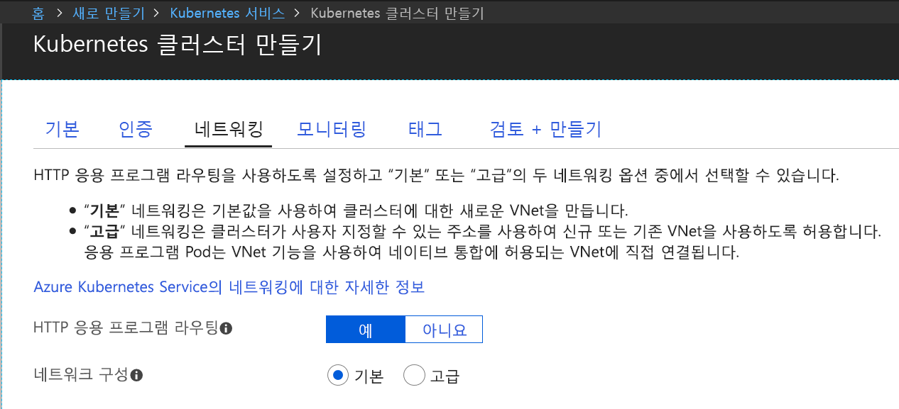

## Azure Dev Space에 사용하도록 설정된 Kubernetes 클러스터 만들기

1. http://portal.azure.com에서 Azure Portal에 로그인합니다.
1. **리소스 만들기**를 선택하고 **Kubernetes**를 검색한 후 **Kubernetes Service** > **만들기**를 선택합니다.

   AKS 클러스터 만들기 양식의 각 머리글 아래에 있는 다음 단계를 완료합니다.

    - **프로젝트 세부 정보**: Azure 구독과 새로운 또는 기존 Azure 리소스 그룹을 선택합니다.
    - **클러스터 세부 정보**: 이름, 영역(현재는 EastUS, Central US, WestEurope, WestUS2, CanadaCentral 또는 CanadaEast를 선택해야 함), 버전 및 AKS 클러스터의 DNS 이름 접두사를 입력합니다.
    - **규모**: AKS 에이전트 노드의 VM 크기 및 노드 수를 선택합니다. Azure Dev Spaces를 시작하는 경우 노드 하나만 있으면 모든 기능을 탐색할 수 있습니다. 노드 수는 클러스터 배포 후 언제든지 쉽게 조정할 수 있습니다. AKS 클러스터를 만든 후에는 VM 크기를 변경할 수 없습니다. 하지만 규모를 확장해야 하는 경우 AKS 클러스터를 배포한 후 간단하게 더 큰 VM이 있는 새 AKS 클러스터를 만들고 Dev Spaces를 사용하여 해당 클러스터를 다시 배포하면 됩니다.

   Kubernetes 버전 1.10.3 이상을 선택해야 합니다.

   

   완료되면 **다음: 인증**을 선택합니다.

1. RBAC(역할 기반 액세스 제어)에 대해 원하는 설정을 선택합니다. Azure Dev Spaces는 RBAC를 사용하거나 사용하지 않도록 설정한 클러스터를 지원합니다.

    

1. Http 응용 프로그램 라우팅을 사용하도록 설정합니다.

   

    > [!IMPORTANT]
    > AKS 클러스터를 만들 때 Http 응용 프로그램 라우팅을 사용하도록 설정해야 합니다. 이 설정은 나중에 변경할 수 없습니다.

1. **검토 + 만들기**를 선택한 후 완료되면 **만들기**를 선택합니다.
