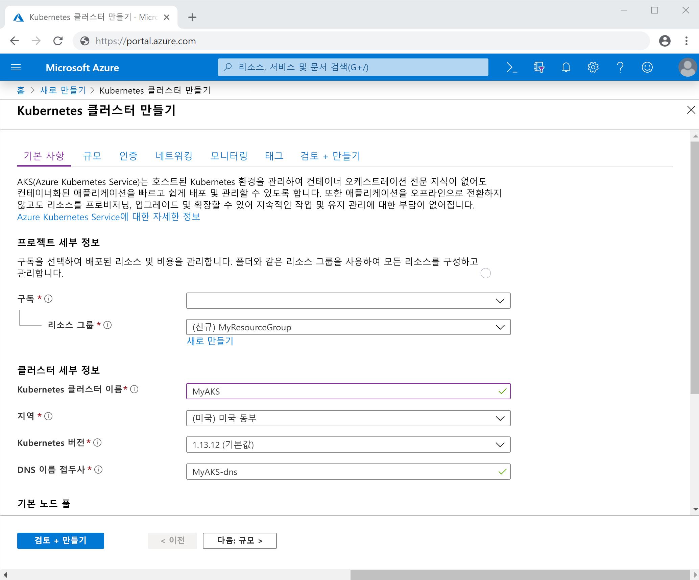
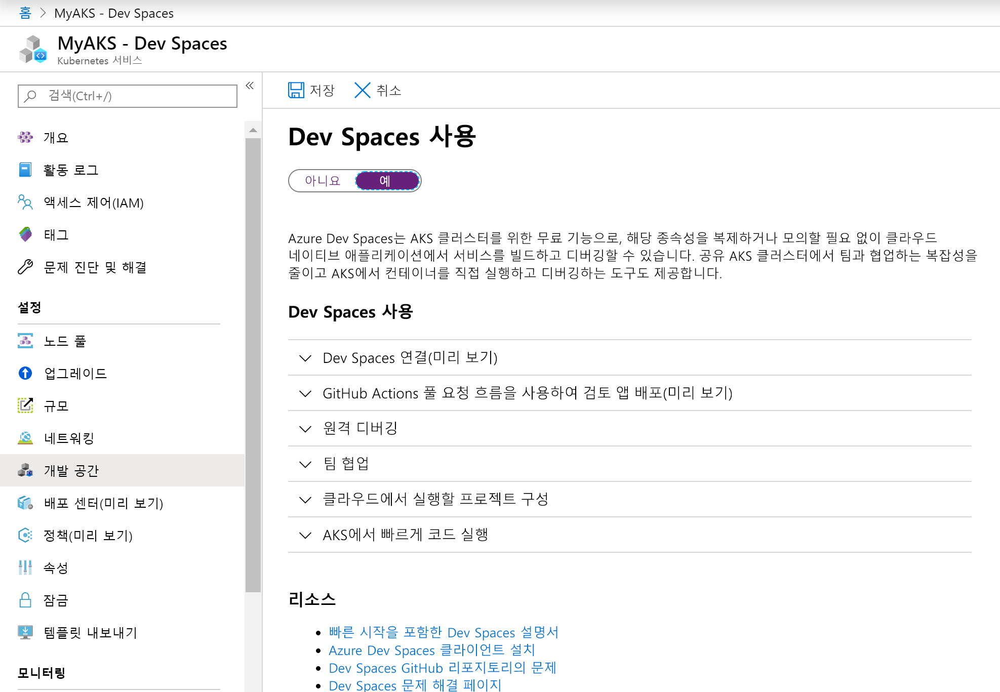
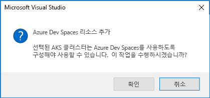

# <a name="quickstart-develop-with-net-core-on-kubernetes-with-azure-dev-spaces-visual-studio-2017"></a>빠른 시작: Azure Dev Spaces(Visual Studio 2017)를 사용하여 Kubernetes에서 .NET Core로 개발

이 가이드에서는 다음을 수행하는 방법을 배우게 됩니다.

- Azure에서 관리되는 Kubernetes 클러스터를 사용하여 Azure Dev Spaces를 설정합니다.
- Visual Studio 2017을 사용하여 컨테이너에서 반복적으로 코드를 개발합니다.
- Visual Studio 2017을 사용하여 클러스터에서 실행되는 코드를 디버깅합니다.

## <a name="prerequisites"></a>필수 조건

- Azure 구독. 계정이 없는 경우 [무료 계정](https://azure.microsoft.com/free)에 만들 수 있습니다.
- 웹 개발 워크로드가 설치된 Windows의 Visual Studio 2017. 설치되어 있지 않으면 [여기](https://aka.ms/vsdownload?utm_source=mscom&utm_campaign=msdocs)에서 다운로드하세요.
- [Visual Studio Tools for Kubernetes](https://aka.ms/get-vsk8stools) 설치.

## <a name="create-an-azure-kubernetes-service-cluster"></a>Azure Kubernetes Service 클러스터 만들기

[지원되는 지역](https://docs.microsoft.com/azure/dev-spaces/#a-rapid,-iterative-kubernetes-development-experience-for-teams)에서 AKS 클러스터를 만들어야 합니다. 클러스터를 만들려면:

1.  [Azure 포털](https://portal.azure.com)
1. *+ 리소스 만들기> Kubernetes 서비스*를 선택합니다. 
1. _구독_, _리소스 그룹_, _Kubernetes 클러스터 이름_, _지역_, _Kubernetes 버전_ 및 _DNS 이름 접두사_를 입력합니다.

    

1. *검토 + 만들기*를 클릭합니다.
1. *만들기*를 클릭합니다.

## <a name="enable-azure-dev-spaces-on-your-aks-cluster"></a>AKS 클러스터에서 Azure Dev Spaces를 사용하도록 설정

Azure Portal에서 AKS 클러스터로 이동하여 *Dev Spaces*를 클릭합니다. *Dev Spaces 사용*을 *예*로 변경하고 *저장*을 클릭합니다.



## <a name="create-a-new-aspnet-web-app"></a>새 ASP.NET 웹앱 만들기

1. Visual Studio 2017을 엽니다.
1. 새 프로젝트 만들기
1. *ASP.NET Core 웹 애플리케이션*을 선택하고 프로젝트 이름을 *webfrontend*로 지정합니다.
1. *확인*을 클릭합니다.
1. 메시지가 표시되면 템플릿에 대해 *웹 애플리케이션(Model-View-Controller)* 를 클릭합니다.
1. 맨 위에서 *.NET Core*와 *ASP.NET Core 2.0*을 선택합니다.
1. *확인*을 클릭합니다.

## <a name="connect-your-project-to-your-dev-space"></a>개발 공간에 프로젝트 연결

프로젝트에서, 아래 그림과 같이 시작 설정 드롭다운에서 **Azure Dev Spaces**를 선택합니다.


Azure Dev Spaces 대화 상자에서 *구독*과 *Azure Kubernetes Cluster*를 선택합니다. *공간*을 *기본*으로 설정하고 *공개적으로 액세스할 수 있음* 확인란을 사용하도록 설정합니다. *확인*을 클릭합니다.


이 프로세스는 공개적으로 액세스할 수 있는 URL을 사용하여 *기본* 개발 공간에 서비스를 배포합니다. Azure Dev Spaces와 함께 작동하도록 구성되지 않은 클러스터를 선택하면 구성할 것인지를 묻는 메시지가 표시됩니다. *확인*을 클릭합니다.



*기본* 개발 공간에서 실행 중인 서비스의 공용 URL은 *출력* 창에 표시됩니다.

```cmd
Starting warmup for project 'webfrontend'.
Waiting for namespace to be provisioned.
Using dev space 'default' with target 'MyAKS'
...
Successfully built 1234567890ab
Successfully tagged webfrontend:devspaces-11122233344455566
Built container image in 39s
Waiting for container...
36s

Service 'webfrontend' port 'http' is available at http://webfrontend.1234567890abcdef1234.eus.azds.io/
Service 'webfrontend' port 80 (http) is available at http://localhost:62266
Completed warmup for project 'webfrontend' in 125 seconds.
```

위의 예제에서 공용 URL은 http://webfrontend.1234567890abcdef1234.eus.azds.io/입니다. 서비스의 공용 URL로 이동하여 개발 공간에서 실행 중인 서비스와 상호 작용합니다.

이 프로세스는 서비스에 대한 공용 액세스가 비활성화되었을 수 있습니다. 공용 액세스를 활성화하기 위해 [*values.yaml*][ingress-update]에서 수신 값을 업데이트할 수 있습니다.

## <a name="update-code"></a>코드 업데이트

Visual Studio 2017이 개발 공간에 여전히 연결되어 있으면 중지 단추를 클릭합니다. `Controllers/HomeController.cs`의 20줄을 다음으로 변경합니다.
    
```csharp
ViewData["Message"] = "Your application description page in Azure.";
```

변경 내용을 저장하고 시작 설정 드롭다운에서 **Azure Dev Spaces**를 사용하여 서비스를 시작합니다. 브라우저에서 서비스의 공용 URL을 열고 *정보*를 클릭합니다. 업데이트된 메시지가 표시되는 것을 확인합니다.

코드 편집이 완료될 때마다 새 컨테이너 이미지 다시 빌드 및 다시 배포 작업을 수행하는 대신 Azure Dev Spaces는 기존 컨테이너 내에서 코드를 점진적으로 다시 컴파일하여 더 빠른 편집/디버그 루프를 제공합니다.

## <a name="setting-and-using-breakpoints-for-debugging"></a>디버깅용 중단점 설정 및 사용

Visual Studio 2017이 개발 공간에 여전히 연결되어 있으면 중지 단추를 클릭합니다. `Controllers/HomeController.cs`를 열고 20줄의 아무 곳이나 클릭하여 커서를 놓습니다. 중단점을 설정하려면 *F9* 키를 누르거나 *디버그*를 클릭한 후 *중단점 설정/해제*를 클릭합니다. 개발 공간에서 디버깅 모드로 서비스를 시작하려면 *F5* 키를 누르거나 *디버그*, *디버깅 시작*을 차례로 클릭합니다.

브라우저에서 서비스를 열고 메시지가 표시되지 않는 것을 확인합니다. Visual Studio 2017로 돌아가서 20줄이 강조 표시된 것을 확인합니다. 설정한 중단점으로 인해 서비스가 20줄에서 일시 중지되었습니다. 서비스를 다시 시작하려면 *F5* 키를 누르거나 *디버그*, *계속*을 차례로 클릭합니다. 브라우저로 돌아가서 메시지가 표시되는 것을 확인합니다.

디버거가 연결된 Kubernetes에서 서비스를 실행 중일 때는 호출 스택, 지역 변수 및 예외 정보와 같은 디버그 정보 전체에 액세스할 수 있습니다.

`Controllers/HomeController.cs`의 20줄에 커서를 놓고 *F9* 키를 눌러서 중단점을 제거합니다.

## <a name="clean-up-your-azure-resources"></a>Azure 리소스 정리

Azure Portal에서 리소스 그룹으로 이동하여 *리소스 그룹 삭제*를 클릭합니다. 또는 [az aks delete](/cli/azure/aks#az-aks-delete) 명령을 사용할 수도 있습니다.

```cmd
az group delete --name MyResourceGroup --yes --no-wait
```

## <a name="next-steps"></a>다음 단계

> [!div class="nextstepaction"]
> [여러 컨테이너 작업 및 팀 개발](multi-service-netcore-visualstudio.md)

[ingress-update]: how-dev-spaces-works.md#how-running-your-code-is-configured
