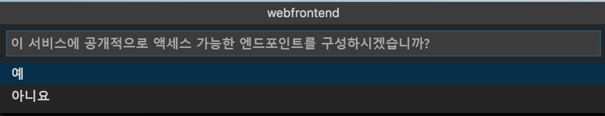
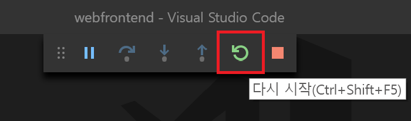

# <a name="quickstart-debug-and-iterate-on-kubernetes-visual-studio-code-and-net-core---azure-dev-spaces"></a>빠른 시작: Kubernetes에서 디버그 및 반복: Visual Studio Code 및 .NET Core - Azure Dev Spaces

이 가이드에서는 다음을 수행하는 방법을 배우게 됩니다.

- Azure에서 관리되는 Kubernetes 클러스터를 사용하여 Azure Dev Spaces를 설정합니다.
- Visual Studio Code를 사용하여 컨테이너에서 반복적으로 코드를 개발합니다.
- Visual Studio Code의 개발 공간에서 코드를 디버그합니다.

Azure Dev Spaces를 통해 다음을 사용하여 디버그하고 반복할 수도 있습니다.
- [Java 및 Visual Studio Code](quickstart-java.md)
- [Node.js 및 Visual Studio Code](quickstart-nodejs.md)
- [.NET Core 및 Visual Studio](quickstart-netcore-visualstudio.md)

## <a name="prerequisites"></a>사전 요구 사항

- Azure 구독 계정이 없는 경우 [무료 계정](https://azure.microsoft.com/free)에 만들 수 있습니다.
- [Visual Studio Code 설치](https://code.visualstudio.com/download).
- Visual Studio Code용 [Azure Dev Spaces](https://marketplace.visualstudio.com/items?itemName=azuredevspaces.azds) 및 [C#](https://marketplace.visualstudio.com/items?itemName=ms-dotnettools.csharp) 확장 프로그램 설치
- [Azure CLI 설치](/cli/azure/install-azure-cli?view=azure-cli-latest)

## <a name="create-an-azure-kubernetes-service-cluster"></a>Azure Kubernetes Service 클러스터 만들기

[지원되는 지역][supported-regions]에서 AKS 클러스터를 만들어야 합니다. 아래 명령은 *MyResourceGroup*이라는 리소스 그룹과 *MyAKS*라는 AKS 클러스터를 만듭니다.

```azurecli
az group create --name MyResourceGroup --location eastus
az aks create -g MyResourceGroup -n MyAKS --location eastus --generate-ssh-keys
```

## <a name="enable-azure-dev-spaces-on-your-aks-cluster"></a>AKS 클러스터에서 Azure Dev Spaces를 사용하도록 설정

`use-dev-spaces` 명령을 사용하여 AKS 클러스터에서 Dev Spaces를 사용하도록 설정하고 프롬프트의 지시를 따릅니다. 아래 명령은 *MyResourceGroup* 그룹의 *MyAKS* 클러스터에서 Dev Spaces를 사용하도록 설정하고 *기본* 개발 공간을 만듭니다.

> [!NOTE]
> `use-dev-spaces` 명령은 Azure Dev Spaces CLI가 아직 설치되지 않은 경우에도 설치합니다. Azure Cloud Shell에는 Azure Dev Spaces CLI를 설치할 수 없습니다.

```azurecli
az aks use-dev-spaces -g MyResourceGroup -n MyAKS
```

```output
'An Azure Dev Spaces Controller' will be created that targets resource 'MyAKS' in resource group 'MyResourceGroup'. Continue? (y/N): y

Creating and selecting Azure Dev Spaces Controller 'MyAKS' in resource group 'MyResourceGroup' that targets resource 'MyAKS' in resource group 'MyResourceGroup'...2m 24s

Select a dev space or Kubernetes namespace to use as a dev space.
 [1] default
Type a number or a new name: 1

Kubernetes namespace 'default' will be configured as a dev space. This will enable Azure Dev Spaces instrumentation for new workloads in the namespace. Continue? (Y/n): Y

Configuring and selecting dev space 'default'...3s

Managed Kubernetes cluster 'MyAKS' in resource group 'MyResourceGroup' is ready for development in dev space 'default'. Type `azds prep` to prepare a source directory for use with Azure Dev Spaces and `azds up` to run.
```

## <a name="get-sample-application-code"></a>샘플 애플리케이션 코드 받기

이 문서에서는 [Azure Dev Spaces 샘플 애플리케이션](https://github.com/Azure/dev-spaces)을 사용하여 Azure Dev Spaces 사용법을 시연합니다.

GitHub에서 애플리케이션을 복제합니다.

```cmd
git clone https://github.com/Azure/dev-spaces
```

## <a name="prepare-the-sample-application-in-visual-studio-code"></a>Visual Studio Code에서 샘플 애플리케이션 준비

Visual Studio Code를 열고 *파일*, *열기...* 를 차례로 클릭하고 *dev-spaces/samples/dotnetcore/getting-started/webfrontend* 디렉터리로 이동한 후 *열기*를 클릭합니다.

이제 Visual Studio Code에서 *webfrontend* 프로젝트를 열었습니다. 개발 공간에서 애플리케이션을 실행하려면 명령 팔레트에서 Azure Dev Spaces 확장을 사용하여 Docker 및 Helm 차트 자산을 생성합니다.

Visual Studio Code에서 명령 팔레트를 열려면 *보기*, *명령 팔레트*를 차례로 클릭합니다. `Azure Dev Spaces`를 입력하기 시작하고 `Azure Dev Spaces: Prepare configuration files for Azure Dev Spaces`를 클릭합니다.


Visual Studio Code에서 공용 엔드포인트를 구성하라는 메시지를 표시하면 `Yes`를 선택하여 공용 엔드포인트를 활성화합니다.



이 명령은 Dockerfile 및 Helm 차트를 생성하여 Azure Dev Spaces에서 실행하도록 프로젝트를 준비합니다. 또한 프로젝트의 루트에서 디버깅 구성을 사용하여 *.vscode* 디렉터리를 생성합니다.

> [!TIP]
> 프로젝트의 [Dockerfile 및 Helm 차트](how-dev-spaces-works-prep.md#prepare-your-code)는 Azure Dev Spaces에서 코드를 빌드하고 실행하는 데 사용되지만 프로젝트를 빌드하고 실행하는 방법을 변경하려면 이러한 파일을 수정할 수 있습니다.

## <a name="build-and-run-code-in-kubernetes-from-visual-studio-code"></a>Visual Studio Code에서 Kubernetes의 코드 빌드 및 실행

왼쪽에서 *디버그* 아이콘을 클릭하고 위쪽에서 *.NET Core 시작(AZDS)* 을 클릭합니다.


이 명령은 디버깅 모드에서 Azure Dev Spaces의 서비스를 빌드하고 실행합니다. 아래쪽에 있는 *터미널* 창에는 Azure Dev Spaces에서 실행 중인 서비스의 빌드 출력 및 URL이 표시됩니다. *디버그 콘솔*에 로그 출력이 표시됩니다.

> [!Note]
> *명령 팔레트*에 Azure Dev Spaces 명령이 보이지 않으면 [Azure Dev Spaces용 Visual Studio Code 확장 프로그램](https://marketplace.visualstudio.com/items?itemName=azuredevspaces.azds)을 설치했는지 확인합니다. 또한 Visual Studio Code에서 *dev-spaces/samples/dotnetcore/getting-started/webfrontend* 디렉터리를 열었는지 확인합니다.

공용 URL을 열어 실행되는 서비스를 볼 수 있습니다.

> [!Note]
> 처음에는 공용 URL에 *잘못된 게이트웨이* 오류가 표시될 수 있습니다. 웹 페이지를 새로 고치기 전에 몇 초 정도 기다린 후 서비스 실행이 표시됩니다.

*디버그*와 *디버깅 중지*를 차례로 클릭하여 디버거를 중지합니다.

## <a name="update-code"></a>코드 업데이트

서비스의 업데이트된 버전을 배포하려면 프로젝트의 파일을 업데이트하고 *.NET Core 시작(AZDS)* 을 다시 실행하면 됩니다. 예를 들면 다음과 같습니다.

1. 애플리케이션이 여전히 실행되는 경우 *디버그*를 클릭한 다음, *디버깅 중지*를 클릭하여 중지합니다.
1. [`Controllers/HomeController.cs`의 22줄](https://github.com/Azure/dev-spaces/blob/master/samples/dotnetcore/getting-started/webfrontend/Controllers/HomeController.cs#L22)을 다음으로 업데이트합니다.
    
    ```csharp
    ViewData["Message"] = "Your application description page in Azure.";
    ```

1. 변경 내용을 저장합니다.
1. *.NET Core 시작(AZDS)* 을 다시 실행합니다.
1. 실행 중인 서비스로 이동하고 *정보*를 클릭합니다.
1. 변경 내용을 확인합니다.
1. *디버그*, *디버깅 중지*를 차례로 클릭하여 애플리케이션을 중지합니다.

## <a name="setting-and-using-breakpoints-for-debugging"></a>디버깅용 중단점 설정 및 사용

*.NET Core 시작(AZDS)* 을 사용하여 디버깅 모드에서 서비스를 시작합니다.

*보기*, *탐색기*를 차례로 클릭하여 *탐색기* 보기로 다시 이동합니다. `Controllers/HomeController.cs`를 열고 22줄의 아무 곳이나 클릭하여 커서를 놓습니다. 중단점을 설정하려면 *F9* 키를 누르거나 *디버그*를 클릭한 후 *중단점 설정/해제*를 클릭합니다.

브라우저에서 서비스를 열고 메시지가 표시되지 않는 것을 확인합니다. Visual Studio Code로 돌아가서 20줄이 강조 표시된 것을 확인합니다. 설정한 중단점으로 인해 서비스가 20줄에서 일시 중지되었습니다. 서비스를 다시 시작하려면 *F5* 키를 누르거나 *디버그*, *계속*을 차례로 클릭합니다. 브라우저로 돌아가서 메시지가 표시되는 것을 확인합니다.

디버거가 연결된 Kubernetes에서 서비스를 실행 중일 때는 호출 스택, 지역 변수 및 예외 정보와 같은 디버그 정보 전체에 액세스할 수 있습니다.

`Controllers/HomeController.cs`의 22줄에 커서를 놓고 *F9*를 눌러서 중단점을 제거합니다.

## <a name="update-code-from-visual-studio-code"></a>Visual Studio Code에서 코드 업데이트

서비스가 디버깅 모드에서 실행 중인 경우 `Controllers/HomeController.cs`의 22줄을 업데이트합니다. 예를 들면 다음과 같습니다.

```csharp
ViewData["Message"] = "Your application description page in Azure while debugging!";
```

파일을 저장합니다. *디버그*, *디버깅 다시 시작*을 차례로 클릭하거나 *디버그 도구 모음*에서 *디버깅 다시 시작* 단추를 클릭합니다.



브라우저에서 서비스를 열고 업데이트된 메시지가 표시되는지 확인합니다.

코드 편집이 완료될 때마다 새 컨테이너 이미지 다시 빌드 및 다시 배포 작업을 수행하는 대신 Azure Dev Spaces는 기존 컨테이너 내에서 코드를 점진적으로 다시 컴파일하여 더 빠른 편집/디버그 루프를 제공합니다.

## <a name="clean-up-your-azure-resources"></a>Azure 리소스 정리

```azurecli
az group delete --name MyResourceGroup --yes --no-wait
```

## <a name="next-steps"></a>다음 단계

Azure Dev Spaces를 통해 여러 컨테이너에서 더 복잡한 애플리케이션을 개발할 수 있는 방법 및 사용자가 다양한 환경에서 다양한 코드 버전이나 분기로 작업하여 공동 개발을 간소화하는 방법을 알아봅니다. 

> [!div class="nextstepaction"]
> [여러 컨테이너 작업 및 팀 개발](multi-service-netcore.md)


[supported-regions]: https://azure.microsoft.com/global-infrastructure/services/?products=kubernetes-service
