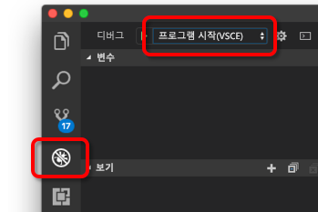
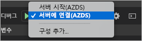

# <a name="quickstart-develop-with-nodejs-on-kubernetes-using-azure-dev-spaces"></a>빠른 시작: Azure Dev Spaces를 사용하여 Kubernetes에서 Node.js로 개발

이 가이드에서는 다음을 수행하는 방법을 배우게 됩니다.

- Azure에서 관리되는 Kubernetes 클러스터를 사용하여 Azure Dev Spaces를 설정합니다.
- Visual Studio Code 및 명령줄을 사용하여 컨테이너에서 반복적으로 코드를 개발합니다.
- Visual Studio Code의 개발 공간에서 코드를 디버그합니다.

## <a name="prerequisites"></a>필수 조건

- Azure 구독. Azure 구독이 없는 경우 [체험 계정](https://azure.microsoft.com/free)을 만들 수 있습니다.
- [Visual Studio Code 설치](https://code.visualstudio.com/download).
- Visual Studio Code용 [Azure Dev Spaces](https://marketplace.visualstudio.com/items?itemName=azuredevspaces.azds) 확장 프로그램 설치.
- [Azure CLI 설치](/cli/azure/install-azure-cli?view=azure-cli-latest)

## <a name="create-an-azure-kubernetes-service-cluster"></a>Azure Kubernetes Service 클러스터 만들기

[지원되는 지역](https://docs.microsoft.com/azure/dev-spaces/#a-rapid,-iterative-kubernetes-development-experience-for-teams)에서 AKS 클러스터를 만들어야 합니다. 아래 명령은 *MyResourceGroup*이라는 리소스 그룹과 *MyAKS*라는 AKS 클러스터를 만듭니다.

```cmd
az group create --name MyResourceGroup --location eastus
az aks create -g MyResourceGroup -n MyAKS --location eastus --node-count 1 --generate-ssh-keys
```

## <a name="enable-azure-dev-spaces-on-your-aks-cluster"></a>AKS 클러스터에서 Azure Dev Spaces를 사용하도록 설정

`use-dev-spaces` 명령을 사용하여 AKS 클러스터에서 Dev Spaces를 사용하도록 설정하고 프롬프트의 지시를 따릅니다. 아래 명령은 *MyResourceGroup* 그룹의 *MyAKS* 클러스터에서 Dev Spaces를 사용하도록 설정하고 *기본* 개발 공간을 만듭니다.

```cmd
$ az aks use-dev-spaces -g MyResourceGroup -n MyAKS

'An Azure Dev Spaces Controller' will be created that targets resource 'MyAKS' in resource group 'MyResourceGroup'. Continue? (y/N): y

Creating and selecting Azure Dev Spaces Controller 'MyAKS' in resource group 'MyResourceGroup' that targets resource 'MyAKS' in resource group 'MyResourceGroup'...2m 24s

Select a dev space or Kubernetes namespace to use as a dev space.
 [1] default
Type a number or a new name: 1

Kubernetes namespace 'default' will be configured as a dev space. This will enable Azure Dev Spaces instrumentation for new workloads in the namespace. Continue? (Y/n): Y

Configuring and selecting dev space 'default'...3s

Managed Kubernetes cluster 'MyAKS' in resource group 'MyResourceGroup' is ready for development in dev space 'default'. Type `azds prep` to prepare a source directory for use with Azure Dev Spaces and `azds up` to run.
```

## <a name="get-sample-application-code"></a>샘플 애플리케이션 코드 받기

이 문서에서는 [Azure Dev Spaces 샘플 애플리케이션](https://github.com/Azure/dev-spaces)을 사용하여 Azure Dev Spaces 사용법을 시연합니다.

GitHub의 애플리케이션을 복제하고 *dev-spaces/samples/nodejs/getting-started/webfrontend* 디렉터리로 이동합니다.

```cmd
git clone https://github.com/Azure/dev-spaces
cd dev-spaces/samples/nodejs/getting-started/webfrontend
```

## <a name="prepare-the-application"></a>애플리케이션 준비

`azds prep` 명령을 사용하여 Kubernetes에서 애플리케이션을 실행하는 데 필요한 Docker 및 Helm 차트 자산을 생성합니다.

```cmd
azds prep --public
```

*dev-spaces/samples/nodejs/getting-started/webfrontend* 디렉터리에서 `prep` 명령을 실행하여 Docker 및 Helm 차트 자산을 올바르게 생성해야 합니다.

## <a name="build-and-run-code-in-kubernetes"></a>Kubernetes에서 코드 빌드 및 실행

`azds up` 명령을 사용하여 AKS에서 코드를 빌드하고 실행합니다.

```cmd
$ azds up
Using dev space 'default' with target 'MyAKS'
Synchronizing files...2s
Installing Helm chart...2s
Waiting for container image build...2m 25s
Building container image...
Step 1/8 : FROM node
Step 2/8 : ENV PORT 80
Step 3/8 : EXPOSE 80
Step 4/8 : WORKDIR /app
Step 5/8 : COPY package.json .
Step 6/8 : RUN npm install
Step 7/8 : COPY . .
Step 8/8 : CMD ["npm", "start"]
Built container image in 6m 17s
Waiting for container...13s
Service 'webfrontend' port 'http' is available at http://webfrontend.1234567890abcdef1234.eus.azds.io/
Service 'webfrontend' port 80 (http) is available at http://localhost:54256
...
```

`azds up` 명령의 출력에 표시되는 공용 URL을 열어서 실행 중인 서비스를 볼 수 있습니다. 이 예제에서 공용 URL은 *http://webfrontend.1234567890abcdef1234.eus.azds.io/* 입니다.

*Ctrl+c*를 사용하여 `azds up` 명령을 중지하면 서비스가 AKS에서 계속 실행되고, 공용 URL은 사용 가능한 상태로 유지됩니다.

## <a name="update-code"></a>코드 업데이트

서비스의 업데이트된 버전을 배포하려면 프로젝트의 파일을 업데이트하고 `azds up` 명령을 다시 실행하면 됩니다. 예: 

1. `azds up`가 계속 실행 중인 경우 *Ctrl+c*를 누르세요.
1. [`server.js`의 10줄](https://github.com/Azure/dev-spaces/blob/master/samples/nodejs/getting-started/webfrontend/server.js#L10)을 다음으로 업데이트합니다.
    
    ```javascript
        res.send('Hello from webfrontend in Azure');
    ```

1. 변경 내용을 저장합니다.
1. `azds up` 명령을 다시 실행합니다.

    ```cmd
    $ azds up
    Using dev space 'default' with target 'MyAKS'
    Synchronizing files...1s
    Installing Helm chart...3s
    Waiting for container image build...
    ...    
    ```

1. 실행 중인 서비스로 이동하고 변경 내용을 살펴봅니다.
1. *Ctrl+c*를 눌러서 `azds up` 명령을 중지합니다.

## <a name="initialize-code-for-debugging-in-kubernetes-with-visual-studio-code"></a>Visual Studio Code로 Kubernetes에서 디버깅을 위한 코드 초기화

Visual Studio Code를 열고 *파일*, *열기...* 를 차례로 클릭하고 *dev-spaces/samples/nodejs/getting-started/webfrontend* 디렉터리로 이동한 후 *열기*를 클릭합니다.

이제 `azds up` 명령을 사용하여 실행한 것과 동일한 서비스인 *webfrontend* 프로젝트가 Visual Studio Code에 열립니다. `azds up`를 직접 사용하지 않고 Visual Studio Code를 사용하여 AKS에서 이 서비스를 디버그하려면 Visual Studio Code를 사용하여 개발 공간과 통신하도록 이 프로젝트를 준비해야 합니다.

Visual Studio Code에서 명령 팔레트를 열려면 *보기*, *명령 팔레트*를 차례로 클릭합니다. `Azure Dev Spaces`를 입력하기 시작하고 `Azure Dev Spaces: Prepare configuration files for Azure Dev Spaces`를 클릭합니다.


이 명령은 Visual Studio Code에서 바로 Azure Dev Spaces에서 실행하도록 프로젝트를 준비합니다. 또한 프로젝트의 루트에서 디버깅 구성을 사용하여 *.vscode* 디렉터리를 생성합니다.

## <a name="build-and-run-code-in-kubernetes-from-visual-studio-code"></a>Visual Studio Code에서 Kubernetes의 코드 빌드 및 실행

왼쪽에서 *디버그* 아이콘을 클릭하고 위쪽에서 *서버 시작(AZDS)* 을 클릭합니다.



이 명령은 디버깅 모드에서 Azure Dev Spaces의 서비스를 빌드하고 실행합니다. 아래쪽에 있는 *터미널* 창에 Azure Dev Spaces를 실행 중인 서비스의 URL과 빌드 출력이 표시됩니다. *디버그 콘솔*에 로그 출력이 표시됩니다.

> [!Note]
> *명령 팔레트*에 Azure Dev Spaces 명령이 보이지 않으면 [Azure Dev Spaces용 Visual Studio Code 확장 프로그램](https://marketplace.visualstudio.com/items?itemName=azuredevspaces.azds)을 설치했는지 확인합니다. 또한 Visual Studio Code에서 *dev-spaces/samples/nodejs/getting-started/webfrontend* 디렉터리를 열었는지 확인합니다.

*디버그*와 *디버깅 중지*를 차례로 클릭하여 디버거를 중지합니다.

## <a name="setting-and-using-breakpoints-for-debugging"></a>디버깅용 중단점 설정 및 사용

*서버 시작(AZDS)* 을 사용하여 서비스를 시작합니다.

*보기*, *탐색기*를 차례로 클릭하여 *탐색기* 보기로 다시 이동합니다. `server.js`를 열고 10줄의 아무 곳이나 클릭하여 커서를 놓습니다. 중단점을 설정하려면 *F9* 키를 누르거나 *디버그*를 클릭한 후 *중단점 설정/해제*를 클릭합니다.

브라우저에서 서비스를 열고 메시지가 표시되지 않는 것을 확인합니다. Visual Studio Code로 돌아가서 10줄이 강조 표시된 것을 확인합니다. 설정한 중단점으로 인해 서비스가 10줄에서 일시 중지되었습니다. 서비스를 다시 시작하려면 *F5* 키를 누르거나 *디버그*, *계속*을 차례로 클릭합니다. 브라우저로 돌아가서 메시지가 표시되는 것을 확인합니다.

디버거가 연결된 Kubernetes에서 서비스를 실행 중일 때는 호출 스택, 지역 변수 및 예외 정보와 같은 디버그 정보 전체에 액세스할 수 있습니다.

`server.js`의 10줄에 커서를 놓고 *F9* 키를 눌러 중단점을 제거합니다.

*디버그*와 *디버깅 중지*를 차례로 클릭하여 디버거를 중지합니다.

## <a name="update-code-from-visual-studio-code"></a>Visual Studio Code에서 코드 업데이트

디버그 모드를 *서버에 연결(AZDS)* 로 변경하고 서비스를 시작합니다.



이 명령은 Azure Dev Spaces의 서비스를 빌드하고 실행합니다. 또한, 서비스의 컨테이너에서 [nodemon](https://nodemon.io) 프로세스를 시작하여 VS Code를 연결합니다. *nodemon* 프로세스는 소스 코드가 변경되면 자동으로 재시작이 가능하기 때문에 로컬 머신에서 개발하는 것과 비슷하게 신속한 내부 루프 개발이 가능합니다.

서비스가 시작되면 브라우저를 사용하여 서비스로 이동하여 상호 작용합니다.

서비스가 실행되는 동안 VS Code로 돌아가서 `server.js`의 10줄을 업데이트합니다. 예: 
```javascript
    res.send('Hello from webfrontend in Azure while debugging!');
```

파일을 저장하고 브라우저에서 서비스로 돌아갑니다. 서비스와 상호 작용하고 업데이트된 메시지가 표시되는지 확인합니다.

*nodemon*을 실행하는 동안 코드 변경 내용이 발견되는 즉시 Node 프로세스가 자동으로 다시 시작됩니다. 자동 재시작 프로세스는 로컬 머신에서 서비스를 편집하고 다시 시작하는 환경과 유사하여 내부 루프 개발 환경을 제공합니다.

## <a name="clean-up-your-azure-resources"></a>Azure 리소스 정리

```cmd
az group delete --name MyResourceGroup --yes --no-wait
```

## <a name="next-steps"></a>다음 단계

Azure Dev Spaces를 통해 여러 컨테이너에서 더 복잡한 애플리케이션을 개발할 수 있는 방법 및 사용자가 다양한 환경에서 다양한 코드 버전이나 분기로 작업하여 공동 개발을 간소화하는 방법을 알아봅니다.

> [!div class="nextstepaction"]
> [여러 컨테이너 작업 및 팀 개발](multi-service-nodejs.md)