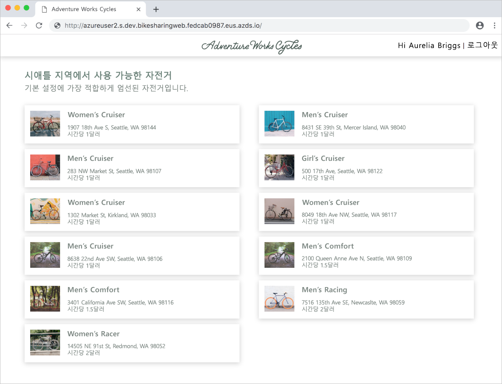

# <a name="quickstart-team-development-on-kubernetes-using-azure-dev-spaces"></a>빠른 시작: Azure Dev Spaces를 사용한 Kubernetes의 팀 개발

이 가이드에서는 다음을 수행하는 방법을 배우게 됩니다.

- Azure Dev Spaces를 Azure의 관리형 Kubernetes 클러스터에 설정합니다.
- 여러 마이크로서비스가 포함된 대규모 애플리케이션을 개발 공간에 배포합니다.
- 전체 애플리케이션의 컨텍스트 내에서 격리된 개발 공간에서 단일 마이크로서비스를 테스트합니다.


## <a name="prerequisites"></a>필수 조건

- Azure 구독. Azure 구독이 없는 경우 [체험 계정](https://azure.microsoft.com/free)을 만들 수 있습니다.
- [Azure CLI 설치](/cli/azure/install-azure-cli?view=azure-cli-latest)
- [Helm 2.13 이상 설치](https://github.com/helm/helm/blob/master/docs/install.md)

## <a name="create-an-azure-kubernetes-service-cluster"></a>Azure Kubernetes Service 클러스터 만들기

[지원되는 지역](https://docs.microsoft.com/azure/dev-spaces/#a-rapid,-iterative-kubernetes-development-experience-for-teams)에서 AKS 클러스터를 만들어야 합니다. 아래 명령은 *MyResourceGroup*이라는 리소스 그룹과 *MyAKS*라는 AKS 클러스터를 만듭니다.

```cmd
az group create --name MyResourceGroup --location eastus
az aks create -g MyResourceGroup -n MyAKS --location eastus --node-vm-size Standard_DS2_v2 --node-count 1 --disable-rbac --generate-ssh-keys
```

또한 *MyAKS* 클러스터는 *Standard_DS2_v2* 크기를 사용하고 RBAC를 사용하지 않도록 설정된 하나의 노드로 만들어집니다.

## <a name="enable-azure-dev-spaces-on-your-aks-cluster"></a>AKS 클러스터에서 Azure Dev Spaces를 사용하도록 설정

`use-dev-spaces` 명령을 사용하여 AKS 클러스터에서 Dev Spaces를 사용하도록 설정하고 프롬프트의 지시를 따릅니다. 아래 명령은 *MyResourceGroup* 그룹의 *MyAKS* 클러스터에서 Dev Spaces를 사용하도록 설정하고 *dev*라는 개발 공간을 만듭니다.

```cmd
az aks use-dev-spaces -g MyResourceGroup -n MyAKS --space dev --yes
```

## <a name="get-sample-application-code"></a>샘플 애플리케이션 코드 받기

이 문서에서는 [Azure Dev Spaces 자전거 공유 샘플 애플리케이션](https://github.com/Azure/dev-spaces/tree/master/samples/BikeSharingApp)을 사용하여 Azure Dev Spaces 사용하는 방법을 보여 줍니다.

GitHub에서 애플리케이션을 복제하고 해당 디렉터리로 이동합니다.

```cmd
git clone https://github.com/Azure/dev-spaces
cd dev-spaces/samples/BikeSharingApp/
```

## <a name="retrieve-the-hostsuffix-for-dev"></a>*dev*에 대한 HostSuffix 검색

`azds show-context` 명령을 사용하여 *dev*에 대한 HostSuffix를 표시합니다.

```cmd
$ azds show-context

Name                ResourceGroup     DevSpace  HostSuffix
------------------  ----------------  --------  -----------------------
MyAKS               MyResourceGroup   dev       fedcab0987.eus.azds.io
```

## <a name="update-the-helm-chart-with-your-hostsuffix"></a>HostSuffix를 사용하여 Helm 차트 업데이트

[charts/values.yaml](https://github.com/Azure/dev-spaces/blob/master/samples/BikeSharingApp/charts/values.yaml)을 열고, 모든 `<REPLACE_ME_WITH_HOST_SUFFIX>` 인스턴스를 앞에서 검색한 HostSuffix 값으로 바꿉니다. 변경 내용을 저장하고 파일을 닫습니다.

## <a name="run-the-sample-application-in-kubernetes"></a>Kubernetes에서 샘플 애플리케이션 실행

Kubernetes에서 샘플 애플리케이션을 실행하는 명령은 기존 프로세스의 일부이며 Azure Dev Spaces 도구에 종속되지 않습니다. 이 경우 Helm은 이 샘플 애플리케이션을 실행하는 데 사용되는 도구이지만, 클러스터 내에서 네임스페이스의 전체 애플리케이션을 실행하는 경우 다른 도구를 사용할 수 있습니다. Helm 명령은 앞에서 만든 *dev*라는 개발 공간을 대상으로 하지만 이 개발 공간도 Kubernetes 네임스페이스입니다. 따라서 개발 공간은 다른 네임스페이스와 동일한 다른 도구에서 대상이 될 수 있습니다.

Azure Dev Spaces는 배포에 사용되는 도구와 관계없이 클러스터에서 애플리케이션을 실행한 후에 팀 개발에 사용할 수 있습니다.

`helm init` 및 `helm install` 명령을 사용하여 클러스터에 샘플 애플리케이션을 설정하고 설치합니다.

```cmd
cd charts/
helm init --wait
helm install -n bikesharing . --dep-up --namespace dev --atomic --wait
```

`helm install` 명령을 완료하는 데 몇 분 정도 걸릴 수 있습니다. 명령 출력은 완료되었을 때 클러스터에 배포된 모든 서비스의 상태를 보여 줍니다.

```cmd
$ cd charts/
$ helm init --wait
...
Happy Helming!

$ helm install -n bikesharing . --dep-up --namespace dev --atomic --wait

Hang tight while we grab the latest from your chart repositories...
...
NAME               READY  UP-TO-DATE  AVAILABLE  AGE
bikes              1/1    1           1          4m32s
bikesharingweb     1/1    1           1          4m32s
billing            1/1    1           1          4m32s
gateway            1/1    1           1          4m32s
reservation        1/1    1           1          4m32s
reservationengine  1/1    1           1          4m32s
users              1/1    1           1          4m32s
```

샘플 애플리케이션이 클러스터에 설치되고 클러스터에서 Dev Spaces를 사용하도록 설정되었으므로 `azds list-uris` 명령을 사용하여 현재 선택된 *dev*에 샘플 애플리케이션에 대한 URL을 표시합니다.

```cmd
$ azds list-uris
Uri                                                 Status
--------------------------------------------------  ---------
http://dev.bikesharingweb.fedcab0987.eus.azds.io/  Available
http://dev.gateway.fedcab0987.eus.azds.io/         Available
```

`azds list-uris` 명령에서 공용 URL을 열어 *bikesharingweb* 서비스로 이동합니다. 위의 예제에서 *bikesharingweb* 서비스에 대한 공용 URL은 `http://dev.bikesharingweb.fedcab0987.eus.azds.io/`입니다. *Aurelia Briggs(고객)* 를 사용자로 선택합니다. 위쪽에 *Hi Aurelia Briggs | Sign Out*(안녕하세요, Aurelia Briggs! | 로그아웃) 텍스트가 표시되는지 확인합니다.



## <a name="create-child-dev-spaces"></a>자식 개발 공간 만들기

`azds space select` 명령을 사용하여 두 개의 자식 공간을 *dev* 아래에 만듭니다.

```cmd
azds space select -n dev/azureuser1 -y
azds space select -n dev/azureuser2 -y
```

위의 명령은 이름이 *azureuser1* 및 *azureuser2*인 두 개의 자식 공간을 *dev* 아래에 만듭니다. 이러한 두 개의 자식 공간은 개발자의 *azureuser1* 및 *azureuser2*에서 샘플 애플리케이션을 변경하는 데 사용할 수 있는 고유한 개발 공간을 나타냅니다.

`azds space list` 명령을 사용하여 모든 개발 공간을 나열하고 *dev/azureuser2*가 선택되었는지 확인합니다.

```cmd
$ azds space list
Name            Selected
--------------  --------
default         False
dev             False
dev/azureuser1  False
dev/azureuser2  True
```

`azds list-uris`를 사용하여 샘플 애플리케이션에 대한 URL을 현재 선택한 *dev/azureuser2* 공간에 표시합니다.

```cmd
$ azds list-uris
Uri                                                             Status
--------------------------------------------------              ---------
http://azureuser2.s.dev.bikesharingweb.fedcab0987.eus.azds.io/  Available
http://azureuser2.s.dev.gateway.fedcab0987.eus.azds.io/         Available
```

`azds list-uris` 명령으로 표시된 URL에 *azureuser2s.dev* 접두사가 있는지 확인합니다. 이 접두사는 선택한 현재 공간이 *dev*의 자식 공간인 *azureuser2*임을 확인합니다.

`azds list-uris` 명령에서 공용 URL을 열어 *dev/azureuser2* 개발 공간에 대한 *bikesharingweb* 서비스로 이동합니다. 위의 예제에서 *bikesharingweb* 서비스에 대한 공용 URL은 `http://azureuser2.s.dev.bikesharingweb.fedcab0987.eus.azds.io/`입니다. *Aurelia Briggs(고객)* 를 사용자로 선택합니다. 위쪽에 *Hi Aurelia Briggs | Sign Out* 텍스트가 표시되는지 확인합니다.

## <a name="update-code"></a>코드 업데이트

텍스트 편집기에서 *BikeSharingWeb/components/Header.js*를 열고, [`userSignOut` className이 있는 span 요소](https://github.com/Azure/dev-spaces/blob/master/samples/BikeSharingApp/BikeSharingWeb/components/Header.js#L16)의 텍스트를 변경합니다.

```html
<span className="userSignOut">
    <Link href="/devsignin"><span tabIndex="0">Welcome {props.userName} | Sign out</span></Link>
</span>
```

변경 내용을 저장하고 파일을 닫습니다.

## <a name="build-and-run-the-updated-bikesharingweb-service-in-the-devazureuser2-dev-space"></a>*dev/azureuser2* 개발 공간에서 업데이트된 bikesharingweb 서비스를 빌드하고 실행합니다.

*BikeSharingWeb/* 디렉터리로 이동하여 `azds up` 명령을 실행합니다.

```cmd
$ cd ../BikeSharingWeb/
$ azds up

Using dev space 'dev/azureuser2' with target 'MyAKS'
Synchronizing files...2s
...
Service 'bikesharingweb' port 'http' is available at http://azureuser2.s.dev.bikesharingweb.fedcab0987.eus.azds.io/
Service 'bikesharingweb' port 80 (http) is available at http://localhost:54256
...
```

이 명령은 *dev/azureuser2* 개발 공간에서 *bikesharingweb* 서비스를 빌드하고 실행합니다. 이 서비스는 *dev*에서 실행되는 *bikesharingweb* 서비스와 함께 실행되며 *azureuser2.s* URL 접두사가 있는 요청에만 사용됩니다. 부모 공간과 자식 개발 공간 사이에서 라우팅이 작동하는 방법에 대한 자세한 내용은 [Azure Dev Spaces가 작동하고 구성되는 방법](how-dev-spaces-works.md)을 참조하세요.

`azds up` 명령의 출력에 표시된 공용 URL을 열어 *dev/azureuser2* 개발 공간에 대한 *bikesharingweb* 서비스로 이동합니다. *Aurelia Briggs(고객)* 를 사용자로 선택합니다. 오른쪽 위 모서리에 업데이트된 텍스트가 표시되는지 확인합니다. 이 변경 내용이 즉시 표시되지 않으면 페이지를 새로 고치거나 브라우저의 캐시를 지워야 할 수 있습니다.


## <a name="verify-other-dev-spaces-are-unchanged"></a>다른 Dev Spaces가 변경되지 않았는지 확인

`azds up` 명령이 아직 실행되고 있으면 *Ctrl+c*를 누릅니다.

```cmd
$ azds list-uris --all
Uri                                                             Status
--------------------------------------------------              ---------
http://azureuser1.s.dev.bikesharingweb.fedcab0987.eus.azds.io/  Available
http://azureuser1.s.dev.gateway.fedcab0987.eus.azds.io/         Available
http://azureuser2.s.dev.bikesharingweb.fedcab0987.eus.azds.io/  Available
http://azureuser2.s.dev.gateway.fedcab0987.eus.azds.io/         Available
http://dev.bikesharingweb.fedcab0987.eus.azds.io/               Available
http://dev.gateway.fedcab0987.eus.azds.io/                      Available
```

브라우저에서 *dev* 버전의 *bikesharingweb*으로 이동하여 *Aurelia Briggs(고객)* 를 사용자로 선택하고, 오른쪽 위 모서리에 원본 텍스트가 표시되는지 확인합니다. *dev/azureuser1* URL을 사용하여 이러한 단계를 반복합니다. 변경 내용은 *dev/azureuser2* 버전의 *bikesharingweb*에만 적용됩니다. *dev/azureuser2*에 대한 변경 내용을 격리하면 *azureuser1*에 영향을 주지 않고도 *azureuser2*를 변경할 수 있습니다.

이러한 변경 내용을 *dev* 및 *dev/azureuser1*에 반영하려면 팀의 기존 워크플로 또는 CI/CD 파이프라인을 따라야 합니다. 예를 들어 이 워크플로에는 버전 제어 시스템에 대한 변경을 커밋하고 CI/CD 파이프라인 또는 Helm과 같은 도구를 사용하여 업데이트를 배포하는 작업이 포함될 수 있습니다.

## <a name="clean-up-your-azure-resources"></a>Azure 리소스 정리

```cmd
az group delete --name MyResourceGroup --yes --no-wait
```

## <a name="next-steps"></a>다음 단계

Azure Dev Spaces를 통해 여러 컨테이너에서 더 복잡한 앱을 개발할 수 있는 방법 및 사용자가 다양한 환경에서 다양한 코드 버전이나 분기로 작업하여 공동 개발을 간소화하는 방법을 알아봅니다.

> [!div class="nextstepaction"]
> [여러 컨테이너 작업 및 팀 개발](multi-service-nodejs.md)
