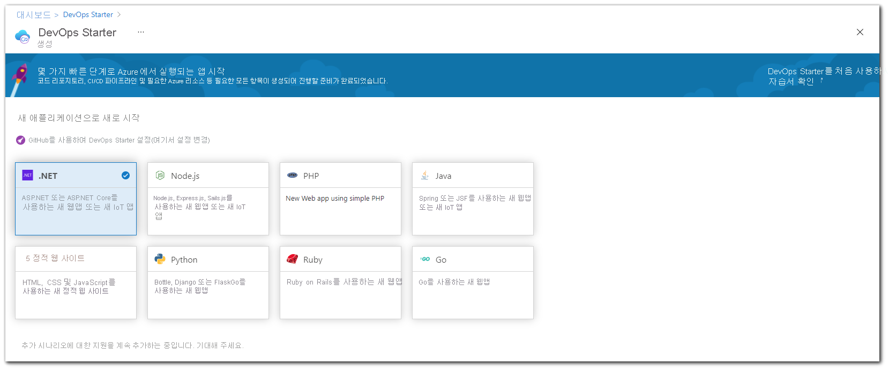
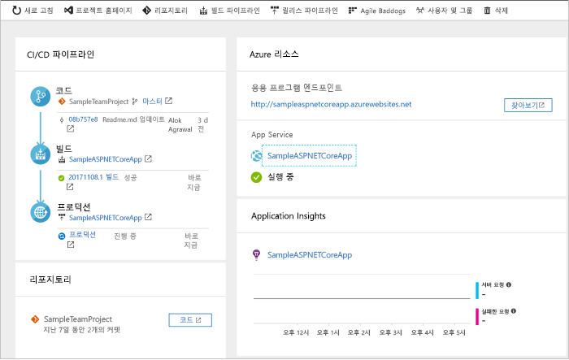
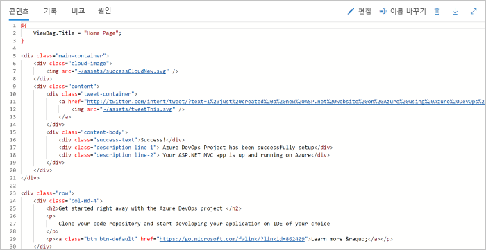
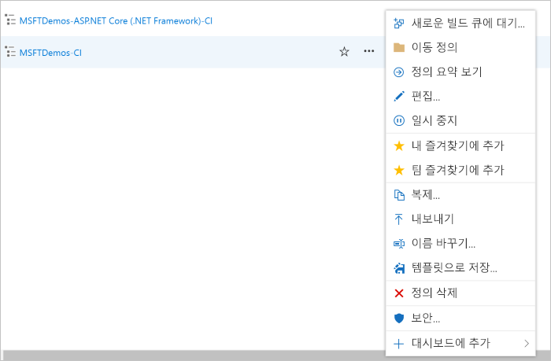

# Azure DevOps Starter를 사용하여 .NET용 CI/CD 파이프라인 만들기

DevOps Starter를 사용하여 .NET Core 또는 ASP.NET 애플리케이션에 대한 CI(연속 통합) 및 CD(지속적인 업데이트)를 구성합니다. DevOps Starter는 Azure Pipelines에서 빌드 및 릴리스 파이프라인의 초기 구성을 간소화합니다.

Azure 구독이 없으면 [Visual Studio Dev Essentials](https://visualstudio.microsoft.com/dev-essentials/)을 통해 무료로 구독을 구할 수 있습니다.

## Azure Portal에 로그인

DevOps Starter는 Azure DevOps에 CI/CD 파이프라인을 만듭니다. 새 Azure DevOps 조직을 만들거나 기존 조직을 사용할 수 있습니다. 또한 DevOps Starter는 선택한 Azure 구독에서 Azure 리소스를 만듭니다.

1. [Microsoft Azure 포털](https://portal.azure.com)에 로그인합니다.

1. 검색 상자에 **DevOps Starter**를 입력한 다음, 선택합니다. **추가**를 클릭하여 새 항목을 만듭니다. 

    

## 샘플 애플리케이션 및 Azure 서비스 선택

1. **.NET** 샘플 애플리케이션을 선택합니다. .NET 샘플에는 오픈 소스 ASP.NET 프레임워크 또는 플랫폼 간 .NET Core 프레임워크 중 하나의 선택이 포함됩니다.

   

2. 이 샘플은 ASP.NET Core MVC 애플리케이션입니다. **.NET Core** 애플리케이션 프레임워크를 선택한 다음, **다음**을 선택합니다.    
    
3. 배포 대상으로 **Windows 웹앱**을 선택한 다음, **다음**을 선택합니다. 필요에 따라 배포에 대해 다른 Azure 서비스를 선택할 수 있습니다. 이전에 선택한 애플리케이션 프레임워크는 여기에서 사용 가능한 Azure 서비스 배포 대상의 유형을 나타냅니다.

## Azure DevOps 및 Azure 구독 구성 

1. **프로젝트 이름**을 입력합니다.

2. 새 무료 **Azure DevOps 조직**을 만들거나 드롭다운에서 기존 조직을 선택합니다.

3. **Azure 구독**을 선택하고, **웹앱**에 대한 이름을 입력하거나 기본값을 선택한 다음, **완료**를 선택합니다. 잠시 후에 DevOps Starter 배포 개요가 Azure Portal에 표시됩니다. 

4. **리소스로 이동**을 선택하여 DevOps Starter 대시보드를 확인합니다. 오른쪽 위 모서리에서 빠른 액세스를 위해 **프로젝트**를 대시보드에 고정합니다. 샘플 앱은 **Azure DevOps 조직**의 리포지토리에서 설정됩니다. 빌드가 실행되고, 앱이 Azure에 배포됩니다.

5. 이 대시보드에서는 코드 리포지토리, CI/CD 파이프라인 및 Azure의 애플리케이션에 가시성을 제공합니다. Azure 리소스의 오른쪽에서 **찾아보기**를 선택하여 실행 중인 앱을 확인합니다.

    

## 코드 변경 내용 커밋 및 CI/CD 실행

DevOps Starter는 Azure Repos 또는 GitHub에서 Git 리포지토리를 만들었습니다. 리포지토리를 살펴보고 애플리케이션의 코드를 변경하려면 다음 단계를 수행합니다.

1. DevOps Starter 대시보드 왼쪽에서 **마스터** 분기에 대한 링크를 선택합니다. 이 링크는 새로 생성된 Git 리포지토리 보기를 엽니다.

2. 다음 몇 단계에서는 웹 브라우저를 사용하여 코드 변경을 직접 **마스터** 분기에 만들고 커밋할 수 있습니다. 리포지토리 페이지의 오른쪽 위에서 **복제**를 선택하여 즐겨찾는 IDE에 Git 리포지토리를 복제할 수도 있습니다. 

3. 왼쪽에서 애플리케이션 파일 구조를 **Application/aspnet-core-dotnet-core/Pages/Index.cshtml**로 이동합니다.

4. **편집**을 선택하고 h2 제목을 변경합니다. 예를 들어 **Azure DevOps Starter를 사용하여 바로 시작하기**를 입력하거나 일부 다른 내용을 변경합니다.

      

5. **커밋**을 선택하여 의견을 남기고 **커밋**을 다시 선택합니다.

6. 브라우저에서 Azure DevOps Starter 대시보드로 이동합니다.  이제 빌드가 진행되고 있음을 확인해야 합니다. 변경한 내용은 자동으로 빌드되며 CI/CD 파이프라인을 통해 배포됩니다.

## CD 파이프라인 검토

이전 단계에서 Azure DevOps Starter가 전체 CI/CD 파이프라인을 자동으로 구성했습니다. 필요에 따라 파이프라인을 탐색하고 사용자 지정합니다. Azure DevOps 빌드 및 릴리스 파이프라인을 숙지하려면 다음을 수행합니다.

1. DevOps Starter 대시보드 맨 위에서 **빌드 파이프라인**을 선택합니다. 이 링크는 브라우저 탭 및 새 프로젝트에 대한 Azure DevOps 빌드 파이프라인을 엽니다.

1. 줄임표(...)를 선택합니다.  이 작업은 새 빌드 큐, 빌드 일시 중지 및 빌드 파이프라인 편집과 같은 여러 활동을 시작할 수 있는 메뉴를 엽니다.

1. **편집**을 선택합니다.

    

1. 이 창에서 빌드 파이프라인의 다양한 작업을 검사할 수 있습니다. 빌드는 Git 리포지토리에서 원본 가져오기, 종속성 복원 및 배포에 사용된 출력 게시 등 다양한 작업을 수행합니다.

1. 빌드 파이프라인의 맨 위에서 빌드 파이프라인 이름을 선택합니다.

1. 빌드 파이프라인의 이름을 좀 더 구체적인 것으로 변경하고 **저장 및 큐에 넣기**, **저장**을 차례로 선택합니다.

1. 빌드 파이프라인 이름에서 **기록**을 선택합니다.   
**기록** 창에 빌드에 대한 최근 변경 내용의 감사 내역이 표시됩니다.  Azure Pipelines는 빌드 파이프라인에 대한 모든 변경 내용을 계속 추적하고 버전을 비교할 수 있습니다.

1. **트리거**를 선택합니다. DevOps Starter는 CI 트리거를 자동으로 생성했으며 리포지토리에 대한 모든 커밋이 새 빌드를 시작합니다. 필요에 따라 CI 프로세스에서 분기를 포함할지를 선택할 수 있습니다.

1. **보존**을 선택합니다. 시나리오에 따라 특정 수의 빌드를 유지하거나 제거하는 정책을 지정할 수 있습니다.

1. **빌드 및 릴리스**를 선택한 다음, **릴리스**를 선택합니다.  
DevOps Starter는 Azure에 대한 배포를 관리하는 릴리스 파이프라인을 만듭니다.

1.  왼쪽에서 릴리스 파이프라인 옆의 줄임표(...)를 선택하고 **편집**을 선택합니다. 릴리스 파이프라인에는 릴리스 프로세스를 정의하는 파이프라인이 포함됩니다.  

1. **아티팩트** 아래에서 **드롭**을 선택합니다. 이전 단계에서 검사한 빌드 파이프라인이 아티팩트에 사용된 출력을 생성합니다. 

1. **드롭** 아이콘 옆에서 **지속적인 배포 트리거**를 선택합니다. 이 릴리스 파이프라인은 새 빌드 아티팩트를 사용할 수 있을 때마다 배포를 실행하는 CD 트리거를 사용하도록 설정했습니다. 필요에 따라 트리거를 비활성화할 수 있으므로 배포는 수동 실행이 필수적입니다.  

1. 왼쪽에서 **작업**을 선택합니다.  작업은 배포 프로세스가 수행하는 활동입니다. 이 예제에서는 Azure App Service에 배포하기 위해 작업을 만들었습니다.

1. 오른쪽에서 **릴리스 보기**를 선택합니다. 이 보기에는 릴리스의 기록이 표시됩니다.

1. 한 릴리스 옆에 있는 줄임표(...)를 선택하고 **열기**를 선택합니다. 릴리스 요약, 연결된 작업 항목 및 테스트 등 여러 메뉴를 탐색할 수 있습니다.

1. **커밋**을 선택합니다. 이 보기에는 특정 배포와 연결된 코드 커밋이 표시됩니다. 

1. **로그**를 선택합니다. 로그에는 배포 프로세스에 대한 유용한 정보가 포함됩니다. 배포 도중 및 이후 모두에서 로그를 볼 수 있습니다.

## 리소스 정리

더 이상 필요하지 않을 경우 만든 Azure App Service 및 기타 관련 리소스를 삭제할 수 있습니다. DevOps Starter 대시보드의 **삭제** 기능을 사용합니다.

## 다음 단계

팀의 요구에 맞게 빌드 및 릴리스 파이프라인 수정 방법에 대해 자세한 알려면 이 자습서를 참조하세요.

> [!div class="nextstepaction"]
> [CD 프로세스 사용자 지정](https://docs.microsoft.com/azure/devops/pipelines/release/define-multistage-release-process?view=vsts)

## 동영상

> [!VIDEO https://www.youtube.com/embed/itwqMf9aR0w]
