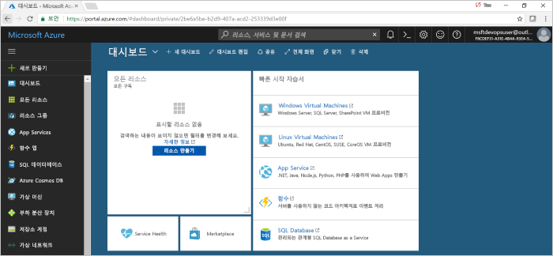

# Azure DevOps Projects를 사용하여 Java용 CI/CD 파이프라인 만들기

Azure DevOps Projects는 Azure Pipelines에서 Java 앱에 대한 CI(지속적인 통합) 및 CD(지속적인 업데이트) 파이프라인을 설정하고 Azure 리소스를 만드는 간소화된 환경을 제공합니다.  

Azure 구독이 없으면 [Visual Studio Dev Essentials](https://visualstudio.microsoft.com/dev-essentials/)을 통해 무료로 구독을 구할 수 있습니다.

## Azure Portal에 로그인

  DevOps Projects는 Azure Pipelines에 CI/CD 파이프라인을 만듭니다. 새 Azure DevOps 조직을 만들거나 기존 조직을 사용할 수 있습니다. 또한 DevOps Projects는 선택한 Azure 구독에서 Azure 리소스를 만듭니다.

1. [Microsoft Azure 포털](https://portal.azure.com)에 로그인합니다.

1. 왼쪽 창에서 **리소스 만들기**를 선택하고 **DevOps Projects**를 검색합니다.  

2. **만들기**를 선택합니다.

    

## 샘플 애플리케이션 및 Azure 서비스 선택

1. Java 샘플 애플리케이션을 선택합니다.  
Java 샘플에는 여러 애플리케이션 프레임워크 선택이 포함됩니다.

1. 기본 샘플 프레임워크는 Spring입니다. 기본 설정에서 나간 후 **다음**을 선택합니다.  컨테이너용 웹앱은 기본 배포 대상입니다. 이전에 선택한 애플리케이션 프레임워크는 여기에서 사용 가능한 Azure 서비스 배포 대상의 유형을 나타냅니다. 

2. 기본 서비스에서 나간 후 **다음**을 선택합니다.
 
## Azure DevOps 및 Azure 구독 구성 

1. 새 Azure DevOps 조직을 만들거나 기존 조직을 선택합니다. 

    a. 프로젝트의 이름을 선택합니다. 

    b. Azure 구독 및 위치를 선택하고 애플리케이션의 이름을 선택한 후 **완료**를 선택합니다.  
    잠시 후에 DevOps Projects 대시보드가 Azure Portal에 표시됩니다. 샘플 애플리케이션이 Azure DevOps 조직의 리포지토리에서 설정되고, 빌드가 실행되고, 애플리케이션이 Azure에 배포됩니다. 이 대시보드에서는 코드 리포지토리, CI/CD 파이프라인 및 Azure의 애플리케이션에 가시성을 제공합니다.
    

2. **찾아보기**를 선택하여 실행 중인 애플리케이션을 볼 수 있습니다.

     
    
 DevOps Projects에서 CI 빌드 및 릴리스 트리거가 자동으로 구성되었을 것입니다.  이제 웹 사이트에 최신 작업을 자동으로 배포하는 CI/CD 프로세스를 사용하여 Java 앱에서 팀과 협업할 준비가 되었습니다.

## 코드 변경 내용 커밋 및 CI/CD 실행

DevOps Projects는 Azure Repos 또는 GitHub에 Git 리포지토리를 만듭니다. 리포지토리를 살펴보고 애플리케이션의 코드를 변경하려면 다음 단계를 수행합니다.

1. DevOps Projects 대시보드 왼쪽에서 마스터 분기에 대한 링크를 선택합니다.  
이 링크는 새로 생성된 Git 리포지토리 보기를 엽니다.

1. 리포지토리 복제 URL을 보려면 브라우저의 오른쪽 위에서 **복제**를 선택합니다.   
    즐겨찾는 IDE에서 Git 리포지토리를 복제할 수 있습니다. 다음 몇 단계에서는 웹 브라우저를 사용하여 코드 변경을 직접 마스터 분기에 만들고 커밋할 수 있습니다.

1. 브라우저의 왼쪽에서 **src/main/webapp/index.html** 파일로 이동합니다.

1. **편집**을 선택하고 일부 텍스트를 변경합니다.
    예를 들어 div 태그 중 하나의 일부 텍스트를 변경합니다.

1. **커밋**을 선택하고 변경 내용을 저장합니다.

1. 브라우저에서 DevOps Projects 대시보드로 이동합니다.   
이제 빌드가 진행되고 있다고 표시됩니다. 방금 변경한 내용은 자동으로 빌드되며 CI/CD 파이프라인을 통해 배포됩니다.

## CD 파이프라인 검토

 이전 단계에서 DevOps Projects의 전체 CI/CD 파이프라인이 자동으로 구성되었습니다. 필요에 따라 파이프라인을 탐색하고 사용자 지정합니다. 다음 단계를 수행하여 빌드 및 릴리스 파이프라인을 숙지하세요.

1. DevOps Projects 대시보드 맨 위에서 **빌드 파이프라인**을 선택합니다.  
이 링크를 클릭하면 브라우저 탭, 새 프로젝트에 대한 빌드 파이프라인이 열립니다.

1. **상태** 필드를 가리킨 후 줄임표(...)를 선택합니다.  
    이 작업은 새 빌드 큐, 빌드 일시 중지 및 빌드 파이프라인 편집과 같은 여러 활동을 시작할 수 있는 메뉴를 엽니다.

1. **편집**을 선택합니다.

1. 이 창에서 빌드 파이프라인의 다양한 작업을 검사할 수 있습니다.  
빌드는 Git 리포지토리에서 원본 가져오기, 종속성 복원 및 배포에 사용된 출력 게시 등 다양한 작업을 수행합니다.

1. 빌드 파이프라인의 맨 위에서 빌드 파이프라인 이름을 선택합니다.

1. 빌드 파이프라인의 이름을 좀 더 구체적인 것으로 변경하고 **저장 및 큐에 넣기**, **저장**을 차례로 선택합니다.

1. 빌드 파이프라인 이름에서 **기록**을 선택합니다.   
**기록** 창에 빌드에 대한 최근 변경 내용의 감사 내역이 표시됩니다.  Azure Pipelines는 빌드 파이프라인에 대한 모든 변경 내용을 계속 추적하고 버전을 비교할 수 있습니다.

1. **트리거**를 선택합니다.   
 DevOps Projects는 CI 트리거를 자동으로 생성하면 리포지토리에 대한 모든 커밋이 새 빌드를 시작합니다.  필요에 따라 CI 프로세스에서 분기를 포함할지를 선택할 수 있습니다.

1. **보존**을 선택합니다.   
시나리오에 따라 특정 수의 빌드를 유지하거나 제거하는 정책을 지정할 수 있습니다.

1. **빌드 및 릴리스**를 선택한 다음, **릴리스**를 선택합니다.  
 DevOps Projects는 Azure에 대한 배포를 관리하는 릴리스 파이프라인을 만듭니다.

1. 왼쪽에서 릴리스 파이프라인 옆의 줄임표(...)를 선택하고 **편집**을 선택합니다.  
릴리스 파이프라인에는 릴리스 프로세스를 정의하는 파이프라인이 포함됩니다.  
    
12. **아티팩트** 아래에서 **드롭**을 선택합니다.  
이전 단계에서 검사한 빌드 파이프라인이 아티팩트에 사용된 출력을 생성합니다. 

1. **드롭** 아이콘 옆에서 **지속적인 배포 트리거**를 선택합니다.  
이 릴리스 파이프라인은 새 빌드 아티팩트를 사용할 수 있을 때마다 배포를 실행하는 CD 트리거를 사용하도록 설정했습니다. 필요에 따라 트리거를 비활성화할 수 있으므로 배포는 수동 실행이 필수적입니다. 

1. 왼쪽에서 **작업**을 선택합니다.   
작업은 배포 프로세스가 수행하는 활동입니다. 이 예제에서는 Azure App Service에 배포하기 위해 작업을 만들었습니다.

1. 오른쪽에서 **릴리스 보기**를 선택합니다.  
이 보기에는 릴리스의 기록이 표시됩니다.

1. 한 릴리스 옆에 있는 줄임표(...)를 선택하고 **열기**를 선택합니다.  
릴리스 요약, 연결된 작업 항목 및 테스트 등 여러 메뉴를 탐색할 수 있습니다.

1. **커밋**을 선택합니다.   
이 보기에는 특정 배포와 연결된 코드 커밋이 표시됩니다. 

1. **로그**를 선택합니다.  
로그에는 배포 프로세스에 대한 유용한 정보가 포함됩니다. 배포 도중 및 이후 모두에서 로그를 볼 수 있습니다.

## 리소스 정리

더 이상 필요하지 않을 경우 Azure App Service 및 기타 관련 리소스를 삭제할 수 있습니다. DevOps Projects 대시보드에서 **삭제** 기능을 사용합니다.

## 다음 단계

CI/CD 프로세스를 구성했을 때 빌드 및 릴리스 파이프라인이 자동으로 생성되었을 것입니다. 팀의 요구를 충족하려면 이러한 빌드 및 릴리스 파이프라인을 수정할 수 있습니다. CI/CD 파이프라인에 대한 자세한 내용은 다음을 참조하세요.

> [!div class="nextstepaction"]
> [CD 프로세스 사용자 지정](https://docs.microsoft.com/azure/devops/pipelines/release/define-multistage-release-process?view=vsts)
