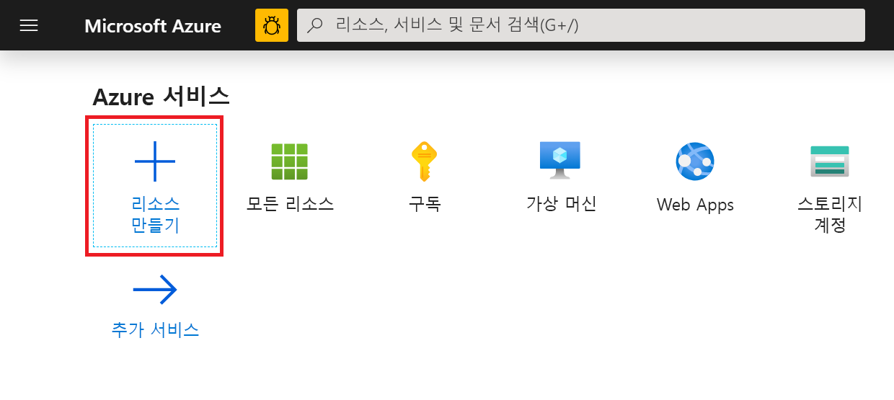
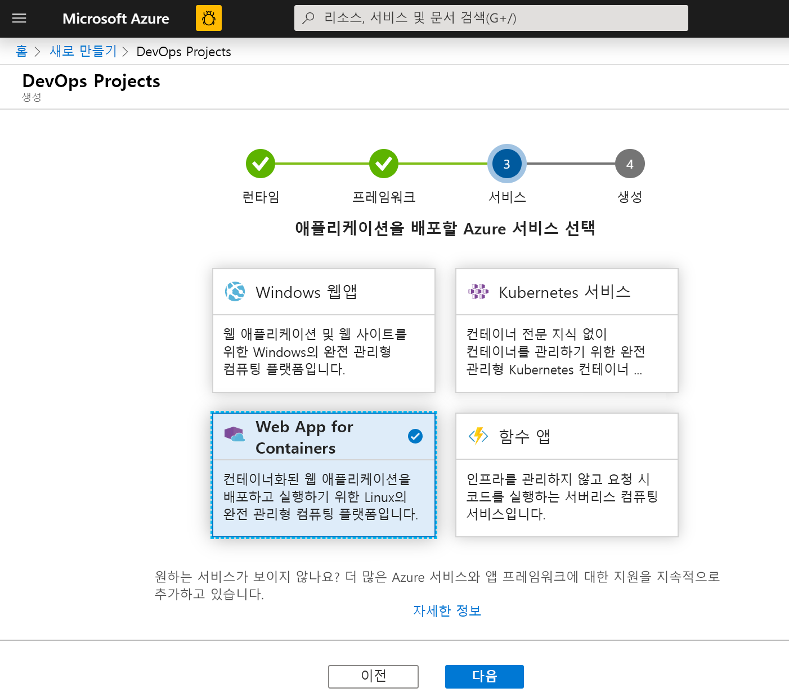
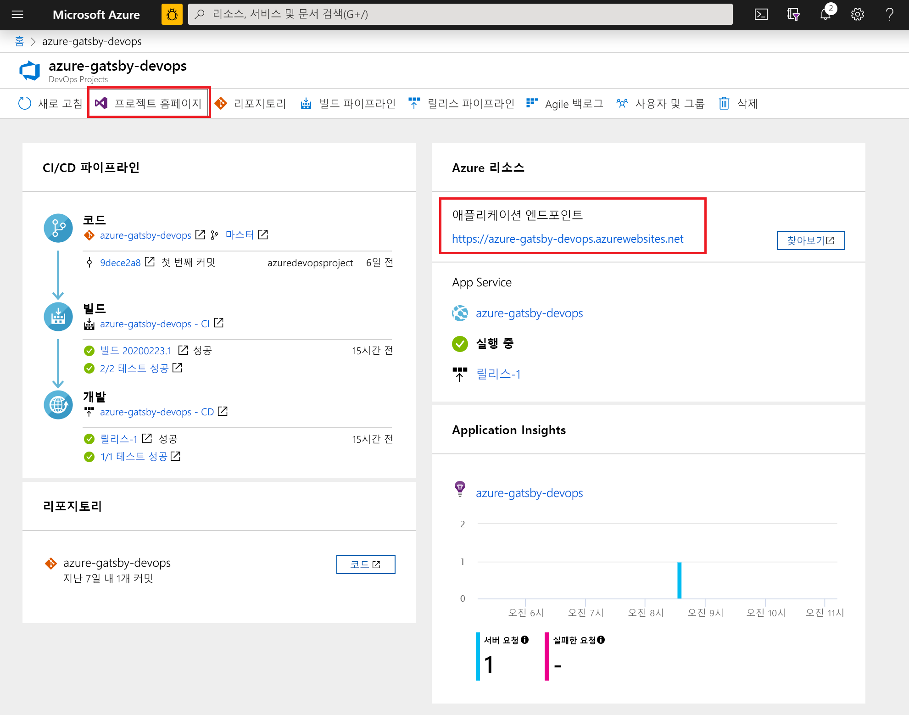
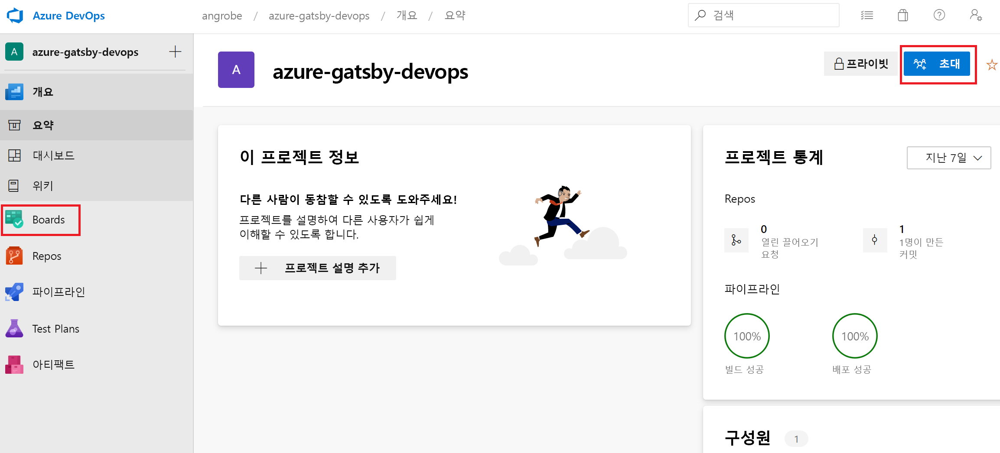
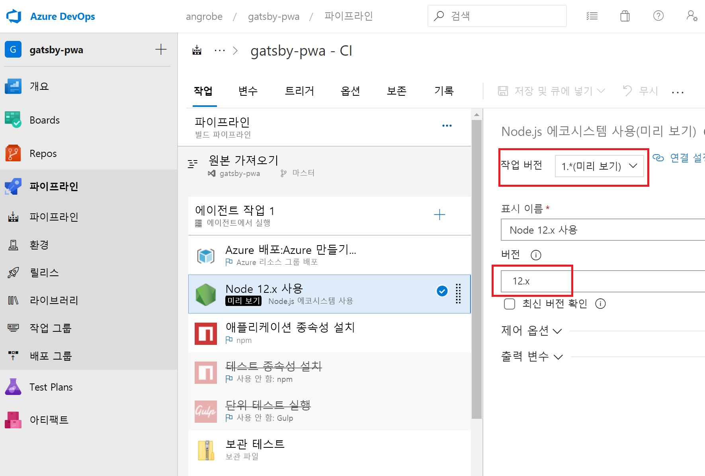
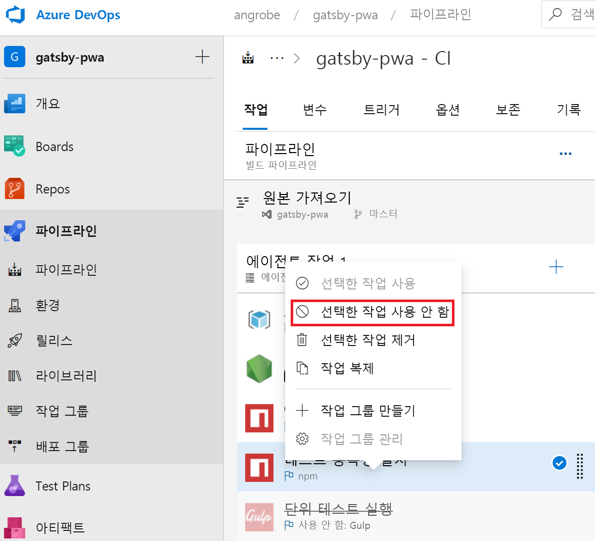
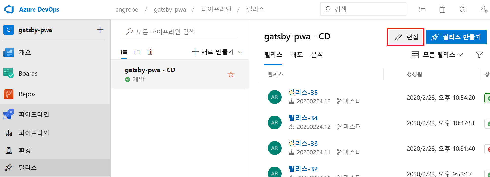
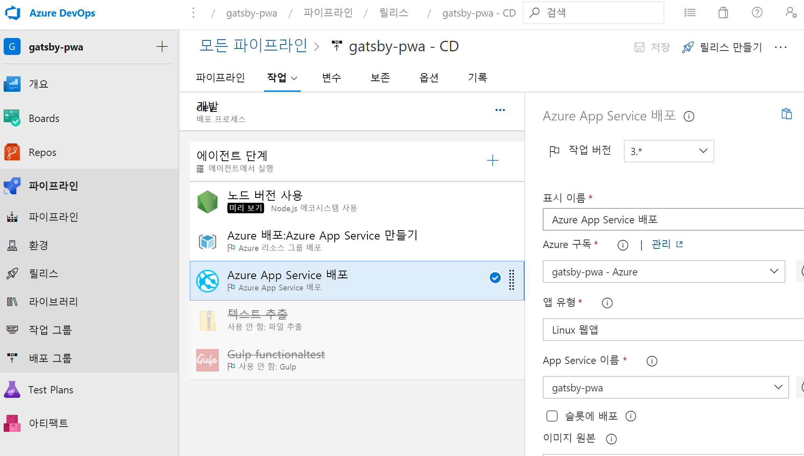

# <a name="create-a-cicd-pipeline-in-azure-pipelines-for-nodejs-with-azure-devops-starter"></a>Azure DevOps Starter를 사용하여 Node.js용 Azure Pipelines에서 CI/CD 파이프라인 만들기

이 빠른 시작에서는 [GatsbyJS](https://www.gatsbyjs.org/) 및 간소화된 Azure DevOps Starter 만들기 환경을 사용하여 NodeJS PWA(프로그레시브 웹앱)를 만듭니다. 완료되면 Azure Pipelines에 PWA용 CI(지속적인 통합) 및 CD(지속적인 배포) 파이프라인이 있습니다. Azure DevOps Starter는 개발, 배포 및 모니터링하는 데 필요한 항목을 설정합니다.

## <a name="prerequisites"></a>사전 요구 사항

- 활성 구독이 있는 Azure 계정. [체험 계정을 만듭니다](https://azure.microsoft.com/free/?ref=microsoft.com&utm_source=microsoft.com&utm_medium=docs&utm_campaign=visualstudio). 
- [Azure DevOps](https://azure.microsoft.com/services/devops/) 조직

## <a name="sign-in-to-the-azure-portal"></a>Azure Portal에 로그인

DevOps Starter는 Azure Pipelines에 CI/CD 파이프라인을 만듭니다. 새 Azure DevOps 조직을 만들거나 기존 조직을 사용할 수 있습니다. 또한 DevOps Starter는 선택한 Azure 구독에서 Azure 리소스를 만듭니다.

1. [Azure Portal](https://portal.azure.com)에 로그인하고, 왼쪽 창에서 **리소스 만들기**를 선택합니다. 

   

1. 검색 상자에 **DevOps Starter**를 입력한 다음, 선택합니다. **추가**를 클릭하여 새 항목을 만듭니다.

    

## <a name="select-a-sample-application-and-azure-service"></a>샘플 애플리케이션 및 Azure 서비스 선택

1. Node.js 샘플 애플리케이션을 선택합니다.   

     

1. 기본 샘플 프레임워크는 **Express.js**입니다. 선택 항목을 **간단한 Node.js 앱**으로 변경하고, **다음**을 선택합니다. 

     

1. 이 단계에서 사용할 수 있는 배포 대상은 2단계에서 선택한 애플리케이션 프레임워크에 따라 결정됩니다. 다음 예에서 **Windows 웹앱**은 기본 배포 대상입니다. 설정된 **Web App for Containers**를 그대로 유지하고, **다음**을 선택합니다.

    

## <a name="configure-a-project-name-and-an-azure-subscription"></a>프로젝트 이름 및 Azure 구독 구성

1. DevOps Starter 만들기 워크플로의 마지막 단계에서 프로젝트 이름을 할당하고, Azure 구독을 선택한 다음, **완료**를 선택합니다.  

    

1. 프로젝트가 빌드되고 애플리케이션이 Azure에 배포되는 동안 요약 페이지가 표시됩니다. 잠시 후 Git 리포지토리, Kanban 보드, 배포 파이프라인, 테스트 계획 및 앱에 필요한 아티팩트가 포함된 프로젝트가 [Azure DevOps 조직](https://dev.azure.com/)에 만들어집니다.  

## <a name="managing-your-project"></a>프로젝트 관리

1. **모든 리소스**로 이동하여 DevOps Starter를 찾습니다. **DevOps Starter**를 선택합니다.

    

1. 프로젝트 홈페이지, 코드 리포지토리, CI/CD 파이프라인 및 실행 중인 앱에 대한 링크를 제공하는 대시보드로 이동합니다. **Azure DevOps**에서 애플리케이션을 보려면 **프로젝트 홈 페이지**를 선택하고, 라이브 샘플 앱을 보려면 다른 브라우저 탭에서 **애플리케이션 엔드포인트**를 선택합니다. 이 샘플은 나중에 GatsbyJS에서 생성된 PWA를 사용하도록 변경됩니다.

     

1. Azure DevOps 프로젝트에서 팀 멤버를 초대하여 협업하고, 작업 추적을 시작하도록 Kanban 보드를 설정할 수 있습니다. 자세한 내용은 [여기](https://docs.microsoft.com/azure/devops/user-guide/what-is-azure-devops?view=azure-devops)를 참조하세요.



## <a name="clone-the-repo-and-install-your-gatsby-pwa"></a>리포지토리 복제 및 Gatsby PWA 설치

DevOps Starter는 Azure Repos 또는 GitHub에서 git 리포지토리를 만듭니다. 이 예에서 Azure Repo를 만들었습니다. 다음 단계에서는 리포지토리를 복제하고 변경해야 합니다.

1. **DevOps 프로젝트**에서 **Repos**를 선택하고 **복제**를 클릭합니다.  Git 리포지토리를 데스크톱에 복제하는 다양한 메커니즘이 있습니다.  개발 환경에 적합한 메커니즘을 선택합니다.  

    

1. 리포지토리가 데스크톱에 복제되면 시작 템플릿을 약간 변경합니다. 먼저 터미널에서 GatsbyJS CLI를 설치합니다.

   ```powershell
    npm install -g gatsby
   ```

1. 터미널에서 리포지토리의 루트로 이동합니다. 여기에는 다음 세 개의 폴더가 포함되어 있습니다.

    ```powershell
    Mode                LastWriteTime         Length Name
    ----                -------------         ------ ----
    d-----        2/23/2020  10:42 PM                Application
    d-----        2/23/2020   3:05 PM                ArmTemplates
    d-----        2/23/2020   3:05 PM                Tests
    ```
    
1. Gatsby 스타터로 바꾸므로 Application 폴더의 모든 파일이 필요하지는 않습니다. 다음 명령을 순서대로 실행하여 정리합니다.
    
    ```powershell
    cp .\Application\Dockerfile .
    rmdir Application
    ```

1. Gatsby CLI를 사용하여 샘플 PWA를 생성합니다. 터미널에서 `gatsby new`를 실행하여 PWA 마법사를 시작하고, 시작 템플릿에 대해 `gatsby-starter-blog`를 선택합니다. 이는 다음 샘플과 비슷합니다.

    ```powershell
    c:\myproject> gatsby new
    √ What is your project called? ... my-gatsby-project
    ? What starter would you like to use? » - Use arrow-keys. Return to submit.
        gatsby-starter-default
        gatsby-starter-hello-world
    >   gatsby-starter-blog
        (Use a different starter)
    ```
    
1. 이제 `my-gatsby-project`라는 폴더가 있습니다. 이름을 `Application`으로 바꾸고, `Dockerfile`을 이 폴더에 복사합니다.
    
    ```powershell
    mv my-gatsby-project Application
    mv Dockerfile Application
    ```
    
1. 원하는 편집기에서 Dockerfile을 열고, 첫 번째 줄을 `FROM node:8`에서 `FROM node:12`로 변경합니다. 이렇게 변경하면 컨테이너에서 Node.js 8.x 버전 대신 12.x 버전을 사용할 수 있습니다. GatsbyJS에는 더 최신 버전의 Node.js가 필요합니다.

1. 다음으로, Application 폴더에서 package.json 파일을 열고, 개발 및 프로덕션 서버가 사용 가능한 모든 네트워크 인터페이스(예: 0.0.0.0) 및 80 포트에서 수신하도록 [스크립트 필드](https://docs.npmjs.com/files/package.json#scripts)를 편집합니다. 이러한 설정을 사용하지 않으면 컨테이너 앱 서비스에서 트래픽을 컨테이너 내에서 실행되는 Node.js 앱으로 라우팅할 수 없습니다. `scripts` 필드는 아래와 비슷합니다. 여기서는 특히 `develop`, `serve` 및 `start` 대상을 기본값에서 변경하려고 합니다.

    ```json
      "scripts": {
        "build": "gatsby build",
        "develop": "gatsby develop  -H 0.0.0.0 -p 80",
        "format": "prettier --write \"**/*.{js,jsx,json,md}\"",
        "start": "npm run serve",
        "serve": "npm run build && gatsby serve -H 0.0.0.0 -p 80",
        "clean": "gatsby clean",
        "test": "echo \"Write tests! -> https://gatsby.dev/unit-testing\" && exit 1"
      }
    ```
    
## <a name="edit-your-cicd-pipelines"></a>CI/CD 파이프라인 편집

1. 이전 섹션의 코드를 커밋하기 전에 빌드 및 릴리스 파이프라인을 약간 변경합니다. '빌드 파이프라인'을 편집하고, Node.js 12.x 버전을 사용하도록 노드 작업을 업데이트합니다. **작업 버전** 필드를 1.x로 설정하고, **버전** 필드를 12.x로 설정합니다.

    

1. 이 빠른 시작에서는 단위 테스트를 만들지 않으며, 빌드 파이프라인에서 이러한 단계를 사용하지 않도록 설정합니다. 테스트를 작성하는 경우 이러한 단계를 사용하도록 다시 설정할 수 있습니다. 마우스 오른쪽 단추로 클릭하여 **테스트 종속성 설치** 및 **단위 테스트 실행**이라는 레이블이 지정된 작업을 선택하고 이를 사용하지 않도록 설정합니다.

    

1. 릴리스 파이프라인을 편집합니다.

    

1. 빌드 파이프라인과 마찬가지로 12.x를 사용하도록 노드 작업을 변경하고 두 개의 테스트 작업을 사용하지 않도록 설정합니다. 릴리스는 다음 스크린샷과 비슷합니다.

    

1. 브라우저의 왼쪽에서 **views/index.pug** 파일로 이동합니다.

1. **편집**을 선택하고 h2 제목을 변경합니다.  예를 들어 **Azure DevOps Starter를 사용하여 바로 시작하기**를 입력하거나 일부 다른 내용을 변경합니다.

1. **커밋**을 선택하고 변경 내용을 저장합니다.

1. 브라우저에서 DevOps Starter 대시보드로 이동합니다.   
이제 빌드가 진행되고 있다고 표시됩니다. 변경 내용이 자동으로 빌드되고 CI/CD 파이프라인을 통해 배포됩니다.

## <a name="commit-your-changes-and-examine-the-azure-cicd-pipeline"></a>변경 내용 커밋 및 Azure CI/CD 파이프라인 검사

앞의 두 단계에서는 Gatsby에서 생성된 PWA를 Git 리포지토리에 추가하고, 코드를 빌드하고 배포하도록 파이프라인을 편집했습니다. 코드를 커밋하고, 빌드 및 릴리스 파이프라인을 통해 진행 상황을 확인할 수 있습니다.

1. 터미널에 있는 프로젝트의 Git 리포지토리 루트에서 다음 명령을 실행하여 코드를 Azure DevOps 프로젝트로 푸시합니다.

    ```powershell
    git add .
    git commit -m "My first Gatsby PWA"
    git push
    ```
    
1. `git push`가 완료되는 즉시 빌드가 시작됩니다. **Azure DevOps 대시보드**에서 진행 상황을 확인할 수 있습니다.

3. 몇 분 후에 빌드 및 릴리스 파이프라인이 완료되고 PWA가 컨테이너에 배포됩니다. 위의 대시보드에서 **애플리케이션 엔드포인트** 링크를 클릭하면 블로그의 Gatsby 스타터 프로젝트가 표시됩니다.

## <a name="clean-up-resources"></a>리소스 정리

리소스가 더 이상 필요하지 않을 경우 만든 Azure App Service 및 기타 관련 리소스를 삭제할 수 있습니다. DevOps Starter 대시보드의 **삭제** 기능을 사용합니다.

## <a name="next-steps"></a>다음 단계

CI/CD 프로세스를 구성하면 빌드 및 릴리스 파이프라인이 자동으로 만들어집니다. 팀의 요구 사항에 맞게 이러한 빌드 및 릴리스 파이프라인을 변경할 수 있습니다. CI/CD 파이프라인에 대한 자세한 내용은 다음을 참조하세요.

> [!div class="nextstepaction"]
> [CD 프로세스 사용자 지정](https://docs.microsoft.com/azure/devops/pipelines/release/define-multistage-release-process?view=vsts)

