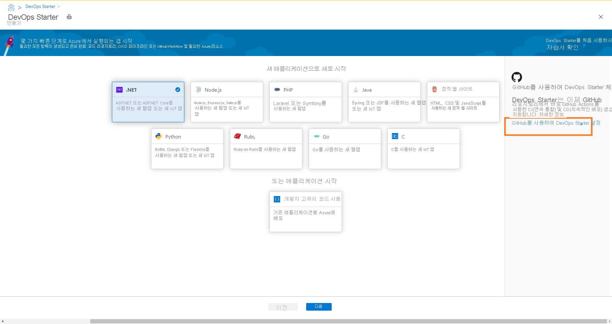
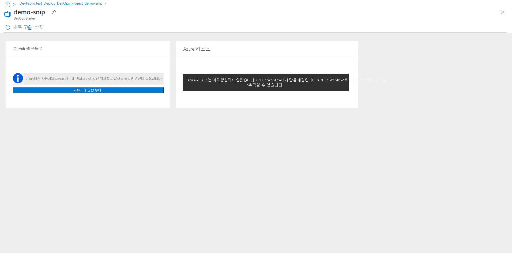

# GitHub Actions를 사용하여 DevOps Starter로 Node.js 앱에 대한 CI/CD 설정

이 빠른 시작에서는 간소화된 DevOps Starter 환경에서 GitHub Actions를 사용하여 Node.js 앱용 CI(연속 통합) 및 CD(지속적인 업데이트) 파이프라인을 설정합니다. DevOps Starter를 사용하여 앱을 개발, 배포 및 모니터링하는 데 필요한 모든 항목을 설정할 수 있습니다. 

## 사전 요구 사항

- 활성 구독이 있는 Azure 계정. [체험 계정을 만듭니다](https://azure.microsoft.com/free/?ref=microsoft.com&utm_source=microsoft.com&utm_medium=docs&utm_campaign=visualstudio). 
- [GitHub](https://github.com/) 계정

## Azure Portal에 로그인

DevOps Starter는 GitHub 작업을 사용하여 CI/CD 워크플로를 만듭니다. 또한 DevOps Starter는 선택한 Azure 구독에서 Azure 리소스를 만듭니다.

1. [Azure Portal](https://portal.azure.com)에 로그인합니다.

1. 검색 상자에 **DevOps Starter** 를 입력한 다음, 선택합니다. **추가** 를 클릭하여 새 항목을 만듭니다.

    

## 샘플 애플리케이션 및 Azure 서비스 선택

1. 오른쪽 배너에서 **GitHub를 사용하여 DevOps Starter 설정** 을 클릭합니다.

    

1. CI/CD 공급자가 **GitHub Actions** 로 선택되어 있는지 확인합니다.

    

1. **Node.js** 샘플 애플리케이션을 선택합니다. Node.js 샘플에는 여러 애플리케이션 프레임워크 선택이 포함됩니다.

1. 기본 샘플 프레임워크는 **Express.js** 입니다. 기본 설정에서 나간 후 **다음** 을 선택합니다.   

2. Windows 웹앱은 기본 배포 대상입니다. 이전에 선택한 애플리케이션 프레임워크는 여기에서 사용 가능한 Azure 서비스 배포 대상의 유형을 나타냅니다. 기본 서비스에서 나간 후 **다음** 을 선택합니다.
 
## GitHub 계정 및 Azure 구독 구성 

1. GitHub를 사용하여 인증합니다.

   1. **권한 부여** 단추를 클릭합니다. 
   
   1. GitHub에 로그인합니다. 현재 GitHub 계정이 없는 경우 여기서 가입할 수 있습니다.

2. 기존 **GitHub 조직** 을 선택합니다. 
   
   1. GitHub 리포지토리의 이름을 선택합니다. 
   
   1. Azure 구독 및 위치를 선택하고 애플리케이션의 이름을 선택한 후 **완료** 를 선택합니다.
    
       

    잠시 후에 DevOps Starter 대시보드가 Azure Portal에 표시됩니다. 샘플 애플리케이션이 Azure DevOps 조직의 리포지토리에서 설정되고, GitHub 워크플로가 트리거되고, 애플리케이션이 Azure에 배포됩니다. 이 대시보드에서 코드 리포지토리, GitHub 워크플로 및 Azure의 애플리케이션을 살펴볼 수 있습니다.
   
3. **찾아보기** 를 선택하여 실행 중인 애플리케이션을 볼 수 있습니다.
    
    이 대시보드에는 GitHub 워크플로 및 Azure 리소스의 세부 정보가 포함되어 있습니다. 최신 실행, 커밋, 작업 상태 등의 GitHub 워크플로 세부 정보를 보려면 **GitHub에 대한 권한을 부여해야 합니다** .
   
   

DevOps Starter는 GitHub 작업을 사용하여 빌드 및 배포 작업을 통해 자동으로 GitHub 워크플로를 구성합니다. 이제 웹 사이트에 최신 작업을 자동으로 배포하는 CI/CD 프로세스를 사용하여 Node.js 앱에서 팀과 협업할 준비가 되었습니다.

   

## 코드 변경 내용 커밋 및 CI/CD 실행

DevOps Starter는 GitHub에서 리포지토리를 만듭니다. 리포지토리를 살펴보고 애플리케이션의 코드를 변경하려면 다음 단계를 수행합니다.

1. DevOps Starter 대시보드 왼쪽에서 마스터 분기에 대한 링크를 선택합니다. 이 링크를 선택하면 새로 만든 GitHub 리포지토리에 대한 보기가 열립니다.

1. 리포지토리 복제 URL을 보려면 브라우저의 오른쪽 위에서 **복제** 를 선택합니다. 즐겨찾는 IDE에서 Git 리포지토리를 복제할 수 있습니다. 다음 몇 단계에서는 웹 브라우저를 사용하여 코드 변경을 직접 마스터 분기에 만들고 커밋할 수 있습니다.

1. 브라우저의 왼쪽에서 **/Application/views/index.pug** 파일로 이동합니다.

1. **편집** 을 선택하고 일부 텍스트를 변경합니다.
    예를 들어 태그 중 하나의 텍스트를 변경합니다.

1. **커밋** 을 선택하고 변경 내용을 저장합니다.

1. 브라우저에서 DevOps Starter 대시보드로 이동합니다.   
이제 진행 중인 GitHub 워크플로 빌드 작업이 표시됩니다. 변경한 내용은 GitHub 워크플로를 통해 자동으로 빌드되고 배포됩니다.

## GitHub 워크플로 보기

이전 단계에서 DevOps Starter가 전체 GitHub 워크플로를 자동으로 구성했습니다. 워크플로를 살펴보고 필요한 대로 사용자 지정하세요. 다음 단계를 수행하여 워크플로를 숙지합니다.

1. DevOps Starter 대시보드의 왼쪽에서 **GitHub 워크플로** 를 선택합니다. 이 링크를 선택하면 새 프로젝트에 대한 브라우저 탭과 GitHub 워크플로가 열립니다.
    > [!NOTE]
    > 워크플로 파일 이름을 바꾸지 마세요. 변경 내용이 대시보드에 반영되려면 워크플로 파일 이름이 **devops-starter-workflow.yml** 이어야 합니다.

1. 워크플로 yaml 파일에는 애플리케이션을 빌드하고 배포하는 데 필요한 모든 GitHub Actions가 포함되어 있습니다. **파일 편집** 옵션을 클릭하여 워크플로 파일을 사용자 지정합니다.

1. 리포지토리의 **코드** 탭 아래에서  **커밋** 을 클릭합니다. 이 보기에는 특정 배포와 연결된 코드 커밋이 표시됩니다.

1. 리포지토리의 **작업** 탭 아래에서 리포지토리의 모든 워크플로 실행 기록을 볼 수 있습니다.

1. **최근 실행** 을 선택하여 워크플로에서 실행된 모든 작업을 확인합니다.

1. **작업** 을 클릭하여 워크플로 실행에 대한 자세한 로그를 확인합니다. 로그에는 배포 프로세스에 대한 유용한 정보가 포함됩니다. 배포 도중 및 이후 모두에서 로그를 볼 수 있습니다.

1. **끌어오기 요청** 탭을 클릭하여 리포지토리의 모든 끌어오기 요청을 확인합니다.

## 리소스 정리

더 이상 필요하지 않을 경우 Azure App Service 및 기타 관련 리소스를 삭제할 수 있습니다. DevOps Starter 대시보드의 **삭제** 기능을 사용합니다.

## 다음 단계

CI/CD 프로세스를 구성할 때 GitHub 워크플로가 자동으로 생성되었습니다. 팀의 요구 사항에 맞게 워크플로를 필요한 대로 수정할 수 있습니다. GitHub Actions 및 워크플로에 대한 자세한 내용은 다음을 참조하세요.

> [!div class="nextstepaction"]
> [GitHub 워크플로 사용자 지정](https://docs.github.com/actions/configuring-and-managing-workflows/configuring-and-managing-workflow-files-and-runs)
