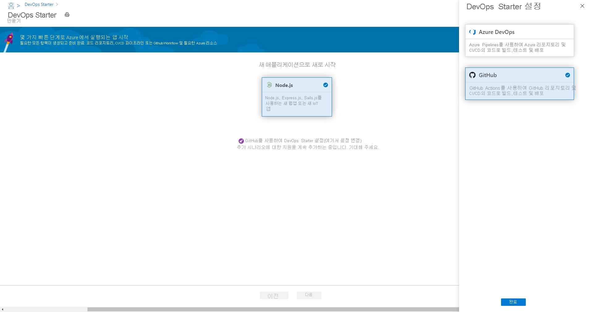
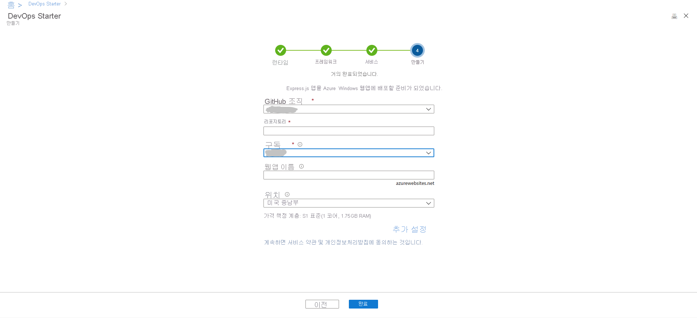
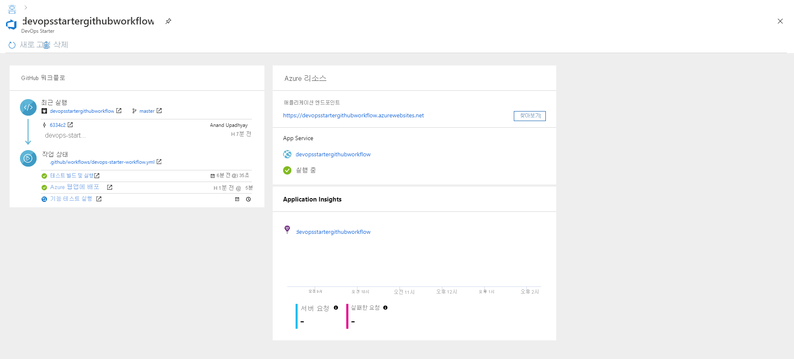

# 자습서: GitHub Actions용 DevOps Starter를 사용하여 Node.js 앱을 Azure Web App에 배포

GitHub Actions용 DevOps Starter는 샘플 애플리케이션을 선택하여 Azure에 배포할 CI(연속 통합) 및 CD(지속적인 업데이트) 워크플로를 만들 수 있는 간소화된 환경을 제공합니다. 

DevOps Starter는 다음 작업도 수행합니다.
* 새 Azure Web App과 같은 Azure 리소스를 자동으로 만듭니다.
* CI 빌드 작업이 포함된 워크플로를 GitHub에서 만들고 구성합니다.
* CD 배포 작업도 워크플로에 포함됩니다. 
* 모니터링을 위해 Azure Application Insights 리소스를 만듭니다.

이 자습서에서는 다음을 수행합니다.

> [!div class="checklist"]
> * DevOps Starter를 사용하여 Node.js 앱 배포
> * GitHub 및 Azure 구독 구성 
> * GitHub 워크플로 검사
> * GitHub에 변경 내용 커밋 및 자동으로 Azure에 배포
> * Azure Application Insights 모니터링 구성
> * 리소스 정리

## 사전 요구 사항

* 활성 구독이 있는 Azure 계정. [체험 계정을 만듭니다](https://azure.microsoft.com/free/).

## DevOps Starter를 사용하여 Node.js 앱 배포

DevOps Starter는 GitHub에서 워크플로를 만듭니다. 기존 GitHub 조직을 사용할 수 있습니다. 또한 DevOps Starter는 선택한 Azure 구독에서 Web App과 같은 Azure 리소스를 만듭니다.

1. [Azure Portal](https://portal.azure.com)에 로그인합니다.

1. 검색 상자에 **DevOps Starter** 를 입력한 다음, 선택합니다. **추가** 를 클릭하여 새 항목을 만듭니다.

    

1. CI/CD 공급자가 **GitHub Actions** 로 선택되어 있는지 확인합니다.

    

1. **Node.js** , **다음** 을 차례로 선택합니다.

1. **애플리케이션 프레임워크 선택** 아래에서 **Express.js** , **다음** 을 차례로 선택합니다. 이전 단계에서 선택한 애플리케이션 프레임워크는 여기에서 사용 가능한 Azure 서비스 배포 대상의 유형을 나타냅니다. 

1. **Windows Web App** , **다음** 을 차례로 선택합니다.

## GitHub 및 Azure 구독 구성

1. GitHub에 **권한을 부여** 하고 기존 GitHub 조직을 선택합니다. 

1. **GitHub 리포지토리** 에 대한 이름을 입력합니다. 

1. Azure 구독 서비스를 선택합니다. 필요에 따라 **변경** 을 선택한 다음, Azure 리소스의 위치 등 보다 자세한 구성 정보를 입력합니다.
 
1. Web App 이름을 입력한 다음, **완료** 를 선택합니다. 몇 분 후에 Azure Web App이 준비됩니다. Node.js 애플리케이션 샘플이 GitHub 조직의 리포지토리에 설정되고, 워크플로가 트리거되고, 애플리케이션에서 새로 만든 Azure Web App에 배포됩니다.

       

   작업이 완료된 후 DevOps Starter 대시보드가 Azure Portal에 표시됩니다. Azure Portal의 **모든 리소스** 에서 직접 대시보드로 이동할 수도 있습니다. 

   대시보드에서 GitHub 코드 리포지토리, CI/CD 워크플로 및 Azure에서 실행되는 애플리케이션에 대한 가시성을 제공합니다.   

   

DevOps Starter는 코드 변경을 리포지토리에 배포하는 트리거를 자동으로 구성합니다.
    
## GitHub 워크플로 검사

이전 단계에서는 DevOps Starter에서 전체 GitHub 워크플로를 자동으로 구성했습니다. 필요에 따라 워크플로를 살펴보고 사용자 지정합니다. 다음 단계를 수행하여 워크플로를 숙지합니다.

1. DevOps Starter 대시보드의 왼쪽에서 **GitHub 워크플로** 를 선택합니다. 이 링크를 선택하면 새 프로젝트에 대한 브라우저 탭과 GitHub 워크플로가 열립니다.
    > [!NOTE]
    > 워크플로 파일 이름을 바꾸지 마세요. 변경 내용이 대시보드에 반영되려면 워크플로 파일 이름이 **devops-starter-workflow.yml** 이어야 합니다.

1. 워크플로 yaml 파일에는 애플리케이션을 빌드하고 배포하는 데 필요한 모든 GitHub Actions가 포함되어 있습니다. **파일 편집** 옵션을 클릭하여 워크플로 파일을 사용자 지정합니다.

1. 리포지토리의 **코드** 탭 아래에서  **커밋** 을 클릭합니다. 이 보기에는 특정 배포와 연결된 코드 커밋이 표시됩니다.

1. 리포지토리의 **작업** 탭 아래에서 리포지토리의 모든 워크플로 실행 기록을 볼 수 있습니다.

1. **최근 실행** 을 선택하여 워크플로에서 실행된 모든 작업을 확인합니다.

1. **작업** 을 클릭하여 워크플로 실행에 대한 자세한 로그를 확인합니다. 로그에는 배포 프로세스에 대한 유용한 정보가 포함됩니다. 배포 도중 및 이후 모두에서 로그를 볼 수 있습니다.

1. **끌어오기 요청** 탭을 클릭하여 리포지토리의 모든 끌어오기 요청을 확인합니다.

## 코드 변경 내용 커밋 및 CI/CD 실행

DevOps Starter는 GitHub에서 리포지토리를 만듭니다. 리포지토리를 살펴보고 애플리케이션의 코드를 변경하려면 다음 단계를 수행합니다.

1. DevOps Starter 대시보드 왼쪽에서 마스터 분기에 대한 링크를 선택합니다. 이 링크를 선택하면 새로 만든 GitHub 리포지토리에 대한 보기가 열립니다.

1. 리포지토리 복제 URL을 보려면 브라우저의 오른쪽 위에서 **복제** 를 선택합니다. 즐겨찾는 IDE에서 Git 리포지토리를 복제할 수 있습니다. 다음 몇 단계에서는 웹 브라우저를 사용하여 코드 변경을 직접 마스터 분기에 만들고 커밋할 수 있습니다.

1. 브라우저의 왼쪽에서 **/Application/views/index.pug** 파일로 이동합니다.

1. **편집** 을 선택하고 일부 텍스트를 변경합니다.
    예를 들어 태그 중 하나에 대한 일부 텍스트를 변경합니다.

1. **커밋** 을 선택하고 변경 내용을 저장합니다.

1. 브라우저에서 DevOps Starter 대시보드로 이동합니다.   
이제 진행 중인 GitHub 워크플로 빌드 작업이 표시됩니다. 방금 변경한 내용은 GitHub 워크플로를 통해 자동으로 빌드되고 배포됩니다.

1. 배포가 완료되면 애플리케이션을 새로 고쳐 변경 내용을 확인합니다.

## Azure Application Insights 모니터링 구성

Azure Application Insights를 사용하면 애플리케이션의 성능 및 사용량을 쉽게 모니터링할 수 있습니다. DevOps Starter는 자동으로 애플리케이션에 대한 Application Insights 리소스를 구성합니다. 필요에 따라 다양한 경고 및 모니터링 기능을 추가로 구성할 수 있습니다.

1. Azure Portal에서 DevOps Starter 대시보드로 이동합니다. 

1. 오른쪽 아래에서 앱에 대한 **Application Insights** 링크를 선택합니다. **Application Insights** 창이 열립니다. 이 보기에는 앱에 대한 사용량, 성능 및 가용성 모니터링 정보가 포함됩니다.

    

1. **시간 범위** 를 선택한 다음, **지난 시간** 을 선택합니다. 결과를 필터링하려면 **업데이트** 를 선택합니다. 이제 지난 60분의 모든 활동이 표시됩니다. 
    
1. 시간 범위를 종료하려면 **x** 를 선택합니다.

1. **경고** 를 선택한 다음, **메트릭 경고 추가** 를 선택합니다. 

1. 경고의 이름을 입력합니다.

1. **메트릭** 드롭다운 목록에서 다양한 경고 메트릭을 검사합니다. 기본 경고는 **1초 보다 큰 서버 응답 시간** 의 경우에 해당합니다. 다양한 경고를 쉽게 구성하여 앱의 모니터링 기능을 개선할 수 있습니다.

1. **이메일 소유자, 기여자 및 구독자를 통해 알림** 확인란을 선택합니다. 필요에 따라 Azure 논리 앱을 실행하여 경고가 표시되면 추가 작업을 수행할 수 있습니다.

1. **확인** 을 선택하여 경고를 만듭니다. 곧 경고가 대시보드에서 활성으로 표시됩니다. 

1. **경고** 영역을 종료하고 **Application Insights** 창으로 돌아갑니다.

1. **가용성** 을 선택한 다음, **테스트 추가** 를 선택합니다. 

1. 테스트 이름을 입력하고 **만들기** 를 선택합니다. 애플리케이션의 가용성을 확인하려면 간단한 ping 테스트를 생성합니다. 몇 분 후 테스트 결과를 사용할 수 있고, Application Insights 대시보드에 가용성 상태가 표시됩니다.

## 리소스 정리

테스트하는 경우 리소스를 정리하여 요금이 청구되지 않도록 할 수 있습니다. 더 이상 필요하지 않은 경우 이 자습서에서 만든 Azure Virtual Machine과 관련 리소스를 삭제할 수 있습니다. 이렇게 하려면 DevOps Starter 대시보드의 **삭제** 기능을 사용합니다. 

> [!IMPORTANT]
> 다음 절차에서는 리소스를 영구적으로 삭제합니다. *삭제* 기능은 Azure에서 DevOps Starter의 프로젝트에서 만든 데이터를 제거하므로 이러한 데이터를 검색할 수 없게 됩니다. 표시되는 메시지를 신중하게 읽은 후 이 절차를 따릅니다.

1. Azure Portal에서 DevOps Starter 대시보드로 이동합니다.
1. 오른쪽 위에서 **삭제** 를 선택합니다.합니다. 
1. 메시지에 따라 **예** 를 선택하여 리소스를 *영구적으로 삭제* 합니다.

필요에 따라 팀의 요구 사항에 맞게 워크플로를 수정할 수 있습니다. 또한 이 CI/CD 패턴을 다른 리포지토리에 대한 템플릿으로 사용할 수 있습니다. 

## 다음 단계

이 자습서에서는 다음 작업 방법을 알아보았습니다.

> [!div class="checklist"]
> * DevOps Starter를 사용하여 Node.js 앱 배포
> * GitHub 및 Azure 구독 구성 
> * GitHub 워크플로 검사
> * GitHub에 변경 내용 커밋 및 자동으로 Azure에 배포
> * Azure Application Insights 모니터링 구성
> * 리소스 정리

GitHub Actions 및 워크플로에 대해 자세히 알아보려면 다음을 참조하세요.

> [!div class="nextstepaction"]
> [GitHub 워크플로 사용자 지정](https://docs.github.com/actions/configuring-and-managing-workflows/configuring-and-managing-workflow-files-and-runs)
