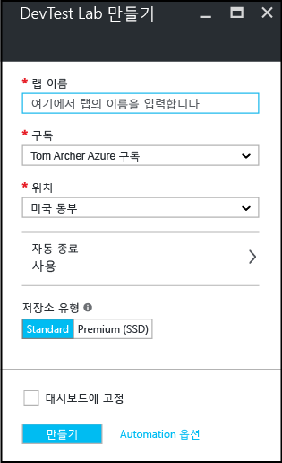

    <properties
	pageTitle="Create a DevTest Lab | Microsoft Azure"
	description="Create a new DevTest Lab lab for virtual machines"
	services="devtest-lab,virtual-machines"
	documentationCenter="na"
	authors="tomarcher"
	manager="douge"
	editor=""/>

<tags
	ms.service="devtest-lab"
	ms.workload="na"
	ms.tgt_pltfrm="na"
	ms.devlang="na"
	ms.topic="get-started-article"
	ms.date="11/01/2015"
	ms.author="tarcher"/>

# Azure DevTest Lab 만들기

## 필수 조건

DevTest Lab을 만들려면 다음이 필요합니다.

- Azure 구독. Azure 구입 옵션에 대해 알아보려면 [Azure 구입 방법](http://azure.microsoft.com/pricing/purchase-options/) 또는 [1개월 무료 평가판](https://azure.microsoft.com/pricing/free-trial/)을 참조하세요. 랩을 만들려면 구독 소유자여야 합니다.
- 랩에 대한 Azure 리소스 그룹입니다. [Azure 리소스 관리자 개요](resource-group-overview.md) 및 [리소스에 대한 액세스 관리 및 감사](./azure-portal/resource-group-rbac.md)를 참조하세요.

## 랩 만들기

1. [Azure Preview 포털](http://portal.azure.com)에 로그인합니다.

1. **찾아보기**를 탭합니다.

1. 목록에서 **DevTest Lab**을 탭합니다.

1. **DevTest Lab** 블레이드에서 **추가**를 탭합니다.

    

1. **DevTest Lab 만들기** 블레이드에서

    1. 새 랩에 대한 **랩 이름**을 입력합니다.
    1. **구독**을 선택하여 랩과 연결합니다.
    1. 랩을 저장할 **위치**를 선택합니다.
    1. **만들기**를 탭합니다.

    

## 다음 단계

랩을 만들었으면 다음 단계를 고려 합니다.

- [DevTest Lab에 대한 액세스 보호](devtest-lab-add-devtest-user.md).

- [랩 정책 설정](devtest-lab-set-lab-policy.md).

- [랩 템플릿 만들기](devtest-lab-create-template.md).

- [VM에 대한 사용자 지정 아티팩트 만들기](devtest-lab-artifact-author.md).

- [Azure DevTest Lab에 아티팩트를 사용하여 VM 추가](devtest-lab-add-vm-with-artifacts.md).

<!---HONumber=Nov15_HO4-->