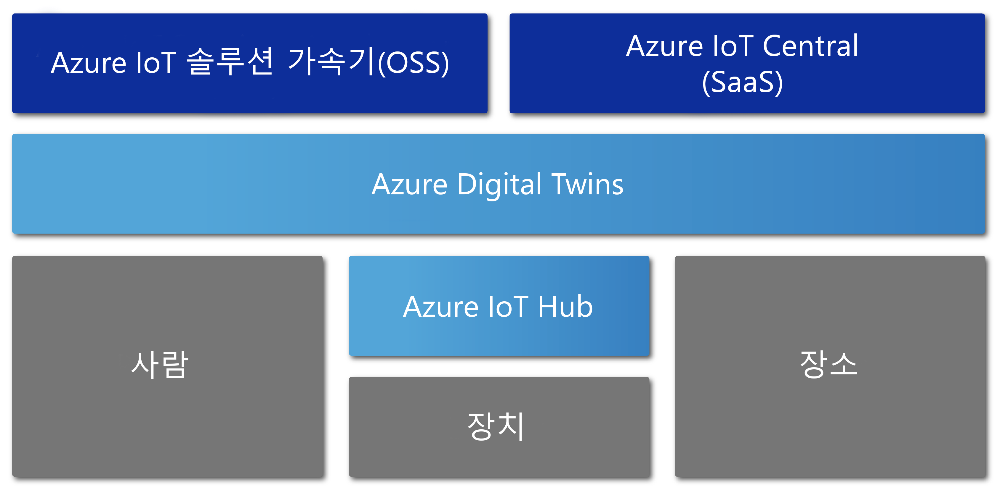

# Azure Digital Twins 개요

Azure Digital Twins는 실제 환경의 종합적 모델을 만드는 Azure IoT 서비스입니다. 여러 기능 중에 사람, 공간, 장치 간의 관계와 상호 작용을 모델링하는 공간 인텔리전스 그래프를 만드는 기능이 있습니다.

Azure Digital Twins를 통해 분산된 여러 센서가 아닌 실제 공간에서 데이터를 쿼리할 수 있습니다. 이 서비스를 사용하면 디지털 및 실제 세상을 망라하는 스트리밍 데이터를 연결하고, 재사용 가능하고 확장성이 높으며 공간을 인지하는 환경을 빌드할 수 있습니다. 팩터리 유지 관리 요구 예측, 전기 그리드에 대한 실시간 에너지 요구 사항 분석, 가용 업무 공간 최적화 등, 다양한 작업에서 이 고유한 관계 상황 기능을 활용해 앱을 극대화할 수 있습니다.

Azure Digital Twins는 창고, 오피스, 학교, 병원, 은행, 경기장, 공장, 주차장, 스마트 그리드, 도시 등, 모든 종류의 환경에 적용됩니다. 여러 도시에서의 일일 온도 추적, 사용 중인 드론 경로 추적, 자동 차량 식별, 건물 점유도 분석, 매장에서 가장 사용량이 많은 현금출납기 찾기 등의 시나리오를 고려해 볼 수 있습니다. 실제 시나리오가 무엇이든 Azure Digital Twins를 통해 해당하는 디지털 인스턴스를 프로비전할 수 있습니다.

다음 비디오에서는 Digital Twins에 대해 자세히 살펴봅니다.

> [!VIDEO https://www.youtube.com/embed/TvN_NxpgyzQ]

## 주요 기능

Azure Digital Twins의 주요 기능은 다음과 같습니다.

### 공간 인텔리전스 그래프

[*공간 인텔리전스 그래프*](./concepts-objectmodel-spatialgraph.md) 또는 *공간 그래프*는 사람, 장소, 장치 간의 관계를 모델링할 수 있는 실제 환경의 가상 표현입니다.

이웃 간에 연결된 여러 전기 사용량 미터를 연결하는 스마트 유틸리티 앱을 고려해 볼 수 있습니다. 전기 사용량 및 요금을 정확하게 모니터링 및 예측하기 위해 이 스마트 유틸리티 회사에서는 각 장치와 센터를 요금 청구 위치 및 고객에 대한 컨텍스트와 함께 모델링해야 합니다. 공간 인텔리전스 그래프를 통해 이런 종류의 복합적 관계를 모델링할 수 있습니다.

### Digital Twins 개체 모델

[Digital Twins 개체 모델](./concepts-objectmodel-spatialgraph.md)은 솔루션의 도메인 특정 요구를 연계하여 개발을 가속화 및 간소화할 수 있는 미리 정의된 장치 프로토콜 및 데이터 스키마입니다.

예를 들어 공간 점유율 응용 프로그램에서는 캠퍼스, 건물, 층, 방 등, 미리 정의된 공간 유형을 사용할 수 있습니다.

### 다중 및 중첩 테넌트

안전하게 확장되며 여러 테넌트에 재사용할 수 있는 솔루션을 빌드할 수 있습니다. 격리되고 안전한 방식으로 액세스 및 사용할 수 있는 여러 보조 테넌트도 만들 수 있습니다.

예를 들어, 한 건물의 다른 테넌트 데이터에서 테넌트의 데이터를 격리하거나 단일 테넌트의 데이터를 다른 건물과 결합하는 공간 사용률 앱을 구성할 수 있습니다.

### 고급 계산 기능

[사용자 정의 함수](./concepts-user-defined-functions.md)라고 하는 고급 계산 기능을 사용하면 수신되는 [장치 데이터](./concepts-device-ingress.md)에 대해 사용자 지정 함수를 정의 및 실행하여 미리 정의된 엔드포인트에 신호를 보낼 수 있습니다. 이 기능은 장치 작업의 사용자 지정 및 자동화를 개선합니다.

예를 들어 스마트 농업 응용 프로그램에는 토양 수분 센서 판독 결과와 일기예보를 평가하는 사용자 정의 함수를 포함하고 관수 수요에 관한 신호를 보낼 수 있습니다.

### 기본 제공 액세스 제어

[역할 기반 액세스 제어](./security-role-based-access-control.md), [Azure Active Directory](./security-authenticating-apis.md) 같은 액세스 및 ID 관리 기능을 통해 개인 및 장치의 액세스를 안전하게 제어할 수 있습니다.

공간 점유자가 특정 범위 안에서 온도를 설정하고 관리자는 모든 공간의 온도를 어느 값으로나 설정할 수 있게 하는 시설 관리 앱을 예로 들 수 있습니다.

### 에코시스템

Azure Digital Twins 인스턴스를 여러 강력한 Azure 서비스에 연결할 수 있습니다. 여기에는 Azure Stream Analytics, AI 및 Storage 서비스와 Azure Maps, Microsoft Mixed Reality, Dynamics 365, Office 365 등이 포함됩니다.

예를 들어 스마트 오피스 빌딩 응용 프로그램은 Azure Digital Twins를 사용하여 여러 층의 팀과 장치를 표시할 수 있습니다. 장치가 프로비전된 Digital Twin 인스턴스에 데이터를 실시간 스트리밍하면 Azure Stream Analytics가 이 데이터를 처리하여 조치 가능한 핵심 정보를 제공합니다. 그런 다음, 데이터를 Azure Storage에 저장하고 공유 가능한 파일 형식으로 변환하여 Office 365를 통해 전체 조직에 배포할 수 있습니다.

## Azure Digital Twins를 활용하는 솔루션

Azure Digital Twins는 IoT 모델링, 데이터 처리, 이벤트 처리, 장치 추적을 간소화하므로 실세계 및 여러 관계를 나타내는 데 유용합니다. 아래 시나리오는 이를 통해 혜택을 누릴 수 있는 여러 업종 중에서 극히 일부에 불과합니다.

* 자산 관리 회사는 오피스 건물의 최적 구성 정보를 얻기 위해 시간 경과에 따른 점유 수준을 파악합니다.
* 경비직원 배치, 관리 서비스 예약 및 기타 소매 공간이나 스포츠 공간에 대한 서비스 등을 구동하는 모바일 앱 주문 티켓을 트리거합니다.
* 실시간으로 건물의 어느 방이 사용 중인지 건물 점유인에게 표시합니다. 그러면 점유이은 자신의 요구에 맞는 공간을 선택할 수 있습니다.
* 공간 내 자산 위치를 추적합니다.
* 사용자 선호와 에너지 그리드 제약을 모델링하여 전기 차량 충전을 최적화합니다.

## 다른 IoT 서비스 컨텍스트의 Azure Digital Twins

Azure Digital Twins는 Azure IoT Hub를 사용하여 실제 세계에 맞춰 모든 항목을 최신으로 유지하는 IoT 장치 및 센서를 연결합니다. 다음 다이어그램은 Azure IoT 서비스와 Azure Digital Twins가 어떤 관계가 있는지 보여 줍니다.

나머지 IoT 에코시스템에 대한 자세한 내용은 [Azure IoT 기술 및 솔루션](https://docs.microsoft.com/azure/iot-fundamentals/iot-services-and-technologies)을 참조하세요.

## 다음 단계

Azure Digital Twins 기능에 대한 간략한 데모를 진행합니다.

> [!div class="nextstepaction"]
> [빠른 시작: Azure Digital Twins로 사용 가능한 회의실 찾기](./quickstart-view-occupancy-dotnet.md)

Azure Digital Twins를 사용한 시설 관리 응용 프로그램 심층 분석:

> [!div class="nextstepaction"]
> [자습서: Azure Digital Twins를 배포하고 공간 그래프 구성](./tutorial-facilities-setup.md)

Azure Digital Twins의 핵심 개념에 알아봅니다.

> [!div class="nextstepaction"]
> [Digital Twins 모델 및 공간 인텔리전스 그래프 이해](./concepts-objectmodel-spatialgraph.md)
