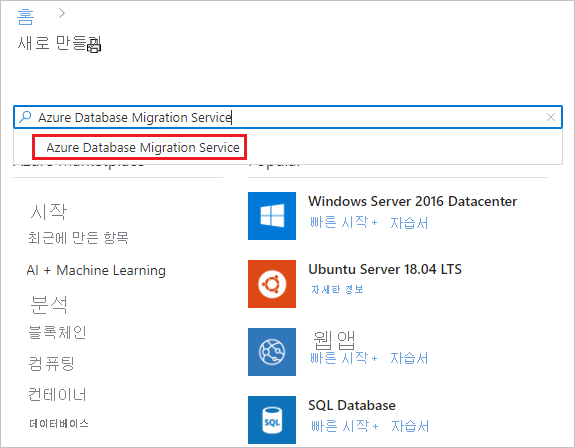
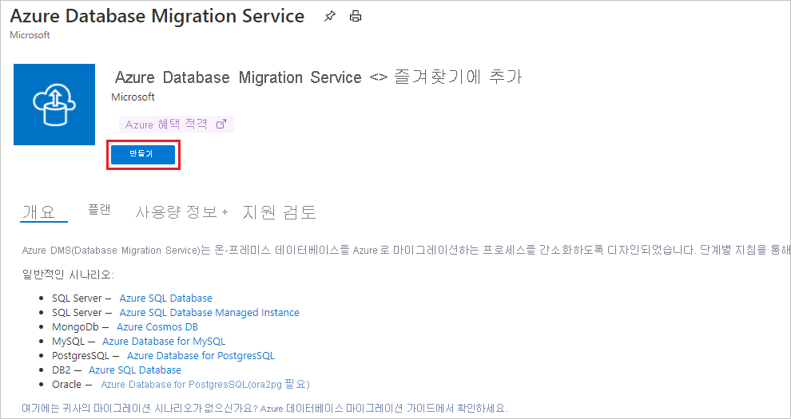
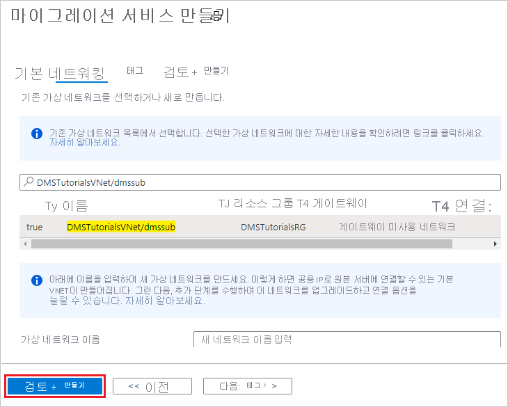

# 빠른 시작: Azure Portal을 사용하여 Azure Database Migration Service 인스턴스를 만듭니다.

이 빠른 시작에서는 Azure Portal을 사용하여 Azure Database Migration Service의 인스턴스를 만듭니다. 인스턴스를 만든 후에는 이를 사용하여 여러 데이터베이스 원본에서 Azure 데이터 플랫폼으로 데이터를 마이그레이션할 수 있습니다. 예를 들어 SQL Server에서 Azure SQL Database로 또는 SQL Server에서 Azure SQL Managed Instance로 데이터를 마이그레이션할 수 있습니다.

Azure 구독이 아직 없는 경우 시작하기 전에 [체험](https://azure.microsoft.com/free/) 계정을 만듭니다.

## Azure Portal에 로그인

웹 브라우저를 열고 [Microsoft Azure Portal](https://portal.azure.com/)로 이동한 다음 자격 증명을 입력하여 포털에 로그인합니다. 기본 보기는 서비스 대시보드입니다.

> [!NOTE]
> 지역별로 구독당 최대 10개의 DMS 인스턴스를 만들 수 있습니다. 더 많은 수의 인스턴스가 필요한 경우 지원 티켓을 만드세요.

## 리소스 공급자 등록

첫 번째 Database Migration Service 인스턴스를 만들기 전에 Microsoft.DataMigration 리소스 공급자를 등록합니다.

1. Azure Portal에서 **구독** 을 검색하고 선택합니다.

   

2. Azure Database Migration Service의 인스턴스를 만들 구독을 선택한 다음, **리소스 공급자** 를 선택합니다.

    

3. 마이그레이션을 검색한 다음, **Microsoft.DataMigration** 에 대해 **등록** 을 선택합니다.

    

## 서비스 인스턴스 만들기

1. Azure Portal 메뉴 또는 **홈** 페이지에서 **리소스 만들기** 를 선택합니다. **Azure Database Migration Service** 를 검색하여 선택합니다

    

2. **Azure Database Migration Service** 화면에서 **만들기** 를 선택합니다.

    

3. **마이그레이션 서비스 만들기** 기본 사항 화면에서:

     - 구독을 선택합니다.
     - 새로운 리소스 그룹을 지정하거나 기존 항목을 만듭니다.
     - Azure Database Migration Service의 인스턴스 이름를 지정합니다.
     - Azure Database Migration Service 인스턴스를 만들 위치를 선택합니다.
     - **Azure** 를 서비스 모드로 선택합니다.
     - 가격 책정 계층을 선택합니다. 비용 및 가격 책정 계층에 대한 자세한 내용은 [가격 책정 페이지](https://aka.ms/dms-pricing)를 참조하세요.
     
    

     - 다음: 네트워킹을 선택합니다.

4. **마이그레이션 서비스 만들기** 네트워킹 화면에서:

    - 기존 가상 네트워크를 선택하거나 새로 만듭니다. 가상 네트워크는 Azure Database Migration Service에 원본 데이터베이스 및 대상 환경에 대한 액세스를 제공합니다. Azure Portal에서 가상 네트워크를 만드는 방법에 대한 자세한 내용은 [Azure Portal을 사용하여 가상 네트워크 만들기](../virtual-network/quick-create-portal.md) 문서를 참조하세요.

    

    - **검토 + 만들기** 를 선택하여 서비스를 만듭니다. 
    
    - 잠시 후에 Azure Database Migration Service 인스턴스가 만들어져 사용할 준비가 됩니다.

    

## 리소스 정리

[Azure 리소스 그룹](../azure-resource-manager/management/overview.md)을 삭제하여 이 빠른 시작에서 만든 리소스를 정리할 수 있습니다. 리소스 그룹을 삭제하려면 만든 Azure Database Migration Service 인스턴스로 이동합니다. **리소스 그룹** 이름을 선택하고 **리소스 그룹 삭제** 를 선택합니다. 이 작업은 리소스 그룹의 모든 자산과 그룹 자체를 삭제합니다.

## 다음 단계

* [SQL Server에서 Azure SQL Database로 오프라인 마이그레이션](tutorial-sql-server-to-azure-sql.md)
* [SQL Server에서 Azure SQL Database로 온라인 마이그레이션](tutorial-sql-server-azure-sql-online.md)
* [SQL Server를 Azure SQL Managed Instance로 오프라인 마이그레이션](tutorial-sql-server-to-managed-instance.md)
* [SQL Server를 Azure SQL Managed Instance로 온라인 마이그레이션](tutorial-sql-server-managed-instance-online.md)