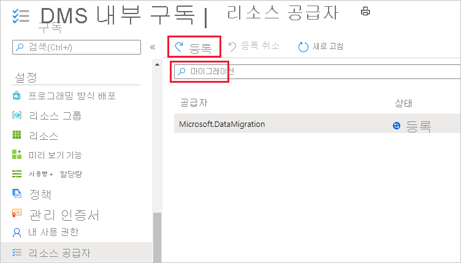
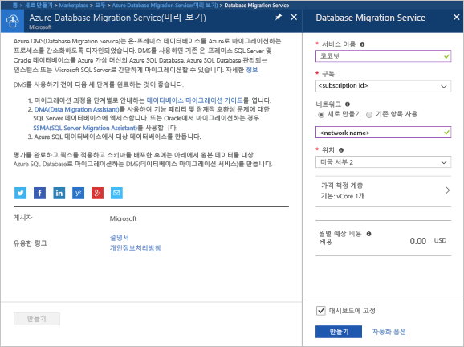
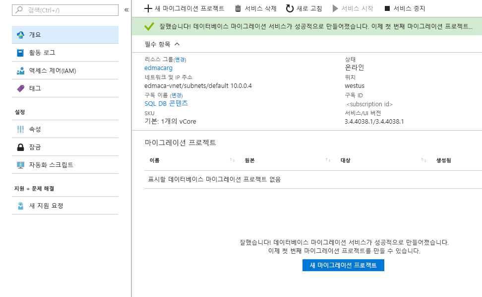

# Azure Portal을 사용하여 Azure Database Migration Service 인스턴스를 만듭니다.
이 빠른 시작에서는 Azure Portal을 사용하여 Azure Database Migration Service의 인스턴스를 만듭니다.  서비스를 만든 후에는 이 서비스를 사용하여 SQL Server 온-프레미스에서 Azure SQL Database로 데이터를 마이그레이션할 수 있습니다.

Azure 구독이 아직 없는 경우 시작하기 전에 [체험](https://azure.microsoft.com/free/) 계정을 만듭니다.

## Azure Portal에 로그인
웹 브라우저를 열고 [Microsoft Azure Portal](https://portal.azure.com/)로 이동한 다음 자격 증명을 입력하여 포털에 로그인합니다.

기본 보기는 서비스 대시보드입니다.

## 리소스 공급자 등록
첫 번째 Database Migration Service 인스턴스를 만들기 전에 Microsoft.DataMigration 리소스 공급자를 등록합니다.

1. Azure Portal에서 **모든 서비스**를 선택한 후 **구독**을 선택합니다.

2. Azure Database Migration Service의 인스턴스를 만들 구독을 선택한 다음 **리소스 공급자**를 선택합니다.

3. 마이그레이션을 검색한 다음 Microsoft.DataMigration의 오른쪽에서 **등록**을 선택합니다.

## 서비스 인스턴스 만들기
1. **+ 리소스 만들기**를 클릭하여 Azure Database Migration Service의 인스턴스를 만듭니다.

2. Marketplace에서 "migration"을 검색하고 **Azure Database Migration Service**를 선택한 다음, **Azure Database Migration Service** 화면에서 **만들기**를 클릭합니다.

3. **Database Migration Service** 화면에서 

    - Azure Database Migration Service 인스턴스를 식별할 수 있도록 기억하기 쉽고 고유한 **서비스 이름**을 선택합니다.
    - 인스턴스를 만들려는 Azure **구독**을 선택합니다.
    - 고유한 이름으로 새 **네트워크**를 만듭니다.
    - 원본 또는 대상 서버에 가장 가까운 **위치**를 선택합니다.
    - **가격 책정 계층**에 대해 기본: 1 vCore를 선택합니다.

    
4. **만들기**를 선택합니다.

잠시 후에 Azure Database Migration Service 인스턴스가 만들어져 사용할 준비가 됩니다. Database Migration Service가 다음 이미지와 같이 표시됩니다.

## 리소스 정리
[Azure 리소스 그룹](../azure-resource-manager/resource-group-overview.md)을 삭제하여 이 빠른 시작에서 만든 리소스를 정리할 수 있습니다.  리소스 그룹을 삭제하려면 만든 Azure Database Migration Service 인스턴스로 이동합니다. **리소스 그룹** 이름을 선택하고 **리소스 그룹 삭제**를 선택합니다.  이 작업은 리소스 그룹의 모든 자산과 그룹 자체를 삭제합니다.

## 다음 단계
> [!div class="nextstepaction"]
> [온-프레미스 SQL Server를 Azure SQL Database로 마이그레이션](tutorial-sql-server-to-azure-sql.md)