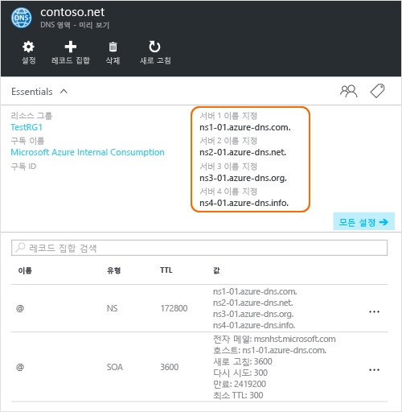

# <a name="delegate-a-domain-to-azure-dns"></a>Azure DNS에 도메인 위임

Azure DNS를 사용하면 DNS 영역을 호스트하고 Azure에서 도메인에 대한 DNS 레코드를 관리할 수 있습니다. 도메인에 대한 DNS 쿼리가 Azure DNS에 도달하려면 부모 도메인에서 Azure DNS로 도메인을 위임해야 합니다. Azure DNS는 도메인 등록 기관이 아닙니다. 이 문서에서는 Azure DNS에 도메인을 위임하는 방법을 알아봅니다.

등록 기관에서 구입한 도메인의 경우 등록 기관에서는 이러한 NS 레코드를 설정하는 옵션을 제공합니다. Azure DNS에서 해당 도메인 이름으로 DNS 영역을 만들기 위해 도메인을 소유할 필요는 없습니다. 그러나 등록 기관에서 Azure DNS로 위임을 설정하려면 도메인을 소유해야 합니다.

예를 들어 'contoso.net' 도메인을 구입하고 Azure DNS에서 이름이 'contoso.net'인 영역을 만든다고 가정합니다. 도메인 소유자로, 등록 기관에서 도메인에 대한 이름 서버 주소(즉, NS 레코드)를 구성하는 옵션을 제공합니다. 등록 기관은 이러한 NS 레코드를 상위 도메인(이 예에서는 '.net')에 저장합니다. 그러면 전 세계의 클라이언트가 'contoso.net'의 DNS 레코드를 확인하려고 할 때 Azure DNS 영역의 도메인으로 보낼 수 있습니다.

## <a name="create-a-dns-zone"></a>DNS 영역 만들기

1. Azure 포털에 로그인합니다.
1. 허브 메뉴에서 **새로 만들기 > 네트워킹 >**을 차례로 클릭한 다음 **DNS 영역**을 클릭하여 **DNS 영역 만들기** 페이지를 엽니다.

    

1. **DNS 영역 만들기** 페이지에서 다음 값을 입력한 다음 **만들기**를 클릭합니다.

   | **설정** | **값** | **세부 정보** |
   |---|---|---|
   |**Name**|contoso.net|DNS 영역의 이름|
   |**구독**|[구독 이름]|응용 프로그램 게이트웨이를 만들 구독을 선택합니다.|
   |**리소스 그룹**|**새로 만들기:** contosoRG|리소스 그룹을 만듭니다. 리소스 그룹 이름은 선택한 구독 내에서 고유해야 합니다. 리소스 그룹에 대해 자세히 알아보려면 [Resource Manager](../azure-resource-manager/resource-group-overview.md?toc=%2fazure%2fdns%2ftoc.json#resource-groups) 개요 문서를 참조하세요.|
   |**위치**:|미국 서부||

> [!NOTE]
> 리소스 그룹은 리소스 그룹의 위치를 나타내며 DNS 영역에 영향을 미치지 않습니다. DNS 영역 위치는 항상 "전역"이며 표시되지 않습니다.

## <a name="retrieve-name-servers"></a>이름 서버 검색

DNS 영역을 Azure DNS에 위임하려면 먼저 해당 영역에 대한 이름 서버 이름을 알아야 합니다. Azure DNS는 영역이 만들어질 때마다 풀에서 이름 서버를 할당합니다.

1. DNS 영역을 만든 후 Azure Portal의 **즐겨찾기** 창에서 **모든 리소스**를 클릭합니다. **모든 리소스** 페이지에서 **contoso.net** DNS 영역을 클릭합니다. 선택한 구독에 이미 여러 개의 리소스가 있는 경우 [이름을 기준으로 필터링...]에 **contoso.net**을 입력합니다. 응용 프로그램 게이트웨이에 간편하게 액세스할 수 있는 상자입니다. 

1. DNS 영역 페이지에서 이름 서버를 검색합니다. 이 예제에서는 'contoso.com' 영역에 이름 서버 'ns1-01.azure-dns.com', 'ns2-01.azure-dns.net', 'ns3-01.azure-dns.org', 'ns4-01.azure-dns.info'가 할당되었습니다.

 

Azure DNS는 할당된 이름 서버를 포함하는 영역에 권한이 있는 NS 레코드를 자동으로 만듭니다.  Azure PowerShell 또는 Azure CLI를 통해 이름 서버 이름을 확인하려면 이러한 레코드만 검색하면 됩니다.

또한 다음 예제에서는 PowerShell 및 Azure CLI를 사용하여 Azure DNS에서 영역의 이름 서버를 검색하는 단계를 제공합니다.

### <a name="powershell"></a>PowerShell

```powershell
# The record name "@" is used to refer to records at the top of the zone.
$zone = Get-AzureRmDnsZone -Name contoso.net -ResourceGroupName contosoRG
Get-AzureRmDnsRecordSet -Name "@" -RecordType NS -Zone $zone
```

다음 예제는 응답입니다.

```
Name              : @
ZoneName          : contoso.net
ResourceGroupName : contosorg
Ttl               : 172800
Etag              : 03bff8f1-9c60-4a9b-ad9d-ac97366ee4d5
RecordType        : NS
Records           : {ns1-07.azure-dns.com., ns2-07.azure-dns.net., ns3-07.azure-dns.org.,
                    ns4-07.azure-dns.info.}
Metadata          :
```

### <a name="azure-cli"></a>Azure CLI

```azurecli
az network dns record-set list --resource-group contosoRG --zone-name contoso.net --type NS --name @
```

다음 예제는 응답입니다.

```json
{
  "etag": "03bff8f1-9c60-4a9b-ad9d-ac97366ee4d5",
  "id": "/subscriptions/00000000-0000-0000-0000-000000000000/resourceGroups/contosoRG/providers/Microsoft.Network/dnszones/contoso.net/NS/@",
  "metadata": null,
  "name": "@",
  "nsRecords": [
    {
      "nsdname": "ns1-07.azure-dns.com."
    },
    {
      "nsdname": "ns2-07.azure-dns.net."
    },
    {
      "nsdname": "ns3-07.azure-dns.org."
    },
    {
      "nsdname": "ns4-07.azure-dns.info."
    }
  ],
  "resourceGroup": "contosoRG",
  "ttl": 172800,
  "type": "Microsoft.Network/dnszones/NS"
}
```

## <a name="delegate-the-domain"></a>도메인 위임

DNS 영역을 만들었고 이름 서버를 확보했으니, 이제 Azure DNS 이름 서버를 사용하여 부모 도메인을 업데이트해야 합니다. 각 등록 기관에는 도메인에 대한 이름 서버 레코드를 변경하는 자체 DNS 관리 도구가 있습니다. 등록 기관의 DNS 관리 페이지에서 NS 레코드를 편집하고 NS 레코드를 Azure DNS에서 만든 레코드로 바꿉니다.

Azure DNS에 도메인을 위임하는 경우 Azure DNS에서 제공하는 이름 서버 이름을 사용해야 합니다. 도메인 이름에 상관 없이 4개의 이름 서버 이름을 모두 사용하는 것이 좋습니다. 도메인 위임에는 같은 최상위 도메인을 도메인으로 사용하는 이름 서버 이름이 필요하지 않습니다.

이러한 IP 주소는 나중에 변경될 수 있으므로 Azure DNS 이름 서버 IP 주소를 가리키는 데 '글루 레코드'를 사용하지 않습니다. 고유한 영역에서 이름 서버 이름을 사용하는 위임('베니티 이름 서버'라고도 함)은 현재 Azure DNS에서 지원되지 않습니다.

## <a name="verify-name-resolution-is-working"></a>이름 확인이 작동하는지 확인

위임을 완료한 후 'nslookup'과 같은 도구로 영역에 대한 SOA 레코드(영역을 만들 때 자동으로 생성됨)를 쿼리하여 이름 확인이 작동하는지 확인할 수 있습니다.

위임이 올바르게 설정된 경우 Azure DNS 이름 서버를 지정할 필요가 없습니다. 일반적인 DNS 확인 프로세스는 자동으로 이름 서버를 자동으로 찾습니다.

```
nslookup -type=SOA contoso.com
```

다음은 이전 명령의 응답 예제입니다.

```
Server: ns1-04.azure-dns.com
Address: 208.76.47.4

contoso.com
primary name server = ns1-04.azure-dns.com
responsible mail addr = msnhst.microsoft.com
serial = 1
refresh = 900 (15 mins)
retry = 300 (5 mins)
expire = 604800 (7 days)
default TTL = 300 (5 mins)
```

## <a name="delegate-sub-domains-in-azure-dns"></a>Azure DNS에서 하위 도메인 위임

별도의 자식 영역을 설정하려는 경우 Azure DNS에 하위 도메인을 위임할 수 있습니다. 예를 들어 Azure DNS에서 'contoso.net'을 설정하고 위임한 후 별도의 자식 영역 'partners.contoso.net'을 설정하려 한다고 가정하겠습니다.

1. Azure DNS에서 자식 영역 'partners.contoso.net'을 만듭니다.
2. Azure DNS에서 자식 영역을 호스팅하는 이름 서버를 가져오려면 자식 영역에서 신뢰할 수 있는 NS 레코드를 조회합니다.
3. 자식 영역을 가리키는 부모 영역에 NS 레코드를 구성하여 자식 영역을 위임합니다.

### <a name="create-a-dns-zone"></a>DNS 영역 만들기

1. Azure 포털에 로그인합니다.
1. 허브 메뉴에서 **새로 만들기 > 네트워킹 >**을 차례로 클릭한 다음 **DNS 영역**을 클릭하여 [DNS 영역 만들기] 페이지를 엽니다.

    

1. **DNS 영역 만들기** 페이지에서 다음 값을 입력한 다음 **만들기**를 클릭합니다.

   | **설정** | **값** | **세부 정보** |
   |---|---|---|
   |**Name**|partners.contoso.net|DNS 영역의 이름|
   |**구독**|[구독 이름]|응용 프로그램 게이트웨이를 만들 구독을 선택합니다.|
   |**리소스 그룹**|**기존 리소스 그룹 사용:** contosoRG|리소스 그룹을 만듭니다. 리소스 그룹 이름은 선택한 구독 내에서 고유해야 합니다. 리소스 그룹에 대해 자세히 알아보려면 [Resource Manager](../azure-resource-manager/resource-group-overview.md?toc=%2fazure%2fdns%2ftoc.json#resource-groups) 개요 문서를 참조하세요.|
   |**위치**:|미국 서부||

> [!NOTE]
> 리소스 그룹은 리소스 그룹의 위치를 나타내며 DNS 영역에 영향을 미치지 않습니다. DNS 영역 위치는 항상 "전역"이며 표시되지 않습니다.

### <a name="retrieve-name-servers"></a>이름 서버 검색

1. DNS 영역을 만든 후 Azure Portal의 **즐겨찾기** 창에서 **모든 리소스**를 클릭합니다. **모든 리소스** 페이지에서 **partners.contoso.net** DNS 영역을 클릭합니다. 선택한 구독에 이미 여러 개의 리소스가 있는 경우 [이름을 기준으로 필터링...]에 **partners.contoso.net**을 입력합니다. DNS 영역에 간편하게 액세스할 수 있는 상자입니다.

1. DNS 영역 페이지에서 이름 서버를 검색합니다. 이 예제에서는 'contoso.com' 영역에 이름 서버 'ns1-01.azure-dns.com', 'ns2-01.azure-dns.net', 'ns3-01.azure-dns.org', 'ns4-01.azure-dns.info'가 할당되었습니다.

 

Azure DNS는 할당된 이름 서버를 포함하는 영역에 권한이 있는 NS 레코드를 자동으로 만듭니다.  Azure PowerShell 또는 Azure CLI를 통해 이름 서버 이름을 확인하려면 이러한 레코드만 검색하면 됩니다.

### <a name="create-name-server-record-in-parent-zone"></a>부모 영역에 이름 서버 레코드 만들기

1. Azure Portal에서 **contoso.net** DNS 영역으로 이동합니다.
1. **+ 레코드 집합**을 클릭합니다.
1. **레코드 집합 추가** 페이지에서 다음 값을 입력한 다음 **확인**을 클릭합니다.

   | **설정** | **값** | **세부 정보** |
   |---|---|---|
   |**Name**|파트너|자식 DNS 영역의 이름|
   |**형식**|NS|이름 서버 레코드에 NS를 사용합니다.|
   |**TTL**|1|Time to Live입니다.|
   |**TTL 단위**|시간|Time to Live를 시간 단위로 설정합니다.|
   |**이름 서버**|{partners.contoso.net 영역의 이름 서버}|partners.contoso.net 영역의 이름 서버 4개를 모두 입력합니다. |

   


### <a name="delegating-sub-domains-in-azure-dns-with-other-tools"></a>다른 도구를 사용하여 Azure DNS에서 하위 도메인 위임

다음 예에서는 PowerShell 및 CLI를 사용하여 Azure DNS에서 하위 도메인을 위임하는 단계를 제공합니다.

#### <a name="powershell"></a>PowerShell

다음 PowerShell 예는 작동 방식을 보여줍니다. Azure Portal 또는 크로스 플랫폼 Azure CLI를 통해 동일한 단계를 실행할 수 있습니다.

```powershell
# Create the parent and child zones. These can be in same resource group or different resource groups as Azure DNS is a global service.
$parent = New-AzureRmDnsZone -Name contoso.net -ResourceGroupName contosoRG
$child = New-AzureRmDnsZone -Name partners.contoso.net -ResourceGroupName contosoRG

# Retrieve the authoritative NS records from the child zone as shown in the next example. This contains the name servers assigned to the child zone.
$child_ns_recordset = Get-AzureRmDnsRecordSet -Zone $child -Name "@" -RecordType NS

# Create the corresponding NS record set in the parent zone to complete the delegation. The record set name in the parent zone matches the child zone name, in this case "partners".
$parent_ns_recordset = New-AzureRmDnsRecordSet -Zone $parent -Name "partners" -RecordType NS -Ttl 3600
$parent_ns_recordset.Records = $child_ns_recordset.Records
Set-AzureRmDnsRecordSet -RecordSet $parent_ns_recordset
```

`nslookup`을 통해 자식 영역의 SOA 레코드를 조회하여 모든 항목이 올바르게 설정되었는지 확인할 수 있습니다.

```
nslookup -type=SOA partners.contoso.com
```

```
Server: ns1-08.azure-dns.com
Address: 208.76.47.8

partners.contoso.com
    primary name server = ns1-08.azure-dns.com
    responsible mail addr = msnhst.microsoft.com
    serial = 1
    refresh = 900 (15 mins)
    retry = 300 (5 mins)
    expire = 604800 (7 days)
    default TTL = 300 (5 mins)
```

#### <a name="azure-cli"></a>Azure CLI

```azurecli
#!/bin/bash

# Create the parent and child zones. These can be in same resource group or different resource groups as Azure DNS is a global service.
az network dns zone create -g contosoRG -n contoso.net
az network dns zone create -g contosoRG -n partners.contoso.net
```

출력에서 `partners.contoso.net` 영역의 이름 서버를 검색합니다.

```
{
  "etag": "00000003-0000-0000-418f-250de2b2d201",
  "id": "/subscriptions/00000000-0000-0000-0000-000000000000/resourceGroups/contosorg/providers/Microsoft.Network/dnszones/partners.contoso.net",
  "location": "global",
  "maxNumberOfRecordSets": 5000,
  "name": "partners.contoso.net",
  "nameServers": [
    "ns1-09.azure-dns.com.",
    "ns2-09.azure-dns.net.",
    "ns3-09.azure-dns.org.",
    "ns4-09.azure-dns.info."
  ],
  "numberOfRecordSets": 2,
  "resourceGroup": "contosorg",
  "tags": {},
  "type": "Microsoft.Network/dnszones"
}
```

각 이름 서버의 레코드 집합 및 NS 레코드를 만듭니다.

```azurecli
#!/bin/bash

# Create the record set
az network dns record-set ns create --resource-group contosorg --zone-name contoso.net --name partners

# Create a ns record for each name server.
az network dns record-set ns add-record --resource-group contosorg --zone-name contoso.net --record-set-name partners --nsdname ns1-09.azure-dns.com.
az network dns record-set ns add-record --resource-group contosorg --zone-name contoso.net --record-set-name partners --nsdname ns2-09.azure-dns.net.
az network dns record-set ns add-record --resource-group contosorg --zone-name contoso.net --record-set-name partners --nsdname ns3-09.azure-dns.org.
az network dns record-set ns add-record --resource-group contosorg --zone-name contoso.net --record-set-name partners --nsdname ns4-09.azure-dns.info.
```

## <a name="delete-all-resources"></a>모든 리소스 삭제

이 문서에서 만든 모든 리소스를 삭제하려면 다음 단계를 완료합니다.

1. Azure Portal의 **즐겨찾기** 창에서 **모든 리소스**를 클릭합니다. [모든 리소스] 페이지에서 **contosorg** 리소스 그룹을 클릭합니다. 선택한 구독에 이미 여러 개의 리소스가 있는 경우 **이름을 기준으로 필터링...**에 **contosorg**를 입력합니다. 리소스 그룹에 간편하게 액세스할 수 있는 상자입니다.
1. **contosorg** 페이지에서 **삭제** 단추를 클릭합니다.
1. 포털에서 삭제할 리소스 그룹의 이름을 입력하여 리소스 그룹 삭제를 확인해야 합니다. 리소스 그룹 이름으로 *contosorg*를 입력한 다음 **삭제**를 클릭합니다. 리소스 그룹을 삭제하면 리소스 그룹 내 모든 리소스가 삭제되므로 리소스 그룹을 삭제하기 전에 리소스 그룹의 콘텐츠를 항상 확인해야 합니다. 포털에서 리소스 그룹 내 포함된 모든 리소스가 삭제된 다음 리소스 그룹 자체가 삭제됩니다. 이 프로세스는 몇 분 정도 걸립니다.

## <a name="next-steps"></a>다음 단계

[DNS 영역 관리](dns-operations-dnszones.md)

[DNS 레코드 관리](dns-operations-recordsets.md)
