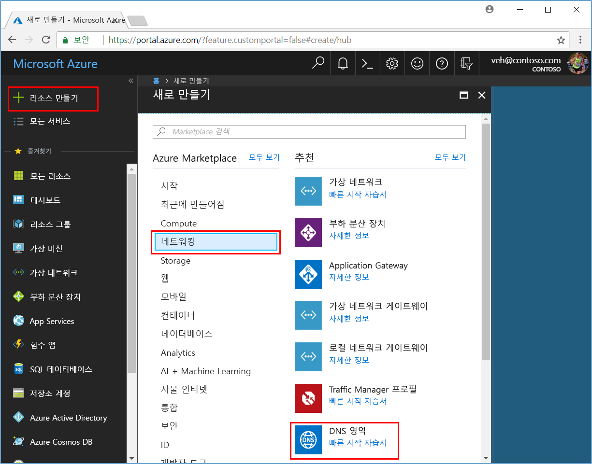
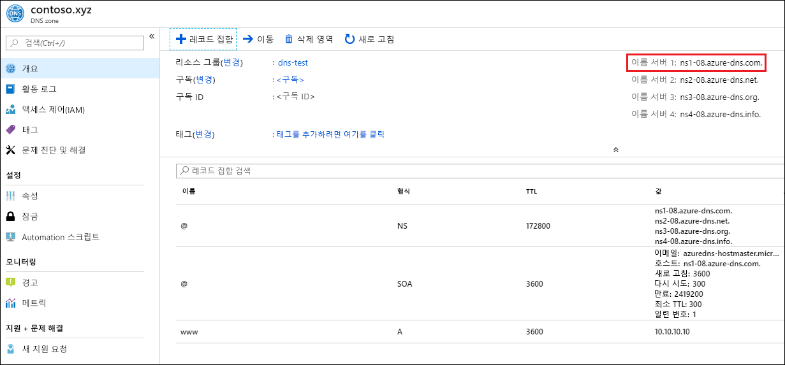

# <a name="quickstart-configure-azure-dns-for-name-resolution-using-the-azure-portal"></a>빠른 시작: Azure Portal을 사용하여 이름 확인을 위한 Azure DNS 구성

 공용 도메인에서 호스트 이름을 확인하기 위한 Azure DNS를 구성할 수 있습니다. 예를 들어 도메인 이름 등록 기관에서 contoso.com 도메인 이름을 구입한 경우 Azure DNS가 contoso.com 도메인을 호스트하고 www.contoso.com을 웹 서버 또는 웹앱의 IP 주소로 확인하도록 구성할 수 있습니다.

이 빠른 시작에서는 테스트 도메인을 만들고, IP 주소 10.10.10.10으로 확인되는 'www'라는 주소 레코드를 만듭니다.

이 빠른 시작에 사용되는 모든 이름 및 IP 주소는 예제일 뿐이며, 실제 시나리오를 반영하지 않습니다. 그러나 해당하는 경우 실제 시나리오도 설명되어 있습니다.

<!---
You can also perform these steps using [Azure PowerShell](dns-getstarted-powershell.md) or the cross-platform [Azure CLI](dns-getstarted-cli.md).
--->

DNS 영역은 특정 도메인에 대한 DNS 항목을 포함하는 데 사용됩니다. Azure DNS에서 도메인 호스팅을 시작하려면 해당 도메인 이름의 DNS 영역을 만들어야 합니다. 그러면 이 DNS 영역 안에 도메인의 각 DNS 항목(또는 레코드)이 생성됩니다. 다음은 이 작업을 수행하는 단계입니다.

Azure 구독이 아직 없는 경우 시작하기 전에 [체험 계정](https://azure.microsoft.com/free/?WT.mc_id=A261C142F)을 만듭니다.

## <a name="create-a-dns-zone"></a>DNS 영역 만들기

1. Azure 포털에 로그인합니다.
2. 왼쪽 위에서 **+ 리소스 만들기**, **네트워킹**, **DNS 영역**을 차례로 클릭하여 **DNS 영역 만들기** 페이지를 엽니다.

    

4. **DNS 영역 만들기** 페이지에서 다음 값을 입력한 다음 **만들기**를 클릭합니다.


   | **설정** | **값** | **세부 정보** |
   |---|---|---|
   |**Name**|contoso.xyz|이 예제의 DNS 영역 이름입니다. 아직 Azure DNS에서 구성되지 않은 한, 이 빠른 시작에서 원하는 값을 사용할 수 있습니다. 실제 값은 도메인 이름 등록 기관에서 구입한 도메인입니다.|
   |**구독**|[구독 이름]|DNS 영역을 만들 구독을 선택합니다.|
   |**리소스 그룹**|**새로 만들기:** dns-test|리소스 그룹을 만듭니다. 리소스 그룹 이름은 선택한 구독 내에서 고유해야 합니다. |
   |**위치**:|미국 동부||

영역을 만드는 데 몇 분이 걸릴 수 있습니다.

## <a name="create-a-dns-record"></a>DNS 레코드 만들기

새 주소 레코드('A' 레코드)를 만듭니다. 'A' 레코드는 호스트 이름을 IP v4 주소로 확인하는 데 사용됩니다.

1. Azure Portal의 **즐겨찾기** 창에서 **모든 리소스**를 클릭합니다. [모든 리소스] 페이지에서 **contoso.com** DNS 영역을 클릭합니다. 선택한 구독에 이미 여러 개의 리소스가 있는 경우 **이름을 기준으로 필터링...** 에 **contoso.xyz**를 입력합니다. DNS 영역에 간편하게 액세스할 수 있는 상자입니다.

1. **DNS 영역** 페이지의 위쪽에서 **+ 레코드 집합**을 클릭하여 **레코드 집합 추가** 페이지를 엽니다.

1. **레코드 집합 추가** 페이지에서 다음 값을 입력하고 **확인**을 클릭합니다. 이 예에서는 'A' 레코드를 만듭니다.

   |**설정** | **값** | **세부 정보** |
   |---|---|---|
   |**Name**|www|레코드 이름. IP 주소를 확인하려는 호스트에 사용할 이름입니다.|
   |**형식**|A| 만들 DNS 레코드의 형식입니다. 'A' 레코드가 가장 일반적이지만, 메일 서버(MX), IP v6 주소(AAAA) 등에 대한 다른 레코드 형식도 있습니다. |
   |**TTL**|1|DNS 요청의 Time-to-Live입니다. DNS 서버 및 클라이언트가 응답을 캐시할 수 있는 시간을 지정합니다.|
   |**TTL 단위**|hours|TTL 값에 대한 시간 측정입니다.|
   |**IP 주소**|10.10.10.10| 이 값은 'A' 레코드가 확인하는 IP 주소입니다. 이 빠른 시작의 테스트 값일 뿐입니다. 실제 사례에서는 웹 서버의 공용 IP 주소를 입력해야 합니다.|


이 빠른 시작에서는 실제 도메인 이름을 구매하지 않으므로 도메인 이름 등록자를 사용하여 Azure DNS를 이름 서버로 구성할 필요가 없습니다. 하지만 실제 시나리오에서는 인터넷 상의 누구든지 호스트 이름을 확인하여 웹 서버 또는 앱에 연결할 수 있게 설정할 것입니다. 실제 시나리오에 대한 자세한 내용은 [Azure DNS에 도메인 위임](dns-delegate-domain-azure-dns.md)을 참조하세요.


## <a name="test-the-name-resolution"></a>이름 확인 테스트

테스트 영역을 만들고 그 안에 테스트 'A' 레코드가 생겼으니, nslookup이라는 도구를 사용하여 이름 확인을 테스트할 수 있습니다. 

1. 먼저 nslookup에 사용할 Azure DNS 이름 서버를 기록해 두어야 합니다. 

   영역의 이름 서버는 DNS 영역 **개요** 페이지에 나열됩니다. 이름 서버 중 하나의 이름을 복사합니다.

   

2. 이제 명령 프롬프트를 열고 다음 명령을 실행합니다.

   ```
   nslookup <host name> <name server>
   
   For example:

   nslookup www.contoso.xyz ns1-08.azure-dns.com
   ```

다음 스크린샷과 비슷한 내용이 표시됩니다.


이름 확인이 올바르게 작동하는지 확인합니다. www.contoso.xyz는 여러분이 구성한 것처럼 10.10.10.10으로 확인됩니다.

## <a name="clean-up-resources"></a>리소스 정리

더 이상 필요 없어서 **dns-test** 리소스 그룹을 삭제하면 이 빠른 시작에서 만든 리소스가 삭제됩니다. 이렇게 하려면 **dns-test** 리소스 그룹을 클릭한 다음, **리소스 그룹 삭제**를 클릭합니다.


## <a name="next-steps"></a>다음 단계

> [!div class="nextstepaction"]
> [사용자 지정 도메인에서 웹앱에 대한 DNS 레코드 만들기](./dns-web-sites-custom-domain.md)