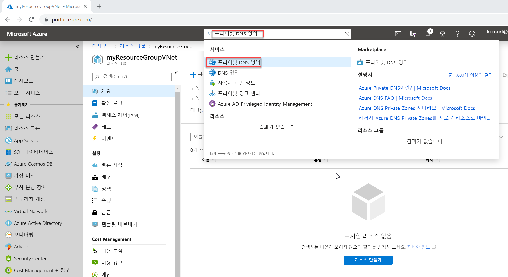

# <a name="quickstart-create-an-azure-private-dns-zone-using-the-azure-portal"></a>빠른 시작: Azure Portal을 사용하여 Azure 프라이빗 DNS 영역 만들기

이 빠른 시작에서는 Azure Portal을 사용하여 첫 번째 프라이빗 DNS 영역 및 레코드를 만드는 단계를 설명합니다.

DNS 영역은 특정 도메인에 대한 DNS 레코드를 호스트하는 데 사용됩니다. Azure DNS에서 도메인 호스팅을 시작하려면 해당 도메인 이름의 DNS 영역을 만들어야 합니다. 그러면 이 DNS 영역 안에 도메인의 각 DNS 레코드가 생성됩니다. 가상 네트워크에 프라이빗 DNS 영역에 게시하려면 영역 내에서 레코드를 확인하도록 허용된 가상 네트워크 목록을 지정합니다.  이것을 *연결된* 가상 네트워크라고 합니다. 자동 등록이 활성화된 경우 Azure DNS는 가상 머신이 생성되고, 해당 IP 주소를 변경하거나 삭제될 때마다 영역 레코드를 업데이트합니다.

이 빠른 시작에서 다음을 수행하는 방법을 알아봅니다.

> [!div class="checklist"]
> * 프라이빗 DNS 영역 만들기
> * 가상 네트워크 만들기
> * 가상 네트워크 연결
> * 테스트 가상 머신 만들기
> * 추가 DNS 레코드 만들기
> * 프라이빗 영역 테스트

Azure 구독이 아직 없는 경우 시작하기 전에 [무료 계정](https://azure.microsoft.com/free/?WT.mc_id=A261C142F)을 만듭니다.

원하는 경우 [Azure PowerShell](private-dns-getstarted-powershell.md) 또는 [Azure CLI](private-dns-getstarted-cli.md)를 사용하여 이 빠른 시작을 완료할 수 있습니다.

## <a name="create-a-private-dns-zone"></a>프라이빗 DNS 영역 만들기

다음 예에서는 **MyAzureResourceGroup**이라는 리소스 그룹에 **private.contoso.com**이라는 DNS 영역을 만듭니다.

DNS 영역에는 도메인에 대한 DNS 항목이 포함됩니다. Azure DNS에서 도메인 호스팅을 시작하려면 해당 도메인 이름의 DNS 영역을 만듭니다.



1. 포털 검색 창의 검색 텍스트 상자에 **프라이빗 DNS 영역**을 입력하고 **Enter** 키를 누릅니다.
1. **프라이빗 DNS 영역**을 선택합니다.
2. **프라이빗 DNS 영역 만들기**를 선택합니다.

1. **프라이빗 DNS 영역 만들기** 페이지에서 다음 값을 입력하거나 선택합니다.

   - **리소스 그룹**: **새로 만들기**를 선택하고, *MyAzureResourceGroup*을 입력하고, **확인**을 선택합니다. 리소스 그룹 이름은 Azure 구독 내에서 고유해야 합니다. 
   -  **이름**: 이 예에서는 *private.contoso.com*을 입력합니다.
1. **리소스 그룹 위치**에 **미국 중서부**를 선택합니다.

1. **검토 + 만들기**를 선택합니다.

1. **만들기**를 선택합니다.

영역을 만드는 데 몇 분이 걸릴 수 있습니다.

## <a name="create-a-virtual-network"></a>가상 네트워크 만들기

1. 포털 페이지 상단 왼쪽에서 **리소스 만들기**를 선택하고 **네트워킹**을 선택한 다음 **가상 네트워크**를 선택합니다.
2. **이름**에는 **myAzureVNet**을 입력합니다.
3. **리소스 그룹**으로 **MyAzureResourceGroup**을 선택합니다.
4. **위치**에 **미국 중서부**를 선택합니다.
5. 다른 기본값을 적용하고 **만들기**를 선택합니다.

## <a name="link-the-virtual-network"></a>가상 네트워크 연결

가상 네트워크에 프라이빗 DNS 영역을 연결하기 위해 가상 네트워크 링크를 만듭니다.


1. **MyAzureResourceGroup** 리소스 그룹을 열고 **private.contoso.com** 프라이빗 영역을 선택합니다.
2. 왼쪽 창에서 **가상 네트워크 링크**를 선택합니다.
3. **추가**를 선택합니다.
4. **링크 이름**에 **myLink**를 입력합니다.
5. **가상 네트워크**에서 **myAzureVNet**을 선택합니다.
6. **자동 등록 사용** 확인란을 선택합니다.
7. **확인**을 선택합니다.

## <a name="create-the-test-virtual-machines"></a>테스트 가상 머신 만들기

이제 프라이빗 DNS 영역을 테스트할 수 있도록 두 대의 가상 머신을 만듭니다.

1. 포털 페이지 상단 왼쪽에서 **리소스 만들기**를 선택한 다음 **Windows Server 2016 Datacenter**를 선택합니다.
1. 리소스 그룹으로 **MyAzureResourceGroup**을 선택합니다.
1. **myVM01**(가상 머신의 이름)을 입력합니다.
1. **지역**은 **미국 중서부**를 선택합니다.
1. 관리자 사용자 이름에 **azureadmin**을 입력합니다.
2. 암호로 **Azure12345678**을 입력하고 암호를 확인합니다.

5. **공용 인바운드 포트**에서 **선택한 포트 허용**을 선택한 다음 **인바운드 포트 선택**에 대해 **RDP(3389)** 를 선택합니다.
10. 페이지에서 다른 기본값으로 적용하고 **다음: 디스크 >** 를 클릭합니다.
11. **디스크** 페이지에서 기본값을 적용하고 **다음: 네트워킹 >** 을 클릭합니다.
1. 가상 네트워크로 **myAzureVNet**이 선택되었는지 확인합니다.
1. 페이지에서 다른 기본값으로 적용하고 **다음: 관리 >** 를 클릭합니다.
2. **부트 진단**의 경우 **해제**를 선택하고 다른 기본값을 적용한 다음 **검토 + 만들기**를 선택합니다.
1. 설정을 검토한 다음 **만들기**를 클릭합니다.

이 단계를 반복하여 이름이 **myVM02**인 다른 가상 머신을 만듭니다.

두 가상 머신을 모두 완료하는 데 몇 분 정도 걸립니다.

## <a name="create-an-additional-dns-record"></a>추가 DNS 레코드 만들기

 다음 예제에서는 리소스 그룹 **MyAzureResourceGroup**의 DNS 영역 **private.contoso.com**에 상대적 이름 **db**가 포함된 레코드를 만듭니다. 레코드 집합의 정규화된 이름은 **db.private.contoso.com**입니다. 레코드 종류는 "A"이고 IP 주소는 **myVM01**입니다.

1. **MyAzureResourceGroup** 리소스 그룹을 열고 **private.contoso.com** 프라이빗 영역을 선택합니다.
2. **+ 레코드 집합**을 선택합니다.
3. **이름**에 **db**를 입력합니다.
4. **IP 주소**에는 **myVM01**의 IP 주소를 입력합니다. 이 주소는 가상 머신이 시작될 때 자동으로 등록되어야 합니다.
5. **확인**을 선택합니다.

## <a name="test-the-private-zone"></a>프라이빗 영역 테스트

이제 **private.contoso.com** 프라이빗 영역에 대한 이름 확인을 테스트할 수 있습니다.

### <a name="configure-vms-to-allow-inbound-icmp"></a>인바운드 ICMP를 허용하도록 VM 구성

이름 확인을 테스트하는 ping 명령을 사용할 수 있습니다. 따라서 인바운드 ICMP 패킷을 허용하도록 두 대의 가상 머신에서 방화벽을 구성합니다.

1. myVM01에 연결하고, 관리자 권한으로 Windows PowerShell 창을 엽니다.
2. 다음 명령 실행:

   ```powershell
   New-NetFirewallRule –DisplayName “Allow ICMPv4-In” –Protocol ICMPv4
   ```

myVM02에서 반복

### <a name="ping-the-vms-by-name"></a>이름별로 VM ping

1. myVM02 Windows PowerShell 명령 프롬프트에서 자동으로 등록된 호스트 이름을 사용하여 myVM01을 ping합니다.
   ```
   ping myVM01.private.contoso.com
   ```
   다음과 유사한 결과가 표시됩니다.
   ```
   PS C:\> ping myvm01.private.contoso.com

   Pinging myvm01.private.contoso.com [10.2.0.4] with 32 bytes of data:
   Reply from 10.2.0.4: bytes=32 time<1ms TTL=128
   Reply from 10.2.0.4: bytes=32 time=1ms TTL=128
   Reply from 10.2.0.4: bytes=32 time<1ms TTL=128
   Reply from 10.2.0.4: bytes=32 time<1ms TTL=128

   Ping statistics for 10.2.0.4:
       Packets: Sent = 4, Received = 4, Lost = 0 (0% loss),
   Approximate round trip times in milli-seconds:
       Minimum = 0ms, Maximum = 1ms, Average = 0ms
   PS C:\>
   ```
2. 이제 이전에 만든 **db** 이름을 ping합니다.
   ```
   ping db.private.contoso.com
   ```
   다음과 유사한 결과가 표시됩니다.
   ```
   PS C:\> ping db.private.contoso.com

   Pinging db.private.contoso.com [10.2.0.4] with 32 bytes of data:
   Reply from 10.2.0.4: bytes=32 time<1ms TTL=128
   Reply from 10.2.0.4: bytes=32 time<1ms TTL=128
   Reply from 10.2.0.4: bytes=32 time<1ms TTL=128
   Reply from 10.2.0.4: bytes=32 time<1ms TTL=128

   Ping statistics for 10.2.0.4:
       Packets: Sent = 4, Received = 4, Lost = 0 (0% loss),
   Approximate round trip times in milli-seconds:
       Minimum = 0ms, Maximum = 0ms, Average = 0ms
   PS C:\>
   ```

## <a name="delete-all-resources"></a>모든 리소스 삭제

더 이상 필요 없다면 **MyAzureResourceGroup** 리소스 그룹을 삭제하여 이 빠른 시작에서 만든 리소스를 삭제합니다.


## <a name="next-steps"></a>다음 단계

> [!div class="nextstepaction"]
> [Azure DNS Private Zones 시나리오](private-dns-scenarios.md)

