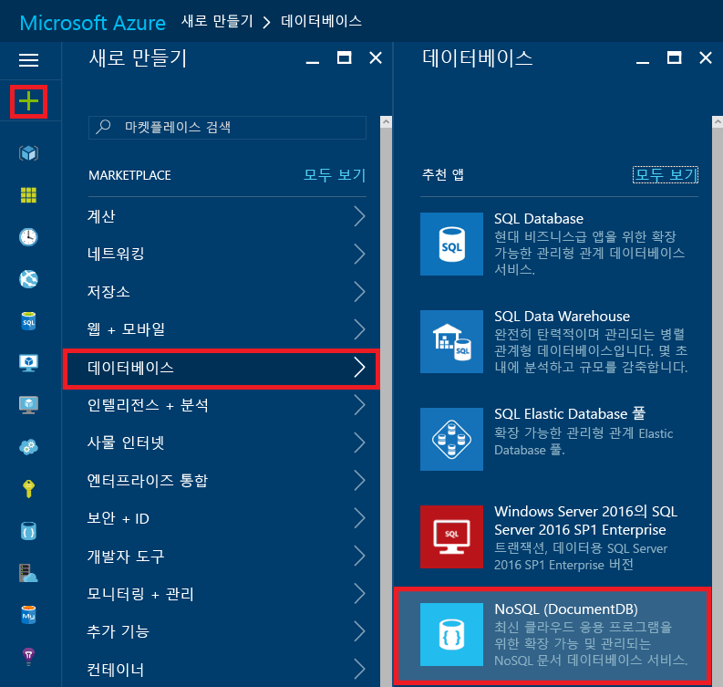
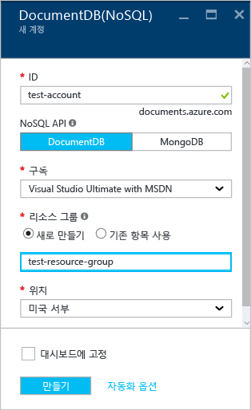
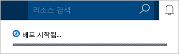
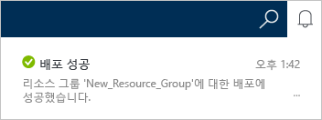
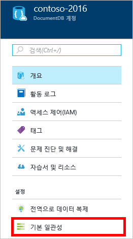
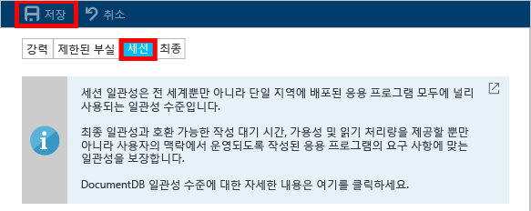

# Azure Portal을 사용하여 DocumentDB NoSQL 계정을 만드는 방법
> [!div class="op_single_selector"]
> * [쉬운 테이블](documentdb-create-account.md)
> * [Azure CLI 및 Azure Resource Manager](documentdb-automation-resource-manager-cli.md)
> 
> 

Microsoft Azure DocumentDB를 사용하여 데이터베이스를 빌드하려면 다음을 수행해야 합니다.

* Azure 계정이 있어야 합니다. 없는 경우 [무료 Azure 계정](https://azure.microsoft.com/free) 을 얻을 수 있습니다. 
* DocumentDB 계정을 만듭니다.  

Azure Portal, Azure Resource Manager 템플릿 또는 Azure 명령줄 인터페이스(CLI)를 사용하여 DocumentDB 계정을 만들 수 있습니다. 이 문서에서는 Azure Portal에서 DocumentDB 계정을 만드는 방법을 보여 줍니다. Azure Resource Manager 또는 Azure CLI를 사용하여 계정을 만들려면 [DocumentDB 데이터베이스 계정 만들기 자동화](documentdb-automation-resource-manager-cli.md)를 참조하세요.

DocumentDB를 처음 사용하세요? Scott Hanselman이 제작한 [이](https://azure.microsoft.com/documentation/videos/create-documentdb-on-azure/) 4분 분량의 동영상을 보고 온라인 포털에서 가장 일반적인 작업을 완료하는 방법을 확인하세요.

1. [Azure 포털](https://portal.azure.com/)에 로그인합니다.
2. 표시줄에서 **새로 만들기**를 클릭하고 **데이터베이스**를 클릭한 다음 **DocumentDB(NoSQL)**를 클릭합니다. 
   
     
3. **새 계정** 블레이드에서 DocumentDB 계정에 대해 원하는 구성을 지정합니다.
   
    
   
   * **ID** 상자에 DocumentDB 계정을 식별하기 위한 이름을 입력합니다.  **ID**의 유효성이 검사되면 **ID** 상자에 녹색 확인 표시가 나타납니다. **ID** 값은 URI 내의 호스트 이름이 됩니다. **ID** 는 소문자, 숫자 및 '-' 문자만 포함할 수 있으며, 3자에서 50자 사이여야 합니다. 선택한 끝점 이름에 *documents.azure.com* 이 추가되고, 그 결과가 DocumentDB 계정 끝점이 됩니다.
   * **NoSQL API** 상자에서 사용할 프로그래밍 모델을 선택합니다.
     
     * **DocumentDB**: DocumentDB API는 HTTP [REST](https://msdn.microsoft.com/library/azure/dn781481.aspx)뿐만 아니라 .NET, Java, Node.js, Python 및 JavaScript [SDK](documentdb-sdk-dotnet.md)를 통해서도 사용할 수 있으며 모든 DocumentDB 기능에 대한 프로그램 방식의 액세스를 제공합니다. 
     * **MongoDB**: 또한 DocumentDB는 **MongoDB** API에 대한 [프로토콜 수준 지원](documentdb-protocol-mongodb.md)을 제공합니다. MongoDB API 옵션을 선택하면 기존 MongoDB SDK 및 [도구](documentdb-mongodb-mongochef.md) 를 사용하여 DocumentDB와 통신할 수 있습니다. [코드를 변경할 필요 없이](documentdb-connect-mongodb-account.md) 기존 MongoDB 앱을 [이동](documentdb-import-data.md)하여 DocumentDB를 사용하고 서비스로 완전히 관리되는 데이터베이스를 규모, 전역 복제 및 다른 기능의 제한 없이 이용할 수 있습니다.
   * **구독**에서 DocumentDB 계정에 사용할 Azure 구독을 선택합니다. 계정에 구독이 하나뿐인 경우 해당 계정이 기본적으로 선택됩니다.
   * **리소스 그룹**에서 DocumentDB 계정에 대한 리소스 그룹을 선택하거나 만듭니다.  기본적으로 새 리소스 그룹이 생성됩니다. 자세한 내용은 [Azure Portal을 사용하여 Azure 리소스 관리](../azure-portal/resource-group-portal.md)를 참조하세요.
   * **위치** 를 사용하여 DocumentDB 계정을 호스트하는 지리적 위치를 지정합니다. 
4. 새 DocumentDB 계정 옵션을 구성했으면 **만들기**를 클릭합니다. 배포의 상태를 확인하려면 알림 허브를 선택합니다.  
   
     
   
   
5. DocumentDB 계정이 생성되면 기본 설정으로 사용할 수 있습니다. DocumentDB 계정의 기본 일관성은 **세션**으로 설정됩니다.  리소스 메뉴에서 **기본 일관성** 을 클릭하여 기본 일관성을 조정할 수 있습니다. DocumentDB에서 제공되는 일관성 수준에 대한 자세한 내용은 [DocumentDB의 일관성 수준](documentdb-consistency-levels.md)을 참조하세요.
   
     
   
     

[방법: DocumentDB 계정 만들기]: #Howto
[다음 단계]: #NextSteps
[documentdb-manage]:../articles/documentdb/documentdb-manage.md

## 다음 단계
이제 DocumentDB 계정을 만들었으므로 다음 단계에서는 DocumentDB 컬렉션 및 데이터베이스를 만들게 됩니다. 

다음 중 하나를 사용하여 새 컬렉션 및 데이터베이스를 만들 수 있습니다.

* [Azure Portal을 사용하여 DocumentDB 컬렉션 만들기](documentdb-create-collection.md)에 설명된 Azure Portal
* 샘플 데이터인 [.NET](documentdb-get-started.md), [.NET MVC](documentdb-dotnet-application.md), [Java](documentdb-java-application.md), [Node.js](documentdb-nodejs-application.md) 또는 [Python](documentdb-python-application.md)을 포함하는 통합형 자습서
* GitHub에서 사용할 수 있는 [.NET](documentdb-dotnet-samples.md#database-examples), [Node.js](documentdb-nodejs-samples.md#database-examples) 또는 [Python](documentdb-python-samples.md#database-examples) 샘플 코드
* [.NET](documentdb-sdk-dotnet.md), [Node.js](documentdb-sdk-node.md), [Java](documentdb-sdk-java.md), [Python](documentdb-sdk-python.md) 및 [REST](https://msdn.microsoft.com/library/azure/mt489072.aspx) SDK

데이터베이스 및 컬렉션을 만든 후에 컬렉션에 [문서를 추가](documentdb-view-json-document-explorer.md)해야 합니다.

컬렉션에 문서가 포함된 후 [DocumentDB SQL](documentdb-sql-query.md)을 사용하여 문서에 대한 [쿼리를 실행](documentdb-sql-query.md#executing-queries)할 수 있습니다. 포털의 [Query Explorer](documentdb-query-collections-query-explorer.md), [REST API](https://msdn.microsoft.com/library/azure/dn781481.aspx) 또는 [SDK](documentdb-sdk-dotnet.md) 중 하나를 사용하여 쿼리를 실행할 수 있습니다.

### 자세한 정보
DocumentDB에 대해 자세히 알아보려면 다음 리소스를 참조하세요.

* [DocumentDB 학습 경로](https://azure.microsoft.com/documentation/learning-paths/documentdb/)
* [DocumentDB 계층적 리소스 모델 및 개념](documentdb-resources.md)

<!--HONumber=Nov16_HO2-->

