<properties 
	pageTitle="DocumentDB용 ASP.NET MVC 자습서: 웹 응용 프로그램 개발 | Microsoft Azure" 
	description="DocumentDB를 사용하여 MVC 웹 응용 프로그램을 만드는 ASP.NET MVC 자습서 JSON을 저장하고 Azure 웹 사이트 - ASP NET MVC 단계별 자습서에서 호스팅하는 todo 앱에서 데이터에 액세스합니다." 
	keywords="ASP.NET MVC 자습서, 웹 응용 프로그램 개발, MVC 웹 응용 프로그램, ASP NET MVC 단계별 자습서"
	services="documentdb" 
	documentationCenter=".net" 
	authors="aliuy" 
	manager="jhubbard" 
	editor="cgronlun"/>

<tags 
	ms.service="documentdb" 
	ms.workload="data-services" 
	ms.tgt_pltfrm="na" 
	ms.devlang="dotnet" 
	ms.topic="hero-article" 
	ms.date="04/18/2016" 
	ms.author="andrl"/>

#ASP.NET MVC 자습서: DocumentDB를 통한 웹 응용 프로그램 개발

> [AZURE.SELECTOR]
- [.NET](documentdb-dotnet-application.md)
- [Node.JS](documentdb-nodejs-application.md)
- [Java](documentdb-java-application.md)
- [Python](documentdb-python-application.md) 

Azure DocumentDB를 효율적으로 활용하여 JSON 문서를 저장 및 쿼리할 수 있는 방법을 강조하기 위해 이 문서에서는 Azure DocumentDB를 사용하여 todo 앱을 빌드하는 방법을 보여 주는 종합적인 연습을 제공합니다. 작업은 Azure DocumentDB에 JSON 문서로 저장됩니다.

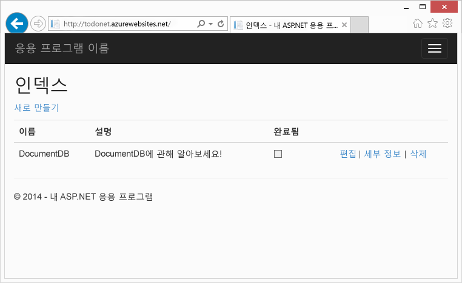

이 연습에서는 Azure에서 제공하는 DocumentDB 서비스를 사용하여 Azure에서 호스트되는 ASP.NET MVC 웹 응용 프로그램의 데이터를 저장하고 액세스하는 방법을 보여 줍니다.

> [AZURE.TIP] 이 자습서에서는 이전에 ASP.NET MVC 및 Azure 웹 사이트를 사용해 본 경험이 있다고 가정합니다. ASP.NET 또는 [필수 도구](#_Toc395637760)를 처음 사용하는 경우 [GitHub][]에서 전체 샘플 프로젝트를 다운로드하고 이 샘플의 지침을 따르는 것이 좋습니다. 프로젝트를 빌드하고 나면 이 문서를 검토하여 프로젝트의 컨텍스트에서 코드를 이해할 수 있습니다.

## 이 데이터베이스 자습서의 필수 조건

이 문서의 지침을 따르기 전에 다음이 있는지 확인해야 합니다.

- 활성 Azure 계정. 계정이 없는 경우 몇 분 만에 무료 평가판 계정을 만들 수 있습니다. 자세한 내용은 [Azure 무료 체험](https://azure.microsoft.com/pricing/free-trial/)을 참조하세요.
- [Visual Studio 2013](http://www.visualstudio.com/) 업데이트 4 이상
- Azure SDK for .NET 버전 2.5.1 이상([Microsoft 웹 플랫폼 설치 관리자][]를 통해 사용 가능)

이 문서의 모든 스크린샷은 Visual Studio 2013 업데이트 4 및 Azure SDK for .NET 버전 2.5.1을 사용하여 생성되었습니다. 시스템이 다른 버전으로 구성된 경우 화면과 옵션이 일부 달라질 수 있지만 위의 필수 구성 요소를 충족하면 솔루션을 사용할 수 있습니다.

## 1단계: DocumentDB 데이터베이스 계정 만들기

먼저 DocumentDB 계정을 만듭니다. 계정이 이미 있는 경우를 [새 ASP.NET MVC 응용 프로그램 만들기](#_Toc395637762)로 건너뛸 수 있습니다.

[AZURE.INCLUDE [documentdb-create-dbaccount](../../includes/documentdb-create-dbaccount.md)]

[AZURE.INCLUDE [documentdb-keys](../../includes/documentdb-keys.md)]

  이제 새 ASP.NET MVC 응용 프로그램을 처음부터 만드는 방법을 살펴보겠습니다.

## 2단계: 새 ASP.NET MVC 응용 프로그램 만들기

계정을 만들었으므로 이제 새 ASP.NET 프로젝트를 만들어 보겠습니다.

1. Visual Studio의 **파일** 메뉴에서 **새로 만들기**를 가리킨 후 **프로젝트**를 클릭합니다.

   	**새 프로젝트** 대화 상자가 나타납니다.
2. **프로젝트 형식** 창에서 **템플릿**, **Visual C#**, **웹**을 확장한 후 **ASP.NET 웹 응용 프로그램**을 선택합니다.

  	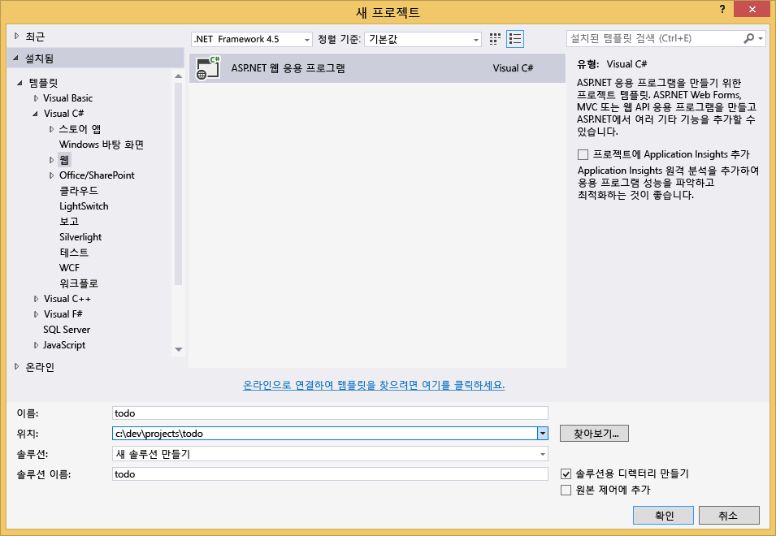

3. **이름** 상자에 프로젝트의 이름을 입력합니다. 이 자습서에서는 "todo"라는 이름을 사용합니다. 다른 이름을 사용하도록 선택한 경우에는 이 자습서에서 todo 네임스페이스를 지칭할 때마다 지정한 응용 프로그램 이름을 사용하도록 제공된 코드 샘플을 조정해야 합니다.

4. **찾아보기**를 클릭하여 프로젝트를 만들 폴더로 이동한 후 **확인**을 클릭합니다.

  	**새 ASP.NET 프로젝트** 대화 상자가 나타납니다.

  	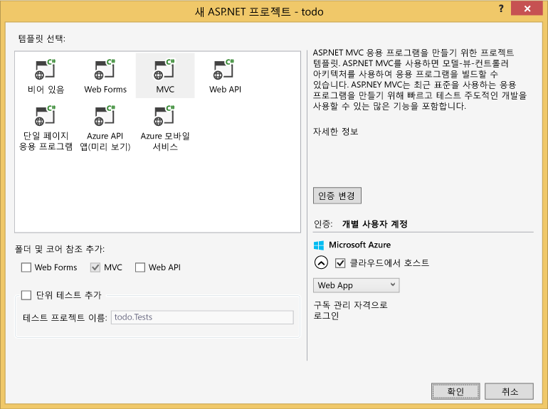

5. 템플릿 창에서 **MVC**를 선택합니다.

6. Azure에서 응용 프로그램을 호스트하려는 경우 오른쪽 아래에서 **클라우드의 호스트**를 선택하여 Azure에서 응용 프로그램이 호스트되도록 합니다. 클라우드에 호스트하도록 선택하고 Azure 웹 사이트에서 호스트되는 응용 프로그램을 실행하도록 선택했습니다. 이 옵션을 선택하면 Azure 웹 사이트가 미리 프로비전되며 최종 응용 프로그램을 훨씬 쉽게 배포할 수 있습니다. 다른 곳에 호스트하거나 Azure에서 구성하지 않으려면 **클라우드의 호스트** 옵션을 선택 취소합니다.

7. **확인**을 클릭하면 Visual Studio에서 빈 ASP.NET MVC 템플릿을 스캐폴딩합니다.

8. 클라우드에 호스트를 선택하면 Azure 계정에 로그인하고 새 웹 사이트에 대한 값을 입력하라는 추가 화면이 하나 이상 표시됩니다. 모든 추가 값을 지정하고 계속합니다.

  	여기서 Azure SQL 데이터베이스 서버를 사용하지 않기 때문에 "데이터베이스 서버"를 선택하지 않았고 나중에 Azure 포털에서 새 Azure DocumentDB 계정을 만들 예정입니다.

	**앱 서비스 계획** 및 **리소스 그룹** 선택에 대한 자세한 내용은 [Azure 앱 서비스 계획의 포괄 개요](../app-service/azure-web-sites-web-hosting-plans-in-depth-overview.md)를 참조하세요.

  	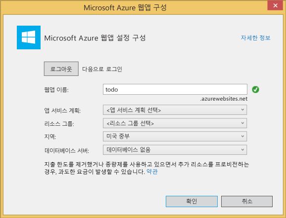

9. Visual Studio에서 상용구 MVC 응용 프로그램을 만들면 로컬에서 실행할 수 있는 빈 ASP.NET 응용 프로그램을 갖게 됩니다.

	모두 ASP.NET "Hello World" 응용 프로그램을 본 적이 있다고 확신하므로 프로젝트 로컬 실행은 건너뛰겠습니다. 바로 이 프로젝트에 DocumentDB를 추가하고 응용 프로그램을 작성하겠습니다.

## 3단계: MVC 웹 응용 프로그램 프로젝트에 DocumentDB 추가

이 솔루션에 필요한 대부분의 ASP.NET MVC 배관을 만들었으므로 이제 이 자습서의 실제 목적으로 돌아가 MVC 웹 응용 프로그램에 Azure DocumentDB를 추가해 보겠습니다.

1. DocumentDB .NET SDK는 패키지되어 NuGet 패키지로 배포되며, Visual Studio에서 NuGet 패키지를 다운로드하려면 **솔루션 탐색기**에서 프로젝트를 마우스 오른쪽 단추로 클릭한 후 **NuGet 패키지 관리**를 클릭하여 Visual Studio에서 NuGet 패키지 관리자를 사용합니다.

  	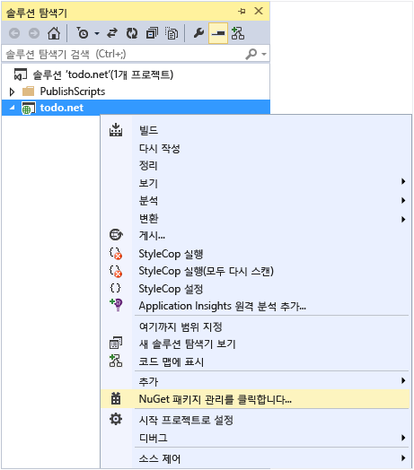

	**NuGet 패키지 관리** 대화 상자가 나타납니다.

2. **온라인 검색** 상자에 ***Azure DocumentDB***를 입력합니다.
	
	결과에서 **Microsoft Azure DocumentDB Client Library** 패키지를 설치합니다. 그러면 DocumentDB 패키지 및 모든 종속성(예: Newtonsoft.Json)이 다운로드되어 설치됩니다.

  	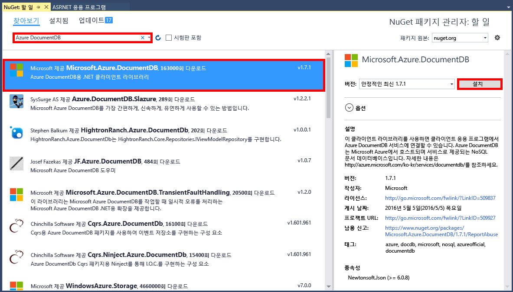

  	또는 패키지 관리자 콘솔을 사용하여 패키지를 설치할 수 있습니다. 이렇게 하려면 **도구** 메뉴에서 **NuGet 패키지 관리자**, **패키지 관리자 콘솔**을 차례로 클릭합니다. 프롬프트에 다음을 입력합니다.

		Install-Package Microsoft.Azure.DocumentDB

3. 패키지가 설치되고 나면 Visual Studio 솔루션은 Microsoft.Azure.Documents.Client 및 Newtonsoft.Json이라는 두 개의 새 참조가 추가된 상태로 다음과 유사합니다.

  	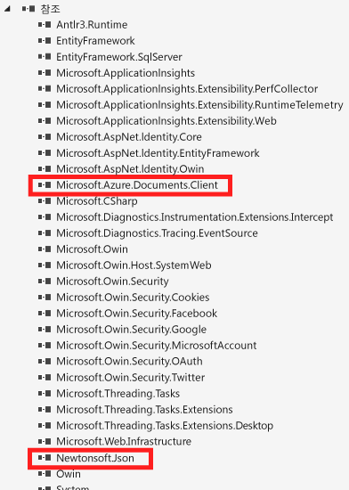

##4단계: ASP.NET MVC 응용 프로그램 설정
 
이제 이 MVC 응용 프로그램에 모델, 뷰 및 컨트롤러를 추가합니다.

- [모델 추가](#_Toc395637764).
- [컨트롤러 추가](#_Toc395637765).
- [뷰 추가](#_Toc395637766).

### JSON 데이터 모델 추가

먼저 MVC의 **M**인 모델을 만들겠습니다.

1. **솔루션 탐색기**에서 **Models** 폴더를 마우스 오른쪽 단추로 클릭한 후 **추가**, **클래스**를 차례로 클릭합니다.

  	**새 항목 추가** 대화 상자가 나타납니다.

2. 새 클래스의 이름을 **Item.cs**로 지정하고 **추가**를 클릭합니다.

3. 이 새 **Item.cs** 파일에서 마지막 *using 문* 뒤에 다음을 추가합니다.
		
		using Newtonsoft.Json;
	
4. 이제 이 코드를
		
		public class Item
		{
		}

	다음 코드로 바꿉니다.

		public class Item
		{
			[JsonProperty(PropertyName = "id")]
			public string Id { get; set; }
			 
			[JsonProperty(PropertyName = "name")]
			public string Name { get; set; }

			[JsonProperty(PropertyName = "description")]
			public string Description { get; set; }

			[JsonProperty(PropertyName = "isComplete")]
			public bool Completed { get; set; }
		}

	DocumentDB의 모든 데이터가 네트워크를 통해 전달되고 JSON으로 저장됩니다. JSON.NET에서 개체를 직렬화/역직렬화하는 방식을 제어하기 위해 방금 만든 **Item** 클래스에서 본 것처럼 **JsonProperty** 특성을 사용할 수 있습니다. 꼭 **필요한** 과정은 아니지만 저는 제가 만든 속성이 JSON camelCase 명명 규칙을 따르는지 확인하고 싶습니다.
	
	JSON의 경우 속성 이름 형식을 제어할 수 있을 뿐만 아니라, **Description** 속성에 대해 했던 것처럼 .NET 속성의 이름을 완전히 다시 지정할 수 있습니다.
	

### 컨트롤러 추가

**M** 작업을 마쳤으므로 이제 MVC의 **C**인 컨트롤러 클래스를 만듭니다.

1. **솔루션 탐색기**에서 **Controllers** 폴더를 마우스 오른쪽 단추로 클릭한 후 **추가**, **컨트롤러**를 차례로 클릭합니다.

	**스캐폴드 추가** 대화 상자가 나타납니다.

2. **MVC 5 컨트롤러 - 비어 있음**을 선택한 후 **추가**를 클릭합니다.

	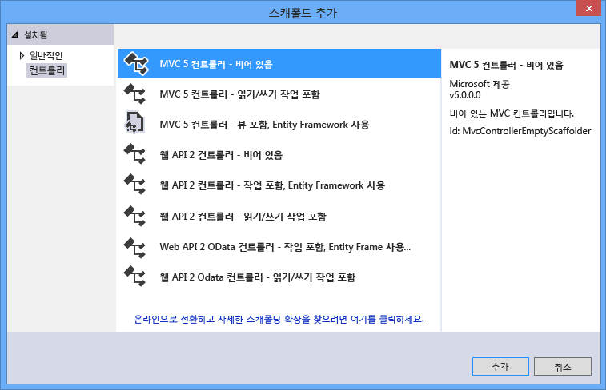

3. 새 컨트롤러의 이름을 **ItemController**로 지정합니다.

	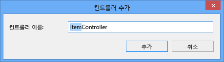

	파일을 만들고 나면 Visual Studio 솔루션은 **솔루션 탐색기**에 새 ItemController.cs 파일이 있는 상태로 다음과 유사합니다. 이전에 만든 새 Item.cs 파일도 표시됩니다.

	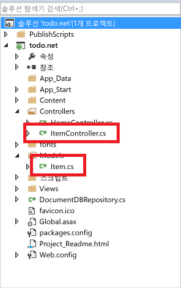

	나중에 돌아올 것이므로 ItemController.cs를 닫아도 됩니다.

### 뷰 추가

이제 MVC의 **V**인 뷰를 만듭니다.

- [항목 인덱스 뷰 추가](#AddItemIndexView).
- [새 항목 뷰 추가](#AddNewIndexView).
- [항목 편집 뷰 추가](#_Toc395888515).

#### 항목 인덱스 뷰 추가

1. **솔루션 탐색기**에서 **Views** 폴더를 확장하고 앞에서 **ItemController**를 추가할 때 Visual Studio에서 만들어진 빈 **Item** 폴더를 마우스 오른쪽 단추로 클릭하고 **추가**, **뷰**를 차례로 클릭합니다.

	

2. **뷰 추가** 대화 상자에서 다음을 수행합니다.
	- **뷰 이름** 상자에 ***Index***를 입력합니다.
	- **템플릿** 상자에서 ***List***를 선택합니다.
	- **모델 클래스** 상자에서 ***Item (todo.Models)***을 선택합니다.
	- **데이터 컨텍스트 클래스** 상자를 빈 상태로 둡니다. 
	- 레이아웃 페이지 상자에 ***~/Views/Shared/\_Layout.cshtml***을 입력합니다.
	
	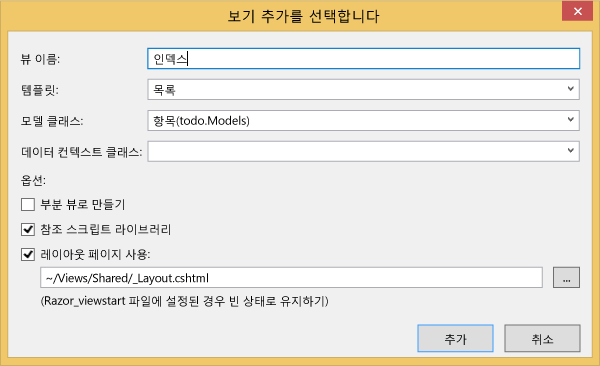

3. 이러한 값이 모두 설정된 후 **추가**를 클릭하면 Visual Studio에서 새 템플릿 뷰를 만듭니다. 완료되면 만들어진 cshtml 파일이 열립니다. 나중에 돌아올 것이므로 Visual Studio에서 해당 파일을 닫아도 됩니다.

#### 새 항목 뷰 추가

**항목 인덱스** 뷰를 만든 방법과 유사하게 이제 새 **항목을** 만들기 위한 새 뷰를 만듭니다.

1. **솔루션 탐색기**에서 **Item** 폴더를 마우스 오른쪽 단추로 클릭한 후 **추가**, **뷰**를 차례로 클릭합니다.

2. **뷰 추가** 대화 상자에서 다음을 수행합니다.
	- **뷰 이름** 상자에 ***Create***를 입력합니다.
	- **템플릿** 상자에서 ***Create***를 선택합니다.
	- **모델 클래스** 상자에서 ***Item (todo.Models)***을 선택합니다.
	- **데이터 컨텍스트 클래스** 상자를 빈 상태로 둡니다.
	- 레이아웃 페이지 상자에 ***~/Views/Shared/\_Layout.cshtml***을 입력합니다.
	- **추가**를 클릭합니다.

#### 항목 편집 뷰 추가

마지막으로, 이전과 동일한 방식으로 **항목**을 편집하기 위한 최종 뷰를 추가합니다.

1. **솔루션 탐색기**에서 **Item** 폴더를 마우스 오른쪽 단추로 클릭한 후 **추가**, **뷰**를 차례로 클릭합니다.

2. **뷰 추가** 대화 상자에서 다음을 수행합니다.
	- **뷰 이름** 상자에 ***Edit***를 입력합니다.
	- **템플릿** 상자에서 ***Edit***를 선택합니다.
	- **모델 클래스** 상자에서 ***Item (todo.Models)***을 선택합니다.
	- **데이터 컨텍스트 클래스** 상자를 빈 상태로 둡니다. 
	- 레이아웃 페이지 상자에 ***~/Views/Shared/\_Layout.cshtml***을 입력합니다.
	- **추가**를 클릭합니다.

이 작업이 완료되면 나중에 이러한 뷰로 돌아올 것이므로 Visual Studio에서 모든 cshtml 문서를 닫습니다.

## 5단계: DocumentDB 연결

표준 MVC를 처리했으므로 이제 DocumentDB에 대한 코드를 추가해 보겠습니다.

이 섹션에서는 다음을 처리하기 위한 코드를 추가합니다.

- [완료되지 않은 항목 나열](#_Toc395637770).
- [항목 추가](#_Toc395637771).
- [항목 편집](#_Toc395637772).

### MVC 웹 응용 프로그램에서 완료되지 않은 항목 나열

먼저 DocumentDB에 연결하고 이를 사용할 모든 논리가 포함된 클래스를 추가합니다. 이 자습서에서는 이 모든 논리를 DocumentDBRepository라는 리포지토리 클래스로 캡슐화합니다.

1. **솔루션 탐색기**에서 프로젝트를 마우스 오른쪽 단추로 클릭하고 **추가**, **클래스**를 차례로 클릭합니다. 새 클래스의 이름을 **DocumentDBRepository**로 지정하고 **추가**를 클릭합니다.
 
2. 새로 만든 **DocumentDBRepository** 클래스에서 *네임스페이스* 선언 위에 다음 *using 문*을 추가합니다.
		
		using Microsoft.Azure.Documents; 
		using Microsoft.Azure.Documents.Client; 
		using Microsoft.Azure.Documents.Linq; 
		using System.Configuration;
		using System.Linq.Expressions;
		using System.Threading.Tasks;

	이제 이 코드를

		public class DocumentDBRepository
		{
		}

	다음 코드로 바꿉니다.

		public static class DocumentDBRepository<T> where T : class
		{
			private static readonly string DatabaseId = ConfigurationManager.AppSettings["database"];
			private static readonly string CollectionId = ConfigurationManager.AppSettings["collection"];
			private static DocumentClient client;
	
			public static void Initialize()
			{
				client = new DocumentClient(new Uri(ConfigurationManager.AppSettings["endpoint"]), ConfigurationManager.AppSettings["authKey"]);
				CreateDatabaseIfNotExistsAsync().Wait();
				CreateCollectionIfNotExistsAsync().Wait();
			}
	
			private static async Task CreateDatabaseIfNotExistsAsync()
			{
				try
				{
					await client.ReadDatabaseAsync(UriFactory.CreateDatabaseUri(DatabaseId));
				}
				catch (DocumentClientException e)
				{
					if (e.StatusCode == System.Net.HttpStatusCode.NotFound)
					{
						await client.CreateDatabaseAsync(new Database { Id = DatabaseId });
					}
					else
					{
						throw;
					}
				}
			}
	
			private static async Task CreateCollectionIfNotExistsAsync()
			{
				try
				{
					await client.ReadDocumentCollectionAsync(UriFactory.CreateDocumentCollectionUri(DatabaseId, CollectionId));
				}
				catch (DocumentClientException e)
				{
					if (e.StatusCode == System.Net.HttpStatusCode.NotFound)
					{
						await client.CreateDocumentCollectionAsync(
							UriFactory.CreateDatabaseUri(DatabaseId),
							new DocumentCollection { Id = CollectionId },
							new RequestOptions { OfferThroughput = 1000 });
					}
					else
					{
						throw;
					}
				}
			}
		}

	> [AZURE.TIP] 새 DocumentCollection을 만들 때 새 컬렉션의 성능 수준을 지정할 수 있는 OfferType의 선택적 RequestOptions 매개 변수를 제공할 수 있습니다. 이 매개 변수를 전달하지 않으면 경우 기본 제공 유형이 사용됩니다. DocumentDB 제공 유형에 대한 자세한 내용은 [DocumentDB 성능 수준](documentdb-performance-levels.md)을 참조하세요.

3. 구성에서 일부 값을 읽어올 것이므로 응용 프로그램의 **Web.config** 파일을 열고 `<AppSettings>` 섹션 아래에 다음 줄을 추가합니다.
	
		<add key="endpoint" value="enter the URI from the Keys blade of the Azure Portal"/>
		<add key="authKey" value="enter the PRIMARY KEY, or the SECONDARY KEY, from the Keys blade of the Azure  Portal"/>
		<add key="database" value="ToDoList"/>
		<add key="collection" value="Items"/>
	
4. 이제 Azure 포털의 키 블레이드를 사용하여 *endpoint* 및 *authKey* 값을 업데이트합니다. 키 블레이드의 **URI**를 endpoint 설정 값으로 사용하고 키 블레이드의 **기본 키** 또는 **보조 키**를 authKey 설정 값으로 사용합니다.

	DocumentDB 리포지토리의 연결을 완료했으므로 이제 응용 프로그램 논리를 추가해 보겠습니다.

5. todo 모음 응용 프로그램으로 가장 먼저 할 일은 완료되지 않은 항목을 표시하는 것입니다. 다음 코드 조각을 **DocumentDBRepository** 클래스 내의 아무 곳에나 복사하여 붙여 넣습니다.

		public static async Task<IEnumerable<T>> GetItemsAsync(Expression<Func<T, bool>> predicate)
		{
			IDocumentQuery<T> query = client.CreateDocumentQuery<T>(
				UriFactory.CreateDocumentCollectionUri(DatabaseId, CollectionId))
				.Where(predicate)
				.AsDocumentQuery();

			List<T> results = new List<T>();
			while (query.HasMoreResults)
			{
				results.AddRange(await query.ExecuteNextAsync<T>());
			}

			return results;
		}

6. 앞에서 추가한 **ItemController**를 열고 네임스페이스 선언 위에 다음 *using 문*을 추가합니다.

		using System.Net;
		using System.Threading.Tasks;
		using todo.Models;

	프로젝트 이름이 "todo"가 아닌 경우 프로젝트 이름을 반영하기 위해 "todo.Models";를 사용하여 업데이트해야 합니다.

	이제 이 코드를

		//GET: Item
		public ActionResult Index()
		{
			return View();
		}

	다음 코드로 바꿉니다.

		[ActionName("Index")]
		public async Task<ActionResult> IndexAsync()
		{
			var items = await DocumentDBRepository<Item>.GetItemsAsync(d => !d.Completed);
			return View(items);
		}
	
이때 오류 없이 솔루션을 작성할 수 있어야 합니다.

지금 응용 프로그램을 실행하면 **HomeController** 및 해당 컨트롤러의 **인덱스** 뷰로 이동합니다. 이것은 시작할 때 선택한 MVC 템플릿 프로젝트에 대한 기본 동작이지만 여기서는 사용하지 않습니다. 이 동작을 변경하기 위해 이 MVC 응용 프로그램의 라우팅을 변경하겠습니다.

***App\_Start\\RouteConfig.cs***를 열고 "defaults:"로 시작하는 줄을 찾은 후 다음과 같이 변경합니다.

		defaults: new { controller = "Item", action = "Index", id = UrlParameter.Optional }

이 구문은 이제 ASP.NET MVC에 라우팅 동작을 제어하기 위한 URL에 값이 지정되지 않은 경우 **Home** 대신 **Item**을 컨트롤러로 사용하고 사용자 **인덱스**를 뷰로 사용하라고 지시합니다.

이제 응용 프로그램을 실행하면 응용 프로그램에서 리포지토리 클래스를 호출하는 **ItemController**를 호출하며 GetItems 메서드를 사용하여 완료되지 않은 모든 항목을 **Views**\**Item**\**Index** 뷰로 반환합니다.

이 프로젝트를 지금 빌드하여 실행하면 이제 다음과 같이 표시됩니다.

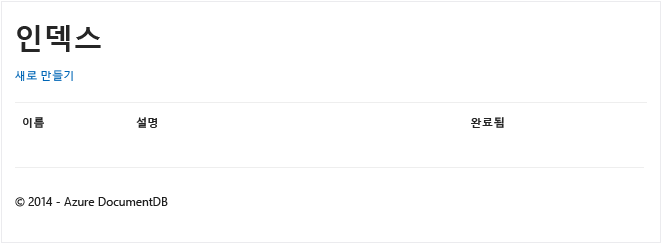

### 항목 추가

빈 그리드 외에 확인할 항목이 있도록 데이터베이스에 일부 항목을 추가하겠습니다.

DocumentDB에 레코드를 저장하기 위해 DocumentDBRepository 및 ItemController에 일부 코드를 추가하겠습니다.

1.  다음 메서드를 **DocumentDBRepository** 클래스에 추가합니다.

		public static async Task<Document> CreateItemAsync(T item)
		{
			return await client.CreateDocumentAsync(UriFactory.CreateDocumentCollectionUri(DatabaseId, CollectionId), item);
		}

	이 메서드는 단순히 전달된 개체를 받아서 DocumentDB에 저장합니다.

2. ItemController.cs 파일을 열고 클래스 내에 다음 코드 조각을 추가합니다. 이를 통해 ASP.NET MVC에서 **Create** 작업을 위해 수행할 작업을 인식할 수 있습니다. 이 경우 앞에서 만든 관련 Create.cshtml 뷰를 렌더링합니다.

		[ActionName("Create")]
		public async Task<ActionResult> CreateAsync()
		{
			return View();
		}

	이제 **만들기** 뷰의 제출을 수락하는 코드를 이 컨트롤러에 더 추가해야 합니다.

2. 이 컨트롤러에 대한 폼 POST의 처리 방법을 ASP.NET MVC에 알리는 다음 코드 블록을 ItemController.cs 클래스에 추가합니다.
	
		[HttpPost]
		[ActionName("Create")]
		[ValidateAntiForgeryToken]
		public async Task<ActionResult> CreateAsync([Bind(Include = "Id,Name,Description,Completed")] Item item)
		{
			if (ModelState.IsValid)
			{
				await DocumentDBRepository<Item>.CreateItemAsync(item);
				return RedirectToAction("Index");
			}

			return View(item);
		}

	이 코드는 DocumentDBRepository를 호출하고 CreateItemAsync 메서드를 사용하여 새로운 todo 항목을 데이터베이스에 유지합니다.
 
	**보안 정보**: **ValidateAntiForgeryToken** 특성은 여기서 교차 사이트 요청 위조 공격으로부터 이 응용 프로그램을 보호하는 데 사용됩니다. 이 특성을 추가하는 것 외에 뷰가 이 위조 방지 토큰과 작동하도록 해야 합니다. 이 주제에 대한 자세한 내용과 이를 올바르게 구현하는 방법의 예는 [교차 사이트 요청 위조 방지(영문)][]를 참조하세요. [GitHub][]에서 제공하는 소스 코드에는 완벽하게 구현되어 있습니다.

	**보안 정보**: 또한 메서드 매개 변수에 **Bind** 특성을 사용하여 과도한 게시 공격으로부터 보호할 수 있습니다. 자세한 내용은 [ASP.NET MVC의 기본 CRUD 작업(영문)][]을 참조하세요.

데이터베이스에 새 항목을 추가하는 데 필요한 코드가 완성되었습니다.

### 항목 편집

마지막으로 수행할 작업은 데이터베이스에서 **항목**을 편집하고 완료로 표시하는 기능입니다. 편집용 뷰는 이미 프로젝트에 추가되었으므로 다시 컨트롤러와 **DocumentDBRepository** 클래스에 일부 코드를 추가하기만 하면 됩니다.

1. **DocumentDBRepository** 클래스에 다음을 추가합니다.

		public static async Task<Document> UpdateItemAsync(string id, T item)
		{
			return await client.ReplaceDocumentAsync(UriFactory.CreateDocumentUri(DatabaseId, CollectionId, id), item);
		}

		public static async Task<T> GetItemAsync(string id)
		{
			try
			{
				Document document = await client.ReadDocumentAsync(UriFactory.CreateDocumentUri(DatabaseId, CollectionId, id));
				return (T)(dynamic)document;
			}
			catch (DocumentClientException e)
			{
				if (e.StatusCode == HttpStatusCode.NotFound)
				{
					return null;
				}
				else
				{
					throw;
				}
			}
		}
	
	이러한 메서드 중 첫 번째 메서드인 **GetItem**은 DocumentDB에서 항목을 가져오며, 이 항목이 다시 **ItemController** 및 **편집** 뷰로 전달됩니다.
	
	방금 추가한 메서드 중 두 번째 메서드는 DocumentDB의 **문서**를 **ItemController**에서 전달된 **문서** 버전으로 바꿉니다.

2. **ItemController** 클래스에 다음을 추가합니다.

		[HttpPost]
		[ActionName("Edit")]
		[ValidateAntiForgeryToken]
		public async Task<ActionResult> EditAsync([Bind(Include = "Id,Name,Description,Completed")] Item item)
		{
			if (ModelState.IsValid)
			{
				await DocumentDBRepository<Item>.UpdateItemAsync(item.Id, item);
				return RedirectToAction("Index");
			}

			return View(item);
		}

		[ActionName("Edit")]
		public async Task<ActionResult> EditAsync(string id)
		{
			if (id == null)
			{
				return new HttpStatusCodeResult(HttpStatusCode.BadRequest);
			}

			Item item = await DocumentDBRepository<Item>.GetItemAsync(id);
			if (item == null)
			{
				return HttpNotFound();
			}

			return View(item);
		}
	
	첫 번째 메서드는 사용자가 **인덱스** 뷰에서 **편집** 링크를 클릭할 때 발생하는 Http Get을 처리합니다. 이 메서드는 DocumentDB에서 [**문서(영문)**](http://msdn.microsoft.com/library/azure/microsoft.azure.documents.document.aspx)를 가져와 **편집** 뷰에 전달합니다.

	그런 다음 **편집** 뷰는 **IndexController**에 Http Post를 수행합니다.
	
	추가한 두 번째 메서드는 데이터베이스에 저장되도록 업데이트된 개체를 DocumentDB에 전달하는 작업을 처리합니다.

응용 프로그램을 실행하는 데 필요한 모든 작업(완료되지 않은 **항목** 나열, 새 **항목** 추가 및 **항목** 편집)이 완료되었습니다.

## 6단계: 로컬에서 응용 프로그램 실행

로컬 컴퓨터에서 응용 프로그램을 테스트하려면 다음을 수행합니다.

1. 디버그 모드에서 응용 프로그램을 빌드하려면 Visual Studio에서 F5 키를 누릅니다. 응용 프로그램이 빌드되고 앞에서 본 것처럼 빈 그리드 페이지가 포함된 상태로 브라우저가 시작되어야 합니다.

	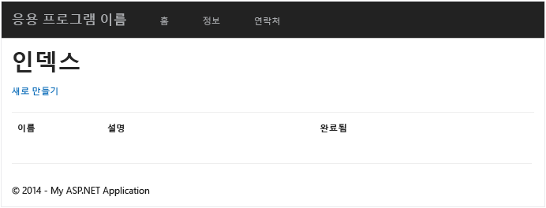

	이때 오류가 발생하면 사용자 코드를 [GitHub][]의 샘플 프로젝트와 비교할 수 있습니다.

2. **새로 만들기** 링크를 클릭하고 **이름** 및 **설명** 필드에 값을 추가합니다. **완료** 확인란을 선택 취소된 상태로 둡니다. 그렇지 않으면 새 **항목**이 완료 상태로 추가되며 초기 목록에 나타나지 않습니다.

	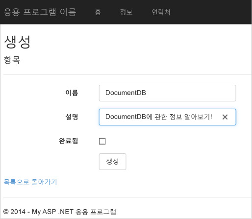

3. **만들기**를 클릭하면 **인덱스** 뷰로 다시 리디렉션되고 **항목**이 목록에 나타납니다.

	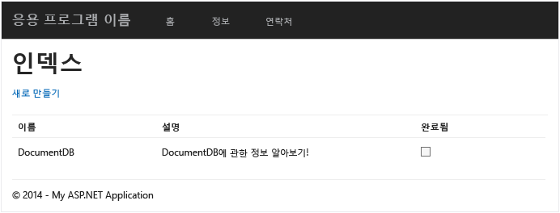

	Todo 목록에 **항목**을 더 추가해도 됩니다.

3. 목록에서 **항목** 옆의 **편집**을 클릭합니다. **편집** 뷰로 이동되며, 여기서 **Completed** 플래그를 비롯한 개체 속성을 업데이트할 수 있습니다. **Complete** 플래그를 표시하고 **저장**을 클릭하면 **항목**이 완료되지 않은 작업 목록에서 제거됩니다.

	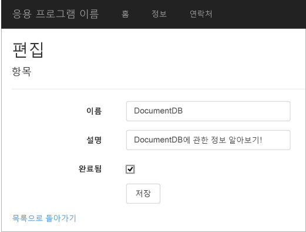

4. 앱을 테스트하고 나면 Ctrl+F5를 눌러 앱 디버깅을 중지합니다. 배포할 준비가 되었습니다!

##7단계: Azure 웹 사이트에 응용 프로그램 배포

이제 전체 응용 프로그램이 DocumentDB와 올바르게 작동하므로 Azure 웹 사이트에 이 웹앱을 배포하겠습니다. 빈 ASP.NET MVC 프로젝트를 만들 때 **클라우드의 호스트**를 선택한 경우 Visual Studio에서 대부분의 작업을 수행하므로 쉽게 배포할 수 있습니다.

1. 이 응용 프로그램을 게시하기 위해 할 일은 **솔루션 탐색기**에서 프로젝트를 마우스 오른쪽 단추로 클릭하고 **게시**를 클릭하는 것뿐입니다.

	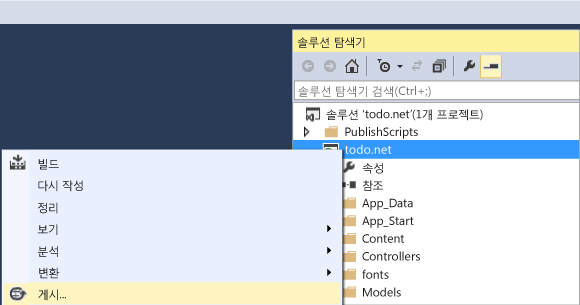

2. 사용자 자격 증명에 따라 모든 항목이 이미 구성되어 있어야 합니다. 실제로 Azure의 표시된 **대상 URL**에 웹 사이트가 이미 만들어져 있으므로 **게시**를 클릭하기만 하면 됩니다.

	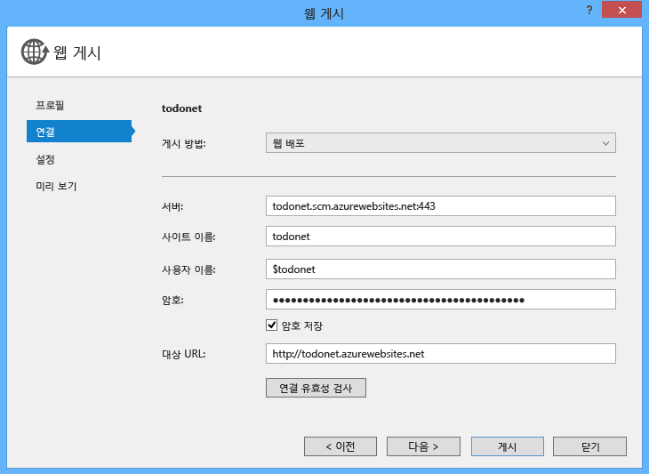

몇 초 후에 Visual Studio에서 웹 응용 프로그램 게시를 완료하고 브라우저를 시작하며, Azure에서 실행되는 작업 내용을 확인할 수 있습니다.

##다음 단계

축하합니다. 지금까지 Azure DocumentDB를 사용하여 첫 ASP.NET MVC 웹 응용 프로그램을 빌드하고 Azure 웹 사이트에 게시했습니다. 이 자습서에 포함되지 않은 세부 정보 및 삭제 기능을 비롯한 전체 응용 프로그램 소스 코드는 [GitHub][]에서 다운로드하거나 복제할 수 있습니다. 따라서 이 내용을 앱에 추가하려는 경우 코드를 끌어와서 이 앱에 추가하면 됩니다.

응용 프로그램에 기능을 더 추가하려면 [DocumentDB .NET 라이브러리](https://msdn.microsoft.com/library/azure/dn948556.aspx)에서 사용 가능한 API를 검토하고 [GitHub][]의 DocumentDB .NET 라이브러리에 자유롭게 기여하세요.

[*]: https://microsoft.sharepoint.com/teams/DocDB/Shared%20Documents/Documentation/Docs.LatestVersions/PicExportError
[Visual Studio Express]: http://www.visualstudio.com/products/visual-studio-express-vs.aspx
[Microsoft 웹 플랫폼 설치 관리자]: http://www.microsoft.com/web/downloads/platform.aspx
[교차 사이트 요청 위조 방지(영문)]: http://go.microsoft.com/fwlink/?LinkID=517254
[ASP.NET MVC의 기본 CRUD 작업(영문)]: http://go.microsoft.com/fwlink/?LinkId=317598
[GitHub]: https://github.com/Azure-Samples/documentdb-net-todo-app

<!---HONumber=AcomDC_0420_2016-->