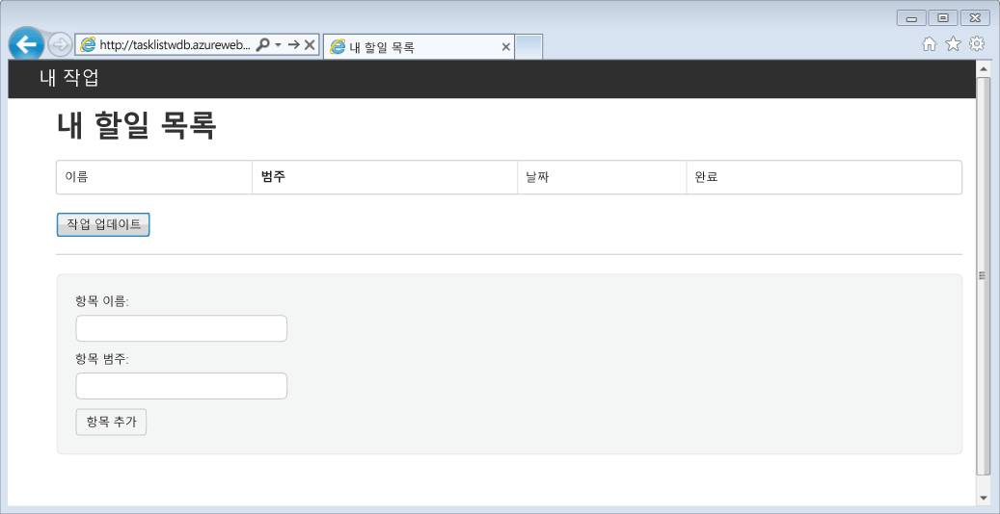
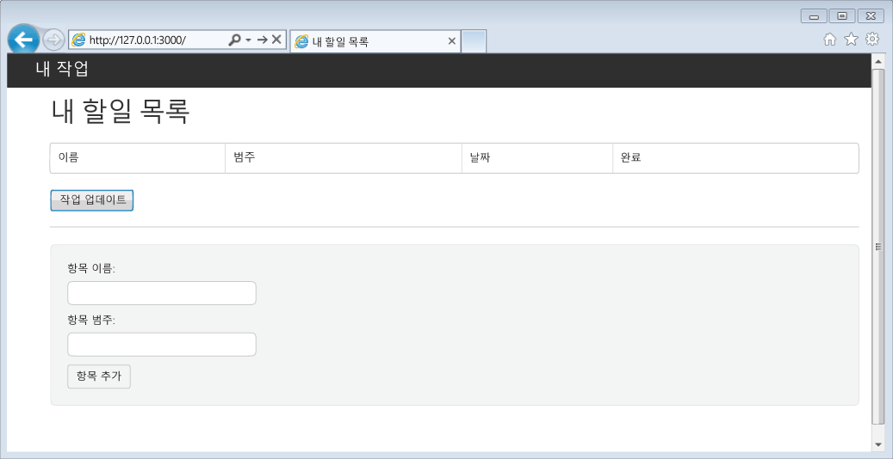
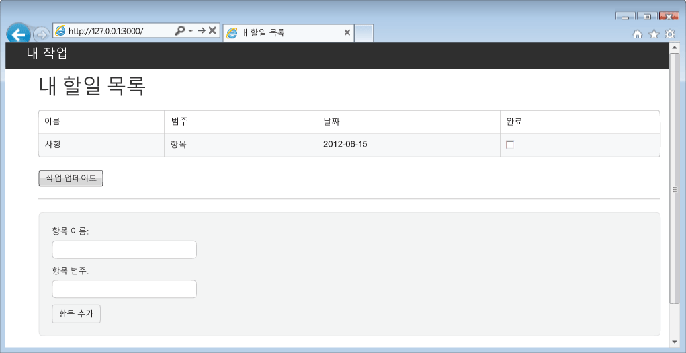

<properties 
	pageTitle="Node.js 알아보기 - DocumentDB Node.js 자습서 | Microsoft Azure" 
	description="Node.js에 대해 알아봅니다. 자습서에서는 Microsoft Azure DocumentDB를 사용하여 Azure 웹 사이트에 호스트된 Node.js Express 웹 응용 프로그램에서 데이터를 저장하고 액세스하는 방법을 설명합니다." 
	keywords="응용 프로그램 개발, 데이터베이스 자습서, node.js 알아보기, node.js 자습서, documentdb, azure, Microsoft azure"
	services="documentdb" 
	documentationCenter="nodejs" 
	authors="ryancrawcour" 
	manager="jhubbard" 
	editor="cgronlun"/>

<tags 
	ms.service="documentdb" 
	ms.workload="data-services" 
	ms.tgt_pltfrm="na" 
	ms.devlang="nodejs" 
	ms.topic="hero-article" 
	ms.date="02/03/2016" 
	ms.author="ryancraw"/>

# DocumentDB를 사용하여 Node.js 응용 프로그램 빌드

> [AZURE.SELECTOR]
- [.NET](documentdb-dotnet-application.md)
- [Node.js](documentdb-nodejs-application.md)
- [Java](documentdb-java-application.md)
- [Python](documentdb-python-application.md)

이 Node.js 자습서에서는 Azure DocumentDB 서비스를 사용하여 Azure 웹 사이트에 호스트된 Node.js Express 응용 프로그램에서 데이터를 저장하고 액세스하는 방법을 보여 줍니다.

먼저 Azure DocumentDB 데이터베이스 계정을 프로비전하는 방법을 알아보는 다음 동영상을 보고 JSON 문서를 Node.js 응용 프로그램에 저장하는 것이 좋습니다.

> [AZURE.VIDEO azure-demo-getting-started-with-azure-documentdb-on-nodejs-in-linux]

그런 다음 이 Node.js 자습서로 돌아와서 다음 내용을 살펴보세요.

- documentdb npm 모듈을 사용해서 DocumentDB를 사용하는 방법
- Azure 웹 사이트에 웹 응용 프로그램을 배포하는 방법

이 데이터베이스 자습서를 따라 작업을 만들고, 검색하고, 완료할 수 있는 간단한 웹 기반 작업 관리 응용 프로그램을 작성합니다. 작업은 Azure DocumentDB에 JSON 문서로 저장됩니다.

자습서를 완료할 시간이 없고 전체 솔루션을 가져오려는 경우 [GitHub][]에서 전체 샘플 솔루션을 구할 수 있습니다.

## 필수 조건

> [AZURE.TIP] 이 Node.js 자습서에서는 Node.js 및 Azure 웹 사이트를 이전에 사용해본 경험이 있다고 가정합니다.

이 문서의 지침을 따르기 전에 다음이 있는지 확인해야 합니다.

- 활성 Azure 계정. 계정이 없는 경우 몇 분 만에 무료 평가판 계정을 만들 수 있습니다. 자세한 내용은 [Azure 무료 체험](https://azure.microsoft.com/pricing/free-trial/)을 참조하세요.
- [Node.js][] 버전 v0.10.29 이상
- [Express 생성기](http://www.expressjs.com/starter/generator.html)(`npm install express-generator -g`를 통해 설치 가능)
- [Git][]

## 1단계: DocumentDB 데이터베이스 계정 만들기

먼저 DocumentDB 계정을 만듭니다. 계정이 이미 있는 경우 [2단계: 새 Node.js 응용 프로그램 만들기](#_Toc395783178)로 건너뛸 수 있습니다.

[AZURE.INCLUDE [documentdb-create-dbaccount](../../includes/documentdb-create-dbaccount.md)]

[AZURE.INCLUDE [documentdb-keys](../../includes/documentdb-keys.md)]

## 2단계: 새 Node.js 응용 프로그램을 만드는 방법 알아보기

이제 [Express](http://expressjs.com/) 프레임워크를 사용해서 기본적인 Hello World Node.js 프로젝트를 만드는 방법을 알아보겠습니다.

1. 자주 사용하는 터미널을 엽니다.

2. Express 생성기를 사용해서 **todo**라는 새로운 응용 프로그램을 생성합니다.

		express todo

3. 새 **todo** 디렉터리를 열고 종속성을 설치합니다.

		cd todo
		npm install

4. 새 응용 프로그램을 실행합니다.

		npm start

5. 브라우저에서 [http://localhost:3000](http://localhost:3000)으로 이동하여 새 응용 프로그램을 확인할 수 있습니다.

	

## 3단계: 추가 모듈 설치

**package.json** 파일은 프로젝트 루트에 생성되는 파일 중 하나입니다. 이 파일에는 Node.js 응용 프로그램에 필요한 추가 모듈의 목록이 들어 있습니다. 나중에 이 응용 프로그램을 Azure 웹 사이트에 배포하는 경우 이 파일을 사용하여 응용 프로그램을 지원하기 위해 Azure에 설치해야 할 모듈을 결정합니다. 이 자습서를 위해 패키지 두 개를 더 설치해야 합니다.

1. 다시 터미널에서 npm을 통해 **async** 모듈을 설치합니다.

		npm install async --save

1. npm을 통해 **documentdb** 모듈을 설치합니다. 이 모듈에서 중요한 모든 DocumentDB 기능이 수행됩니다.

		npm install documentdb --save

3. 응용 프로그램의 **package.json** 파일에 대해 빠른 검사를 수행하면 추가 모듈이 표시됩니다. 이 파일은 응용 프로그램 실행 시 다운로드 및 설치할 패키지를 Azure에 알려줍니다. 아래 예제와 비슷합니다.

	

       이 파일은 해당 응용 프로그램이 이러한 추가 모듈에 종속된다는 것을 노드(및 나중에 Azure)에 알려줍니다.

## 4단계: 노드 응용 프로그램에서 DocumentDB 서비스 사용

초기 설정 및 구성이 모두 완료되었으므로 이제 Azure DocumentDB를 사용하여 일부 코드를 작성하겠습니다.

### 모델 만들기

1. 프로젝트 디렉터리에서 **models**라는 새 디렉터리를 만듭니다.
2. **models** 디렉터리에서 **taskDao.js**라는 새 파일을 만듭니다. 이 파일에는 응용 프로그램에서 만든 작업 모델이 포함됩니다.
3. 동일한 **models** 디렉터리에서 **docdbUtils.js**라는 다른 새 파일을 만듭니다. 이 파일에는 응용 프로그램 전체에서 사용할 몇 가지 유용하고, 다시 사용할 수 있는 코드가 포함됩니다. 
4. 다음 코드를 **docdbUtils.js**에 복사합니다.

		var DocumentDBClient = require('documentdb').DocumentClient;
			
		var DocDBUtils = {
		    getOrCreateDatabase: function (client, databaseId, callback) {
		        var querySpec = {
		            query: 'SELECT * FROM root r WHERE r.id=@id',
		            parameters: [{
		                name: '@id',
		                value: databaseId
		            }]
		        };
		
		        client.queryDatabases(querySpec).toArray(function (err, results) {
		            if (err) {
		                callback(err);
		
		            } else {
		                if (results.length === 0) {
		                    var databaseSpec = {
		                        id: databaseId
		                    };
		
		                    client.createDatabase(databaseSpec, function (err, created) {
		                        callback(null, created);
		                    });
		
		                } else {
		                    callback(null, results[0]);
		                }
		            }
		        });
		    },
		
		    getOrCreateCollection: function (client, databaseLink, collectionId, callback) {
		        var querySpec = {
		            query: 'SELECT * FROM root r WHERE r.id=@id',
		            parameters: [{
		                name: '@id',
		                value: collectionId
		            }]
		        };		       
				
		        client.queryCollections(databaseLink, querySpec).toArray(function (err, results) {
		            if (err) {
		                callback(err);
		
		            } else {		
		                if (results.length === 0) {
		                    var collectionSpec = {
		                        id: collectionId
		                    };
							
				 			var requestOptions = {
								offerType: 'S1'
							};
							
		                    client.createCollection(databaseLink, collectionSpec, requestOptions, function (err, created) {
		                        callback(null, created);
		                    });
		
		                } else {
		                    callback(null, results[0]);
		                }
		            }
		        });
		    }
		};
				
		module.exports = DocDBUtils;

> [AZURE.TIP] createCollection은 컬렉션의 제공 유형을 지정하는 데 사용할 수 있는 선택적 requestOptions 매개 변수를 사용합니다. requestOptions.offerType 값을 제공하지 않으면 기본 제공 유형을 사용하여 컬렉션이 생성됩니다. DocumentDB 제공 유형에 대한 자세한 내용은 [DocumentDB 성능 수준](documentdb-performance-levels.md)을 참조하세요.
		
3. **docdbUtils.js** 파일을 저장하고 닫습니다.

4. **taskDao.js** 파일의 시작 부분에서 **DocumentDBClient** 및 위에서 만든 **docdbUtils.js**를 참조하도록 다음 코드를 추가합니다.

        var DocumentDBClient = require('documentdb').DocumentClient;
		var docdbUtils = require('./docdbUtils');

4. 그런 다음, Task 개체를 정의하고 내보내는 코드를 추가합니다. 이 코드는 작업 개체를 초기화하고 사용할 데이터베이스 및 문서 컬렉션을 설정합니다.

		function TaskDao(documentDBClient, databaseId, collectionId) {
		  this.client = documentDBClient;
		  this.databaseId = databaseId;
		  this.collectionId = collectionId;
		
		  this.database = null;
		  this.collection = null;
		}
		
		module.exports = TaskDao;

5. 이제 다음 코드를 추가하여 Task 개체에서 추가 메서드를 정의합니다. 이러한 메서드를 통해 DocumentDB에 저장된 데이터를 조작할 수 있습니다.

		TaskDao.prototype = {
		    init: function (callback) {
		        var self = this;
		
		        docdbUtils.getOrCreateDatabase(self.client, self.databaseId, function (err, db) {
		            if (err) {
		                callback(err);

		            } else {
		                self.database = db;
		                docdbUtils.getOrCreateCollection(self.client, self.database._self, self.collectionId, function (err, coll) {
		                    if (err) {
		                        callback(err);
		
		                    } else {
		                        self.collection = coll;
		                    }
		                });
		            }
		        });
		    },
		
		    find: function (querySpec, callback) {
		        var self = this;
		
		        self.client.queryDocuments(self.collection._self, querySpec).toArray(function (err, results) {
		            if (err) {
		                callback(err);
		
		            } else {
		                callback(null, results);
		            }
		        });
		    },
		
		    addItem: function (item, callback) {
		        var self = this;
		
		        item.date = Date.now();
		        item.completed = false;
		
		        self.client.createDocument(self.collection._self, item, function (err, doc) {
		            if (err) {
		                callback(err);
		
		            } else {
		                callback(null, doc);
		            }
		        });
		    },
		
		    updateItem: function (itemId, callback) {
		        var self = this;
		
		        self.getItem(itemId, function (err, doc) {
		            if (err) {
		                callback(err);
		
		            } else {
		                doc.completed = true;
		
		                self.client.replaceDocument(doc._self, doc, function (err, replaced) {
		                    if (err) {
		                        callback(err);
		
		                    } else {
		                        callback(null, replaced);
		                    }
		                });
		            }
		        });
		    },
		
		    getItem: function (itemId, callback) {
		        var self = this;
		
		        var querySpec = {
		            query: 'SELECT * FROM root r WHERE r.id=@id',
		            parameters: [{
		                name: '@id',
		                value: itemId
		            }]
		        };
		
		        self.client.queryDocuments(self.collection._self, querySpec).toArray(function (err, results) {
		            if (err) {
		                callback(err);
		
		            } else {
		                callback(null, results[0]);
		            }
		        });
		    }
		};

6. **taskDao.js** 파일을 저장하고 닫습니다.

### 컨트롤러 만들기

1. 프로젝트의 **routes** 디렉터리에서 **tasklist.js**라는 새 파일을 만듭니다. 
2. 아래 코드를 **tasklist.js**에 추가합니다. 이 코드는 **tasklist.js**에서 사용되는 DocumentDBClient 및 async 모듈을 로드합니다. 또한 앞에서 정의한 **Task** 개체의 인스턴스가 전달되는 **TaskList** 함수도 정의되었습니다.

		var DocumentDBClient = require('documentdb').DocumentClient;
		var async = require('async');
		
		function TaskList(taskDao) {
		  this.taskDao = taskDao;
		}
		
		module.exports = TaskList;

3. **showTasks, addTask** 및 **completeTasks**에 사용된 메서드를 추가하여 **tasklist.js** 파일에 계속 추가합니다.
		
		TaskList.prototype = {
		    showTasks: function (req, res) {
		        var self = this;
		
		        var querySpec = {
		            query: 'SELECT * FROM root r WHERE r.completed=@completed',
		            parameters: [{
		                name: '@completed',
		                value: false
		            }]
		        };
		
		        self.taskDao.find(querySpec, function (err, items) {
		            if (err) {
		                throw (err);
		            }
		
		            res.render('index', {
		                title: 'My ToDo List ',
		                tasks: items
		            });
		        });
		    },
		
		    addTask: function (req, res) {
		        var self = this;
		        var item = req.body;
		
		        self.taskDao.addItem(item, function (err) {
		            if (err) {
		                throw (err);
		            }
		
		            res.redirect('/');
		        });
		    },
		
		    completeTask: function (req, res) {
		        var self = this;
		        var completedTasks = Object.keys(req.body);
		
		        async.forEach(completedTasks, function taskIterator(completedTask, callback) {
		            self.taskDao.updateItem(completedTask, function (err) {
		                if (err) {
		                    callback(err);
		                } else {
		                    callback(null);
		                }
		            });
		        }, function goHome(err) {
		            if (err) {
		                throw err;
		            } else {
		                res.redirect('/');
		            }
		        });
		    }
		};

4. **tasklist.js** 파일을 저장하고 닫습니다.
 
### config.js 추가

1. 프로젝트 디렉터리에서 **config.js**라는 새 파일을 만듭니다.
2. 다음을 **config.js**에 추가합니다. 이 파일은 응용 프로그램에 필요한 구성 설정 및 값을 정의합니다.

		var config = {}
		
		config.host = process.env.HOST || "[the URI value from the DocumentDB Keys blade on http://portal.azure.com]";
		config.authKey = process.env.AUTH_KEY || "[the PRIMARY KEY value from the DocumentDB Keys blade on http://portal.azure.com]";
		config.databaseId = "ToDoList";
		config.collectionId = "Items";
		
		module.exports = config;

3. **config.js** 파일에서 [Microsoft Azure 포털](https://portal.azure.com)의 DocumentDB 계정 키 블레이드에 있는 값을 사용해서 HOST 및 AUTH\_KEY 값을 업데이트합니다.

4. **config.js** 파일을 저장하고 닫습니다.
 
### app.js 수정

1. 프로젝트 디렉터리에서 **app.js** 파일을 엽니다. 이 파일은 이전에 Express 웹 응용 프로그램을 만들 때 생성되었습니다.
2. 다음 코드를 **app.js** 상단에 추가합니다.
	
		var DocumentDBClient = require('documentdb').DocumentClient;
		var config = require('./config');
		var TaskList = require('./routes/tasklist');
		var TaskDao = require('./models/taskDao');

3. 이 코드는 사용할 구성 파일을 정의하고 이 파일에서 값을 나중에 곧 사용할 변수로 읽어들입니다.
4. **app.js** 파일에서 다음 두 줄을

		app.use('/', routes);
		app.use('/users', users); 

      다음 코드 조각으로 바꿉니다.

		var docDbClient = new DocumentDBClient(config.host, {
		    masterKey: config.authKey
		});
		var taskDao = new TaskDao(docDbClient, config.databaseId, config.collectionId);
		var taskList = new TaskList(taskDao);
		taskDao.init();
		
		app.get('/', taskList.showTasks.bind(taskList));
		app.post('/addtask', taskList.addTask.bind(taskList));
		app.post('/completetask', taskList.completeTask.bind(taskList));

6. 이러한 줄은 DocumentDB에 대한 새로운 연결을 사용해서 **TaskDao** 개체의 새 인스턴스를 정의하고(**config.js**에서 읽은 값 사용), 작업 개체를 초기화한 후 폼 작업을 **TaskList** 컨트롤러의 메서드에 바인딩합니다.

7. 끝으로, **app.js** 파일을 저장하고 닫으면 작업이 거의 완료됩니다.
 
## 5단계: 사용자 인터페이스 작성

이제 사용자가 실제로 응용 프로그램을 조작할 수 있도록 사용자 인터페이스를 작성하겠습니다. 만든 Express 응용 프로그램은 **Jade**를 뷰 엔진으로 사용합니다. Jade에 대한 자세한 내용은 [http://jade-lang.com/](http://jade-lang.com/)을 참조하세요.

1. **views** 디렉터리의 **layout.jade** 파일은 다른 **.jade** 파일에 대한 전역 템플릿으로 사용됩니다. 이 단계에서는 멋진 모습의 웹 사이트를 쉽게 디자인할 수 있게 해주는 도구 키트인 [Twitter Bootstrap](https://github.com/twbs/bootstrap)을 사용하도록 이 파일을 수정합니다. 
2. **views** 폴더에 있는 **layout.jade** 파일을 열고 파일 내용을 다음으로 바꿉니다.
	
		doctype html
		html
		  head
		    title= title
		    link(rel='stylesheet', href='//ajax.aspnetcdn.com/ajax/bootstrap/3.3.2/css/bootstrap.min.css')
		    link(rel='stylesheet', href='/stylesheets/style.css')
		  body
		    nav.navbar.navbar-inverse.navbar-fixed-top
		      div.navbar-header
		        a.navbar-brand(href='#') My Tasks
		    block content
		    script(src='//ajax.aspnetcdn.com/ajax/jQuery/jquery-1.11.2.min.js')
		    script(src='//ajax.aspnetcdn.com/ajax/bootstrap/3.3.2/bootstrap.min.js')

	이렇게 하면 응용 프로그램에 대한 일부 HTML을 렌더링하고 콘텐츠 페이지의 레이아웃을 제공할 수 있는 **콘텐츠**라는 **블록**을 만들도록 **Jade** 엔진에 알립니다. 이 **layout.jade** 파일을 저장하고 닫습니다.

4. 이제 응용 프로그램에 사용되는 뷰인 **index.jade** 파일을 열고 파일 내용을 다음으로 바꿉니다.

		extends layout
		
		block content
		  h1 #{title}
		  br
		
		  form(action="/completetask", method="post")
		    table.table.table-striped.table-bordered
		      tr
		        td Name
		        td Category
		        td Date
		        td Complete
		      if (typeof tasks === "undefined")
		        tr
		          td
		      else
		        each task in tasks
		          tr
		            td #{task.name}
		            td #{task.category}
		            - var date  = new Date(task.date);
		            - var day   = date.getDate();
		            - var month = date.getMonth() + 1;
		            - var year  = date.getFullYear();
		            td #{month + "/" + day + "/" + year}
		            td
		              input(type="checkbox", name="#{task.id}", value="#{!task.completed}", checked=task.completed)
		    button.btn(type="submit") Update tasks
		  hr
		  form.well(action="/addtask", method="post")
		    label Item Name:
		    input(name="name", type="textbox")
		    label Item Category:
		    input(name="category", type="textbox")
		    br
		    button.btn(type="submit") Add item

	이렇게 하면 레이아웃이 확장되고 앞에서 **layout.jade** 파일에 있던 **content** 자리 표시자의 콘텐츠가 제공됩니다.
	
	이 레이아웃에서 HTML 폼 두 개를 만들었습니다. 첫 번째 폼에는 데이터에 대한 테이블 및 컨트롤러의 **/completetask** 메서드에 게시하여 항목을 업데이트할 수 있게 해주는 단추 및 데이터 테이블이 포함됩니다. 두 번째 폼에는 컨트롤러의 **/addtask** 메서드에 게시하여 새 항목을 만들 수 있게 해주는 단추와 2개의 입력 필드가 포함됩니다.
	
	응용 프로그램이 작동하는 데 필요한 모든 작업이 완료되었습니다.

5. **public\stylesheets** 디렉터리에서 **style.css** 파일을 열고 코드를 다음으로 바꿉니다.

		body {
		  padding: 50px;
		  font: 14px "Lucida Grande", Helvetica, Arial, sans-serif;
		}
		a {
		  color: #00B7FF;
		}
		.well label {
		  display: block;
		}
		.well input {
		  margin-bottom: 5px;
		}
		.btn {
		  margin-top: 5px;
		  border: outset 1px #C8C8C8;
		}

	이 **style.css** 파일을 저장하고 닫습니다.

## 6단계: 로컬에서 응용 프로그램 실행

1. 로컬 컴퓨터에서 응용 프로그램을 테스트하려면 터미널에서 `npm start`를 실행하여 응용 프로그램을 시작하고, 아래 이미지와 비슷하게 보이는 페이지로 브라우저를 실행합니다.

	

2. 항목, 항목 이름 및 범주에 대해 제공된 필드를 사용하여 정보를 입력하고 **항목 추가**를 클릭합니다.

3. 페이지가 업데이트되어 새로 만든 항목을 ToDo 목록에 표시합니다.

	

4. 작업을 완료하려면 완료 열의 확인란을 선택한 후 **작업 업데이트**를 클릭하면 됩니다.

## 7단계: Azure 웹 사이트에 응용 프로그램 개발 프로젝트 배포

1. 아직 Azure 웹 사이트에 대해 git 리포지토리를 사용하도록 설정하지 않은 경우 사용하도록 설정합니다. [Azure 앱 서비스에서 GIT를 사용하여 연속 배포](../app-service-web/web-sites-publish-source-control.md) 항목에서 이 작업을 수행하는 방법에 대한 지침을 볼 수 있습니다.

2. Azure 웹 사이트를 git 원격으로 추가합니다.

		git remote add azure https://username@your-azure-website.scm.azurewebsites.net:443/your-azure-website.git

3. 원격 푸시로 배포합니다.

		git push azure master

4. 몇 초 후에 웹 응용 프로그램 게시가 완료되고 git가 웹 응용 프로그램 게시를 완료하고, Azure에서 실행 중인 작업을 볼 수 있는 브라우저가 실행됩니다.

## 다음 단계

축하합니다. 지금까지 Azure DocumentDB를 사용하여 첫 Node.js Express 웹 응용 프로그램을 작성하고 Azure 웹 사이트에 게시했습니다.

[GitHub][]에서 전체 참조 응용 프로그램의 소스 코드를 다운로드할 수 있습니다.

자세한 내용은 [Node.js 개발자 센터](https://azure.microsoft.com/develop/nodejs/)를 참조하세요.

[Node.js]: http://nodejs.org/
[Git]: http://git-scm.com/
[Github]: https://github.com/Azure-Samples/documentdb-node-todo-app
 

<!---HONumber=AcomDC_0204_2016-->