<properties
    pageTitle="DocumentDB를 사용한 Python Flask 웹 응용 프로그램 개발 | Microsoft Azure"
    description="DocumentDB를 사용하여 Azure에 호스트된 Python Flask 웹 응용 프로그램에서 데이터를 저장하고 액세스하는 방법에 대한 데이터베이스 자습서를 검토합니다. 응용 프로그램 개발 솔루션을 찾습니다." 
	keywords="응용 프로그램 개발, 데이터베이스 자습서, python flask, python 웹 응용 프로그램, python 웹 개발, documentdb, azure, Microsoft azure"
    services="documentdb"
    documentationCenter="python"
    authors="ryancrawcour"
    manager="jhubbard"
    editor="cgronlun"/>

<tags
    ms.service="documentdb"
    ms.workload="data-management"
    ms.tgt_pltfrm="na"
    ms.devlang="python"
    ms.topic="hero-article"
    ms.date="01/05/2016"
    ms.author="ryancraw"/>

# DocumentDB를 사용한 Python Flask 웹 응용 프로그램 개발

> [AZURE.SELECTOR]
- [.NET](documentdb-dotnet-application.md)
- [Node.js](documentdb-nodejs-application.md)
- [Java](documentdb-java-application.md)
- [Python](documentdb-python-application.md)

이 자습서에서는 Azure DocumentDB를 사용하여 Azure에 호스트된 Python 웹 응용 프로그램에서 데이터를 저장하고 액세스하는 방법을 보여주며 이전에 Python 및 Azure 웹 사이트를 사용한 경험이 있다고 가정합니다.

이 데이터베이스 자습서에서는 다음 내용을 다룹니다.

1. DocumentDB 계정 만들기 및 프로비전
2. Python MVC 응용 프로그램 만들기
3. 웹 응용 프로그램에서 Azure DocumentDB에 연결 및 사용
4. Azure 웹 사이트에 웹 응용 프로그램 배포

이 자습서를 따르면 설문 조사에 투표할 수 있는 간단한 투표 응용 프로그램을 빌드합니다.

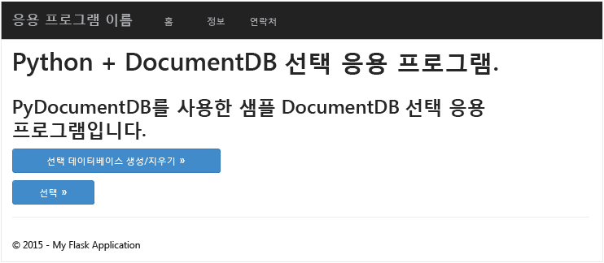


## 데이터베이스 자습서 필수 조건

이 문서의 지침을 따르기 전에 다음이 설치되어 있는지 확인해야 합니다.

- 활성 Azure 계정. 계정이 없는 경우 몇 분 만에 무료 평가판 계정을 만들 수 있습니다. 자세한 내용은 [Azure 무료 체험](https://azure.microsoft.com/pricing/free-trial/)을 참조하세요.
- [Visual Studio 2013](http://www.visualstudio.com/) 이상 또는 [Visual Studio Express]().(무료 버전) 이 자습서의 지침은 특별히 Visual Studio 2015용으로 작성됩니다. 
- [GitHub](http://microsoft.github.io/PTVS/)에서 Python Tools for Visual Studio. 이 자습서에서는 Python Tools for VS 2015를 사용합니다. 
- [azure.com](https://azure.microsoft.com/downloads/)에서 사용 가능한 Azure Python SDK for Visual Studio 2.4 버전 이상. Python 2.7용 Microsoft Azure SDK를 사용했습니다.
- [python.org][2]에서 Python 2.7. Python 2.7.11을 사용했습니다. 

> [AZURE.IMPORTANT]처음으로 Python 2.7을 설치하는 경우 사용자 지정 Python 2.7.11 화면에서 **경로에 python.exe 추가**를 선택하도록 합니다.
> 
>    

- [Microsoft 다운로드 센터][3]에서 Python 2.7용 Microsoft Visual C++ 컴파일러.

## 1단계: DocumentDB 데이터베이스 계정 만들기

먼저 DocumentDB 계정을 만듭니다. 계정이 이미 있는 경우 [2단계: 새 Python Flask 웹 응용 프로그램 만들기](#step-2:-create-a-new-python-flask-web-application)로 건너뛸 수 있습니다.

[AZURE.INCLUDE [documentdb-create-dbaccount](../../includes/documentdb-create-dbaccount.md)]

<br/> 이제 새 Python Flask 웹 응용 프로그램을 처음부터 만드는 방법을 살펴보겠습니다.

## 2단계: 새 Python Flask 웹 응용 프로그램 만들기로 건너뛸 수 있습니다

1. Visual Studio의 **파일** 메뉴에서 **새로 만들기**를 가리킨 후 **프로젝트**를 클릭합니다.

    **새 프로젝트** 대화 상자가 나타납니다.

2. 왼쪽 창에서 **템플릿** 및 **Python**을 확장하고 **웹**을 클릭합니다.

3. 가운데 창에서 **Flask 웹 프로젝트**를 선택한 다음 **이름** 상자에 **자습서**를 입력하고 **확인**을 클릭합니다. [Python 코드에 대한 스타일 가이드](https://www.python.org/dev/peps/pep-0008/#package-and-module-names)에 설명한 대로 Python 패키지 이름은 모두 소문자여야 합니다.

	Python Flask를 처음 사용하는 경우 Python에서 웹 응용 프로그램을 더 빨리 작성하는 데 도움이 되는 웹 응용 프로그램 개발 프레임워크입니다.

	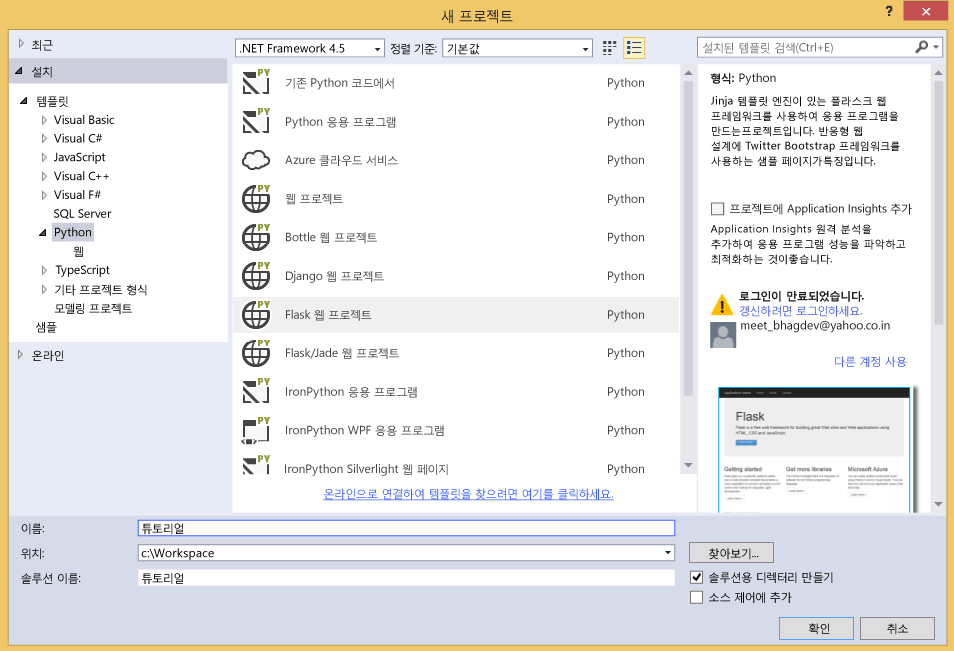

4. **Python Tools for Visual Studio** 창에서 **가상 환경에 설치**를 클릭합니다.

	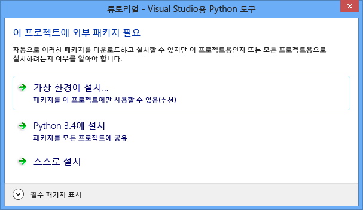

5. **가상 환경 추가** 창에서 PyDocumentDB가 현재 Python 3.x을 지원하지 않기 때문에 기본값을 적용하고 Python 2.7을 기본 환경으로 사용한 다음 **만들기**를 클릭합니다. 프로젝트에 필요한 Python 가상 환경을 설정합니다.

	

    환경이 성공적으로 설치될 때 출력 창은 `Successfully installed Flask-0.10.1 Jinja2-2.8 MarkupSafe-0.23 Werkzeug-0.11.3 itsdangerous-0.24 'requirements.txt' was installed successfully.`을 표시합니다.

## 3단계: Python Flask 웹 응용 프로그램 수정

### 프로젝트에 Python Flask 패키지 추가

프로젝트가 설정된 후 DocumentDB용 Python 패키지인 pydocumentdb를 포함해서 프로젝트에 필요한 Flask 패키지를 추가해야 합니다.

1. 솔루션 탐색기에서 **requirements.txt** 파일을 열고 내용을 다음으로 바꾼 다음 파일을 저장합니다.

    	flask==0.9
    	flask-mail==0.7.6
    	sqlalchemy==0.7.9
    	flask-sqlalchemy==0.16
    	sqlalchemy-migrate==0.7.2
    	flask-whooshalchemy==0.55a
    	flask-wtf==0.8.4
    	pytz==2013b
    	flask-babel==0.8
    	flup
    	pydocumentdb>=1.0.0

2. 솔루션 탐색기에서 **env**를 마우스 오른쪽 단추로 클릭하고 **requirements.txt에서 설치**를 클릭합니다.

	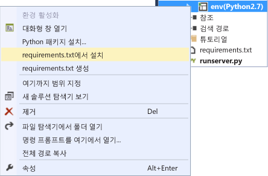

    성공적으로 설치한 후에 출력 창이 다음을 표시합니다.

        Successfully installed Babel-2.1.1 Tempita-0.5.2 WTForms-2.1 Whoosh-2.7.0 blinker-1.4 decorator-4.0.6 flask-0.9 flask-babel-0.8 flask-mail-0.7.6 flask-sqlalchemy-0.16 flask-whooshalchemy-0.55a0 flask-wtf-0.8.4 flup-1.0.2 pydocumentdb-1.4.2 pytz-2013b0 speaklater-1.3 sqlalchemy-0.7.9 sqlalchemy-migrate-0.7.2

    > [AZURE.NOTE]출력 창에 실패가 표시되는 경우가 드물게 발생합니다. 그런 경우 오류가 정리와 관련이 있는지 확인하세요. 때때로 정리는 실패하지만 설치는 성공하는 경우가 있습니다(이를 확인하려면 출력 창에서 위로 스크롤). [가상 환경 확인](#verify-the-virtual-environment)에서 설치를 확인할 수 있습니다. 설치에 실패했지만 확인이 성공한 경우 계속해도 됩니다.

### 가상 환경 확인

모두 올바르게 설치되었는지 확인해 보겠습니다.

1. **Ctrl**+**Shift**+**B**를 눌러 솔루션을 빌드합니다.
2. 빌드가 성공하면 **F5** 키를 눌러 웹 사이트를 시작합니다. 그러면 Flask 개발 서버가 실행되고 웹 브라우저가 시작됩니다. 다음 페이지를 참조해야 합니다.

	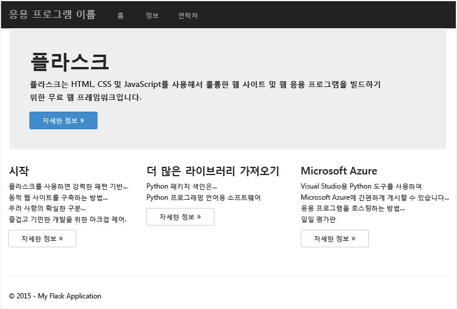

3. **Shift**+**F5**를 눌러 웹 사이트의 디버깅을 중지합니다.

### 데이터베이스, 컬렉션 및 문서 정의 만들기

이제 새 파일을 추가하고 다른 사용자를 업데이트하여 투표 응용 프로그램을 만들어 보겠습니다.

1. 솔루션 탐색기에서 **자습서** 프로젝트를 마우스 오른쪽 단추로 클릭하고 **추가**, **새 항목**을 차례로 클릭합니다. **빈 Python 파일**을 선택하고 파일 이름을 **forms.py**로 지정합니다.  
2. 다음 코드를 the forms.py 파일에 추가한 다음 파일을 저장합니다.

```python
from flask.ext.wtf import Form
from wtforms import RadioField

class VoteForm(Form):
	deploy_preference  = RadioField('Deployment Preference', choices=[
        ('Web Site', 'Web Site'),
        ('Cloud Service', 'Cloud Service'),
        ('Virtual Machine', 'Virtual Machine')], default='Web Site')
```


### 필요한 가져오기를 views.py에 추가합니다.

1. 솔루션 탐색기에서 **자습서** 폴더를 확장하고 **views.py** 파일을 엽니다. 
2. **views.py** 파일 맨 위에 다음 import 문을 추가하고 파일을 저장합니다. 이렇게 하면 DocumentDB의 PythonSDK 및 Flask 패키지를 가져옵니다.

	```python
	from forms import VoteForm
	import config
	import pydocumentdb.document_client as document_client
	```


### 데이터베이스, 컬렉션 및 문서 만들기

- **views.py**에서 파일의 끝에 다음 코드를 추가합니다. 이 코드는 폼에서 사용되는 데이터베이스를 만듭니다. **views.py**의 기존 코드를 삭제하지 마세요. 단순히 끝 부분에 추가합니다.

```python
@app.route('/create')
def create():
    """Renders the contact page."""
    client = document_client.DocumentClient(config.DOCUMENTDB_HOST, {'masterKey': config.DOCUMENTDB_KEY})

    # Attempt to delete the database.  This allows this to be used to recreate as well as create
    try:
        db = next((data for data in client.ReadDatabases() if data['id'] == config.DOCUMENTDB_DATABASE))
        client.DeleteDatabase(db['_self'])
    except:
        pass

    # Create database
    db = client.CreateDatabase({ 'id': config.DOCUMENTDB_DATABASE })

    # Create collection
    collection = client.CreateCollection(db['_self'],{ 'id': config.DOCUMENTDB_COLLECTION }, { 'offerType': 'S1' })

    # Create document
    document = client.CreateDocument(collection['_self'],
        { 'id': config.DOCUMENTDB_DOCUMENT,
          'Web Site': 0,
          'Cloud Service': 0,
          'Virtual Machine': 0,
          'name': config.DOCUMENTDB_DOCUMENT 
        })

    return render_template(
       'create.html',
        title='Create Page',
        year=datetime.now().year,
        message='You just created a new database, collection, and document.  Your old votes have been deleted')
```

> [AZURE.TIP]**CreateCollection** 메서드는 선택적 **RequestOptions**를 세 번째 매개 변수로 사용합니다. 컬렉션에 대한 제품 유형을 지정하는 데 사용할 수 있습니다. offerType 값을 제공하지 않으면 기본 제품 유형을 사용하여 컬렉션이 생성됩니다. DocumentDB 제품 유형에 대한 자세한 내용은 [DocumentDB 성능 수준](documentdb-performance-levels.md)을 참조하세요.


### 데이터베이스, 컬렉션 및 문서를 읽고 폼 제출

- **views.py**에서 파일의 끝에 다음 코드를 추가합니다. 이 코드는 데이터베이스, 컬렉션 및 문서를 읽고 폼을 설정합니다. **views.py**의 기존 코드를 삭제하지 마세요. 단순히 끝 부분에 추가합니다.

```python
@app.route('/vote', methods=['GET', 'POST'])
def vote(): 
    form = VoteForm()
    replaced_document ={}
    if form.validate_on_submit(): # is user submitted vote  
        client = document_client.DocumentClient(config.DOCUMENTDB_HOST, {'masterKey': config.DOCUMENTDB_KEY})

        # Read databases and take first since id should not be duplicated.
        db = next((data for data in client.ReadDatabases() if data['id'] == config.DOCUMENTDB_DATABASE))

        # Read collections and take first since id should not be duplicated.
        coll = next((coll for coll in client.ReadCollections(db['_self']) if coll['id'] == config.DOCUMENTDB_COLLECTION))

        # Read documents and take first since id should not be duplicated.
        doc = next((doc for doc in client.ReadDocuments(coll['_self']) if doc['id'] == config.DOCUMENTDB_DOCUMENT))

        # Take the data from the deploy_preference and increment our database
        doc[form.deploy_preference.data] = doc[form.deploy_preference.data] + 1
        replaced_document = client.ReplaceDocument(doc['_self'], doc)

        # Create a model to pass to results.html
        class VoteObject:
            choices = dict()
            total_votes = 0

        vote_object = VoteObject()
        vote_object.choices = {
            "Web Site" : doc['Web Site'],
            "Cloud Service" : doc['Cloud Service'],
            "Virtual Machine" : doc['Virtual Machine']
        }
        vote_object.total_votes = sum(vote_object.choices.values())

        return render_template(
            'results.html', 
            year=datetime.now().year, 
            vote_object = vote_object)

    else :
        return render_template(
            'vote.html', 
            title = 'Vote',
            year=datetime.now().year,
            form = form)
```


### HTML 파일 만들기

1. 솔루션 탐색기의 **자습서** 폴더에서 **템플릿** 폴더를 마우스 오른쪽 단추로 클릭하고 **추가**, **새 항목**을 차례로 클릭합니다. 
2. **HTML 페이지**를 선택한 다음 이름 상자에 **create.html**을 입력합니다. 
3. 1단계 및 2단계를 반복하여 results.html and vote.html과 같은 추가 HTML 파일을 만듭니다.
4. <body> 요소의 **create.html**에 다음 코드를 추가합니다. 이 코드는 새 데이터베이스, 컬렉션 및 문서를 만들었다는 메시지를 표시합니다.

	```html
	
	
	<h2>{{ title }}.</h2>
	<h3>{{ message }}</h3>
	<p><a href="{{ url_for('vote') }}" class="btn btn-primary btn-large">Vote &raquo;</a></p>
	
	```

5. <body> 요소의 **results.html**에 다음 코드를 추가합니다. 설문 조사 결과를 표시합니다.

	```html
	
	
	<h2>Results of the vote</h2>
		<br />
		
	
	<div class="row">
		<div class="col-sm-5">{{choice}}</div>
	        <div class="col-sm-5">
	        	<div class="progress">
	        		<div class="progress-bar" role="progressbar" aria-valuenow="{{vote_object.choices[choice]}}" aria-valuemin="0" aria-valuemax="{{vote_object.total_votes}}" style="width: {{(vote_object.choices[choice]/vote_object.total_votes)*100}}%;">
	                    		{{vote_object.choices[choice]}}
				</div>
			</div>
	        </div>
	</div>
	
	
	<br />
	<a class="btn btn-primary" href="{{ url_for('vote') }}">Vote again?</a>
	
	```

6. <body> 요소의 **vote.html**에 다음 코드를 추가합니다. 설문 조사를 표시하고 투표를 수락합니다. 투표를 등록하면 제어가 views.py로 전달되며, 여기서 투표 완료를 인식하고 그에 따라 문서를 추가합니다.

	```html
	
	
	<h2>What is your favorite way to host an application on Azure?</h2>
	<form action="" method="post" name="vote">
		{{form.hidden_tag()}}
	        {{form.deploy_preference}}
	        <button class="btn btn-primary" type="submit">Vote</button>
	</form>
	
	```

7. **템플릿** 폴더에서 **index.html**의 내용을 다음과 같이 바꿉니다. 이 코드는 응용 프로그램의 방문 페이지 역할을 합니다.
	
	```html
	
	
	<h2>Python + DocumentDB Voting Application.</h2>
	<h3>This is a sample DocumentDB voting application using PyDocumentDB</h3>
	<p><a href="{{ url_for('create') }}" class="btn btn-primary btn-large">Create/Clear the Voting Database &raquo;</a></p>
	<p><a href="{{ url_for('vote') }}" class="btn btn-primary btn-large">Vote &raquo;</a></p>
	
	```

### 구성 파일 추가 및 \_\_init\_\_.py 변경

1. 솔루션 탐색기에서 **자습서** 프로젝트를 마우스 오른쪽 단추로 클릭하고 **추가** 및 **새 항목**을 차례로 클릭한 다음 **빈 Python 파일**을 선택하고 파일의 이름을 **config.py**로 지정합니다. 이 구성 파일은 Flask의 폼에 필요합니다. 이 파일을 사용하여 비밀 키를 제공할 수도 있습니다. 하지만 이 자습서에서는 이 키가 필요하지 않습니다.

2. Config.py에 다음 코드를 추가하고 다음 단계에서 **DOCUMENTDB\_HOST** 및 **DOCUMENTDB\_KEY**의 값을 변경해야 합니다.

	```python
	CSRF_ENABLED = True
	SECRET_KEY = 'you-will-never-guess'
	
	DOCUMENTDB_HOST = 'https://YOUR_DOCUMENTDB_NAME.documents.azure.com:443/'
	DOCUMENTDB_KEY = 'YOUR_SECRET_KEY_ENDING_IN_=='
	
	DOCUMENTDB_DATABASE = 'voting database'
	DOCUMENTDB_COLLECTION = 'voting collection'
	DOCUMENTDB_DOCUMENT = 'voting document'
	```

3. [Azure 포털](https://portal.azure.com/)에서 **찾아보기**, **DocumentDB 계정**을 클릭하여 **키** 블레이드를 탐색하고 사용할 계정 이름을 두 번 클릭한 다음 **키**를 클릭합니다. **키** 블레이드에서 **URI** 값을 복사하고 **DOCUMENTDB\_HOST** 속성에 대한 값으로 **config.py** 파일에 붙여 넣습니다.
4. 다시 Azure 포털의 **키** 블레이드에서 **기본 키** 또는 **보조 키** 값을 복사하고 **DOCUMENTDB\_KEY** 속성에 대한 값으로 **config.py** 파일에 붙여 넣습니다.
5. **\_\_init\_\_.py** 파일에 다음 줄을 추가합니다. 

        app.config.from_object('config')

    파일의 내용은 다음과 같습니다.

	```python
	from flask import Flask
	app = Flask(__name__)
	app.config.from_object('config')
	import tutorial.views
	```

6. 모든 파일을 추가한 후에 솔루션 탐색기는 다음과 같아야 합니다.

	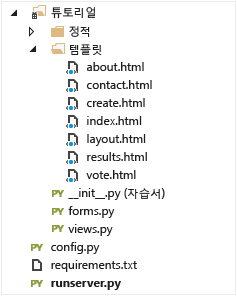


## 4단계: 로컬에서 웹 응용 프로그램 실행

1. **Ctrl**+**Shift**+**B**를 눌러 솔루션을 빌드합니다.
2. 빌드가 성공하면 **F5** 키를 눌러 웹 사이트를 시작합니다. 스크린에 다음이 표시되어야 합니다.

	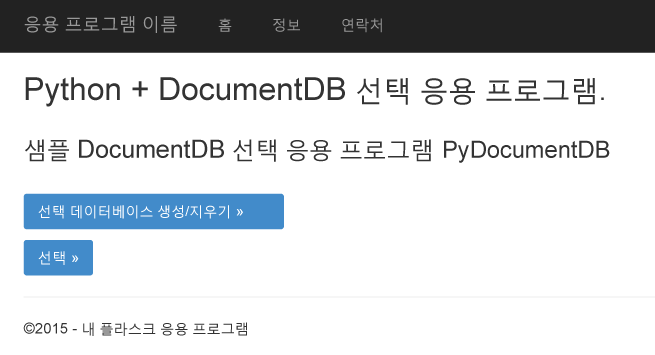

3. **투표 데이터베이스 만들기/지우기**를 클릭하여 데이터베이스를 생성합니다.

	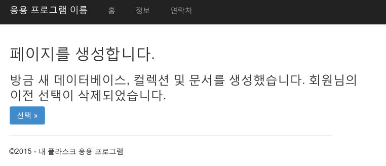

4. 그런 다음 **투표**를 클릭하고 옵션을 선택합니다.

	

5. 투표할 때마다 해당 카운터가 증가합니다.

	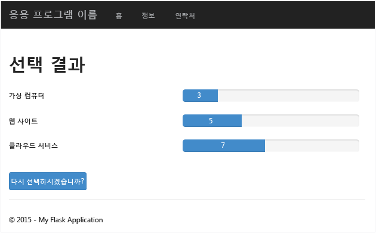

6. Shift+F5를 눌러 프로젝트의 디버깅을 중지합니다.

## 5단계:· Azure 웹 사이트에 웹 응용 프로그램 배포

이제 완료된 응용 프로그램이 DocumentDB에 대해 올바르게 작동하므로 Azure 웹 사이트에 배포하겠습니다.

1. 솔루션 탐색기에서 프로젝트를 마우스 오른쪽 단추로 클릭하고(로컬에서 실행하고 있지 않도록 확인) **게시**를 선택합니다.  

 	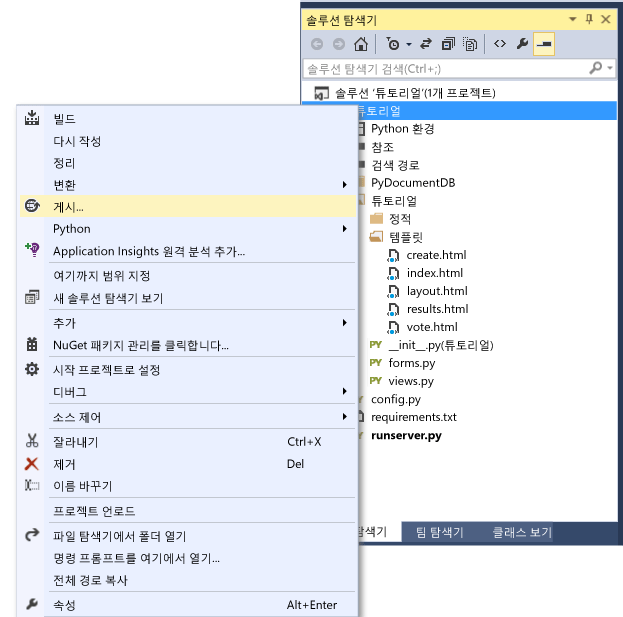

2. **웹 게시** 창에서 **Microsoft Azure 웹 사이트**를 선택합니다.

	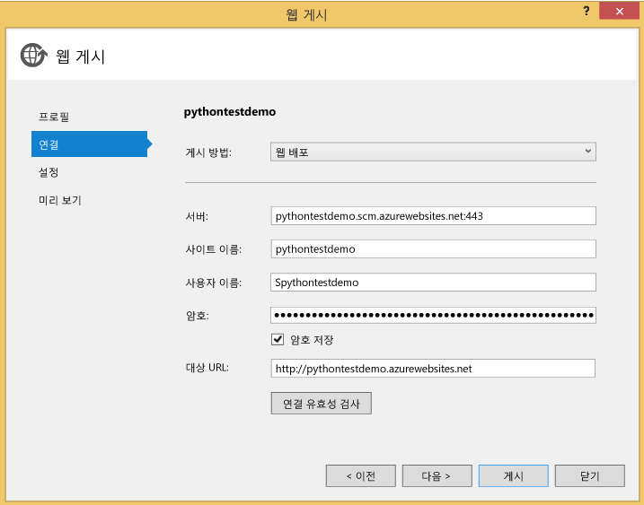

3. **기존 웹 사이트 선택** 창에서 **새로 만들기**를 클릭합니다.

	

4. **Microsoft Azure에서 사이트 만들기** 창에서 **사이트 이름**을 입력하고 **하위 지역**을 선택한 다음 **만들기**를 클릭합니다.

	

5. **웹 게시** 창에서 **게시**를 클릭합니다.

	

3. 몇 초 후에 Visual Studio에서 웹 응용 프로그램 게시를 완료하고 브라우저를 시작하며, Azure에서 실행되는 작업 내용을 확인할 수 있습니다.

## 문제 해결

컴퓨터에서 실행하는 첫 번째 Python 앱인 경우 다음 폴더(또는 동등한 설치 위치)가 경로 변수에 포함되어 있도록 합니다.

    C:\Python27\site-packages;C:\Python27\;C:\Python27\Scripts;

투표 페이지에 오류가 발생하고 **자습서**가 아닌 다른 이름으로 프로젝트의 이름을 지정한 경우 **\_\_init\_\_.py**가 줄에서 올바른 프로젝트 이름을 참조하도록 합니다.`import tutorial.view`

## 다음 단계

축하합니다. 지금까지 Azure DocumentDB를 사용하여 첫 Python 웹 응용 프로그램을 완성하고 Azure 웹 사이트에 게시했습니다.

이 항목은 사용자 피드백에 따라 자주 업데이트되고 개선됩니다. 자습서를 완료했으면 이 페이지 상단과 하단에 있는 응답 단추를 사용하여 개선되었으면 하는 사항에 대한 피드백을 포함해야 합니다. 직접 연락을 받고 싶은 경우 설명에 메일 주소를 포함하세요.

웹 응용 프로그램에 다른 기능을 추가하려면 [DocumentDB Python SDK](documentdb-sdk-python.md)에서 사용할 수 있는 API를 검토하세요.

Azure, Visual Studio 및 Python에 대한 자세한 내용은 [Python 개발자 센터](https://azure.microsoft.com/develop/python/)를 참조하세요.

추가 Python Flask 자습서는 [Flask Mega-자습서 1부: Hello, World!](http://blog.miguelgrinberg.com/post/the-flask-mega-tutorial-part-i-hello-world)를 참조하세요.

  [Visual Studio Express]: http://www.visualstudio.com/products/visual-studio-express-vs.aspx
  [2]: https://www.python.org/downloads/windows/
  [3]: https://www.microsoft.com/download/details.aspx?id=44266
  [Microsoft Web Platform Installer]: http://www.microsoft.com/web/downloads/platform.aspx
  [Azure portal]: http://portal.azure.com

<!---HONumber=AcomDC_0107_2016-->