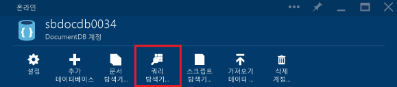
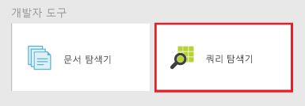
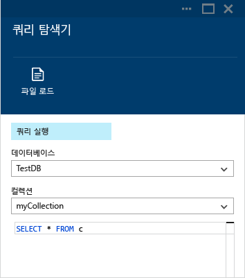
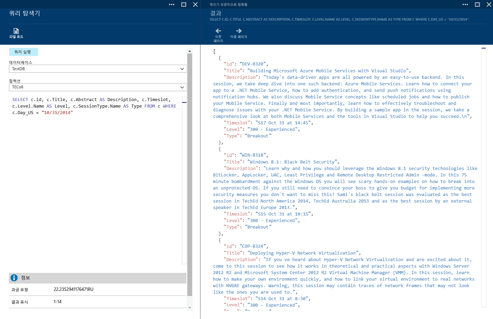
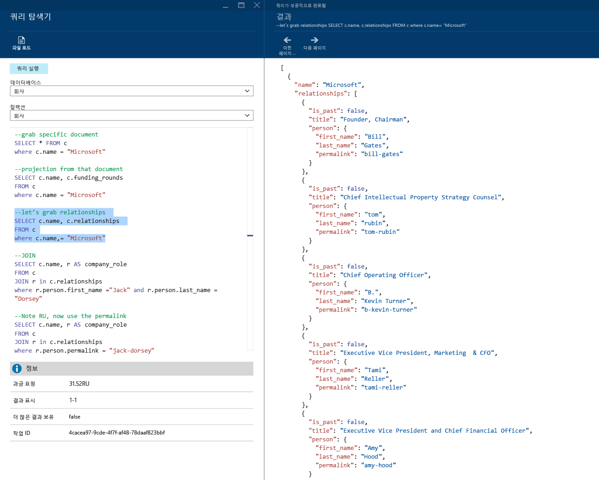
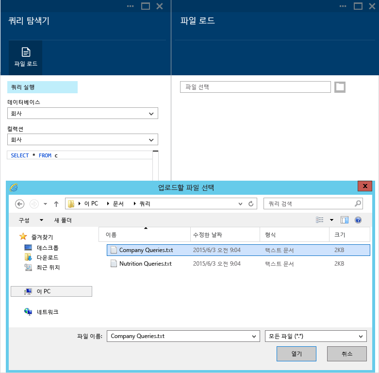
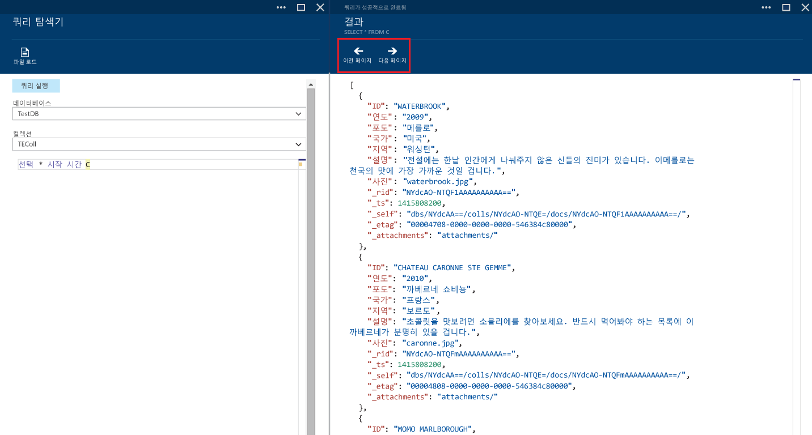
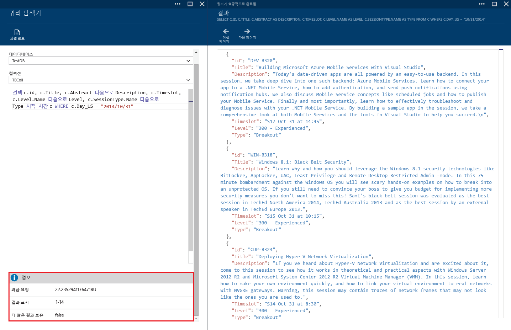
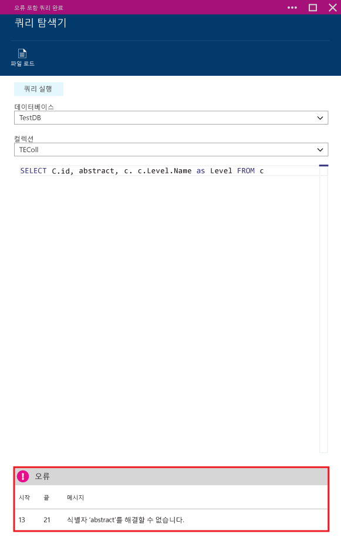

<properties 
	pageTitle="쿼리 탐색기를 사용해서 DocumentDB 컬렉션에 대해 SQL 쿼리 만들기, 편집 및 실행 | Microsoft Azure" 
	description="DocumentDB 컬렉션에 대해 SQL 쿼리를 만들고, 편집 및 실행할 수 있는 Azure Preview 포털 도구인 DocumentDB 쿼리 탐색기에 대해 알아봅니다." 
	services="documentdb" 
	authors="AndrewHoh" 
	manager="jhubbard" 
	editor="monicar" 
	documentationCenter=""/>

<tags 
	ms.service="documentdb" 
	ms.workload="data-services" 
	ms.tgt_pltfrm="na" 
	ms.devlang="na" 
	ms.topic="get-started-article"
	ms.date="09/08/2015" 
	ms.author="anhoh"/>

# 쿼리 탐색기를 사용해서 DocumentDB 컬렉션에 대해 SQL 쿼리 만들기, 편집 및 실행 #

이 문서에서는 DocumentDB 컬렉션에 대해 쿼리를 만들고, 편집 및 실행할 수 있게 해주는 Microsoft Azure Preview 도구인 [Microsoft Azure DocumentDB](http://azure.microsoft.com/services/documentdb/) 쿼리 탐색기에 대해 개괄적으로 설명합니다.

이 자습서를 완료하면 다음 질문에 대답할 수 있습니다.

-	웹 브라우저를 통해 DocumentDB 컬렉션에 대해 쿼리를 쉽게 만들고, 편집 및 실행하려면 어떻게 하나요?
-	웹 브라우저를 통해 DocumentDB 쿼리 결과 페이지를 쉽게 탐색하려면 어떻게 하나요?
-	내 DocumentDB 쿼리에서 구문 오류를 해결하려면 어떻게 하나요? 

##쿼리 탐색기 실행 및 탐색##

쿼리 탐색기는 DocumentDB 계정, 데이터베이스 및 컬렉션 블레이드 중 어디에서나 실행할 수 있습니다.
  
1. DocumentDB 계정 또는 데이터베이스 블레이드의 위에서 **쿼리 탐색기** 명령을 클릭하면 됩니다.

	

2. 또는 각 블레이드 하단 근처에는 **쿼리 탐색기** 타일이 포함된 **개발자 도구** 렌즈가 있습니다.
	
	

2. 쿼리 탐색기를 실행하려면 타일을 클릭합니다.

	**데이터베이스** 및 **컬렉션** 드롭다운 목록 상자는 쿼리 탐색기를 실행하는 컨텍스트에 따라 미리 채워집니다. 예를 들어 데이터베이스 블레이드에서 실행할 경우 현재 데이터베이스가 미리 채워집니다. 컬렉션 블레이드에서 실행할 경우에는 현재 컬렉션이 미리 채워집니다.

	

##쿼리 탐색기를 사용하여 쿼리 만들기, 편집 및 실행##

쿼리 탐색기를 사용하면 DocumentDB 컬렉션에 대해 쿼리를 쉽게 만들고, 편집 및 실행할 수 있으며, 쿼리 탐색기에는 쿼리 작성 환경을 향상시킬 수 있도록 기본적인 키워드 및 값이 강조 표시됩니다.

- 쿼리 탐색기를 처음에 열면 SELECT * FROM c의 기본 쿼리가 제공됩니다. 기본 쿼리를 사용하거나 고유 쿼리를 생성한 후 **쿼리 실행** 단추를 클릭하여 결과를 볼 수 있습니다. 쿼리 탐색기에서는 [쿼리 DocumentDB](documentdb-sql-query.md)에 설명된 대로 DocumentDB SQL 쿼리 언어가 지원됩니다.

	

- 여러 쿼리를 입력하고 실행할 쿼리를 강조 표시한 다음 **쿼리 실행** 단추를 클릭하여 결과를 볼 수도 있습니다.

	

- **파일 로드** 명령을 사용하여 기존 파일의 내용을 로드할 수 있습니다.

	

- 기본적으로 쿼리 탐색기는 100개 단위로 결과를 반환합니다. 쿼리로 생성되는 결과가 100개 이상이면 단순히 **다음 페이지** 및 **이전 페이지** 명령을 사용하여 결과 집합을 탐색할 수 있습니다.

	

- 쿼리가 성공하면 요청 비용, 현재 표시 중인 결과 집합 및 추가 결과가 있는지 여부(앞에서 설명한 대로 **다음 페이지** 명령으로 쉽게 액세스할 수 있음)와 같은 정보가 제공됩니다.

	

- 마찬가지로, 쿼리가 완료될 때 오류가 발생하면, 쿼리 탐색기에 문제 해결에 도움이 될 수 있는 오류 목록이 표시됩니다.

	

##다음 단계

- DocumentDB에 대해 자세히 알아보려면 [여기](http://azure.com/docdb)를 클릭하세요.
- 쿼리 탐색기에서 지원되는 DocumentDB SQL 문법에 대해 자세히 알아보려면 [여기](documentdb-sql-query.md)를 클릭하세요.
 

<!---HONumber=Oct15_HO4-->