<properties
	pageTitle="DocumentDB 문서 탐색기를 사용하여 JSON 문서 보기, 편집, 만들기 및 업로드 | Azure"
	description="DocumentDB를 사용하여 JSON 문서를 보고, 편집하며, 만들고, 업로드하는 Azure Preview 포털 도구인 DocumentDB 문서 탐색기에 대해 알아봅니다."
	services="documentdb"
	authors="stephbaron"
	manager="johnmac"
	editor="monicar"
	documentationCenter=""/>

<tags
	ms.service="documentdb"
	ms.workload="data-services"
	ms.tgt_pltfrm="na"
	ms.devlang="na"
	ms.topic="get-started-article" 
	ms.date="06/10/2015"
	ms.author="stbaro"/>

# DocumentDB 문서 탐색기를 사용하여 JSON 문서 보기, 편집, 만들기 및 업로드 #

이 문서에서는 DocumentDB를 사용하여 JSON 문서를 보고, 편집하며, 만들고, 업로드할 수 있는 Azure Preview 포털 도구인 [Microsoft Azure DocumentDB](http://azure.microsoft.com/services/documentdb/) 문서 탐색기에 대해 개괄적으로 설명합니다.

이 자습서를 완료하면 다음 질문에 대답할 수 있습니다.

-	웹 브라우저를 통해 개별 DocumentDB 문서를 쉽게 만들고, 보고, 편집하고, 삭제하려면 어떻게 하나요?
-	웹 브라우저를 통해 DocumentDB 문서의 시스템 속성을 쉽게 보려면 어떻게 하나요?
-	웹 브라우저를 통해 DocumentDB로 문서의 대량 수집을 쉽게 수행하려면 어떻게 하나요?

##문서 탐색기 실행 및 탐색##

문서 탐색기는 DocumentDB 계정, 데이터베이스 및 컬렉션 블레이드 중 하나에서 실행할 수 있습니다.

1. DocumentDB 계정 또는 데이터베이스 블레이드의 위에서 **문서 탐색기** 명령을 클릭하면 됩니다.

	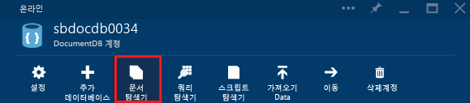
 
2. 또는, 각 블레이드의 아래쪽에 **문서 탐색기** 부분을 포함하는 **개발자 도구** 렌즈가 있습니다.

	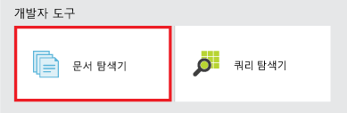

2. 문서 탐색기를 시작하려면 타일을 클릭하기만 하면 됩니다.

	
**데이터베이스** 및 **컬렉션** 드롭다운 목록 상자는 문서 탐색기를 실행하는 컨텍스트에 따라 미리 채워져 있습니다. 예를 들어 데이터베이스 블레이드에서 실행할 경우 현재 데이터베이스가 미리 채워집니다. 컬렉션 블레이드에서 실행할 경우에는 현재 컬렉션이 미리 채워집니다.

	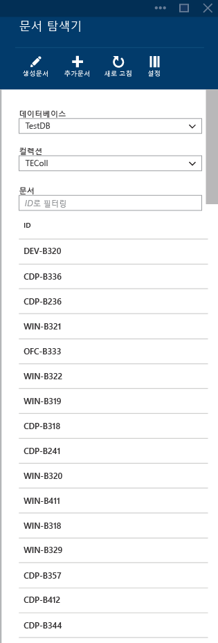

3. 기본적으로 문서 탐색기는 선택한 컬렉션의 문서를 처음부터 최대 100개까지 만든 날짜 순으로 로드합니다. 문서 탐색기 블레이드 아래쪽에 있는 **추가 로드** 옵션을 선택하여 추가 문서(100개 일괄 처리)를 로드할 수 있습니다. 문서 탐색기 블레이드 위쪽에 있는 설정 명령을 클릭하면 기본 동작을 수정할 수 있습니다.

	

4. 설정 블레이드에서는 페이지당 반환되는 항목 수를 조정하고 문서 탐색기 표에서 일치하는 문서를 로드하는 WHERE 절을 제공할 수 있습니다. DocumentDB SQL 문법에 대한 자세한 내용은 [여기](documentdb-sql-query.md)를 참조하세요.

	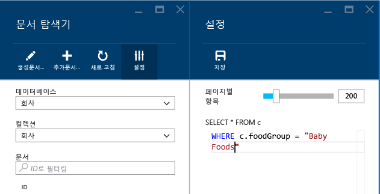

	> [AZURE.NOTE]문서 탐색기 설정을 수정한 후에는 **새로 고침** 명령을 클릭해야 새 설정이 적용됩니다. 설정을 현재 브라우저 세션에서만 유지됩니다.
	
5. **데이터베이스** 및 **컬렉션** 드롭다운 목록 상자를 사용하면 문서 탐색기를 닫았다가 다시 실행할 필요 없이 현재 문서를 보고 있는 컬렉션을 쉽게 변경할 수 있습니다.

5. 또한 문서 탐색기에서는 현재 로드된 문서 집합을 ID 속성별로 필터링할 수 있습니다. 필터 상자에 입력하면 됩니다.

	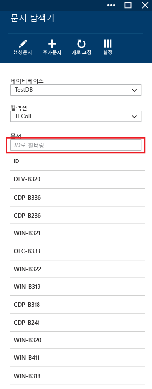

	또한 문서 탐색기 목록의 결과는 제공된 기준에 따라 필터링됩니다.

	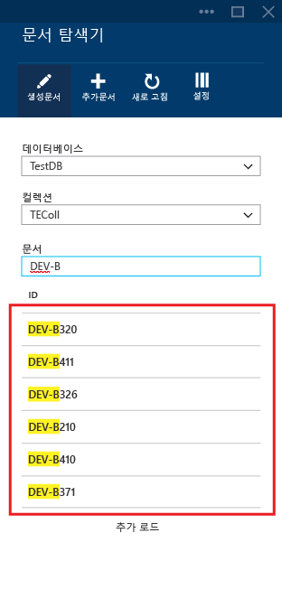

	> [AZURE.IMPORTANT]문서 탐색기 필터 기능은 ***현재*** 로드된 문서 집합만 필터링하고 현재 선택한 컬렉션에 대해 쿼리를 수행하지 않습니다.

6. 문서 탐색기에서 로드한 문서 목록을 새로 고치려면 블레이드 맨 위에 있는 **새로 고침** 명령을 클릭하면 됩니다.

	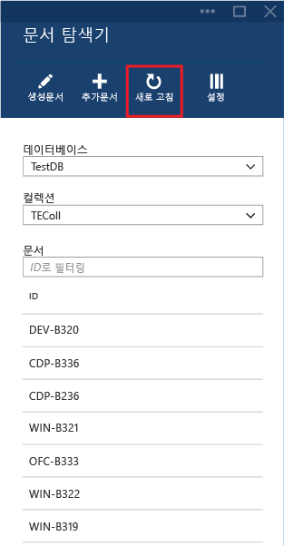

##문서 탐색기를 사용하여 문서 보기, 만들기 및 편집##

문서 탐색기를 사용하면 문서를 쉽게 만들고, 편집하고, 삭제할 수 있습니다.

- 문서를 만들려면 **문서 만들기** 명령을 클릭만 하면 됩니다. 그러면 최소 JSON 코드 조각이 제공됩니다.

	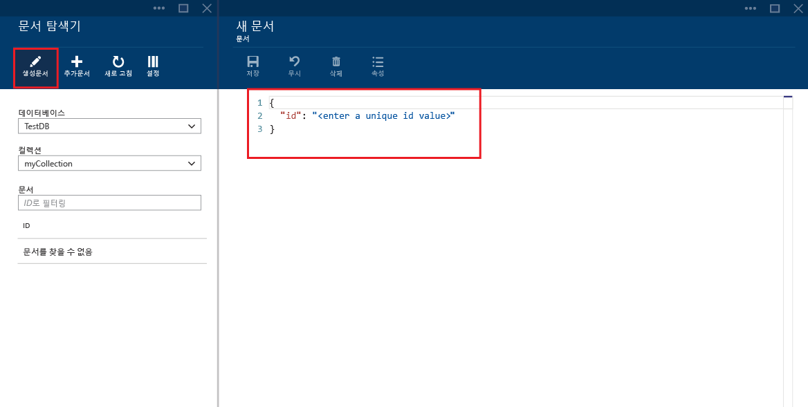

- 만들려는 문서의 JSON 콘텐츠를 입력하거나 붙여넣고 **저장** 명령을 클릭하여 문서를 커밋하면 됩니다.

	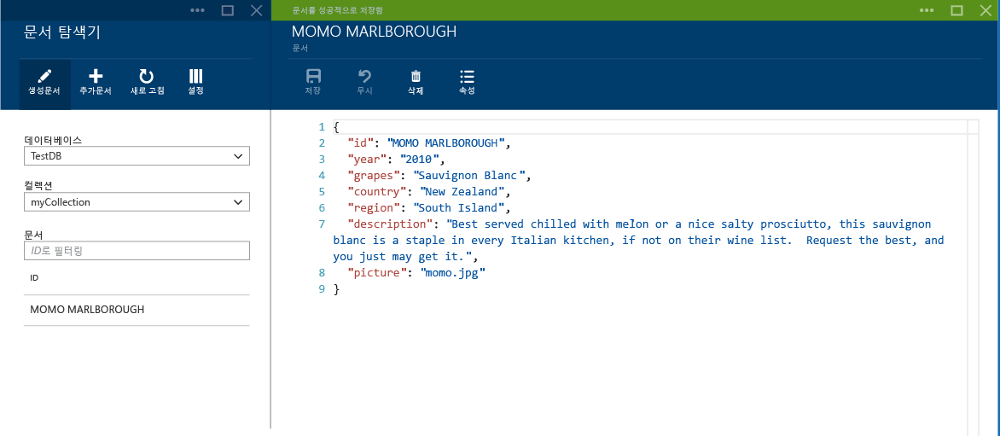

	> [AZURE.NOTE]"ID" 속성을 제공하지 않으면 문서 탐색기에서 ID 속성을 자동으로 추가하고 GUID를 ID 값으로 생성합니다.

- JSON 파일, MongoDB, SQL Server, CSV 파일, Azure 테이블 저장소 또는 기타 DocumentDB 컬렉션의 데이터가 이미 있는 경우 DocumentDB의 [데이터 마이그레이션 도구](documentdb-import-data.md)를 사용하여 데이터를 신속하게 가져올 수 있습니다.

- 기존 문서를 편집하려면 문서 탐색기에서 문서를 선택하고 적절하게 편집한 다음 **저장** 명령을 클릭하면 됩니다.

	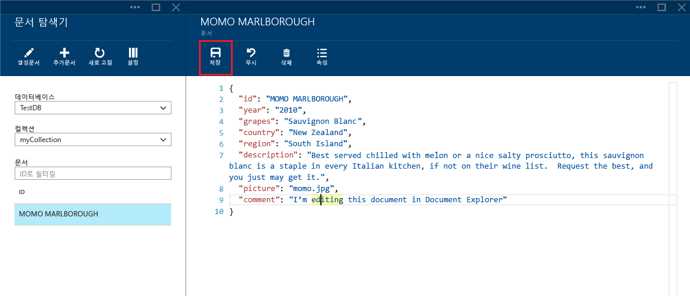

- 문서를 편집하고 있는 경우 현재 편집 내용을 취소하려면 취소 명령을 클릭하고 취소 작업을 확인하면 됩니다. 그러면 이전 상태의 문서가 다시 로드됩니다.

	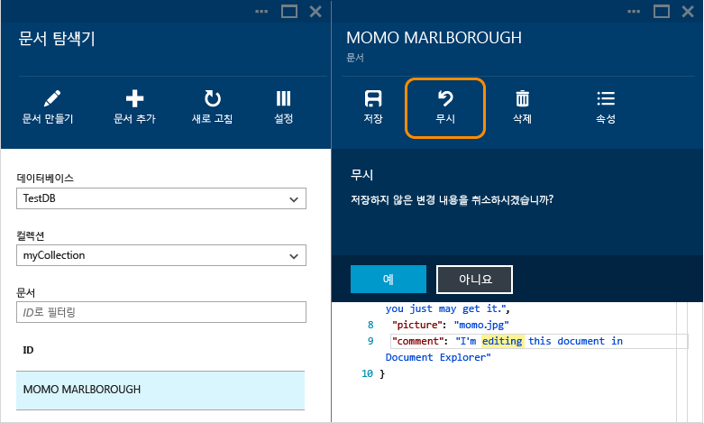

- 문서를 선택하고 **삭제** 명령을 클릭한 다음 삭제를 확인하여 문서를 삭제할 수 있습니다. 확인하면 문서가 문서 탐색기 목록에서 바로 제거됩니다.

	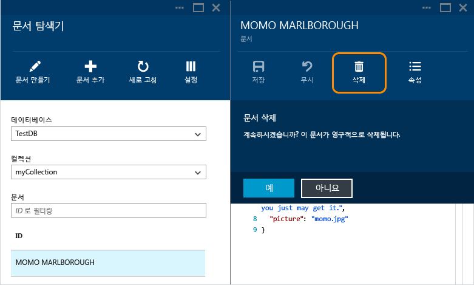

- 문서 탐색기는 새 문서 또는 편집된 문서에 유효한 JSON이 포함되어 있는지 확인합니다. 잘못된 섹션을 가리켜 유효성 검사 오류에 대한 자세한 정보를 얻을 수도 있습니다.

	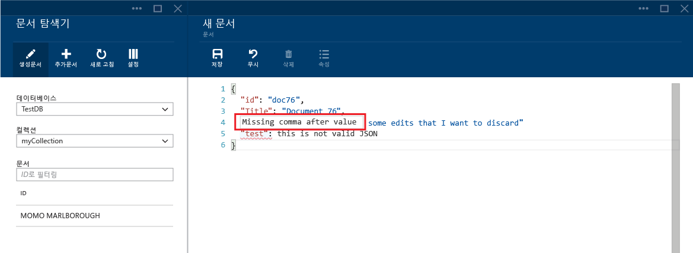

- 또한 문서 탐색기에서는 잘못된 JSON 콘텐츠를 사용하여 문서를 저장할 수 없습니다.

	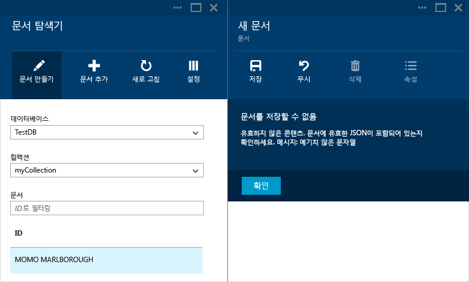

- 끝으로, 문서 탐색기에서는 **속성** 명령을 클릭하여 현재 로드된 문서의 시스템 속성을 쉽게 볼 수 있습니다.

	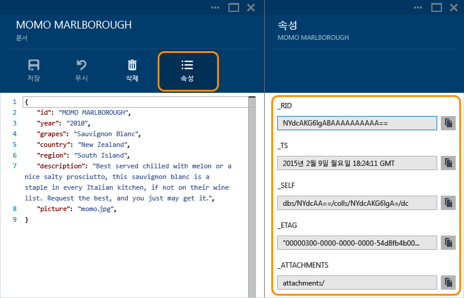

	> [AZURE.NOTE]타임스탬프(_ts) 속성은 내부적으로 epoch 시간으로 표시되지만 문서 탐색기에서는 이 값을 사람이 읽을 수 있는 GMT 형식으로 표시합니다.

##문서 탐색기를 사용하여 문서 일괄 추가##

문서 탐색기는 하나 이상의 기존 JSON 문서의 대량 수집을 지원합니다.

1. 업로드 프로세스를 시작하려면 **문서 추가** 명령을 클릭합니다.

	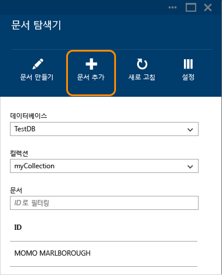

2. 새 블레이드가 열립니다. 찾아보기 단추를 클릭하여 파일 탐색기 창을 열고 업로드할 JSON 문서를 하나 이상 선택합니다.

	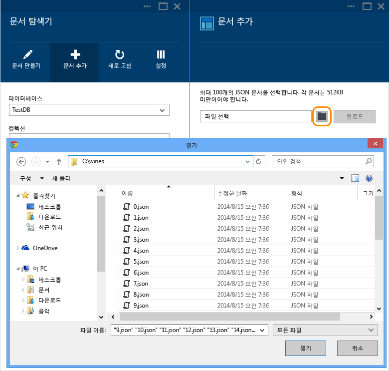

	> [AZURE.NOTE]문서 탐색기는 현재 개별 업로드 작업당 최대 100개의 JSON 문서를 지원합니다.

3. 원하는 대로 선택했으면 **업로드** 단추를 클릭합니다. 문서가 문서 탐색기 그리드에 자동으로 추가되고 작업이 진행됨에 따라 업로드 결과가 표시됩니다. 가져오기 오류는 개별 파일에 대해 보고됩니다.

	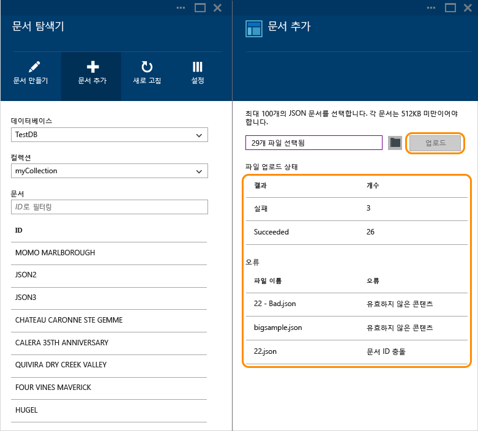

4. 작업이 완료되었으면 업로드할 다른 문서를 최대 100개까지 선택할 수 있습니다.

##다음 단계

DocumentDB에 대해 자세히 알아보려면 [여기](http://azure.com/docdb)를 클릭하세요.
 

<!---HONumber=July15_HO3-->