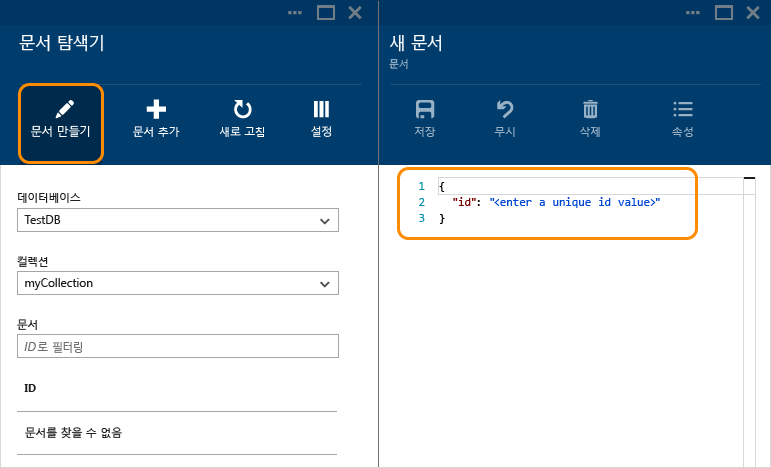
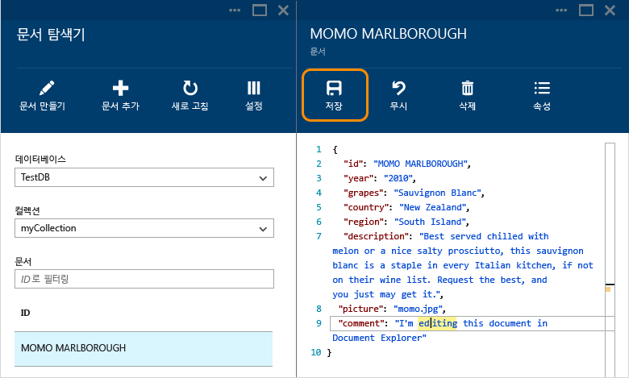
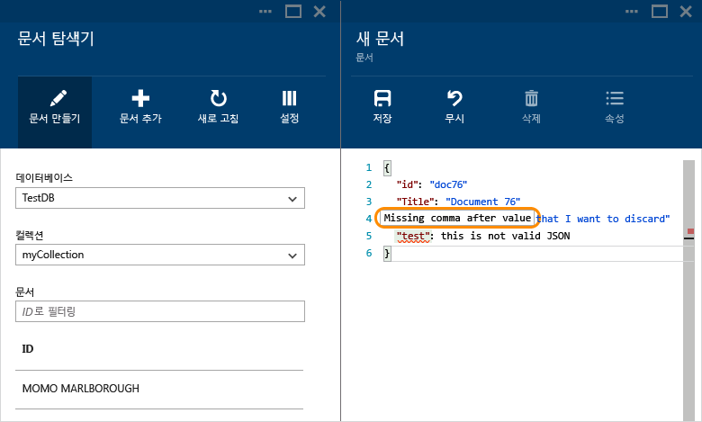
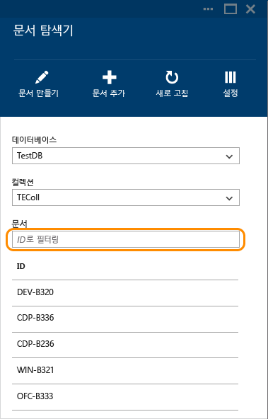
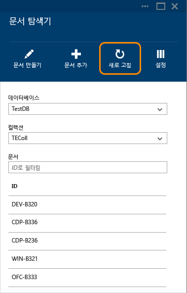

<properties
	pageTitle="DocumentDB 문서 탐색기, JSON 보기 | Microsoft Azure"
	description="NoSQL 문서 데이터베이스인 DocumentDB를 사용하여 JSON을 보고, 편집하고, 만들고, JSON 문서를 업로드하는 Azure 포털 도구인 DocumentDB 문서 탐색기에 대해 알아봅니다."
    keywords="JSON 보기"
	services="documentdb"
	authors="AndrewHoh"
	manager="jhubbard"
	editor="monicar"
	documentationCenter=""/>

<tags
	ms.service="documentdb"
	ms.workload="data-services"
	ms.tgt_pltfrm="na"
	ms.devlang="na"
	ms.topic="article"
	ms.date="08/30/2016"
	ms.author="anhoh"/>

# DocumentDB 문서 탐색기를 사용하여 JSON 문서 보기, 편집, 만들기 및 업로드

이 문서에서는 DocumentDB를 사용하여 JSON 문서를 보고, 편집하며, 만들고, 업로드하고, 필터링할 수 있는 Azure 포털 도구인 [Microsoft Azure DocumentDB](https://azure.microsoft.com/services/documentdb/) 문서 탐색기에 대해 개괄적으로 설명합니다.

MongoDB에 대한 프로토콜이 지원되는 DocumentDB 계정에서 문서 탐색기를 사용할 수 없습니다. 이 페이지는 이 기능이 설정된 경우에 업데이트됩니다.

## 문서 탐색기 시작

1. Azure 포털의 이동 표시줄에서 **DocumentDB(NoSQL)**를 클릭합니다. **DocumentDB(NoSQL)**가 표시되지 않으면 **서비스 더 보기**를 클릭한 다음 **DocumentDB(NoSQL)**를 클릭합니다.

2. 리소스 메뉴에서 **문서 탐색기**를 클릭합니다.
 
	

    **문서 탐색기** 블레이드에서 **데이터베이스** 및 **컬렉션** 드롭다운 목록은 문서 탐색기를 시작한 컨텍스트에 따라 미리 채워집니다.

## 문서 만들기

1. [문서 탐색기를 시작합니다](#launch-document-explorer).

2. **문서 탐색기** 블레이드에서 **문서 만들기**를 클릭합니다.

    **문서** 블레이드에서는 최소 JSON 코드 조각이 제공됩니다.

	

2. **문서** 블레이드에 만들려는 JSON 문서의 콘텐츠를 입력하거나 붙여넣은 다음 **저장**을 클릭하여 **문서 탐색기** 블레이드에 지정된 데이터베이스 및 컬렉션에 문서를 커밋합니다.

	

	> [AZURE.NOTE] "ID" 속성을 제공하지 않으면 문서 탐색기에서 ID 속성을 자동으로 추가하고 GUID를 ID 값으로 생성합니다.

    JSON 파일, MongoDB, SQL Server, CSV 파일, Azure 테이블 저장소 Amazon DynamoDB, HBase 또는 기타 DocumentDB 컬렉션의 데이터가 이미 있는 경우 DocumentDB의 [데이터 마이그레이션 도구](documentdb-import-data.md)를 사용하여 데이터를 신속하게 가져올 수 있습니다.

## 문서 편집

1. [문서 탐색기를 시작합니다](#launch-document-explorer).

2. 기존 문서를 편집하려면 **문서 탐색기** 블레이드에서 문서를 선택하고 **문서** 블레이드에서 편집한 다음 **저장**을 클릭합니다.

    

    문서를 편집하고 있는 경우 현재 편집 내용 집합을 취소하려면 **문서** 블레이드에서 **취소**를 클릭하고 취소 작업을 확인합니다. 그러면 이전 상태의 문서가 다시 로드됩니다.

    

## 문서 삭제

1. [문서 탐색기를 시작합니다](#launch-document-explorer).

2. **문서 탐색기**에서 문서를 선택하고 **삭제**를 클릭한 다음 삭제를 확인합니다. 확인하면 문서가 문서 탐색기 목록에서 바로 제거됩니다.

	

## JSON 문서 작업

문서 탐색기는 새 문서 또는 편집된 문서에 유효한 JSON이 포함되어 있는지 확인합니다. 또 잘못된 섹션을 가리켜 유효성 검사 오류에 대한 자세한 정보를 통해 JSON 오류를 볼 수도 있습니다.

또한 문서 탐색기에서는 잘못된 JSON 콘텐츠를 사용하여 문서를 저장할 수 없습니다.

끝으로, 문서 탐색기에서는 **속성** 명령을 클릭하여 현재 로드된 문서의 시스템 속성을 쉽게 볼 수 있습니다.

> [AZURE.NOTE] 타임스탬프(\_ts) 속성은 내부적으로 epoch 시간으로 표시되지만 문서 탐색기에서는 이 값을 사람이 읽을 수 있는 GMT 형식으로 표시합니다.

## 문서 필터링
문서 탐색기는 다양한 탐색 옵션 및 고급 설정을 지원합니다.

기본적으로 문서 탐색기는 선택한 컬렉션의 문서를 처음부터 최대 100개까지 만든 날짜 순으로 로드합니다. 문서 탐색기 블레이드 아래쪽에 있는 **추가 로드** 옵션을 선택하여 추가 문서(100개 일괄 처리)를 로드할 수 있습니다. **필터** 명령을 통해 로드할 문서를 선택할 수 있습니다.

1. [문서 탐색기를 시작합니다](#launch-document-explorer).

2. **문서 탐색기** 블레이드의 맨 위에 있는 **필터**를 클릭합니다.

    
  
3.  필터 설정은 명령 모음 아래에 나타납니다. 필터 설정에서 WHERE 절 및/또는 ORDER BY 절을 입력한 다음 **필터**를 클릭합니다.

	

	문서 탐색기는 필터 쿼리와 일치하는 문서 결과를 자동으로 새로 고칩니다. [SQL 쿼리 및 SQL 구문](documentdb-sql-query.md) 문서에서 DocumentDB SQL 문법에 대해 자세히 알아보거나 [SQL 쿼리 치트 시트](documentdb-sql-query-cheat-sheet.md)의 복사본을 인쇄합니다.

    **데이터베이스** 및 **컬렉션** 드롭다운 목록 상자를 사용하면 문서 탐색기를 닫았다가 다시 실행할 필요 없이 현재 문서를 보고 있는 컬렉션을 쉽게 변경할 수 있습니다.

    또한 문서 탐색기에서는 현재 로드된 문서 집합을 ID 속성별로 필터링할 수 있습니다. 문서 필터에 ID 상자별로 입력합니다.

	

	문서 탐색기 목록의 결과는 제공된 기준에 따라 필터링됩니다.

	

	> [AZURE.IMPORTANT] 문서 탐색기 필터 기능은 ***현재*** 로드된 문서 집합만 필터링하고 현재 선택한 컬렉션에 대해 쿼리를 수행하지 않습니다.

4. 문서 탐색기에서 로드한 문서 목록을 새로 고치려면 블레이드 맨 위에 있는 **새로 고침**을 클릭합니다.

	

## 문서 일괄 추가

문서 탐색기는 하나 이상의 기존 JSON 문서(업로드 작업당 최대 100개의 JSON 파일)의 대량 수집을 지원합니다.

1. [문서 탐색기를 시작합니다](#launch-document-explorer).

2. 업로드 프로세스를 시작하려면 **문서 업로드**를 클릭합니다.

	

    **문서 업로드** 블레이드가 열립니다.

2. 찾아보기 단추를 클릭하여 파일 탐색기 창을 열고 업로드할 JSON 문서를 하나 이상 선택한 다음 **열기**를 클릭합니다.

	

	> [AZURE.NOTE] 문서 탐색기는 현재 개별 업로드 작업당 최대 100개의 JSON 문서를 지원합니다.

3. 원하는 대로 선택했으면 **업로드** 단추를 클릭합니다. 문서가 문서 탐색기 그리드에 자동으로 추가되고 작업이 진행됨에 따라 업로드 결과가 표시됩니다. 가져오기 오류는 개별 파일에 대해 보고됩니다.

	

4. 작업이 완료되면 업로드할 다른 문서를 최대 100개까지 선택할 수 있습니다.

## 포털 외부 JSON 문서 작업

Azure 포털의 문서 탐색기는 DocumentDB의 문서 작업 방법 중 한 가지입니다. [REST API](https://msdn.microsoft.com/library/azure/mt489082.aspx) 또는 [클라이언트 SDK](documentdb-sdk-dotnet.md)를 사용하여 문서 작업을 할 수도 있습니다. 예제 코드는 [.NET SDK 문서 예제](documentdb-dotnet-samples.md#document-examples) 및 [Node.js SDK 문서 예제](documentdb-nodejs-samples.md#document-examples)를 참조하세요.

다른 소스(JSON 파일, MongoDB, SQL Server, CSV 파일, Azure 테이블 저장소, Amazon DynamoDB 또는 HBase)에서 파일을 가져오거나 마이그레이션해야 하는 경우 DocumentDB [데이터 마이그레이션 도구](documentdb-import-data.md)를 사용하여 데이터를 신속하게 DocumentDB로 가져올 수 있습니다.

## 문제 해결

**증상**: 문서 탐색기에서 **문서를 찾을 수 없습니다.**라는 메시지가 반환됩니다.

**솔루션**: 문서가 삽입된 올바른 구독, 데이터베이스 및 컬렉션을 선택했는지 확인합니다. 또한 처리량 할당량 내에서 작업을 하고 있는지도 확인합니다. 최대 처리량 수준에서 작업 중이어서 제한이 적용되는 경우에는 컬렉션의 최대 처리량 할당량보다 낮은 수준에서 작업할 수 있도록 응용 프로그램 사용량을 줄입니다.

**설명**: 포털도 응용 프로그램이므로 다른 응용 프로그램과 마찬가지로 DocumentDB 데이터베이스와 컬렉션을 호출합니다. 다른 응용 프로그램에서 수행하는 호출로 인해 현재 요청이 제한되고 있다면 포털도 제한될 수 있으므로 리소스가 포털에 표시되지 않습니다. 이 문제를 해결하려면 처리량이 많이 사용되는 원인을 해결한 후에 포털 블레이드를 새로 고칩니다. 처리량 사용을 측정하고 줄이는 방법에 대한 자세한 내용은 [성능 팁](documentdb-performance-tips.md) 문서의 [처리량](documentdb-performance-tips.md#throughput) 섹션에 나와 있습니다.

## 다음 단계

문서 탐색기에서 지원되는 DocumentDB SQL 문법에 대해 자세히 알아보려면 [SQL 쿼리 및 SQL 구문](documentdb-sql-query.md) 문서를 참조하거나 [SQL 쿼리 치트 시트](documentdb-sql-query-cheat-sheet.md)를 인쇄합니다.

[학습 경로](https://azure.microsoft.com/documentation/learning-paths/documentdb/)도 DocumentDB에 대해 자세히 파악할 수 있는 유용한 리소스입니다.

<!---HONumber=AcomDC_0831_2016-->