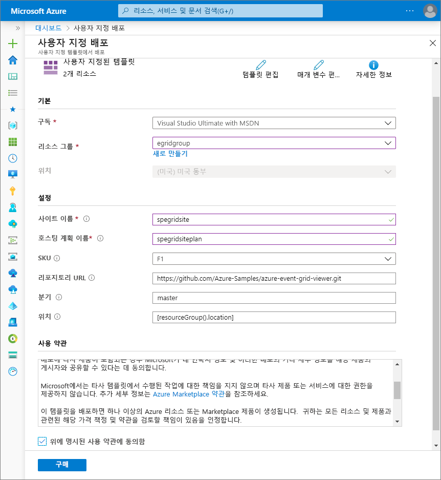
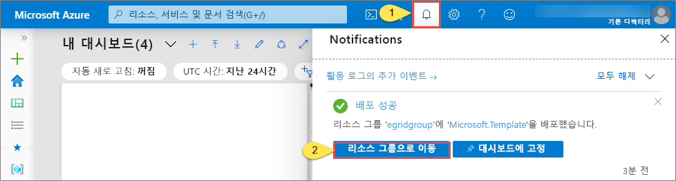
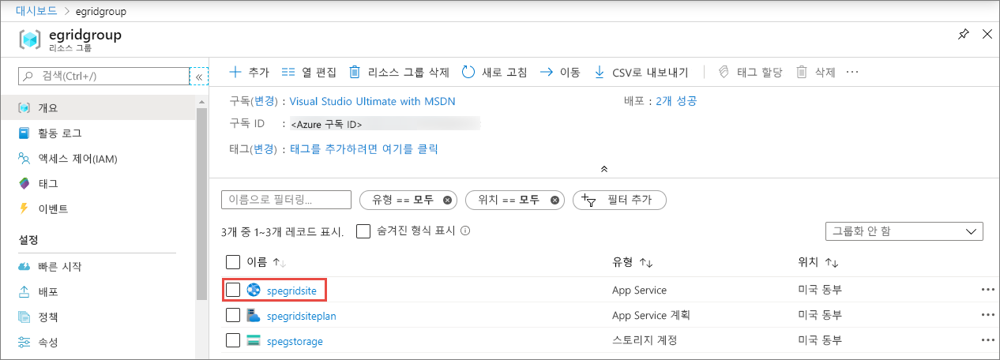
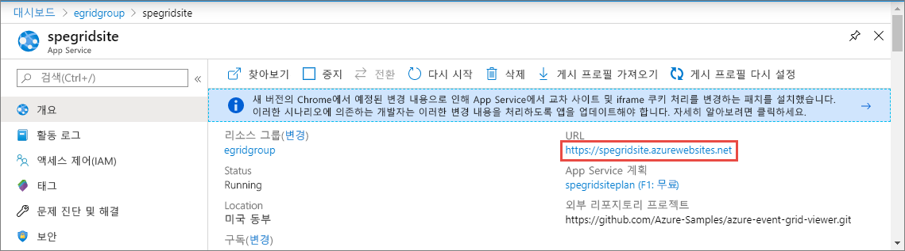
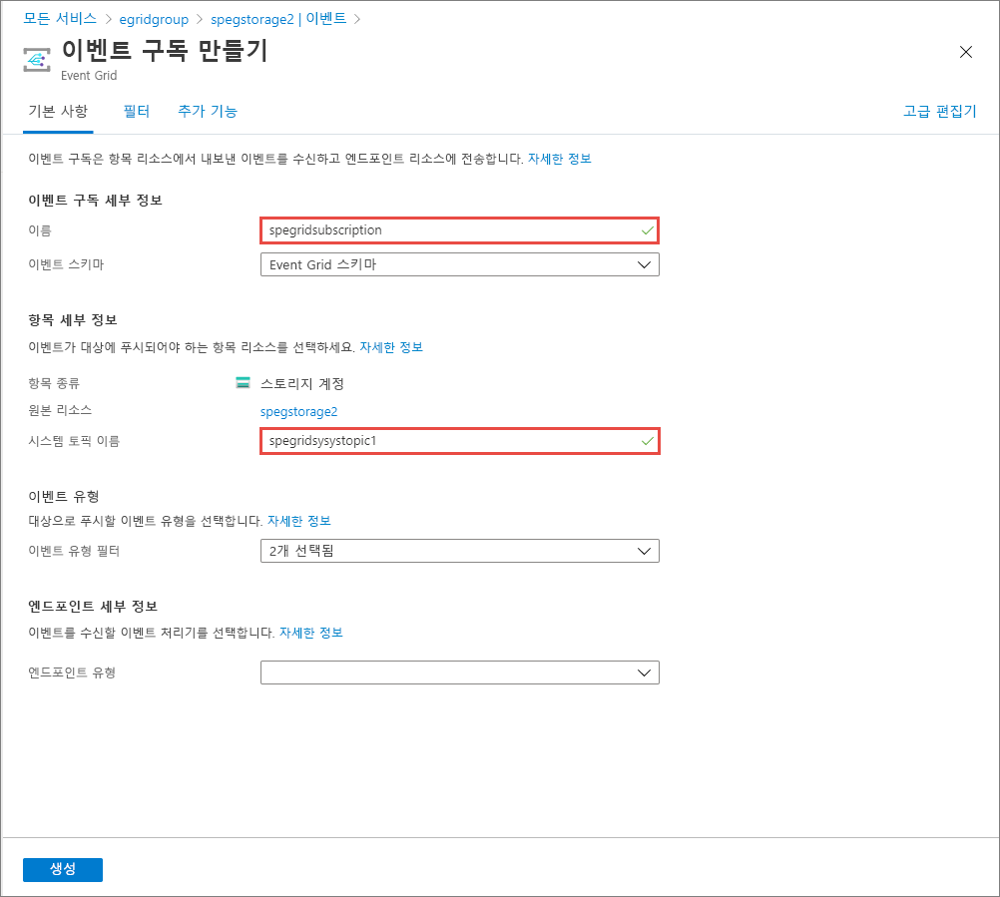
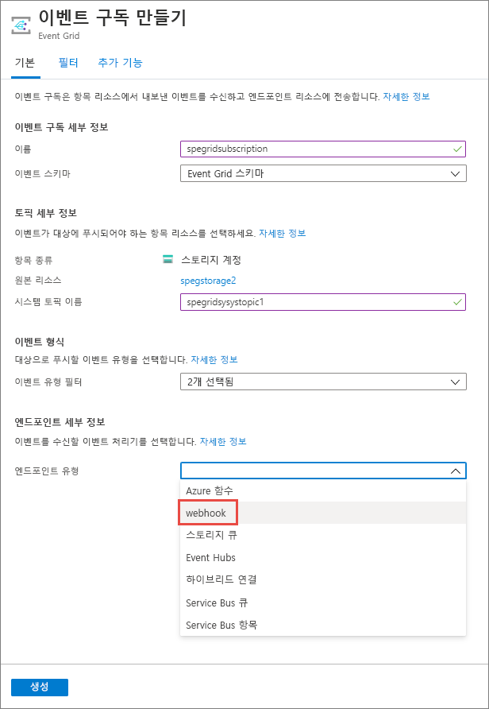
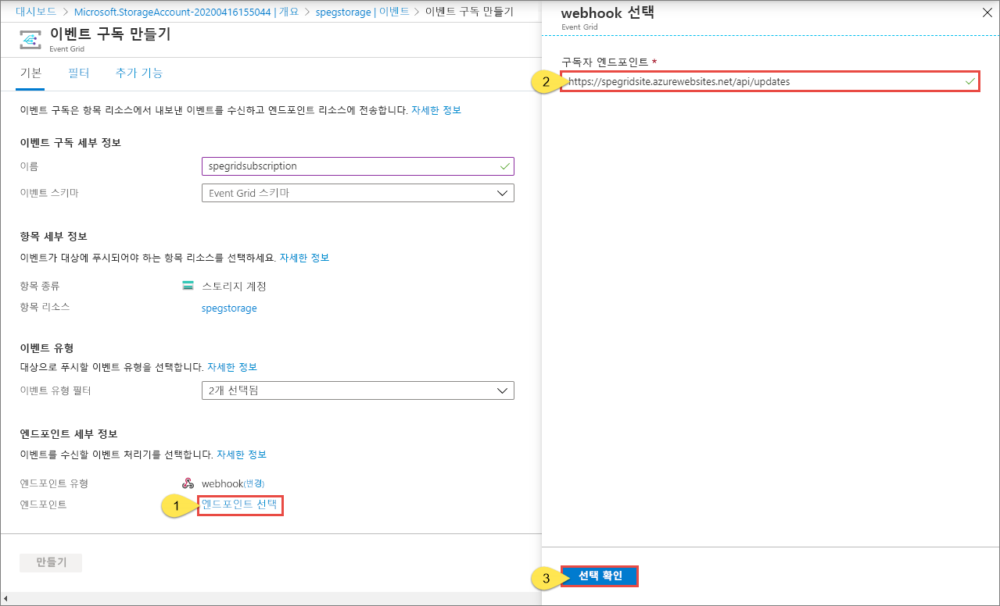
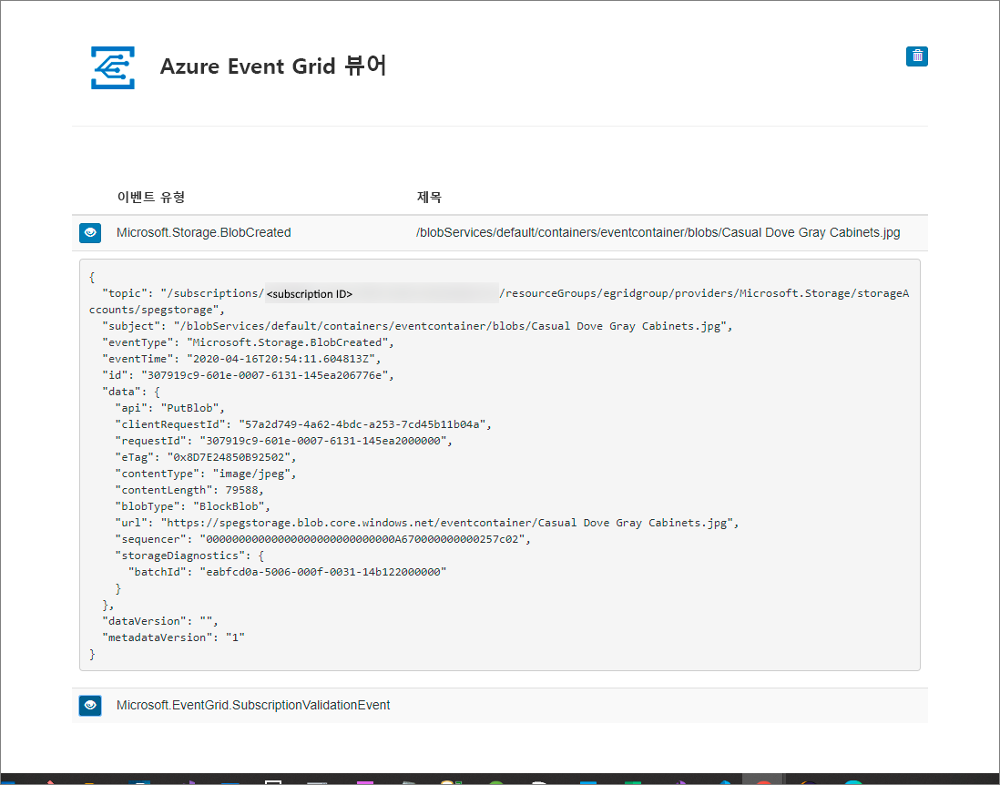

# 빠른 시작: Azure Portal을 사용하여 Blob Storage 이벤트를 웹 엔드포인트로 라우팅

Azure Event Grid는 클라우드에 대한 이벤트 서비스입니다. 이 문서에서는 Azure Portal을 사용하여 Blob Storage 계정을 만들고, 해당 Blob Storage에 대한 이벤트를 구독하고, 결과를 보기 위한 이벤트를 트리거합니다. 일반적으로 이벤트 데이터를 처리하고 작업을 수행하는 엔드포인트에 이벤트를 보냅니다. 그러나 이 문서를 간소화하기 위해 메시지를 수집하고 표시하는 웹앱에 이벤트를 보냅니다.

[!INCLUDE [quickstarts-free-trial-note.md](../../includes/quickstarts-free-trial-note.md)]

작업을 완료하면 이벤트 데이터가 웹앱에 보내진 것을 확인할 수 있습니다.

## 스토리지 계정 만들기

1. [Azure 포털](https://portal.azure.com/)에 로그인합니다.

1. Blob Storage를 만들려면 **리소스 만들기**를 선택합니다. 

1. 사용할 수 있는 옵션을 필터링하려면 **스토리지**를 선택하고, **스토리지 계정 - Blob, 파일, 테이블, 큐**를 선택합니다.

   

   이벤트를 구독하려면 범용 v2 스토리지 계정 또는 Blob Storage 계정을 만듭니다.
   
1. **스토리지 계정 만들기** 페이지에서 다음 단계를 수행합니다.
    1. Azure 구독을 선택합니다. 
    2. **리소스 그룹**의 경우 새 리소스 그룹을 만들거나 기존 리소스 그룹을 선택합니다. 
    3. 스토리지 계정의 이름을 입력합니다. 
    4. **검토 + 만들기**를 선택합니다. 

           
    5. **검토 + 만들기** 페이지에서 설정을 검토하고 **만들기**를 선택합니다. 

        >[!NOTE]
        > **StorageV2(범용 v2)** 및 **BlobStorage** 종류의 스토리지 계정만 이벤트 통합을 지원합니다. **스토리지(범용 v1)** 는 Event Grid와의 통합을 지원하지 *않습니다*.

## 메시지 엔드포인트 만들기

Blob Storage 계정에 대한 이벤트를 구독하기 전에 이벤트 메시지에 대한 엔드포인트를 만들어 보겠습니다. 일반적으로 엔드포인트는 이벤트 데이터를 기반으로 작업을 수행합니다. 이 빠른 시작을 간소화하기 위해 이벤트 메시지를 표시하는 [미리 작성된 웹앱](https://github.com/Azure-Samples/azure-event-grid-viewer)을 배포합니다. 배포된 솔루션은 App Service 계획, App Service 웹앱 및 GitHub의 소스 코드를 포함합니다.

1. **Azure에 배포**를 선택하여 구독에 솔루션을 배포합니다. 

   
2. **사용자 지정 배포** 페이지에서 다음 단계를 수행합니다. 
    1. **리소스 그룹**에서 스토리지 계정을 만들 때 생성된 것과 동일한 리소스 그룹을 선택합니다. 자습서를 완료한 후 리소스 그룹을 삭제하면 더 쉽게 정리할 수 있습니다.  
    2. **사이트 이름**에 웹앱의 이름을 입력합니다.
    3. **호스팅 계획 이름**에 웹앱을 호스팅하는 데 사용할 App Service 계획의 이름을 입력합니다.
    4. **위에 명시된 사용 약관에 동의함** 확인란을 선택합니다. 
    5. **구매**를 선택합니다. 

       
1. 배포가 완료될 때까지 몇 분 정도 걸릴 수 있습니다. 포털에서 경고(벨 아이콘)를 선택하고 **리소스 그룹으로 이동**을 선택합니다. 

    
4. **리소스 그룹** 페이지의 리소스 목록에서 자신이 만든 웹앱을 선택합니다. 이 목록에는 App Service 계획과 스토리지 계정도 표시됩니다. 

    
5. 웹앱의 **App Service** 페이지에서 URL을 선택하여 웹 사이트로 이동합니다. URL은 `https://<your-site-name>.azurewebsites.net` 형식이어야 합니다.
    
    

6. 사이트가 보이지만 사이트에 이벤트가 아직 게시되지 않았음을 확인합니다.

   

[!INCLUDE [event-grid-register-provider-portal.md](../../includes/event-grid-register-provider-portal.md)]

## Blob Storage 구독

항목을 구독하여 Event Grid에 추적하려는 이벤트와 이벤트를 보낼 위치를 알립니다.

1. 포털에서 앞서 만든 Azure Storage 계정으로 이동합니다. 왼쪽 메뉴에서 **모든 리소스**를 선택하고 스토리지 계정을 선택합니다. 
2. **스토리지 계정** 페이지의 왼쪽 메뉴에서 **이벤트**를 선택합니다. 
1. **추가 옵션** 및 **웹 후크**를 차례로 합니다. 엔드포인트에 대한 웹 후크를 사용하여 뷰어 앱에 이벤트를 보냅니다. 

   
3. **이벤트 구독 만들기** 페이지에서 다음 단계를 수행합니다. 
    1. 이벤트 구독에 대한 이벤트 **이름**을 입력합니다.
    2. **시스템 항목**의 **이름**을 입력합니다. 시스템 항목에 대한 자세한 내용은 [시스템 항목 개요](system-topics.md)를 참조하십시오.

       
    2. **엔드포인트 유형**으로 **웹후크**를 선택합니다. 

       
4. **엔드포인트**에서 **엔드포인트 선택**을 클릭하고 웹앱의 URL을 입력한 후 홈페이지 URL(예: `https://spegridsite.azurewebsites.net/api/updates`)에 `api/updates`를 추가한 다음, **선택 확인**을 선택합니다.

   
5. 이제 **이벤트 구독 만들기** 페이지에서 **만들기**를 선택하여 이벤트 구독을 만듭니다. 

   

1. 웹앱을 다시 확인하고, 구독 유효성 검사 이벤트를 보냈음을 확인합니다. 눈 모양 아이콘을 선택하여 이벤트 데이터를 확장합니다. Event Grid는 유효성 검사 이벤트를 보내므로 엔드포인트는 이벤트 데이터를 수신하려는 것을 확인할 수 있습니다. 웹앱은 구독의 유효성을 검사하는 코드를 포함합니다.

   

이제 이벤트를 트리거하여 Event Grid가 메시지를 사용자 엔드포인트에 어떻게 배포하는지 살펴 보겠습니다.

## 엔드포인트에 이벤트 보내기

파일을 업로드하여 Blob Storage에 대한 이벤트를 트리거합니다. 파일에는 특정 콘텐츠가 필요하지 않습니다. 문서에서는 testfile.txt라는 파일이 있다고 해도 모든 파일을 사용할 수 있다고 가정합니다.

1. Azure Portal에서 Blob Storage 계정으로 이동하고 **개요** 페이지에서 **컨테이너**를 선택합니다.

   

1. **+컨테이너**를 선택합니다. 컨테이너에 이름을 지정하고 모든 액세스 수준을 사용한 후 **만들기**를 선택합니다. 

   

1. 새 컨테이너를 선택합니다.

   

1. 파일을 업로드하려면 **업로드**를 선택합니다. **Blob 업로드** 페이지에서 테스트를 위해 업로드할 파일을 찾아 선택한 다음, 해당 페이지에서 **업로드**를 선택합니다. 

   

1. 테스트 파일을 찾아서 업로드합니다.

1. 이벤트를 트리거했고 Event Grid가 구독할 때 구성한 엔드포인트로 메시지를 보냈습니다. 메시지는 JSON 형식이며 하나 이상의 이벤트가 있는 배열을 포함합니다. 다음 예제에서 JSON 메시지는 이벤트가 1개 있는 배열을 포함합니다. 웹앱을 확인한 다음, **Blob 생성** 이벤트를 수신했다고 알립니다. 

   

## 리소스 정리

이 이벤트로 작업을 계속하려는 경우 이 문서에서 만든 리소스를 정리하지 마세요. 계속하지 않으려는 경우 이 문서에서 만든 리소스를 삭제합니다.

리소스 그룹을 선택하고 **리소스 그룹 삭제**를 선택합니다.

## 다음 단계

이제 사용자 지정 항목 및 이벤트 구독을 만드는 방법에 대해 알아보았습니다. 다음으로 어떤 Event Grid가 도움이 되는지 자세히 알아보세요.

- [Event Grid 정보](overview.md)
- [Blob Storage 이벤트를 사용자 지정 웹 엔드포인트로 라우팅](../storage/blobs/storage-blob-event-quickstart.md?toc=%2fazure%2fevent-grid%2ftoc.json)
- [Azure Event Grid 및 Logic Apps를 사용하여 가상 머신 변경 모니터링](monitor-virtual-machine-changes-event-grid-logic-app.md)
- [데이터 웨어하우스로 빅 데이터 스트림](event-grid-event-hubs-integration.md)
