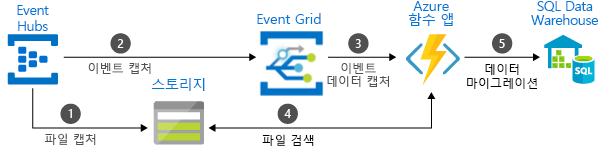

# 메시지를 배달하는 Azure 서비스 중에서 선택

Azure는 솔루션 전체에서 이벤트 메시지 배달에 도움이 되는 세 가지 서비스를 제공합니다. 이러한 서비스는 다음과 같습니다.

* [Event Grid](/azure/event-grid/)
* [Event Hubs](/azure/event-hubs/)
* [Service Bus](/azure/service-bus-messaging/)

약간의 유사성이 있지만 각 서비스는 특정 시나리오를 위해 설계되었습니다. 이 문서는 이러한 서비스 간의 차이점을 설명하고 응용 프로그램에 대해 어떤 것을 선택하는지 이해하는 데 도움을 줍니다. 대부분의 경우에서 메시지 서비스는 상호 보완적이며 함께 사용할 수 있습니다.

## 이벤트와 메시지 서비스 비교

이벤트를 배달하는 서비스와 메시지를 배달하는 서비스 간에 주목할 중요한 차이점이 있습니다.

### 행사

이벤트는 조건 또는 상태 변경에 대한 간단한 알림입니다. 이벤트 게시자는 이벤트 처리 방법에 대한 기대가 없습니다. 이벤트 소비자는 알림을 어떻게 처리할지 결정합니다. 이벤트는 불연속 단위 또는 시리즈의 일부일 수 있습니다.

불연속 이벤트는 상태 변경을 보고하며 실행이 가능합니다. 다음 단계를 수행하기 위해 소비자는 무언가가 발생했다는 것만 알면 됩니다. 이벤트 데이터는 발생한 상황에 대한 정보를 포함하지만 이벤트를 트리거한 데이터가 없습니다. 예를 들어, 이벤트는 소비자에게 파일이 만들어진 것을 알립니다. 파일에 대한 일반 정보를 포함할 수 있지만 파일 자체는 포함하지 않습니다. 불연속 이벤트는 크기를 조정해야 하는 서버리스 솔루션에 이상적입니다.

시리즈 이벤트는 조건을 보고하며 분석이 가능합니다. 이벤트는 시간 순서가 지정되며 상호 연관됩니다. 소비자는 발생한 결과를 분석하기 위해 순차화된 일련의 이벤트가 필요합니다.

### Message

메시지는 사용되거나 다른 위치에 저장되는 서비스에서 생성된 원시 데이터입니다. 메시지는 메시지 파이프라인을 트리거한 데이터를 포함합니다. 메시지 게시자는 소비자가 메시지를 처리하는 방식에 대한 기대를 합니다. 양측 사이에 계약이 존재합니다. 예를 들어 게시자는 원시 데이터가 포함된 메시지를 보내고 소비자가 이 데이터로부터 파일을 만들고 작업이 완료되면 응답을 보낼 것으로 기대합니다.

## 서비스의 비교

| 서비스 | 목적 | type | 사용하는 경우 |
| ------- | ------- | ---- | ----------- |
| Event Grid | 사후 프로그래밍 | 이벤트 배포(불연속) | 상태 변경에 대응 |
| Event Hubs | 빅 데이터 파이프라인 | 이벤트 스트리밍(시리즈) | 원격 분석 및 분산 데이터 스트리밍 |
| Service Bus | 높은 가치의 엔터프라이즈 메시지 | Message | 주문 처리 및 금융 거래 |

### Event Grid

Event Grid는 이벤트 구동, 반응성 프로그래밍을 사용할 수 있는 이벤트 백플레인입니다. 게시-구독 모델을 사용합니다. 게시자는 이벤트를 내보내지만 처리될 이벤트에 대한 기대치가 없습니다. 구독자는 처리하려는 이벤트를 결정합니다.

Event Grid는 Azure 서비스와 긴밀히 통합하고 타사 서비스와 통합할 수 있습니다. 이벤트 소비를 단순화하고 상수 폴링에 대한 필요성을 제거하여 비용을 낮춥니다. Event Grid는 효율적이고 안정적으로 Azure 및 비 Azure 리소스에서 이벤트를 라우팅합니다. 등록된 구독자 끝점에 이벤트를 분산합니다. 이벤트 메시지는 서비스 및 응용 프로그램의 변화에 대응하는 데 필요한 정보를 포함합니다. Event Grid는 데이터 파이프라인이 아니며, 업데이트된 실제 개체를 배달하지 않습니다.

다음과 같은 특성이 있습니다.

* 동적으로 확장
* 저렴한 비용
* 서버를 사용하지 않음

### Event Hubs

Azure Event Hubs는 빅 데이터 파이프라인입니다. 원격 분석 및 이벤트 스트림 데이터의 캡처, 보존 및 재생을 용이하게 합니다. 여러 동시 원본에서 데이터를 가져올 수 있습니다. Event Hubs는 다양한 스트림 처리 인프라 및 분석 서비스에 사용할 수 있도록 원격 분석 및 이벤트 데이터를 허용합니다. 데이터 스트림 또는 번들 이벤트 일괄 처리로 사용 가능합니다. 이 서비스는 실시간 처리에 대한 빠른 데이터 검색뿐만 아니라 저장된 원시 데이터의 반복된 재생을 활성화하는 단일 솔루션을 제공합니다. 처리 및 분석을 위해 스트리밍 데이터를 파일에 캡처할 수 있습니다.

다음과 같은 특성이 있습니다.

* 낮은 대기 시간
* 초당 수백만 개의 이벤트 수신 및 처리 가능

### Service Bus

Service Bus는 기존의 엔터프라이즈 응용 프로그램용입니다. 이러한 엔터프라이즈 응용 프로그램은 트랜잭션, 순서 지정, 중복 검색 및 즉시 일관성을 필요로 합니다. Service Bus는 클라우드 네이티브 응용 프로그램을 활성화하여 비즈니스 프로세스에 대한 신뢰할 수 있는 상태 전환 관리를 제공합니다. 손실되거나 중복될 수 없는 높은 가치의 메시지를 처리할 때 Azure Service Bus를 사용합니다. 또한 Service Bus는 하이브리드 클라우드 솔루션 간 매우 안전한 통신을 용이하게 하고 클라우드 솔루션에 기존 온-프레미스 시스템을 연결할 수 있습니다.

Service Bus는 조정된 메시징 시스템입니다. 소비하는 주체에서 메시지를 받을 준비가 될 때까지 메시지를 "broker"(예: 큐)에 저장합니다.

다음과 같은 특성이 있습니다.

* 폴링을 필요로 하는 신뢰할 수 있는 비동기 메시지 배달(서비스로 엔터프라이즈 메시지)
* FIFO, 일괄 처리/세션, 트랜잭션, 배달 못 한 편지 처리, 임시 컨트롤, 라우팅 및 필터링 및 중복 검색 등의 고급 메시징 기능

## 서비스를 함께 사용

경우에 따라 고유한 역할을 수행하기 위해 서비스를 함께 사용합니다. 예를 들어, 전자 상거래 사이트는 주문을 처리하는 Service Bus, 사이트 원격 분석을 캡처하는 Event Hubs 및 발송된 항목과 같은 이벤트에 응답하는 Event Grid를 사용할 수 있습니다.

다른 경우에서는 함께 연결하여 이벤트 및 데이터 파이프라인을 형성합니다. Event Grid를 사용하여 다른 서비스에서 이벤트에 응답합니다. 데이터를 데이터 웨어하우스로 마이그레이션하기 위해 Event Hubs와 함께 Event Grid를 사용하는 예는 [데이터 웨어하우스로 빅 데이터 스트림](event-grid-event-hubs-integration.md)을 참조하세요. 다음 이미지는 데이터 스트리밍에 대한 워크플로를 보여 줍니다.

## 다음 단계

* Azure 메시지 서비스에 대한 자세한 내용은 블로그 게시물 [이벤트, 데이터 요소 및 메시지 - 데이터에 대한 올바른 Azure 메시지 서비스 선택](https://azure.microsoft.com/blog/events-data-points-and-messages-choosing-the-right-azure-messaging-service-for-your-data/)을 참조하세요.
* Event Grid에 대한 소개는 [Event Grid 정보](overview.md)를 참조하세요.
* Event Grid를 시작하려면 [Azure Event Grid를 사용하여 사용자 지정 이벤트 만들기 및 라우팅](custom-event-quickstart.md)을 참조하세요.
* Event Hubs를 시작하려면 [Azure Portal을 사용하여 Event Hubs 네임스페이스 및 이벤트 허브 만들기](../event-hubs/event-hubs-create.md)를 참조하세요.
* Service Bus를 시작하려면 [Azure Portal을 사용하여 Service Bus 네임스페이스 만들기](../service-bus-messaging/service-bus-create-namespace-portal.md)를 참조하세요.