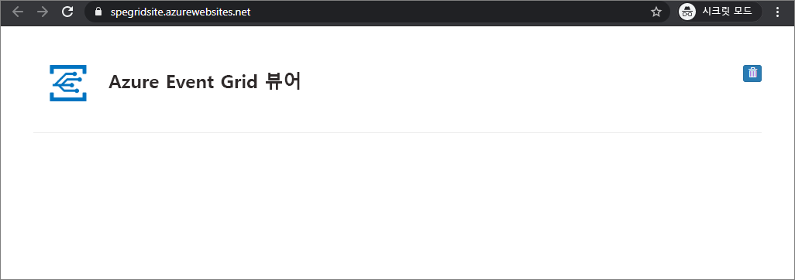

# <a name="build-your-own-disaster-recovery-for-custom-topics-in-event-grid"></a>Event Grid에서 사용자 지정 항목용 자체 재해 복구 빌드
재해 복구는 애플리케이션 기능의 심각한 손실에서 복구하는 데 집중합니다. 이 자습서에서는 특정 지역에서 Event Grid 서비스가 비정상 상태가 될 경우 복구되도록 이벤트 아키텍처를 설정하는 방법을 안내합니다.

이 자습서에서는 Event Grid의 사용자 지정 항목을 위한 능동-수동 장애 조치(failover) 아키텍처를 만드는 방법을 알아봅니다. 두 지역 간에 항목과 구독을 미러링한 후 항목이 비정상 상태가 되면 장애 조치(failover)를 관리하는 방식으로 장애 조치를 구현할 것입니다. 이 자습서의 아키텍처는 모든 새 트래픽을 장애 조치합니다. 이 설정에서는 손상된 지역이 다시 정상화될 때까지 이미 이동 중인 이벤트가 복구되지 않는다는 사실을 알아두는 것이 중요합니다.

> [!NOTE]
> Event Grid는 현재 서버 쪽에서 자동 GeoDR(지역 재해 복구)를 지원합니다. 장애 조치(failover) 프로세스를 더 효과적으로 제어하려는 경우 클라이언트 쪽 재해 복구 논리를 구현할 수 있습니다. 자동 GeoDR에 대한 자세한 내용은 [Azure Event Grid의 서버 쪽 지역 재해 복구](geo-disaster-recovery.md)를 참조하세요.

## <a name="create-a-message-endpoint"></a>메시지 엔드포인트 만들기

장애 조치 구성을 테스트하려면 이벤트를 수신할 엔드포인트가 필요합니다. 이 엔드포인트는 장애 조치 인프라의 일부가 아니지만 테스트를 용이하게 하기 위해 이벤트 처리기 역할을 합니다.

테스트를 간소화하려면 이벤트 메시지를 표시하는 [미리 작성된 웹앱](https://github.com/Azure-Samples/azure-event-grid-viewer)을 배포합니다. 배포된 솔루션은 App Service 계획, App Service 웹앱 및 GitHub의 소스 코드를 포함합니다.

1. **Azure에 배포**를 선택하여 구독에 솔루션을 배포합니다. Azure Portal에서 매개 변수에 대한 값을 제공합니다.

   <a href="https://portal.azure.com/#create/Microsoft.Template/uri/https%3A%2F%2Fraw.githubusercontent.com%2FAzure-Samples%2Fazure-event-grid-viewer%2Fmaster%2Fazuredeploy.json" target="_blank"></a>

1. 배포가 완료될 때까지 몇 분 정도 걸릴 수 있습니다. 배포가 성공된 후 실행하는지 확인하려면 웹앱을 봅니다. 웹 브라우저에서 `https://<your-site-name>.azurewebsites.net`으로 이동합니다.
나중에 필요하므로 이 URL을 메모해 두세요.

1. 참조하는 사이트에 이벤트가 아직 게시되지 않았습니다.

   

[!INCLUDE [event-grid-register-provider-portal.md](../../includes/event-grid-register-provider-portal.md)]


## <a name="create-your-primary-and-secondary-topics"></a>주 및 보조 항목 만들기

먼저 두 개의 Event Grid 항목을 만듭니다. 이러한 항목은 주 및 보조 항목 역할을 합니다. 기본적으로 이벤트는 주 항목을 통과합니다. 주 지역에 서비스 중단이 발생할 경우 보조 지역에서 인계합니다.

1. [Azure Portal](https://portal.azure.com)에 로그인합니다. 

1. Azure 주 메뉴의 왼쪽 상단 모서리에서 **모든 서비스**를 선택하고 **Event Grid**를 검색한 후 **Event Grid 항목**을 선택합니다.

   

    Event Grid 항목 옆에 있는 별표를 선택하여 나중에 쉽게 액세스할 수 있도록 리소스 메뉴에 추가합니다.

1. Event Grid 항목 메뉴에서 **+추가**를 선택하여 주 항목을 만듭니다.

   * 항목에 논리적 이름을 지정하고 쉽게 추적할 수 있도록 "-primary"를 접미사로 추가합니다.
   * 이 항목의 지역이 주 지역이 됩니다.

     

1. 항목이 생성되면 해당 항목으로 이동하고 **항목 엔드포인트**를 복사합니다. 이 URI이 나중에 필요할 것입니다.

    

1. 또한 나중에 필요하게 될 항목의 액세스 키를 가져옵니다. 리소스 메뉴에서 **액세스 키**를 클릭하고 키 1을 복사합니다.

    

1. 항목 블레이드에서 **+이벤트 구독**을 클릭하여 자습서의 필수 조건에서 만든 이벤트 수신기 웹 사이트를 연결하는 구독을 만듭니다.

   * 이벤트 구독에 논리적 이름을 지정하고 쉽게 추적할 수 있도록 "-primary"를 접미사로 추가합니다.
   * 엔드포인트 유형 웹후크를 선택합니다.
   * 이벤트 수신기의 이벤트 URL에 엔드포인트를 `https://<your-event-reciever>.azurewebsites.net/api/updates`와 같이 설정합니다.

     

1. 동일한 흐름을 반복하여 주 항목 및 구독을 만듭니다. 이번에는 더 쉽게 추적할 수 있도록 "-primary" 접미사를 "-secondary"로 바꿉니다. 마지막으로, 다른 Azure 지역에 배치해야 합니다. 원하는 모든 위치에 배치할 수 있지만 [Azure 지역 쌍](../best-practices-availability-paired-regions.md)을 사용하는 것이 좋습니다. 보조 항목과 구독을 다른 지역에 배치하면 주 지역이 다운되더라도 새 이벤트가 진행되도록 할 수 있습니다.

지금까지 다음을 구현했습니다.

   * 테스트용 이벤트 수신기 웹 사이트.
   * 주 지역의 주 항목.
   * 주 항목을 이벤트 수신기 웹 사이트에 연결하는 주 이벤트 구독.
   * 보조 지역의 보조 항목.
   * 주 항목을 이벤트 수신기 웹 사이트에 연결하는 보조 이벤트 구독.

## <a name="implement-client-side-failover"></a>클라이언트 쪽 장애 조치(failover) 구현

이제 항목과 구독 설정의 지역적 중복 쌍이 있으므로 클라이언트 쪽 장애 조치(failover)를 구현할 수 있습니다. 구현하는 방법은 여러 가지가 있지만 모든 장애 조치 구현에서 일반적인 한 가지 특징이 있습니다. 한 항목이 더 이상 정상 상태가 아닐 경우 트래픽이 다른 항목으로 리디렉션됩니다.

### <a name="basic-client-side-implementation"></a>기본 클라이언트 쪽 구현

다음 샘플 코드는 항상 기본 항목을 먼저 게시하려고 하는 간단한 .NET 게시자입니다. 기본 항목을 게시하는 데 실패하면 보조 항목을 장애 조치합니다. 두 경우 모두 `https://<topic-name>.<topic-region>.eventgrid.azure.net/api/health`에서 GET을 수행하여 다른 항목의 상태 api를 확인합니다. 정상적인 항목은 **/api/health** 엔드포인트에 대해 GET이 수행될 경우 항상 **200 OK**로 응답해야 합니다.

```csharp
using System;
using System.Net.Http;
using System.Collections.Generic;
using Microsoft.Azure.EventGrid;
using Microsoft.Azure.EventGrid.Models;
using Newtonsoft.Json;

namespace EventGridFailoverPublisher
{
    // This captures the "Data" portion of an EventGridEvent on a custom topic
    class FailoverEventData
    {
        [JsonProperty(PropertyName = "teststatus")]
        public string TestStatus { get; set; }
    }

    class Program
    {
        static void Main(string[] args)
        {
            // TODO: Enter the endpoint each topic. You can find this topic endpoint value
            // in the "Overview" section in the "Event Grid Topics" blade in Azure Portal..
            string primaryTopic = "https://<primary-topic-name>.<primary-topic-region>.eventgrid.azure.net/api/events";
            string secondaryTopic = "https://<secondary-topic-name>.<secondary-topic-region>.eventgrid.azure.net/api/events";

            // TODO: Enter topic key for each topic. You can find this in the "Access Keys" section in the
            // "Event Grid Topics" blade in Azure Portal.
            string primaryTopicKey = "<your-primary-topic-key>";
            string secondaryTopicKey = "<your-secondary-topic-key>";

            string primaryTopicHostname = new Uri( primaryTopic).Host;
            string secondaryTopicHostname = new Uri(secondaryTopic).Host;

            Uri primaryTopicHealthProbe = new Uri("https://" + primaryTopicHostname + "/api/health");
            Uri secondaryTopicHealthProbe = new Uri("https://" + secondaryTopicHostname + "/api/health");

            var httpClient = new HttpClient();

            try
            {
                TopicCredentials topicCredentials = new TopicCredentials(primaryTopicKey);
                EventGridClient client = new EventGridClient(topicCredentials);

                client.PublishEventsAsync(primaryTopicHostname, GetEventsList()).GetAwaiter().GetResult();
                Console.Write("Published events to primary Event Grid topic.");

                HttpResponseMessage health = httpClient.GetAsync(secondaryTopicHealthProbe).Result;
                Console.Write("\n\nSecondary Topic health " + health);
            }
            catch (Microsoft.Rest.Azure.CloudException e)
            {
                TopicCredentials topicCredentials = new TopicCredentials(secondaryTopicKey);
                EventGridClient client = new EventGridClient(topicCredentials);

                client.PublishEventsAsync(secondaryTopicHostname, GetEventsList()).GetAwaiter().GetResult();
                Console.Write("Published events to secondary Event Grid topic. Reason for primary topic failure:\n\n" + e);

                HttpResponseMessage health = httpClient.GetAsync(primaryTopicHealthProbe).Result;
                Console.Write("\n\nPrimary Topic health " + health);
            }

            Console.ReadLine();
        }

        static IList<EventGridEvent> GetEventsList()
        {
            List<EventGridEvent> eventsList = new List<EventGridEvent>();

            for (int i = 0; i < 5; i++)
            {
                eventsList.Add(new EventGridEvent()
                {
                    Id = Guid.NewGuid().ToString(),
                    EventType = "Contoso.Failover.Test",
                    Data = new FailoverEventData()
                    {
                        TestStatus = "success"
                    },
                    EventTime = DateTime.Now,
                    Subject = "test" + i,
                    DataVersion = "2.0"
                });
            }

            return eventsList;
        }
    }
}
```

### <a name="try-it-out"></a>체험

모든 구성 요소가 설정되었으므로 장애 조치(failover) 구현을 테스트할 수 있습니다. Visual Studio 코드 또는 원하는 환경에서 위의 샘플을 실행합니다. 다음의 4개 값을 해당 항목의 엔드포인트 및 키로 바꾸세요.

   * primaryTopic - 주 항목의 엔드포인트입니다.
   * secondaryTopic - 보조 항목의 엔드포인트입니다.
   * primaryTopicKey - 주 항목의 키입니다.
   * secondaryTopicKey - 보조 항목의 키입니다.

이벤트 게시자를 실행해 보세요. 아래와 같은 Event Grid 뷰어에서 테스트 이벤트가 시작되는 것을 볼 수 있을 것입니다.


장애 조치(failover)가 작동하는지 확인하려면 기본 항목 키의 문자 몇 개를 변경하여 더 이상 유효하지 않게 하면 됩니다. 게시자를 다시 실행해 보세요. 그래도 새 이벤트가 Event Grid 뷰어에 나타나야 하지만 콘솔을 보면 현재 보조 항목을 통해 게시되고 있는 것이 보일 것입니다.

### <a name="possible-extensions"></a>가능한 확장 방법

필요에 따라 이 샘플을 확장하는 방법은 여러 가지가 있습니다. 대규모 시나리오의 경우 항목의 상태 api에 대한 정기 검사를 별도로 수행하는 것이 좋습니다. 이렇게 하면 항목이 다운될 경우 매번 게시할 때마다 확인할 필요가 없습니다. 항목이 정상 상태가 아니라는 것을 알고 있다면 보조 항목에 게시되도록 기본값을 설정하면 됩니다.

마찬가지로, 특정 요구 사항에 따라 장애 복구(failback) 논리를 구현하는 것이 좋습니다. 대기 시간 단축을 위해 가장 가까운 데이터 센터로 게시하는 것이 중요할 경우에는 장애 조치한 항목의 상태 api를 정기적으로 검사하면 됩니다. 다시 정상 상태가 되면 더 가까운 데이터 센터로 장애 복구(failback)를 수행해도 무방합니다.

## <a name="next-steps"></a>다음 단계

- [http 엔드포인트에서 이벤트를 수신](./receive-events.md)하는 방법 알아보기
- [하이브리드 연결로 이벤트를 라우팅](./custom-event-to-hybrid-connection.md)하는 방법 알아보기
- [Azure DNS 및 Traffic Manager를 사용한 재해 복구](https://docs.microsoft.com/azure/networking/disaster-recovery-dns-traffic-manager)에 대해 알아보기
