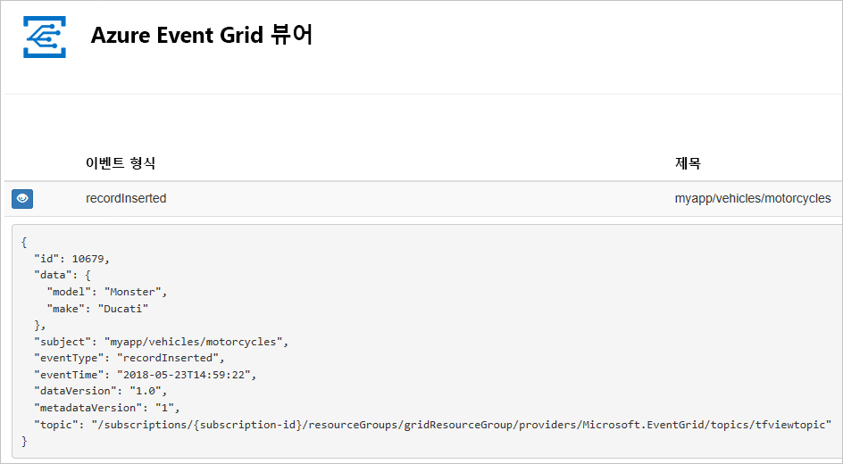
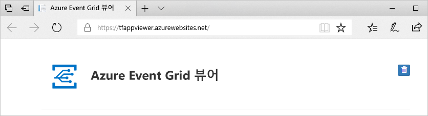
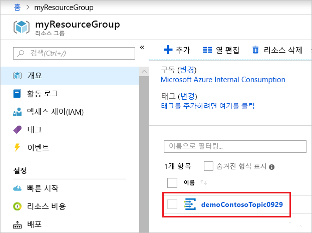
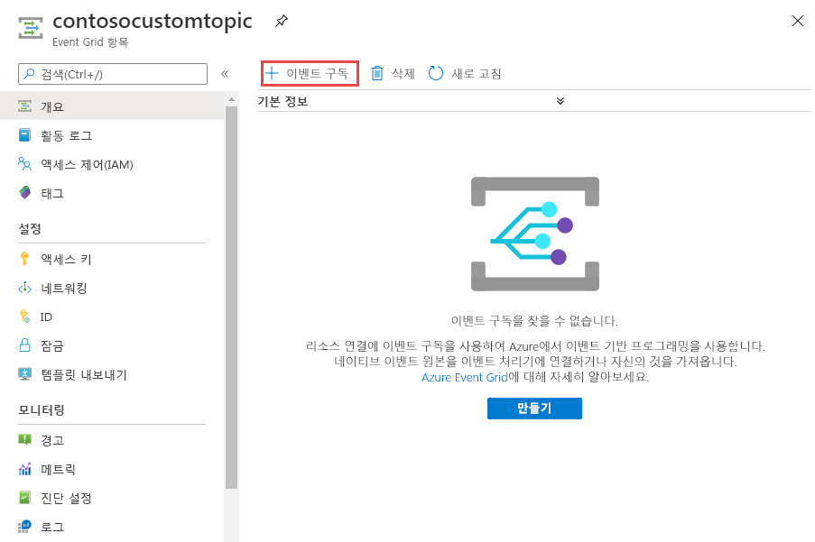
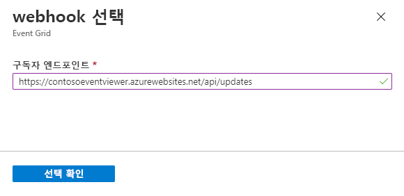
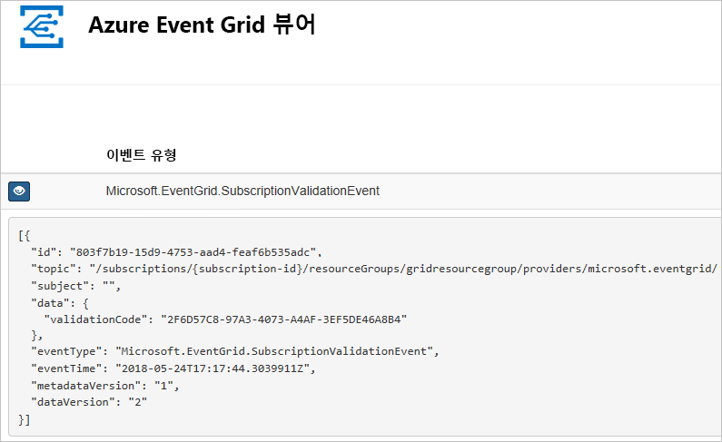

# <a name="quickstart-route-custom-events-to-web-endpoint-with-the-azure-portal-and-event-grid"></a>빠른 시작: Azure Portal 및 Event Grid를 사용하여 사용자 지정 이벤트를 웹 엔드포인트로 라우팅

Azure Event Grid는 클라우드에 대한 이벤트 서비스입니다. 이 문서에서는 Azure Portal을 사용하여 사용자 지정 항목을 만들고 사용자 지정 항목을 구독하며 이벤트를 트리거하여 결과를 확인합니다. 일반적으로 이벤트 데이터를 처리하고 작업을 수행하는 엔드포인트에 이벤트를 보냅니다. 그러나 이 문서를 간소화하기 위해 메시지를 수집하고 표시하는 웹앱에 이벤트를 보냅니다.

작업을 완료하면 이벤트 데이터가 웹앱에 보내진 것을 확인할 수 있습니다.



[!INCLUDE [quickstarts-free-trial-note.md](../../includes/quickstarts-free-trial-note.md)]

[!INCLUDE [event-grid-register-provider-portal.md](../../includes/event-grid-register-provider-portal.md)]

## <a name="create-a-custom-topic"></a>사용자 지정 토픽 만들기

Event Grid 항목은 이벤트를 게시하는 사용자 정의 엔드포인트를 제공합니다. 

1. [Azure 포털](https://portal.azure.com/)에 로그인합니다.

1. 사용자 지정 항목을 만들려면 **리소스 만들기**를 선택합니다. 

   

1. *Event Grid 항목*을 검색하고 사용 가능한 옵션 중에서 선택합니다.

   

1. **만들기**를 선택합니다.

   

1. 사용자 지정 항목의 고유한 이름을 입력합니다. DNS 항목으로 표시되기 때문에 토픽 이름은 고유해야 합니다. 이미지에 표시된 이름은 사용하지 마십시오. 대신 고유한 이름을 만듭니다. 3~50자 사이로 a-z, A-Z, 0-9 및 “-” 값만 포함해야 합니다. 리소스 그룹에 대한 이름을 입력합니다. **만들기**를 선택합니다.

   

1. 사용자 지정 항목을 만든 후 성공 알림이 표시됩니다.

   

   배포가 실패한 경우 오류의 원인을 찾습니다. **배포 실패**를 선택합니다.

   

   오류 메시지를 선택합니다.

   

   다음 이미지에는 사용자 지정 항목에 대한 이름이 이미 사용 중이므로 실패한 배포가 나와 있습니다. 이 오류가 표시되는 경우 다른 이름을 사용하여 배포를 다시 시도하십시오.

   

## <a name="create-a-message-endpoint"></a>메시지 엔드포인트 만들기

사용자 지정 토픽을 구독하기 전에 이벤트 메시지에 대한 엔드포인트를 만들어 보겠습니다. 일반적으로 엔드포인트는 이벤트 데이터를 기반으로 작업을 수행합니다. 이 빠른 시작을 간소화하기 위해 이벤트 메시지를 표시하는 [미리 작성된 웹앱](https://github.com/Azure-Samples/azure-event-grid-viewer)을 배포합니다. 배포된 솔루션은 App Service 계획, App Service 웹앱 및 GitHub의 소스 코드를 포함합니다.

1. **Azure에 배포**를 선택하여 구독에 솔루션을 배포합니다. Azure Portal에서 매개 변수에 대한 값을 제공합니다.

   <a href="https://portal.azure.com/#create/Microsoft.Template/uri/https%3A%2F%2Fraw.githubusercontent.com%2FAzure-Samples%2Fazure-event-grid-viewer%2Fmaster%2Fazuredeploy.json" target="_blank"></a>

1. 배포가 완료될 때까지 몇 분 정도 걸릴 수 있습니다. 배포가 성공된 후 실행하는지 확인하려면 웹앱을 봅니다. 웹 브라우저에서 `https://<your-site-name>.azurewebsites.net`으로 이동합니다.

1. 참조하는 사이트에 이벤트가 아직 게시되지 않았습니다.

   

## <a name="subscribe-to-custom-topic"></a>사용자 지정 항목 구독

Event Grid 항목을 구독하여 Event Grid에 추적하려는 이벤트와 이벤트를 보낼 위치를 알립니다.

1. 포털에서 사용자 지정 항목을 선택합니다.

   

1. **+ 이벤트 구독**을 선택합니다.

   

1. 엔드포인트 형식에 **웹후크**를 선택합니다. 이벤트 구독의 이름을 입력합니다.

   

1. **엔드포인트 선택**을 선택합니다. 

1. 웹 후크 엔드포인트의 경우 웹앱의 URL을 제공하고 `api/updates`를 홈 페이지 URL에 추가합니다. **선택 확인**을 선택합니다.

   

1. 이벤트 구독 값 프로비전을 마치면, **만들기**를 선택합니다.

웹앱을 다시 확인하고, 구독 유효성 검사 이벤트를 보냈음을 확인합니다. 눈 모양 아이콘을 선택하여 이벤트 데이터를 확장합니다. Event Grid는 유효성 검사 이벤트를 보내므로 엔드포인트는 이벤트 데이터를 수신하려는 것을 확인할 수 있습니다. 웹앱은 구독의 유효성을 검사하는 코드를 포함합니다.



## <a name="send-an-event-to-your-topic"></a>토픽에 이벤트 보내기

이제 이벤트를 트리거하여 Event Grid가 메시지를 사용자 엔드포인트에 어떻게 배포하는지 살펴 보겠습니다. Azure CLI 또는 PowerShell을 사용하여 사용자 지정 항목에 테스트 이벤트를 보냅니다. 일반적으로 애플리케이션 또는 Azure 서비스는 이벤트 데이터를 보냅니다.

첫 번째 예제에서는 Azure CLI를 사용합니다. 사용자 지정 항목에 대한 URL 및 키와 샘플 이벤트 데이터를 가져옵니다. `<topic_name>`의 사용자 지정 항목 이름을 사용합니다. 샘플 이벤트 데이터가 생성됩니다. JSON의 `data` 요소는 이벤트의 페이로드입니다. 모든 잘 구성된(Well-Formed) JSON은 이 필드에 배치될 수 있습니다. 또한 고급 라우팅 및 필터링을 위해 제목 필드를 사용할 수 있습니다. CURL은 HTTP 요청을 보내는 유틸리티입니다.

```azurecli-interactive
endpoint=$(az eventgrid topic show --name <topic_name> -g myResourceGroup --query "endpoint" --output tsv)
key=$(az eventgrid topic key list --name <topic_name> -g myResourceGroup --query "key1" --output tsv)

event='[ {"id": "'"$RANDOM"'", "eventType": "recordInserted", "subject": "myapp/vehicles/motorcycles", "eventTime": "'`date +%Y-%m-%dT%H:%M:%S%z`'", "data":{ "make": "Ducati", "model": "Monster"},"dataVersion": "1.0"} ]'

curl -X POST -H "aeg-sas-key: $key" -d "$event" $endpoint
```

두 번째 예제에서는 PowerShell을 사용하여 비슷한 단계를 수행합니다.

```azurepowershell-interactive
$endpoint = (Get-AzureRmEventGridTopic -ResourceGroupName gridResourceGroup -Name <topic-name>).Endpoint
$keys = Get-AzureRmEventGridTopicKey -ResourceGroupName gridResourceGroup -Name <topic-name>

$eventID = Get-Random 99999

#Date format should be SortableDateTimePattern (ISO 8601)
$eventDate = Get-Date -Format s

#Construct body using Hashtable
$htbody = @{
    id= $eventID
    eventType="recordInserted"
    subject="myapp/vehicles/motorcycles"
    eventTime= $eventDate   
    data= @{
        make="Ducati"
        model="Monster"
    }
    dataVersion="1.0"
}

#Use ConvertTo-Json to convert event body from Hashtable to JSON Object
#Append square brackets to the converted JSON payload since they are expected in the event's JSON payload syntax
$body = "["+(ConvertTo-Json $htbody)+"]"

Invoke-WebRequest -Uri $endpoint -Method POST -Body $body -Headers @{"aeg-sas-key" = $keys.Key1}
```

이벤트를 트리거했고 Event Grid가 구독할 때 구성한 엔드포인트로 메시지를 보냈습니다. 웹앱을 확인하여 방금 전송한 이벤트를 봅니다.

```json
[{
  "id": "1807",
  "eventType": "recordInserted",
  "subject": "myapp/vehicles/motorcycles",
  "eventTime": "2017-08-10T21:03:07+00:00",
  "data": {
    "make": "Ducati",
    "model": "Monster"
  },
  "dataVersion": "1.0",
  "metadataVersion": "1",
  "topic": "/subscriptions/{subscription-id}/resourceGroups/{resource-group}/providers/Microsoft.EventGrid/topics/{topic}"
}]
```


## <a name="clean-up-resources"></a>리소스 정리

이 이벤트로 작업을 계속하려는 경우 이 문서에서 만든 리소스를 정리하지 마세요. 계속하지 않으려는 경우 이 문서에서 만든 리소스를 삭제합니다.

리소스 그룹을 선택하고 **리소스 그룹 삭제**를 선택합니다.

## <a name="next-steps"></a>다음 단계

이제 사용자 지정 항목 및 이벤트 구독을 만드는 방법에 대해 알아보았습니다. 다음으로 어떤 Event Grid가 도움이 되는지 자세히 알아보세요.

- [Event Grid 정보](overview.md)
- [Blob Storage 이벤트를 사용자 지정 웹 엔드포인트로 라우팅](../storage/blobs/storage-blob-event-quickstart.md?toc=%2fazure%2fevent-grid%2ftoc.json)
- [Azure Event Grid 및 Logic Apps를 사용하여 가상 머신 변경 모니터링](monitor-virtual-machine-changes-event-grid-logic-app.md)
- [데이터 웨어하우스로 빅 데이터 스트림](event-grid-event-hubs-integration.md)
