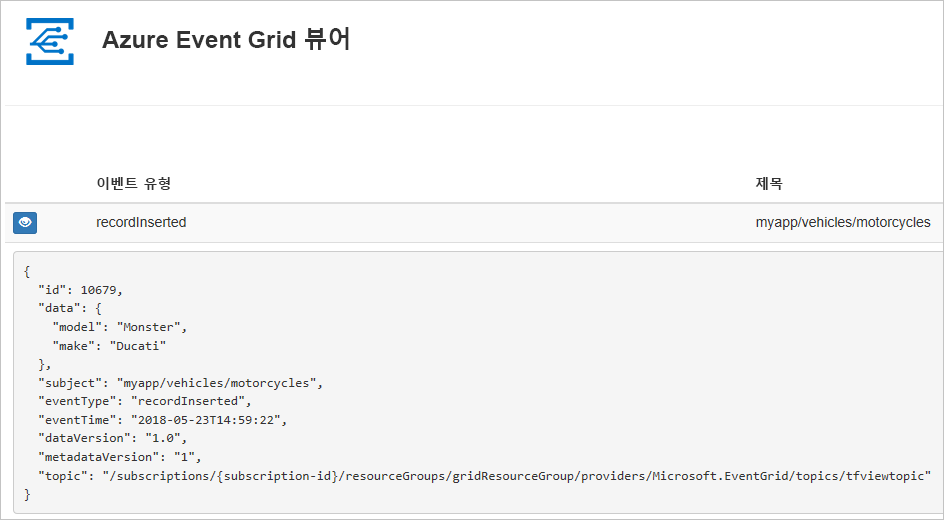
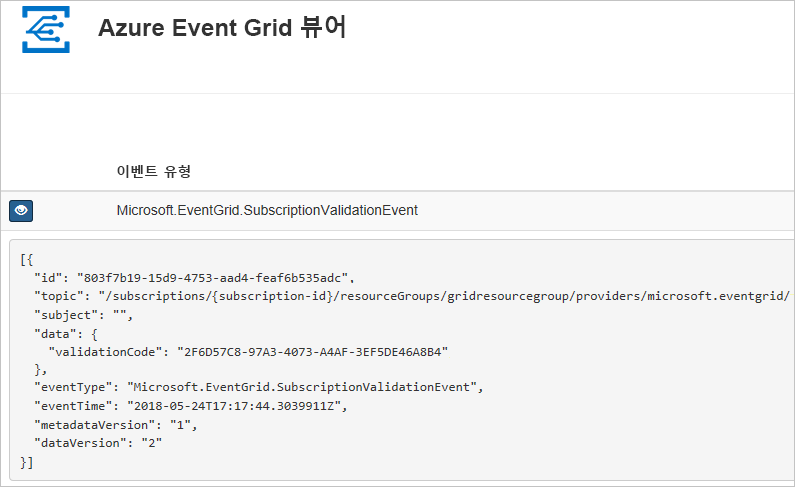

# <a name="create-and-route-custom-events-with-azure-cli-and-event-grid"></a>Azure CLI 및 Event Grid를 사용하여 사용자 지정 이벤트 만들기 및 라우팅

Azure Event Grid는 클라우드에 대한 이벤트 서비스입니다. 이 문서에서는 Azure CLI를 사용하여 사용자 지정 토픽을 만들고 해당 토픽을 구독하며 이벤트를 트리거하여 결과를 확인합니다. 일반적으로 이벤트 데이터를 처리하고 작업을 수행하는 엔드포인트에 이벤트를 보냅니다. 그러나 이 문서를 간소화하기 위해 메시지를 수집하고 표시하는 웹앱에 이벤트를 보냅니다.

작업을 완료하면 이벤트 데이터가 웹앱에 보내진 것을 확인할 수 있습니다.



[!INCLUDE [quickstarts-free-trial-note.md](../../includes/quickstarts-free-trial-note.md)]

[!INCLUDE [cloud-shell-try-it.md](../../includes/cloud-shell-try-it.md)]

CLI를 로컬로 설치하여 사용하도록 선택하는 경우 이 문서에서는 최신 버전의 Azure CLI(2.0.24 이상)를 실행해야 합니다. 버전을 확인하려면 `az --version`을 실행합니다. 설치 또는 업그레이드해야 하는 경우 [Azure CLI 설치](/cli/azure/install-azure-cli)를 참조하세요.

Cloud Shell을 사용하지 않는 경우 먼저 `az login`을 사용하여 로그인해야 합니다.

## <a name="create-a-resource-group"></a>리소스 그룹 만들기

Event Grid 토픽은 Azure 리소스이며 Azure 리소스 그룹에 배치해야 합니다. 리소스 그룹은 Azure 리소스가 배포 및 관리되는 논리적 컬렉션입니다.

[az group create](/cli/azure/group#az-group-create) 명령을 사용하여 리소스 그룹을 만듭니다. 

다음 예제에서는 *westus2* 위치에 *gridResourceGroup*이라는 리소스 그룹을 만듭니다.

```azurecli-interactive
az group create --name gridResourceGroup --location westus2
```

[!INCLUDE [event-grid-register-provider-cli.md](../../includes/event-grid-register-provider-cli.md)]

## <a name="create-a-custom-topic"></a>사용자 지정 토픽 만들기

Event Grid 항목은 이벤트를 게시하는 사용자 정의 엔드포인트를 제공합니다. 다음 예제에서는 리소스 그룹에 사용자 지정 토픽을 만듭니다. `<your-topic-name>`을 토픽의 고유한 이름으로 바꿉니다. 토픽 이름은 DNS 항목의 일부이므로 고유해야 합니다.

```azurecli-interactive
topicname=<your-topic-name>

az eventgrid topic create --name $topicname -l westus2 -g gridResourceGroup
```

## <a name="create-a-message-endpoint"></a>메시지 끝점 만들기

토픽을 구독하기 전에 이벤트 메시지에 대한 끝점을 만들어 보겠습니다. 일반적으로 엔드포인트는 이벤트 데이터를 기반으로 작업을 수행합니다. 이 빠른 시작을 간소화하기 위해 이벤트 메시지를 표시하는 [미리 작성된 웹앱](https://github.com/dbarkol/azure-event-grid-viewer)을 배포합니다. 배포된 솔루션은 App Service 계획, App Service 웹앱 및 GitHub의 소스 코드를 포함합니다.

`<your-site-name>`을 웹앱의 고유한 이름으로 바꿉니다. 웹앱 이름은 DNS 항목의 일부이므로 고유해야 합니다.

```azurecli-interactive
sitename=<your-site-name>

az group deployment create \
  --resource-group gridResourceGroup \
  --template-uri "https://raw.githubusercontent.com/dbarkol/azure-event-grid-viewer/master/azuredeploy.json" \
  --parameters siteName=$sitename hostingPlanName=viewerhost
```

배포가 완료될 때까지 몇 분 정도 걸릴 수 있습니다. 배포가 성공된 후 실행하는지 확인하려면 웹앱을 봅니다. 웹 브라우저에서 `https://<your-site-name>.azurewebsites.net`으로 이동합니다.

현재 표시된 메시지가 없는 사이트가 표시되어야 합니다.

## <a name="subscribe-to-a-topic"></a>토픽 구독

항목을 구독하여 Event Grid에 추적하려는 이벤트와 해당 이벤트를 보낼 위치를 알립니다. 다음 예제에서는 사용자가 만든 토픽을 구독하고 웹앱의 URL을 이벤트 알림에 대한 엔드포인트로 전달합니다.

웹앱에 대한 엔드포인트는 접미사 `/api/updates/`를 포함해야 합니다.

```azurecli-interactive
endpoint=https://$sitename.azurewebsites.net/api/updates

az eventgrid event-subscription create \
  -g gridResourceGroup \
  --topic-name $topicname \
  --name demoViewerSub \
  --endpoint $endpoint
```

웹앱을 다시 확인하고, 구독 유효성 검사 이벤트를 보냈음을 확인합니다. 눈 모양 아이콘을 선택하여 이벤트 데이터를 확장합니다. Event Grid는 유효성 검사 이벤트를 보내므로 엔드포인트는 이벤트 데이터를 수신하려는 것을 확인할 수 있습니다. 웹앱은 구독의 유효성을 검사하는 코드를 포함합니다.



## <a name="send-an-event-to-your-topic"></a>토픽에 이벤트 보내기

이벤트를 트리거하여 Event Grid가 메시지를 사용자 엔드포인트에 어떻게 배포하는지 살펴보겠습니다. 먼저, 사용자 지정 토픽에 대한 URL 및 키를 가져오겠습니다.

```azurecli-interactive
endpoint=$(az eventgrid topic show --name $topicname -g gridResourceGroup --query "endpoint" --output tsv)
key=$(az eventgrid topic key list --name $topicname -g gridResourceGroup --query "key1" --output tsv)
```

이 문서를 간소화하기 위해 토픽에 보낼 샘플 이벤트 데이터를 사용합니다. 일반적으로 응용 프로그램 또는 Azure 서비스는 이벤트 데이터를 보냅니다. 다음 예제는 이벤트 데이터를 가져옵니다.

```azurecli-interactive
body=$(eval echo "'$(curl https://raw.githubusercontent.com/Azure/azure-docs-json-samples/master/event-grid/customevent.json)'")
```

전체 이벤트를 보려면 `echo "$body"`를 사용합니다. JSON의 `data` 요소는 이벤트의 페이로드입니다. 모든 잘 구성된(Well-Formed) JSON은 이 필드에 배치될 수 있습니다. 또한 고급 라우팅 및 필터링을 위해 제목 필드를 사용할 수 있습니다.

CURL은 HTTP 요청을 보내는 유틸리티입니다. 이 문서에서는 토픽에 이벤트를 보내는 데 CURL을 사용합니다. 

```azurecli-interactive
curl -X POST -H "aeg-sas-key: $key" -d "$body" $endpoint
```

이벤트를 트리거했고 Event Grid가 구독할 때 구성한 엔드포인트로 메시지를 보냈습니다. 웹앱을 확인하여 방금 전송한 이벤트를 봅니다.

```json
[{
  "id": "1807",
  "eventType": "recordInserted",
  "subject": "myapp/vehicles/motorcycles",
  "eventTime": "2017-08-10T21:03:07+00:00",
  "data": {
    "make": "Ducati",
    "model": "Monster"
  },
  "dataVersion": "1.0",
  "metadataVersion": "1",
  "topic": "/subscriptions/{subscription-id}/resourceGroups/{resource-group}/providers/Microsoft.EventGrid/topics/{topic}"
}]
```

## <a name="clean-up-resources"></a>리소스 정리
이 이벤트 또는 이벤트 뷰어 앱으로 작업을 계속하려는 경우 이 문서에서 만든 리소스를 정리하지 마세요. 그렇지 않으면 다음 명령을 사용하여 이 문서에서 만든 리소스를 삭제합니다.

```azurecli-interactive
az group delete --name gridResourceGroup
```

## <a name="next-steps"></a>다음 단계

토픽 및 이벤트 구독을 만드는 방법을 배웠으므로 어떤 Event Grid가 도움이 되는지 자세히 알아보세요.

- [Event Grid 정보](overview.md)
- [Blob Storage 이벤트를 사용자 지정 웹 끝점으로 라우팅](../storage/blobs/storage-blob-event-quickstart.md?toc=%2fazure%2fevent-grid%2ftoc.json)
- [Azure Event Grid 및 Logic Apps를 사용하여 가상 머신 변경 모니터링](monitor-virtual-machine-changes-event-grid-logic-app.md)
- [데이터 웨어하우스로 빅 데이터 스트림](event-grid-event-hubs-integration.md)
