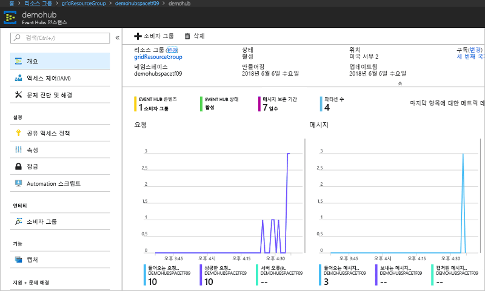

# <a name="quickstart-route-custom-events-to-azure-event-hubs-with-azure-cli-and-event-grid"></a>빠른 시작: Azure CLI 및 Event Grid를 사용하여 Azure Event Hubs로 사용자 지정 이벤트 라우팅

Azure Event Grid는 클라우드에 대한 이벤트 서비스입니다. Azure Event Hubs는 지원되는 이벤트 처리기 중 하나입니다. 이 문서에서는 Azure CLI를 사용하여 사용자 지정 항목을 만들고 사용자 지정 항목을 구독하며 이벤트를 트리거하여 결과를 확인합니다. Event Hub로 이벤트를 보냅니다.

[!INCLUDE [quickstarts-free-trial-note.md](../../includes/quickstarts-free-trial-note.md)]

## <a name="create-a-resource-group"></a>리소스 그룹 만들기

Event Grid 토픽은 Azure 리소스이며 Azure 리소스 그룹에 배치해야 합니다. 리소스 그룹은 Azure 리소스가 배포 및 관리되는 논리적 컬렉션입니다.

[az group create](/cli/azure/group#az-group-create) 명령을 사용하여 리소스 그룹을 만듭니다. 

다음 예제에서는 *westus2* 위치에 *gridResourceGroup*이라는 리소스 그룹을 만듭니다.

```azurecli-interactive
az group create --name gridResourceGroup --location westus2
```

[!INCLUDE [event-grid-register-provider-cli.md](../../includes/event-grid-register-provider-cli.md)]

## <a name="create-a-custom-topic"></a>사용자 지정 토픽 만들기

Event Grid 항목은 이벤트를 게시하는 사용자 정의 엔드포인트를 제공합니다. 다음 예제에서는 리소스 그룹에 사용자 지정 토픽을 만듭니다. `<your-topic-name>`을 사용자 지정 항목의 고유한 이름으로 바꿉니다. DNS 항목으로 표시되기 때문에 사용자 지정 항목 이름은 고유해야 합니다.

```azurecli-interactive
topicname=<your-topic-name>
az eventgrid topic create --name $topicname -l westus2 -g gridResourceGroup
```

## <a name="create-event-hub"></a>이벤트 허브 만들기

사용자 지정 토픽을 구독하기 전에 이벤트 메시지에 대한 엔드포인트를 만들어 보겠습니다. 이벤트를 수집하기 위한 Event Hub를 만듭니다.

```azurecli-interactive
namespace=<unique-namespace-name>
hubname=demohub

az eventhubs namespace create --name $namespace --resource-group gridResourceGroup
az eventhubs eventhub create --name $hubname --namespace-name $namespace --resource-group gridResourceGroup
```

## <a name="subscribe-to-a-custom-topic"></a>사용자 지정 항목 구독

Event Grid 항목을 구독하여 Event Grid에 추적하려는 이벤트를 알립니다. 다음 예제에서는 직접 만든 사용자 지정 항목을 구독하고 엔드포인트에 대한 이벤트 허브의 리소스 ID를 전달합니다. 엔드포인트는 다음과 같은 형식입니다.

`/subscriptions/<subscription-id>/resourceGroups/<resource-group-name>/providers/Microsoft.EventHub/namespaces/<namespace-name>/eventhubs/<hub-name>`

다음 스크립트는 Event Hub에 대한 리소스 ID를 가져오고 이벤트 그리드 토픽을 구독합니다. 엔드포인트 형식을 `eventhub`로 설정하고 엔드포인트에 대한 Event Hub ID를 사용합니다.

```azurecli-interactive
hubid=$(az eventhubs eventhub show --name $hubname --namespace-name $namespace --resource-group gridResourceGroup --query id --output tsv)

az eventgrid event-subscription create \
  --topic-name $topicname \
  -g gridResourceGroup \
  --name subtoeventhub \
  --endpoint-type eventhub \
  --endpoint $hubid
```

이벤트 구독을 만드는 계정에는 이벤트 허브에 대한 쓰기 권한이 있어야 합니다.

## <a name="send-an-event-to-your-custom-topic"></a>사용자 지정 항목에 이벤트 보내기

이벤트를 트리거하여 Event Grid가 메시지를 사용자 엔드포인트에 어떻게 배포하는지 살펴보겠습니다. 먼저, 사용자 지정 토픽에 대한 URL 및 키를 가져오겠습니다.

```azurecli-interactive
endpoint=$(az eventgrid topic show --name $topicname -g gridResourceGroup --query "endpoint" --output tsv)
key=$(az eventgrid topic key list --name $topicname -g gridResourceGroup --query "key1" --output tsv)
```

이 문서를 간소화하기 위해 사용자 지정 항목에 보낼 샘플 이벤트 데이터를 사용합니다. 일반적으로 응용 프로그램 또는 Azure 서비스는 이벤트 데이터를 보냅니다. CURL은 HTTP 요청을 보내는 유틸리티입니다. 이 문서에서는 CURL을 사용하여 사용자 지정 항목에 이벤트를 보냅니다.  다음 예제는 세 개의 이벤트를 Event Grid 토픽으로 보냅니다.

```azurecli-interactive
for i in 1 2 3
do
   event='[ {"id": "'"$RANDOM"'", "eventType": "recordInserted", "subject": "myapp/vehicles/motorcycles", "eventTime": "'`date +%Y-%m-%dT%H:%M:%S%z`'", "data":{ "make": "Ducati", "model": "Monster"},"dataVersion": "1.0"} ]'
   curl -X POST -H "aeg-sas-key: $key" -d "$event" $endpoint
done
```

포털에서 Event Hub로 이동하고 Event Grid에서 이 세 개의 이벤트를 Event Hub로 보냈음을 확인합니다.



일반적으로 Event Hub에서 이벤트를 검색하는 애플리케이션을 만듭니다. Event Hub에서 메시지를 가져오는 애플리케이션을 만들려면 다음을 참조하세요.

* [.NET Standard에서 이벤트 프로세서 호스트를 사용하여 메시지 수신 시작](../event-hubs/event-hubs-dotnet-standard-getstarted-receive-eph.md)
* [Java를 사용하여 Azure Event Hubs에서 이벤트 수신](../event-hubs/event-hubs-java-get-started-receive-eph.md)
* [Apache Storm을 사용하여 Event Hubs에서 이벤트 수신](../event-hubs/event-hubs-storm-getstarted-receive.md)

## <a name="clean-up-resources"></a>리소스 정리
이 이벤트로 작업을 계속하려는 경우 이 문서에서 만든 리소스를 정리하지 마세요. 그렇지 않으면 다음 명령을 사용하여 이 문서에서 만든 리소스를 삭제합니다.

```azurecli-interactive
az group delete --name gridResourceGroup
```

## <a name="next-steps"></a>다음 단계

토픽 및 이벤트 구독을 만드는 방법을 배웠으므로 어떤 Event Grid가 도움이 되는지 자세히 알아보세요.

- [Event Grid 정보](overview.md)
- [Blob Storage 이벤트를 사용자 지정 웹 엔드포인트로 라우팅](../storage/blobs/storage-blob-event-quickstart.md?toc=%2fazure%2fevent-grid%2ftoc.json)
- [Azure Event Grid 및 Logic Apps를 사용하여 가상 머신 변경 모니터링](monitor-virtual-machine-changes-event-grid-logic-app.md)
- [데이터 웨어하우스로 빅 데이터 스트림](event-grid-event-hubs-integration.md)
