# <a name="quickstart-route-custom-events-to-an-azure-function-with-event-grid"></a>빠른 시작: Event Grid를 사용하여 Azure 함수로 사용자 지정 이벤트 라우팅

Azure Event Grid는 클라우드에 대한 이벤트 서비스입니다. Azure Functions는 지원되는 이벤트 처리기 중 하나입니다. 이 문서에서는 Azure Portal을 사용하여 사용자 지정 항목을 만들고 사용자 지정 항목을 구독하며 이벤트를 트리거하여 결과를 확인합니다. Azure 함수로 이벤트를 보냅니다.

[!INCLUDE [quickstarts-free-trial-note.md](../../includes/quickstarts-free-trial-note.md)]

## <a name="create-azure-function"></a>Azure 함수 만들기

사용자 지정 토픽을 구독하기 전에 이벤트를 처리하는 함수를 만들어 보겠습니다. Azure Portal에서 '리소스 만들기'를 클릭하고 '함수'를 입력한 다음, '함수 앱'을 선택하고 [만들기]를 클릭합니다. 리소스 그룹 아래에서 '새로 만들기'를 선택하고 이름을 지정합니다. 자습서의 나머지 부분에서 이 이름을 사용합니다. 함수 앱 이름을 지정하고, '게시' 토들을 '코드'로 두고, 아무 런타임 및 지역을 선택한 다음, [만들기]를 누릅니다.

함수 앱이 준비되면 함수 앱으로 이동하여 '+ 새 함수'를 클릭합니다. 개발 환경으로 '포털 내'를 선택하고 [계속]을 누릅니다. [함수 만들기]에서 '추가 템플릿'을 선택하여 더 많은 템플릿을 표시한 다음, 'Azure Event Grid 트리거'를 검색하여 선택합니다. 이 트리거를 처음 사용하는 경우 '설치'를 클릭하여 확장을 설치해야 할 수도 있습니다.

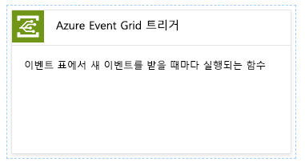

확장을 설치한 후에는 [계속]을 클릭하고 함수 이름을 지정한 다음, [만들기]를 누릅니다.

[!INCLUDE [event-grid-register-provider-portal.md](../../includes/event-grid-register-provider-portal.md)]

## <a name="create-a-custom-topic"></a>사용자 지정 토픽 만들기

Event Grid 항목은 이벤트를 게시하는 사용자 정의 엔드포인트를 제공합니다. 

1. [Azure 포털](https://portal.azure.com/)에 로그인합니다.
2. 왼쪽 탐색 메뉴에서 **모든 서비스**를 선택하고 **Event Grid**를 검색하고 **Event Grid 항목**을 선택합니다. 

    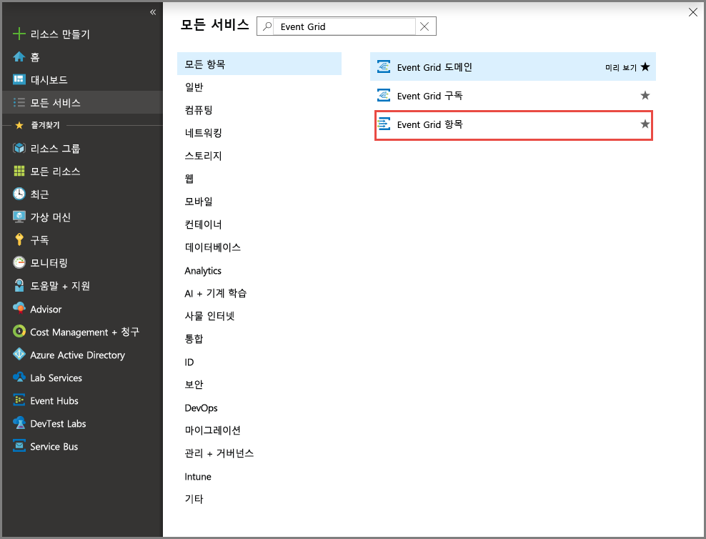
3. **Event Grid 항목** 페이지의 도구 모음에 있는 **+ 추가**를 선택합니다. 

    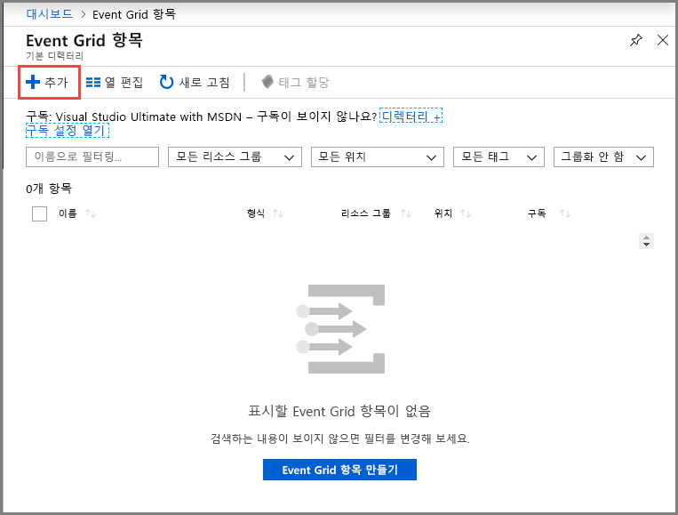

4. **토픽 만들기** 페이지에서 다음 단계를 수행합니다.

    1. 사용자 지정 항목의 고유한 **이름**을 입력합니다. DNS 항목으로 표시되기 때문에 토픽 이름은 고유해야 합니다. 이미지에 표시된 이름은 사용하지 마십시오. 대신 고유한 이름을 만듭니다. 3~50자 사이로 a-z, A-Z, 0-9 및 “-” 값만 포함해야 합니다.
    2. Azure **구독**을 선택합니다.
    3. 이전 단계에서 동일한 리소스 그룹을 선택합니다.
    4. Event Grid 항목의 **위치**를 선택합니다.
    5. **이벤트 스키마** 필드에 대한 기본 값 **Event Grid 스키마**를 유지합니다. 

       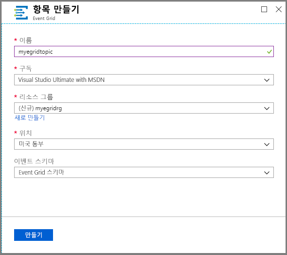
    6. **만들기**를 선택합니다. 

5. 사용자 지정 항목을 만든 후 성공 알림이 표시됩니다. **리소스 그룹으로 이동**을 선택합니다. 

   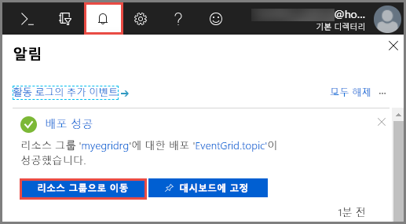

6. **리소스 그룹** 페이지에서 Event Grid 항목을 선택합니다. 

   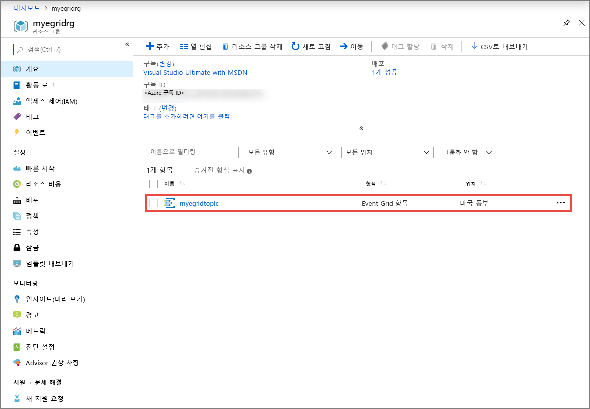

7. Event Grid에 대한 **Event Grid 항목** 페이지가 표시됩니다. 이 페이지를 열린 상태로 유지합니다. 나중에 빠른 시작에서 사용할 예정입니다. 

    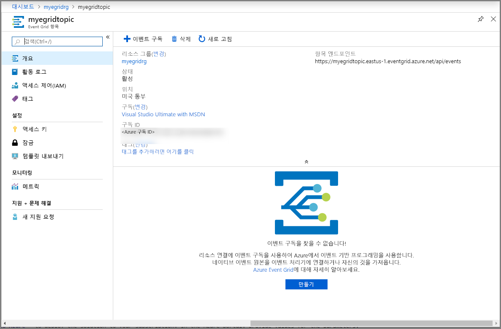

## <a name="subscribe-to-custom-topic"></a>사용자 지정 항목 구독

Event Grid 항목을 구독하여 Event Grid에 추적하려는 이벤트와 이벤트를 보낼 위치를 알립니다.

1. 이제 사용자 지정 항목에 대한 **Event Grid 항목** 페이지의 도구 모음에서 **+ 이벤트 구독**을 선택합니다.

   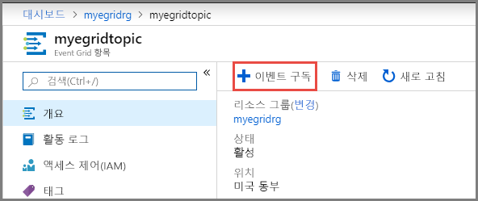

2. **이벤트 구독 만들기** 페이지에서 다음 단계를 수행합니다.
    1. 이벤트 구독에 대한 이벤트 **이름**을 입력합니다.
    3. **엔드포인트 유형**으로 **Azure 함수**를 선택합니다. 
    4. **엔드포인트 선택**을 선택합니다. 

       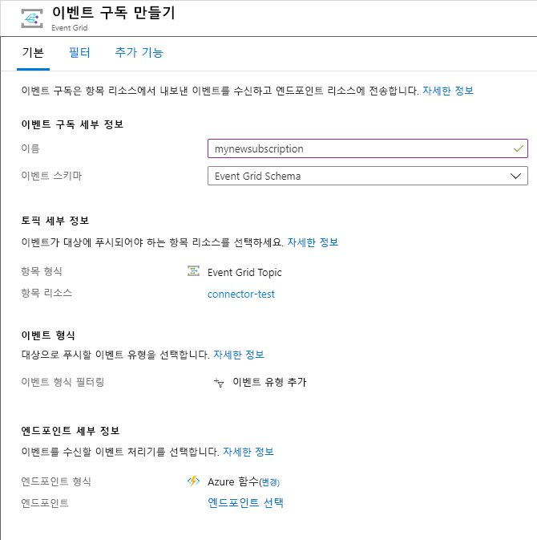

    5. 함수 엔드포인트의 경우 함수 앱이 속한 Azure 구독 및 리소스 그룹을 선택하고, 이전에 만든 함수 앱 및 함수를 선택합니다. **선택 확인**을 선택합니다.

       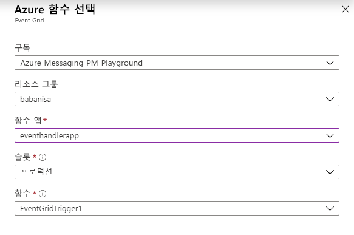

    6. **이벤트 구독 만들기** 페이지에서 **만들기**를 선택합니다.

## <a name="send-an-event-to-your-topic"></a>토픽에 이벤트 보내기

이제 이벤트를 트리거하여 Event Grid가 메시지를 사용자 엔드포인트에 어떻게 배포하는지 살펴 보겠습니다. Azure CLI 또는 PowerShell을 사용하여 사용자 지정 항목에 테스트 이벤트를 보냅니다. 일반적으로 애플리케이션 또는 Azure 서비스는 이벤트 데이터를 보냅니다.

첫 번째 예제에서는 Azure CLI를 사용합니다. 사용자 지정 항목에 대한 URL 및 키와 샘플 이벤트 데이터를 가져옵니다. `<topic name>`의 사용자 지정 항목 이름을 사용합니다. 샘플 이벤트 데이터가 생성됩니다. JSON의 `data` 요소는 이벤트의 페이로드입니다. 모든 잘 구성된(Well-Formed) JSON은 이 필드에 배치될 수 있습니다. 또한 고급 라우팅 및 필터링을 위해 제목 필드를 사용할 수 있습니다. CURL은 HTTP 요청을 보내는 유틸리티입니다.


### <a name="azure-cli"></a>Azure CLI
1. Azure Portal에서 **Cloud Shell**을 선택합니다. Cloud Shell 창의 왼쪽 위 모서리에서 **Bash**를 선택합니다. 

    
1. 다음 명령을 실행하여 항목에 대한 **엔드포인트**를 가져옵니다. 명령을 복사하고 붙여넣은 후, 명령을 실행하기 전에 **항목 이름** 및 **리소스 그룹 이름**을 업데이트합니다. 

    ```azurecli
    endpoint=$(az eventgrid topic show --name <topic name> -g <resource group name> --query "endpoint" --output tsv)
    ```
2. 다음 명령을 실행하여 사용자 지정 항목에 대한 **키**를 가져옵니다. 명령을 복사하고 붙여넣은 후, 명령을 실행하기 전에 **항목 이름** 및 **리소스 그룹** 이름을 업데이트합니다. 

    ```azurecli
    key=$(az eventgrid topic key list --name <topic name> -g <resource group name> --query "key1" --output tsv)
    ```
3. 이벤트 정의와 함께 다음 명령문을 복사하고 **ENTER**를 누릅니다. 

    ```json
    event='[ {"id": "'"$RANDOM"'", "eventType": "recordInserted", "subject": "myapp/vehicles/motorcycles", "eventTime": "'`date +%Y-%m-%dT%H:%M:%S%z`'", "data":{ "make": "Ducati", "model": "Monster"},"dataVersion": "1.0"} ]'
    ```
4. 다음 **Curl** 명령을 실행하여 이벤트를 게시합니다.

    ```
    curl -X POST -H "aeg-sas-key: $key" -d "$event" $endpoint
    ```

### <a name="azure-powershell"></a>Azure PowerShell
두 번째 예제에서는 PowerShell을 사용하여 비슷한 단계를 수행합니다.

1. Azure Portal에서 **Cloud Shell**을 선택하거나 https://shell.azure.com/) 으로 이동합니다. Cloud Shell 창의 왼쪽 위 모서리에서 **PowerShell**을 선택합니다. Azure CLI 섹션에서 샘플 **Cloud Shell** 창 이미지를 확인합니다.
2. 다음 변수를 설정합니다. 각 명령을 복사하고 붙여넣은 후, 명령을 실행하기 전에 **항목 이름** 및 **리소스 그룹 이름**을 업데이트합니다.

    ```powershell
    $resourceGroupName = <resource group name>
    $topicName = <topic name>
    ```
3. 다음 명령을 실행하여 항목에 대한 **엔드포인트** 및 **키**를 가져옵니다.

    ```powershell
    $endpoint = (Get-AzEventGridTopic -ResourceGroupName $resourceGroupName -Name $topicName).Endpoint
    $keys = Get-AzEventGridTopicKey -ResourceGroupName $resourceGroupName -Name $topicName
    ```
4. 이벤트를 준비합니다. Cloud Shell 창에서 명령문을 복사하고 실행합니다. 

    ```powershell
    $eventID = Get-Random 99999

    #Date format should be SortableDateTimePattern (ISO 8601)
    $eventDate = Get-Date -Format s

    #Construct body using Hashtable
    $htbody = @{
        id= $eventID
        eventType="recordInserted"
        subject="myapp/vehicles/motorcycles"
        eventTime= $eventDate   
        data= @{
            make="Ducati"
            model="Monster"
        }
        dataVersion="1.0"
    }
    
    #Use ConvertTo-Json to convert event body from Hashtable to JSON Object
    #Append square brackets to the converted JSON payload since they are expected in the event's JSON payload syntax
    $body = "["+(ConvertTo-Json $htbody)+"]"
    ```
5. **Invoke-WebRequest** cmdlet을 사용하여 이벤트를 보냅니다. 

    ```powershell
    Invoke-WebRequest -Uri $endpoint -Method POST -Body $body -Headers @{"aeg-sas-key" = $keys.Key1}
    ```

### <a name="verify-in-the-event-grid-viewer"></a>Event Grid 뷰어에서 확인
이벤트를 트리거했고 Event Grid가 구독할 때 구성한 엔드포인트로 메시지를 보냈습니다. Event Grid 트리거 함수로 이동하여 로그를 엽니다. 로그에 이벤트의 데이터 페이로드 복사본이 표시됩니다. 로그 창을 열었는지 또는 [다시 연결]을 눌렀는지 잘 모르겠으면 테스트 이벤트를 다시 전송해 보세요.

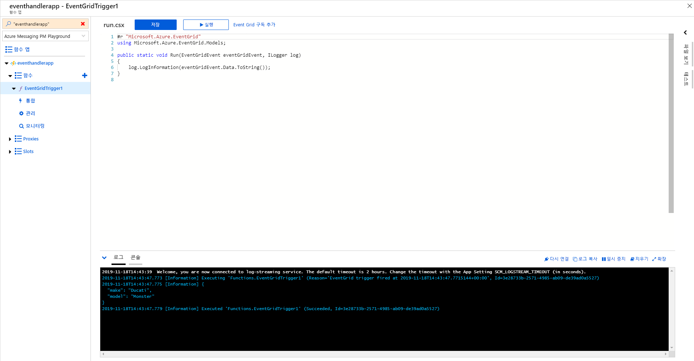

## <a name="clean-up-resources"></a>리소스 정리
이 이벤트로 작업을 계속하려는 경우 이 문서에서 만든 리소스를 정리하지 마세요. 계속하지 않으려는 경우 이 문서에서 만든 리소스를 삭제합니다.

1. 왼쪽 메뉴에서 **리소스 그룹** 을 선택합니다. 왼쪽 메뉴에 보이지 않으면, 왼쪽 메뉴에서 **모든 서비스**를 선택하고 **리소스 그룹**을 선택합니다. 
2. 리소스 그룹을 선택하여 **리소스 그룹** 페이지를 시작합니다. 
3. 도구 모음에서 **리소스 그룹 삭제**를 선택합니다. 
4. 리소스 그룹의 이름을 입력하여 삭제를 확인하고 **삭제**를 선택합니다. 

    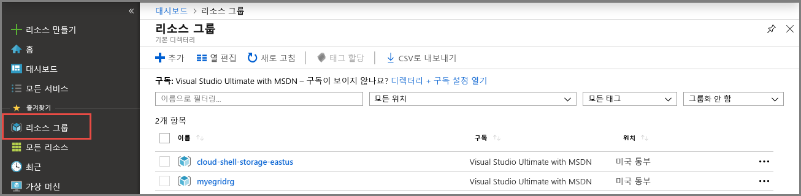

    이미지에 보이는 다른 리소스 그룹은 Cloud Shell 창에서 생성되어 사용되었습니다. 나중에 Cloud Shell 창에서 사용하지 않으려면 삭제합니다. 
```

## Next steps

Now that you know how to create topics and event subscriptions, learn more about what Event Grid can help you do:

- [About Event Grid](overview.md)
- [Route Blob storage events to a custom web endpoint](../storage/blobs/storage-blob-event-quickstart.md?toc=%2fazure%2fevent-grid%2ftoc.json)
- [Monitor virtual machine changes with Azure Event Grid and Logic Apps](monitor-virtual-machine-changes-event-grid-logic-app.md)
- [Stream big data into a data warehouse](event-grid-event-hubs-integration.md)
