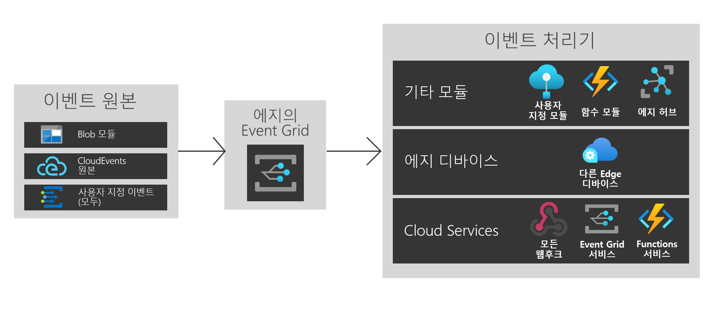

# Azure IoT Edge의 Azure Event Grid란?
IoT Edge의 Event Grid는 Azure Event Grid의 강력한 성능과 유연성을 에지에 제공합니다. 토픽을 만들고 이벤트를 게시할 수 있으며, 대상이 동일한 디바이스의 모듈이든, 다른 에지 디바이스의 모듈이든 또는 클라우드의 서비스든 상관없이 여러 대상을 구독할 수 있습니다.

클라우드와 마찬가지로, IoT Edge 모듈의 Event Grid는 이벤트의 라우팅, 필터링 및 안정적인 전달을 처리합니다. 고급 문자열, 숫자 및 부울 필터를 사용하여 이벤트를 필터링하면 관련 이벤트만 다른 이벤트 처리기로 보낼 수 있습니다. 재시도 논리는 이벤트가 게시 시점에 사용할 수 없는 경우에도 대상 목적지에 도달하도록 합니다. IoT Edge의 Event Grid를 강력한 저장소 및 전달 메커니즘으로 사용할 수 있습니다.

IoT Edge의 Event Grid는 CloudEvents v1.0 및 사용자 지정 이벤트 스키마를 모두 지원합니다. 또한 손쉬운 상호 운용성을 위해 클라우드의 Event Grid와 동일한 Pub/Sub 의미 체계를 지원합니다.

이 문서에서는 IoT Edge의 Azure Event Grid에 대한 개요를 제공합니다. 에지에서 이 모듈을 사용하는 방법에 대한 단계별 지침은 [로컬로 이벤트 게시 및 구독](pub-sub-events-webhook-local.md)을 참조하세요. 

이 이미지는 IoT Edge에서 Event Grid를 사용할 수 있는 몇 가지 방법을 보여주며, 지원되는 기능의 전체 목록은 아닙니다.

## IoT Edge에서 Event Grid를 사용하는 시기

IoT Edge의 Event Grid는 에지와 클라우드 사이에 사용하기 쉽고 신뢰할 수 있는 이벤트 모델을 제공합니다.

IoT Edge의 Event Grid는 Azure 클라우드 서비스에 대한 대칭형 런타임 노출 영역을 사용하여 빌드되었기 때문에, 필요한 모든 위치에서 동일한 이벤트와 API 호출을 사용할 수 있습니다. 게시/구독을 클라우드에서 수행하든, 에지에서 수행하든, 또는 클라우드와 에지 사이에서 수행하든 상관없이, 이제 IoT Edge의 Event Grid에서 모두 처리할 수 있습니다.

IoT Edge의 Event Grid를 사용하여 모듈 간의 간단한 워크플로를 트리거할 수 있습니다. 예를 들어 토픽을 만들고, 스토리지 모듈의 "storage blob created" 이벤트를 이 토픽에 게시합니다. 이제 하나 이상의 함수 또는 사용자 지정 모듈을 해당 토픽에 구독할 수 있습니다.

에지 디바이스 간에 기능을 확장할 수 있습니다. Blob 모듈 이벤트를 게시하려는데 에지 디바이스의 여러 가지 강력한 컴퓨팅 성능을 사용하려는 경우 디바이스 간 구독을 만듭니다.

마지막으로, 클라우드에 연결할 수 있습니다. Blob 모듈 이벤트가 정기적으로 클라우드와 동기화되는 경우 클라우드에 제공되는 더 강력한 컴퓨팅 성능을 사용하거나 처리된 데이터를 보내고, 추가 클라우드 서비스 구독을 만듭니다.

IoT Edge의 Event Grid는 유연하고 신뢰할 수 있는 분리된 이벤트 아키텍처를 제공합니다.

## 이벤트 원본

클라우드와 비슷하게, IoT Edge의 Event Grid는 모듈 간에 직접 통합하여 이벤트 기반 아키텍처를 빌드할 수 있습니다. 현재 다음 위치에서 IoT Edge의 Event Grid로 이벤트를 보낼 수 있습니다.

* IoT Edge의 Azure Blob Storage
* CloudEvents 원본
* HTTP POST를 통한 사용자 지정 모듈 및 컨테이너

## 이벤트 처리기

IoT Edge의 Event Grid는 원하는 위치로 이벤트를 보낼 수 있도록 빌드되었습니다. 현재 다음 대상이 지원됩니다.

* IoT Hub, 함수 및 사용자 지정 모듈을 비롯한 기타 모듈
* 기타 에지 디바이스
* 웹후크
* Azure Event Grid 클라우드 서비스
* Event Hubs
* Service Bus 큐
* Service Bus 토픽
* Storage 큐

## 지원되는 환경
현재 Windows 64비트, Linux 64비트 및 ARM 32비트 환경이 지원됩니다.

## 개념

다음은 Azure Event Grid를 시작하기 위한 5가지 개념입니다.

* **이벤트** - 발생한 내용입니다.
* **이벤트 원본** - 이벤트가 발생한 곳입니다.
* **토픽** - 게시자가 이벤트를 보낸 엔드포인트입니다.
* **이벤트 구독** - 때때로 여러 처리기에 이벤트를 라우팅하는 엔드포인트 또는 기본 제공 메커니즘입니다. 구독도 처리기가 지능적으로 들어오는 이벤트를 필터링하는 데 사용됩니다.
* **이벤트 처리기** - 이벤트에 대응하는 앱 또는 서비스입니다.

## 비용

공개 미리 보기 기간에는 IoT Edge의 Event Grid가 무료로 제공됩니다.

## 문제
IoT Edge의 Event Grid 사용과 관련하여 이슈가 있는 경우 [https://github.com/Azure/event-grid-iot-edge/issues](https://github.com/Azure/event-grid-iot-edge/issues)에서 보고해 주세요.

## 다음 단계

* [로컬로 이벤트 게시 및 구독](pub-sub-events-webhook-local.md)
* [클라우드에서 이벤트 게시 및 구독](pub-sub-events-webhook-cloud.md)
* [Event Grid 클라우드로 이벤트 전송](forward-events-event-grid-cloud.md)
* [IoTHub로 이벤트 전송](forward-events-iothub.md)
* [로컬로 Blob Storage 이벤트에 대응](react-blob-storage-events-locally.md)