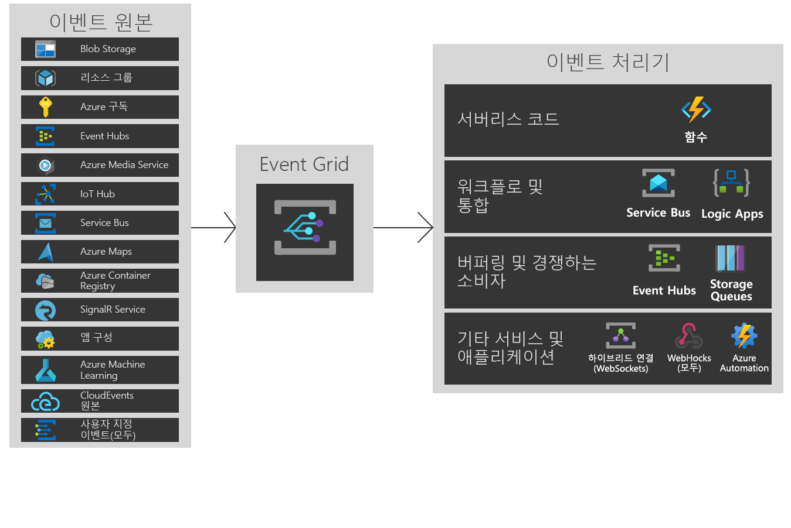

# Azure Event Grid란?

Azure Event Grid를 사용하면 이벤트 기반 아키텍처를 가진 애플리케이션을 쉽게 빌드할 수 있습니다. 먼저 구독할 Azure 리소스를 선택한 다음, 이벤트를 전송할 이벤트 처리기 또는 WebHook 엔드포인트를 제공합니다. Event Grid는 기본적으로 저장소 Blob 및 리소스 그룹과 같은 Azure 서비스의 이벤트를 지원합니다. 또한 Event Grid는 사용자 지정 토픽을 사용하여 사용자 고유의 이벤트를 지원합니다. 

필터를 사용하여 다른 엔드포인트에 대한 특정 이벤트를 라우팅하고, 여러 엔드포인트로 멀티캐스트하며, 이벤트가 안정적으로 배달되도록 할 수 있습니다.

Azure Event Grid는 각 지역의 여러 장애 도메인과 가용성 영역(지원하는 지역 안)으로 고유하게 분산되어 가용성을 극대화하기 위해 배포됩니다. 현재, Azure Event Grid는 모든 공용 지역에서 사용할 수 있습니다. Azure 독일, Azure 중국 21Vianet 또는 Azure Government 클라우드에서는 아직 사용할 수 없습니다.

이 문서는 Azure Event Grid의 개요를 제공합니다. Event Grid를 시작하려는 경우 [Azure Event Grid를 사용하여 사용자 지정 이벤트 만들기 및 라우팅](custom-event-quickstart.md)을 참조하세요. 

이 이미지는 Event Grid가 원본 및 처리기를 연결하는 방법을 보여 주지만, 지원되는 통합의 전체 목록은 아닙니다.

## 이벤트 원본

각 소스의 기능에 대한 전체 내용 및 관련 문서는 [이벤트 원본](event-sources.md)을 참조하세요. 현재 다음 Azure 서비스는 Event Grid로 이벤트 보내기를 지원합니다.

* [Azure 구독(관리 작업)](event-sources.md#azure-subscriptions)
* [컨테이너 레지스트리](event-sources.md#container-registry)
* [사용자 지정 항목](event-sources.md#custom-topics)
* [Event Hubs](event-sources.md#event-hubs)
* [IoT Hub](event-sources.md#iot-hub)
* [Media Services](event-sources.md#media-services)
* [리소스 그룹(관리 작업)](event-sources.md#resource-groups)
* [Service Bus](event-sources.md#service-bus)
* [Storage Blob](event-sources.md#storage)
* [Azure Maps](event-sources.md#maps)

## 이벤트 처리기

각 소스의 기능에 대한 전체 내용 및 관련 문서는 [이벤트 원본](event-handlers.md)을 참조하세요. 현재 다음 Azure 서비스는 Event Grid의 이벤트 처리를 지원합니다. 

* [Azure Automation](event-handlers.md#azure-automation)
* [Azure Functions](event-handlers.md#azure-functions)
* [Event Hubs](event-handlers.md#event-hubs)
* [VNet](event-handlers.md#hybrid-connections)
* [Logic Apps](event-handlers.md#logic-apps)
* [Microsoft Flow](https://preview.flow.microsoft.com/connectors/shared_azureeventgrid/azure-event-grid/)
* [Queue Storage](event-handlers.md#queue-storage)
* [웹후크](event-handlers.md#webhooks)

## 개념

이제부터 살펴볼 Azure Event Grid의 5가지 개념은 다음과 같습니다.

* **이벤트** - 발생한 내용입니다.
* **이벤트 원본** - 이벤트가 발생한 곳입니다.
* **토픽** - 게시자가 이벤트를 보낸 엔드포인트입니다.
* **이벤트 구독** - 때때로 여러 처리기에 이벤트를 라우팅하는 엔드포인트 또는 기본 제공 메커니즘입니다. 구독도 처리기가 지능적으로 들어오는 이벤트를 필터링하는 데 사용됩니다.
* **이벤트 처리기** - 이벤트에 반응하는 앱 또는 서비스입니다.

이러한 개념에 대한 자세한 내용은 [Azure Event Grid의 개념](concepts.md)을 참조하세요.

## 기능

Azure Event Grid의 몇 가지 주요 기능은 다음과 같습니다.

* **단순성** - Azure 리소스부터 모든 이벤트 처리기 또는 엔드포인트의 이벤트를 목표로 선택하고 클릭합니다.
* **고급 필터링** - 이벤트 처리기가 관련 이벤트만 수신하도록 이벤트 유형 또는 이벤트 게시자 경로를 필터링합니다.
* **팬 아웃** - 필요에 따라 다양한 위치로 이벤트 사본을 보낼 수 있도록 동일한 이벤트에 대한 여러 엔드포인트를 구독합니다.
* **안정성** - 이벤트 전달을 보장하기 위해 지수 백오프를 통해 24시간 다시 시도합니다.
* **이벤트별 요금** - Event Grid를 사용하는 만큼만 지불합니다.
* **높은 처리량** - 초당 수백만 개 이벤트 지원을 통해 Event Grid에서 대량 워크로드를 빌드합니다.
* **기본 제공 이벤트** - 리소스 정의 기본 제공 이벤트를 사용하여 신속하게 준비하고 실행합니다.
* **사용자 지정 이벤트** - Event Grid를 사용하여 사용자 앱의 사용자 지정 이벤트를 라우팅하고, 필터링하며, 안정적으로 배달합니다.

Event Grid, Event Hubs 및 Service Bus를 비교하려면 [Choose between Azure services that deliver messages](compare-messaging-services.md)(메시지를 배달하는 Azure 서비스 중 선택)을 참조하세요.

## Event Grid로 할 수 있는 작업은 무엇인가요?

Azure Event Grid는 서버리스 작업 자동화 및 [통합](https://azure.com/integration) 작업을 크게 개선하는 여러 가지 기능을 제공합니다. 

### 서버를 사용하지 않는 애플리케이션 아키텍처

Event Grid는 데이터 원본과 이벤트 처리기를 연결합니다. 예를 들어 Event Grid를 사용하여 Blob Storage 컨테이너에 추가될 때 이미지를 분석하는 서버리스 함수를 트리거합니다. 

### 작업 Automation

Event Grid를 통해 자동화를 가속화하고 정책 적용을 간소화할 수 있습니다. 예를 들어 Event Grid를 사용하여 가상 머신 또는 SQL 데이터베이스가 생성될 때 Azure Automation에 알립니다. 이벤트를 사용하여 서비스 구성이 규정을 준수하는지 자동으로 확인하거나, 메타데이터를 작업 도구에 배치하거나, 가상 머신에 태그를 지정하거나, 작업 항목을 제출할 수 있습니다.

### 애플리케이션 통합

Event Grid는 앱을 다른 서비스와 연결합니다. 예를 들어 앱의 이벤트 데이터를 Event Grid로 보내고 Event Grid의 안정적인 배달, 고급 라우팅 및 Azure와의 직접 통합을 활용하는 사용자 지정 토픽을 만듭니다. 또는 Event Grid와 Logic Apps를 사용하여, 코드를 작성할 필요 없이 어디서든 데이터를 처리할 수 있습니다. 

## Event Grid의 비용은 얼마입니까?

Azure Event Grid는 이벤트별 요금 가격 책정 모델을 사용하므로 사용한 것에 대해서만 지불하면 됩니다. 매월 처음 100,000개 작업은 무료입니다. 작업은 이벤트 수신, 구독 배달 시도, 관리 호출 및 주체 접미사 기준 필터링으로 정의됩니다. 자세한 내용은 [가격 책정 페이지](https://azure.microsoft.com/pricing/details/event-grid/)를 참조하세요.

## 다음 단계

* [Storage Blob 이벤트 라우팅](../storage/blobs/storage-blob-event-quickstart.md?toc=%2fazure%2fevent-grid%2ftoc.json)  
  Event Grid를 사용하여 Storage Blob 이벤트에 응답합니다.
* [사용자 지정 이벤트 만들기 및 구독](custom-event-quickstart.md)  
  Azure Event Grid 빠른 시작을 사용하여 사용자 지정 이벤트를 엔드포인트로 보내는 방법을 확인할 수 있습니다.
* [Logic Apps를 이벤트 처리기로 사용](monitor-virtual-machine-changes-event-grid-logic-app.md)  
  Event Grid에서 푸시된 이벤트에 응답하기 위해 Logic Apps를 사용하여 앱을 빌드하는 방법을 설명하는 자습서입니다.
* [데이터 웨어하우스로 빅 데이터 스트림](event-grid-event-hubs-integration.md)  
  Azure Functions를 사용하여 Event Hubs의 데이터를 SQL Data Warehouse로 스트리밍하는 방법을 설명하는 자습서입니다.
* [Event Grid REST API 참조](/rest/api/eventgrid)  
  이벤트 구독, 라우팅 및 필터링 관리에 대한 참조 콘텐츠를 제공합니다.
