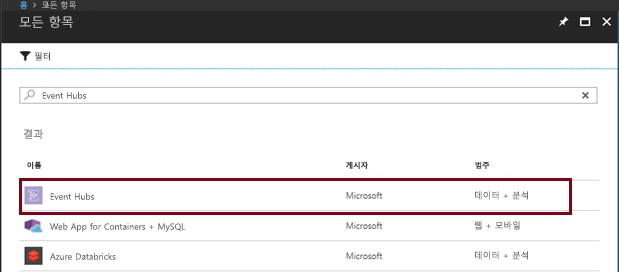
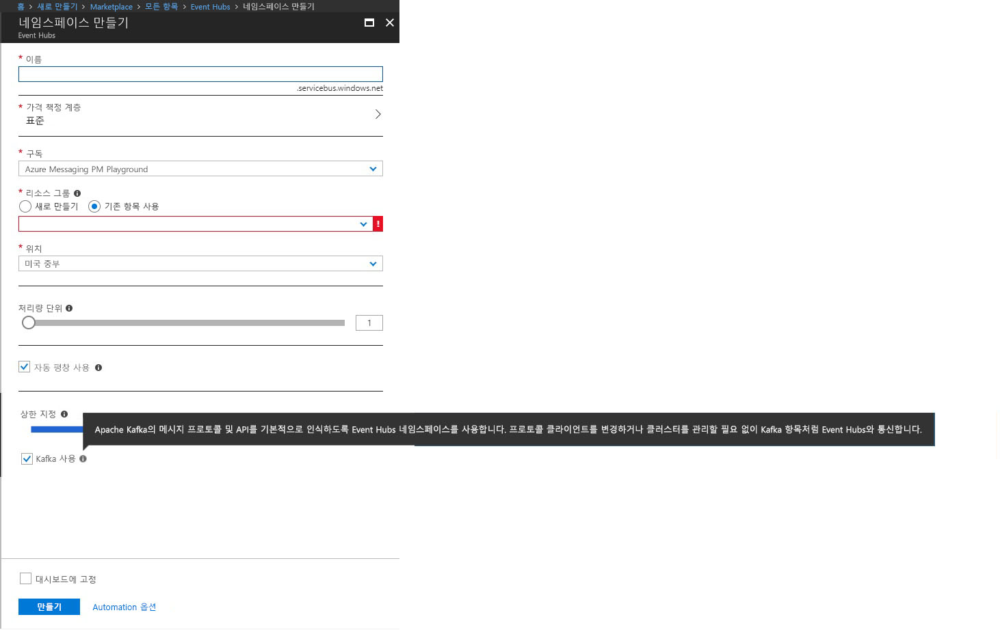
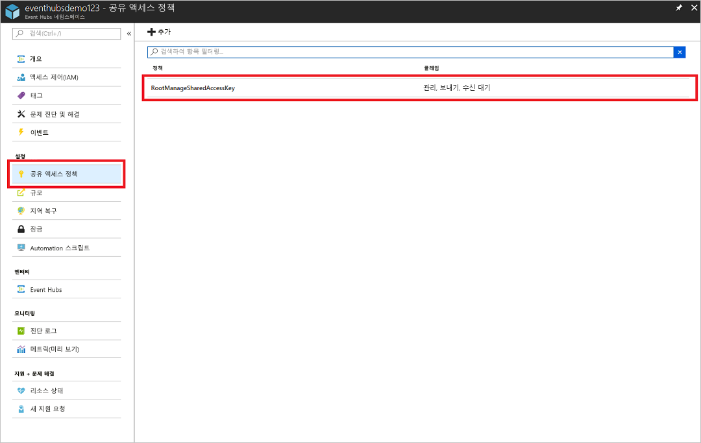
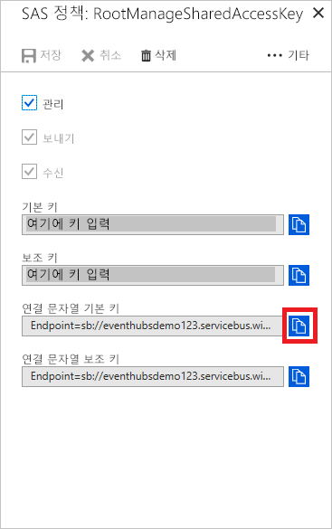

# Apache Kafka 지원 이벤트 허브 만들기

Azure Event Hubs는 초당 수백만 건의 이벤트를 수집하고 실시간 분석 및 시각화를 위해 짧은 대기 시간 및 높은 처리량을 제공하는 빅 데이터 스트리밍 PaaS(Platform as a Service)입니다.

Azure Event Hubs는 Kafka 엔드포인트를 제공합니다. 이 엔드포인트를 통해 Event Hubs 네임스페이스가 [Apache Kafka](https://kafka.apache.org/intro) 메시지 프로토콜 및 API를 고유하게 해석할 수 있습니다. 이 기능을 사용하면 프로토콜 클라이언트를 변경하거나 자체 클러스터를 실행하지 않고도 Kafka 항목과 마찬가지로 이벤트 허브와 통신할 수 있습니다. Event Hubs는 [Apache Kafka 버전 1.0](https://kafka.apache.org/10/documentation.html) 이상을 지원합니다.

이 문서에서는 Event Hubs 네임스페이스를 만들고 Kafka 지원 이벤트 허브에 Kafka 애플리케이션을 연결하는 데 필요한 연결 문자열을 확보하는 방법을 설명합니다.

## 필수 조건

Azure 구독이 아직 없는 경우 시작하기 전에 [무료 계정](https://azure.microsoft.com/free/?ref=microsoft.com&utm_source=microsoft.com&utm_medium=docs&utm_campaign=visualstudio)을 만듭니다.

## Kafka 지원 Event Hubs 네임스페이스 만들기

1. [Azure Portal][Azure portal]에 로그온하고 화면 왼쪽 위에서 **리소스 만들기**를 클릭합니다.

2. Event Hubs를 검색하고 아래 표시된 옵션을 선택합니다.
    
    
 
3. 고유 이름을 제공하고 네임스페이스에서 Kafka를 사용하도록 설정합니다. **만들기**를 클릭합니다.
    
    
 
4. 네임스페이스가 만들어지면 **설정** 탭에서 **공유 액세스 정책**을 클릭하여 연결 문자열을 가져옵니다.

    

5. 기본 **RootManageSharedAccessKey**를 선택하거나 새 정책을 추가할 수 있습니다. 정책 이름을 클릭하고 연결 문자열을 복사합니다. 
    
    
 
6. 이 연결 문자열을 Kafka 애플리케이션 구성에 추가합니다.

이제 Kafka 프로토콜을 사용하는 애플리케이션에서 Event Hubs로 이벤트를 스트리밍할 수 있습니다.

## 다음 단계

Event Hubs에 대한 자세한 내용은 다음 링크를 방문하세요.

* [Kafka 애플리케이션에서 이벤트 허브로 스트리밍](event-hubs-quickstart-kafka-enabled-event-hubs.md)
* [Kafka용 Event Hubs에 대해 알아보기](event-hubs-for-kafka-ecosystem-overview.md)
* [Event Hubs에 대해 알아봅니다](event-hubs-what-is-event-hubs.md).

[Azure portal]: https://portal.azure.com/
