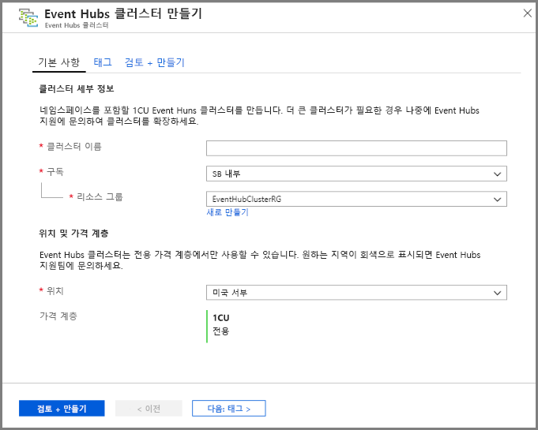
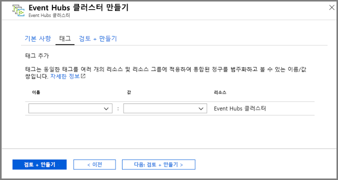
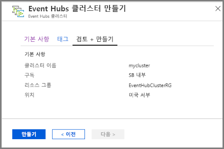
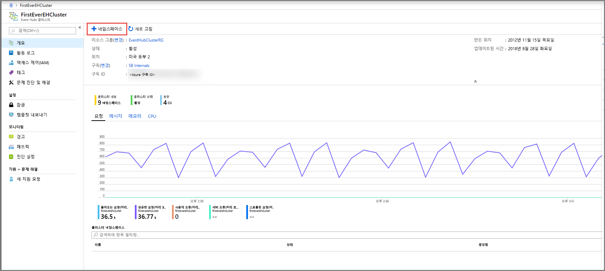
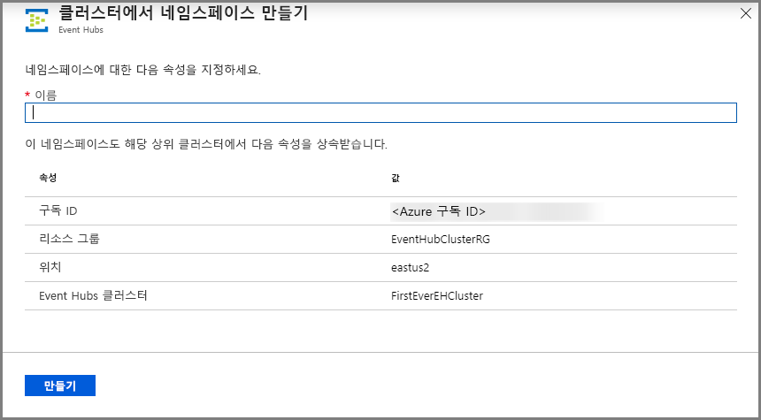
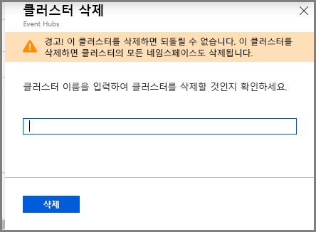

# 빠른 시작: Azure Portal을 사용하여 전용 Event Hubs 클러스터 만들기 
Event Hubs 클러스터는 스트리밍 요구 사항이 가장 까다로운 고객을 위한 단일 테넌트 배포를 제공합니다. 이 제품은 99.99% SLA를 보장하며 Dedicated 가격 책정 계층에서만 사용할 수 있습니다. 용량을 보장하고 대기 시간이 1초 미만에 불과한 [Event Hubs 클러스터](event-hubs-dedicated-overview.md)는 초당 수백만 개의 이벤트를 수신할 수 있습니다. 클러스터 내부에 생성되는 네임스페이스 및 이벤트 허브는 표준 제품의 모든 기능을 포함하고 있으며, 거기에 수신 제한도 없습니다. Dedicated 제품은 인기 있는 [Event Hubs 캡처](event-hubs-capture-overview.md) 기능을 추가 비용 없이 사용할 수 있으므로, 자동으로 데이터 스트림을 일괄 처리하여 [Azure Blob Storage](../storage/blobs/storage-blobs-introduction.md) 또는 [Azure Data Lake Storage Gen 1](../data-lake-store/data-lake-store-overview.md)에 기록할 수 있습니다.

전용 클러스터는 미리 할당된 CPU 및 메모리 리소스의 양을 의미하는 **CU(용량 단위)** 단위로 프로비저닝 및 청구됩니다. 각 클러스터에 1, 2, 4, 8, 12, 16 또는 20개 CU를 구매할 수 있습니다. 이 빠른 시작에서는 Azure Portal을 통해 1 CU Event Hubs 클러스터를 만드는 방법을 안내합니다.

> [!NOTE]
> 이 셀프 서비스 환경은 현재 [Azure Portal](https://aka.ms/eventhubsclusterquickstart)에서 미리 보기로 사용할 수 있습니다. Dedicated 제품에 대해 궁금한 점이 있으면 [Event Hubs 팀](mailto:askeventhubs@microsoft.com)으로 문의하세요.

## 필수 조건
이 빠른 시작을 완료하려면 다음 항목이 있어야 합니다.

- Azure 계정. 계정이 없으면 시작하기 전에 [계정을 구매](https://azure.microsoft.com/pricing/purchase-options/pay-as-you-go/)하세요. Azure 체험 계정에서는 이 기능이 지원되지 않습니다. 
- [Visual Studio 2017 업데이트 3(버전 15.3, 26730.01)](https://visualstudio.microsoft.com/vs/) 이상
- [.NET Standard SDK](https://dotnet.microsoft.com/download) 버전 2.0 이상
- [리소스 그룹 만들기](../event-hubs/event-hubs-create.md#create-a-resource-group)

## Event Hubs Dedicated 클러스터 만들기
Event Hubs 클러스터는 하나 이상의 네임스페이스를 만들 수 있는 고유한 범위 지정 컨테이너를 제공합니다. 포털 셀프 서비스 환경의 이 미리 보기 단계에서는 지원되는 Azure 지역에 1CU 클러스터를 만들 수 있습니다. 1CU보다 큰 클러스터가 필요한 경우 클러스터를 만든 후 클러스터를 강화해 달라는 Azure 지원 요청을 제출하면 됩니다.

Azure Portal을 사용하여 리소스 그룹에 클러스터를 만들려면 다음 단계를 완료합니다.

1. [이 링크](https://aka.ms/eventhubsclusterquickstart)를 따라 이동하여 Azure Portal에서 클러스터를 만듭니다. 반대로, 왼쪽 탐색 창에서 **모든 서비스**를 선택한 다음, 검색 창에 "Event Hubs 클러스터"를 입력하고 결과 목록에서 "Event Hubs 클러스터"를 선택합니다.
2. **클러스터 만들기** 페이지에서 다음을 구성합니다.
    1. **클러스터의 이름**을 입력합니다. 시스템에서 사용 가능한 이름인지 즉시 확인합니다.
    2. 클러스터를 만들 **구독**을 선택합니다.
    3. 클러스터를 만들 **리소스 그룹**을 선택합니다.
    4. 클러스터의 **위치**를 선택합니다. 원하는 지역이 회색으로 비활성화된 경우 일시적으로 용량을 초과한 것이며, Event Hubs 팀에 [지원 요청](#submit-a-support-request)을 제출할 수 있습니다.
    5. 페이지 맨 아래에서 **다음: 태그** 단추를 선택합니다. 시스템에서 리소스를 완전히 프로비전하기까지 몇 분 동안 기다려야 할 수 있습니다.

        
3. **태그** 페이지에서 다음을 구성합니다.
    1. 추가할 태그의 **이름** 및 **값**을 입력합니다. 이 단계는 **선택 사항**입니다.  
    2. **검토 + 만들기** 단추를 선택합니다.

        
4. **검토 + 만들기** 페이지에서 세부 정보를 검토하고 **만들기**를 선택합니다. 

    

## 클러스터 내부에 네임스페이스 및 이벤트 허브 만들기

1. 클러스터 내부에 네임스페이스를 만들려면 클러스터에 대한 **Event Hubs 클러스터** 페이지의 상단 메뉴에서 **+네임스페이스**를 선택합니다.

    
2. [네임스페이스 만들기] 페이지에서 다음 단계를 수행합니다.
    1. **네임스페이스 이름**을 입력합니다.  그러면 시스템에서는 사용 가능한 이름인지 확인합니다.
    2. 네임스페이스는 다음 속성을 상속합니다.
        1. 구독 ID
        2. 리소스 그룹
        3. 위치
        4. 클러스터 이름
    3. **만들기**를 선택하여 네임스페이스를 만듭니다. 이제 클러스터를 관리할 수 있습니다.  

        
3. 네임스페이스를 만든 후에는 평소에 네임스페이스 내부에 만들던 것처럼 [이벤트 허브를 만들 수 있습니다](event-hubs-create.md#create-an-event-hub). 

## 지원 요청을 제출합니다.

클러스터를 만든 후 크기를 변경하고 싶거나 원하는 지역을 사용할 수 없는 경우 다음 단계에 따라 지원 요청을 제출하세요.

1. [Azure Portal](https://portal.azure.com)의 왼쪽 메뉴에서 **도움말 + 지원**을 선택합니다.
2. [지원] 메뉴에서 **+ 새 지원 요청**을 선택합니다.
3. [지원] 페이지에서 다음 단계를 수행합니다.
    1. **이슈 유형** 드롭다운 목록에서 **기술**을 선택합니다.
    2. **구독**의 경우 사용자의 구독을 선택합니다.
    3. **서비스**로 **내 서비스**를 선택한 다음, **Event Hubs**를 선택합니다.
    4. 클러스터가 이미 있는 경우 해당 클러스터를 **리소스**로 선택하고, 그렇지 않으면 **일반 질문/리소스를 사용할 수 없음**을 선택합니다.
    5. **문제 유형**으로 **할당량**을 선택합니다.
    6. **문제 하위 유형** 드롭다운 목록에서 다음 값 중 하나를 선택합니다.
        1. 해당 Azure 지역에 기능을 지원해 달라고 요청하려면 **Dedicated SKU 요청**을 선택합니다.
        2. 전용 클러스터를 강화 또는 축소하려면 **전용 클러스터 강화 또는 축소 요청**을 선택합니다. 
    7. **주제**에는 이슈를 설명합니다.

        

 ## 전용 클러스터 삭제
 
1. 클러스터를 삭제하려면 위쪽 메뉴에서 **삭제**를 선택합니다. 클러스터를 만든 후 적어도 4시간 이상의 클러스터 사용 요금이 청구됩니다. 
2. 정말로 클러스터를 삭제할 것인지 확인하는 메시지가 나타납니다.
3. **클러스터 이름**을 입력하고 **삭제**를 선택하여 클러스터를 삭제합니다.

    

## 다음 단계
이 문서에서는 Event Hubs 클러스터를 만들었습니다. 이벤트 허브에서 이벤트를 전송 및 수신하고, 이벤트를 Azure 스토리지 또는 Azure Data Lake Store에 캡처하는 방법에 대한 단계별 지침은 다음 자습서를 참조하세요.

- [.NET Core에서 이벤트 보내기 및 받기](event-hubs-dotnet-standard-getstarted-send.md)
- [Azure Portal을 사용하여 Event Hubs 캡처를 사용하도록 설정](event-hubs-capture-enable-through-portal.md)
- [Apache Kafka에 Azure Event Hubs 사용](event-hubs-for-kafka-ecosystem-overview.md)
