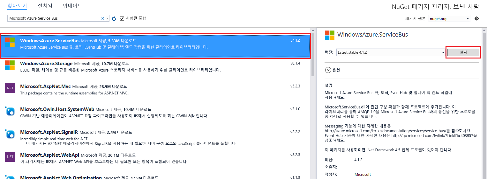
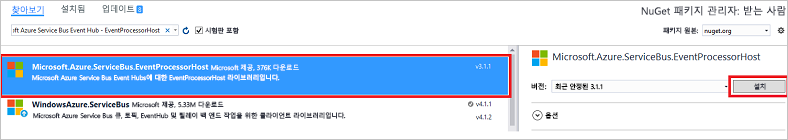

# <a name="send-events-to-or-receive-events-from-azure-event-hubs-using-net-framework"></a>이벤트를 보내거나.NET Framework를 사용 하 여 Azure Event Hubs에서 이벤트 수신
Azure Event Hubs는 초당 수백만 개의 이벤트를 수신하여 처리할 수 있는 빅 데이터 스트리밍 플랫폼이자 이벤트 수집 서비스입니다. Event Hubs는 분산된 소프트웨어와 장치에서 생성된 이벤트, 데이터 또는 원격 분석을 처리하고 저장할 수 있습니다. Event Hub로 전송된 데이터는 실시간 분석 공급자 또는 일괄 처리/저장소 어댑터를 사용하여 변환하고 저장할 수 있습니다. Event Hubs에 대한 자세한 개요는 [Event Hubs 개요](event-hubs-about.md) 및 [Event Hubs 기능](event-hubs-features.md)을 참조하세요.

이 자습서에서.NET Framework 콘솔 응용 프로그램을 만드는 방법을 보여 줍니다 C# 이벤트를 보내거나 eventhub에서 이벤트를 수신 합니다. 

## <a name="prerequisites"></a>필수 조건
이 자습서를 완료하려면 다음 필수 구성 요소가 필요합니다.

- [Microsoft Visual Studio 2017 이상](https://visualstudio.com).
- **Event Hubs 네임 스페이스를 만들고 event hub**합니다. 첫 번째 단계에서는 [Azure Portal](https://portal.azure.com)을 사용하여 Event Hubs 형식의 네임스페이스를 만들고 애플리케이션에서 Event Hub와 통신하는 데 필요한 관리 자격 증명을 얻습니다. 네임스페이스 및 이벤트 허브를 만들려면 [이 문서](event-hubs-create.md)의 절차를 따릅니다. 그런 다음, 가져옵니다 합니다 **이벤트 허브 네임 스페이스에 대 한 연결 문자열** 문서에서 지침에 따라: [연결 문자열 가져오기](event-hubs-get-connection-string.md#get-connection-string-from-the-portal) 해당 연결 문자열은 이 자습서의 뒷부분에서 사용합니다.

## <a name="send-events"></a>이벤트 보내기 
이 섹션에서는 이벤트 허브로 이벤트를 보내는.net 콘솔 응용 프로그램을 만드는 방법을 보여 줍니다. 

### <a name="create-a-console-application"></a>콘솔 애플리케이션 만들기

Visual Studio에서 **콘솔 애플리케이션** 프로젝트 템플릿을 사용하여 Visual C# 데스크톱 애플리케이션 프로젝트를 새로 만듭니다. 프로젝트의 이름을 **Sender**로 지정합니다.
   


### <a name="add-the-event-hubs-nuget-package"></a>Event Hubs NuGet 패키지 추가

1. 솔루션 탐색기에서 **Sender** 프로젝트를 마우스 오른쪽 단추로 클릭한 다음 **솔루션에 대한 NuGet 패키지 관리**를 클릭합니다. 
2. **찾아보기** 탭을 클릭한 다음 `WindowsAzure.ServiceBus`를 검색합니다. **설치**를 클릭하고 사용 약관에 동의합니다. 
   
    
   
    Visual Studio는 [Azure Service Bus 라이브러리 NuGet 패키지](https://www.nuget.org/packages/WindowsAzure.ServiceBus)에 대한 참조를 다운로드, 설치 및 추가합니다.

### <a name="write-code-to-send-messages-to-the-event-hub"></a>이벤트 허브에 메시지를 전송하는 코드 작성

1. **Program.cs** 파일 위에 다음 `using` 문을 추가합니다.
   
    ```csharp
    using System.Threading;
    using Microsoft.ServiceBus.Messaging;
    ```
2. **Program** 클래스에 다음 필드를 추가하고, 이전 섹션에서 만든 Event Hub 이름과 이전에 저장한 네임스페이스 수준 연결 문자열로 위치 지정자 값을 대체합니다. Azure Portal 이벤트 허브 페이지의 **RootManageSharedAccessKey** 아래 **연결 문자열-기본** 키에서 이벤트 허브의 연결 문자열을 복사할 수 있습니다. 자세한 단계는 [연결 문자열 가져오기](event-hubs-get-connection-string.md#get-connection-string-from-the-portal)를 참조하세요.
   
    ```csharp
    static string eventHubName = "Your Event Hub name";
    static string connectionString = "namespace connection string";
    ```
3. **Program** 클래스에 다음 메서드를 추가합니다.
   
      ```csharp
      static void SendingRandomMessages()
      {
          var eventHubClient = EventHubClient.CreateFromConnectionString(connectionString, eventHubName);
          while (true)
          {
              try
              {
                  var message = Guid.NewGuid().ToString();
                  Console.WriteLine("{0} > Sending message: {1}", DateTime.Now, message);
                  eventHubClient.Send(new EventData(Encoding.UTF8.GetBytes(message)));
              }
              catch (Exception exception)
              {
                  Console.ForegroundColor = ConsoleColor.Red;
                  Console.WriteLine("{0} > Exception: {1}", DateTime.Now, exception.Message);
                  Console.ResetColor();
              }
       
              Thread.Sleep(200);
          }
      }
      ```
   
      이 메서드는 200ms 지연과 함께 Event Hub에 이벤트를 지속적으로 보냅니다.
4. 마지막으로 **Main** 메서드에 다음 줄을 추가합니다.
   
      ```csharp
      Console.WriteLine("Press Ctrl-C to stop the sender process");
      Console.WriteLine("Press Enter to start now");
      Console.ReadLine();
      SendingRandomMessages();
      ```
5. 프로그램을 실행하고 오류가 없는지 확인합니다.
  
## <a name="receive-events"></a>이벤트 수신
이 섹션에서는 사용 하 여 이벤트 허브에서 메시지를 수신 하는.NET Framework 콘솔 응용 프로그램을 작성 합니다 [이벤트 프로세서 호스트](event-hubs-event-processor-host.md)합니다. [이벤트 프로세서 호스트](event-hubs-event-processor-host.md)는 영구적 검사점을 관리하여 Event Hubs의 이벤트 수신을 간소화하고 이러한 Event Hubs에서 병렬 수신하는 .NET 클래스입니다. 이벤트 프로세서 호스트를 사용하면 다른 노드에 호스트된 수신기를 비롯한 여러 수신기 간에 이벤트를 분할할 수 있습니다. 

[!INCLUDE [event-hubs-create-storage](../../includes/event-hubs-create-storage.md)]

### <a name="create-a-console-application"></a>콘솔 애플리케이션 만들기

Visual Studio에서 **콘솔 애플리케이션** 프로젝트 템플릿을 사용하여 Visual C# 데스크톱 애플리케이션 프로젝트를 새로 만듭니다. 프로젝트 이름을 **Receiver**로 지정합니다.
   


### <a name="add-the-event-hubs-nuget-package"></a>Event Hubs NuGet 패키지 추가

1. 솔루션 탐색기에서 **Receiver** 프로젝트를 마우스 오른쪽 단추로 클릭한 다음 **솔루션에 대한 NuGet 패키지 관리**를 클릭합니다.
2. **찾아보기** 탭을 클릭한 다음 `Microsoft Azure Service Bus Event Hub - EventProcessorHost`를 검색합니다. **설치**를 클릭하고 사용 약관에 동의합니다.
   
    
   
    Visual Studio는 [Azure Service Bus Event Hub - EventProcessorHost NuGet 패키지](https://www.nuget.org/packages/Microsoft.Azure.ServiceBus.EventProcessorHost)에 대한 참조 및 해당하는 모든 종속성을 다운로드, 설치 및 추가합니다.

### <a name="implement-the-ieventprocessor-interface"></a>IEventProcessor 인터페이스 구현

1. **Receiver** 프로젝트를 마우스 오른쪽 단추로 클릭하고 **추가**를 클릭한 후 **클래스**를 클릭합니다. 새 클래스의 이름을 **SimpleEventProcessor**로 지정하고 **추가**를 클릭하여 클래스를 생성합니다.
   
    
2. SimpleEventProcessor.cs 파일의 맨 위에 다음 구문을 추가합니다.
    
      ```csharp
      using Microsoft.ServiceBus.Messaging;
      using System.Diagnostics;
      ```
    
3. 다음 코드를 클래스의 본문으로 대체합니다.
    
      ```csharp
      class SimpleEventProcessor : IEventProcessor
      {
        Stopwatch checkpointStopWatch;
        
        async Task IEventProcessor.CloseAsync(PartitionContext context, CloseReason reason)
        {
            Console.WriteLine("Processor Shutting Down. Partition '{0}', Reason: '{1}'.", context.Lease.PartitionId, reason);
            if (reason == CloseReason.Shutdown)
            {
                await context.CheckpointAsync();
            }
        }
        
        Task IEventProcessor.OpenAsync(PartitionContext context)
        {
            Console.WriteLine("SimpleEventProcessor initialized.  Partition: '{0}', Offset: '{1}'", context.Lease.PartitionId, context.Lease.Offset);
            this.checkpointStopWatch = new Stopwatch();
            this.checkpointStopWatch.Start();
            return Task.FromResult<object>(null);
        }
        
        async Task IEventProcessor.ProcessEventsAsync(PartitionContext context, IEnumerable<EventData> messages)
        {
            foreach (EventData eventData in messages)
            {
                string data = Encoding.UTF8.GetString(eventData.GetBytes());
        
                Console.WriteLine(string.Format("Message received.  Partition: '{0}', Data: '{1}'",
                    context.Lease.PartitionId, data));
            }
        
            //Call checkpoint every 5 minutes, so that worker can resume processing from 5 minutes back if it restarts.
            if (this.checkpointStopWatch.Elapsed > TimeSpan.FromMinutes(5))
            {
                await context.CheckpointAsync();
                this.checkpointStopWatch.Restart();
            }
        }
      }
      ```
    
      이 클래스는 Event Hub에서 받는 이벤트를 처리하기 위해 **EventProcessorHost**에 의해 호출됩니다. `SimpleEventProcessor` 클래스는 초시계를 사용하여 **EventProcessorHost** 컨텍스트에서 검사점 메서드를 주기적으로 호출합니다. 이 처리로 인해 수신기가 다시 시작되는 경우 5분 이하의 처리 작업은 손실됩니다.

### <a name="update-the-main-method-to-use-simpleeventprocessor"></a>SimpleEventProcessor를 사용하도록 Main 메서드 업데이트

1. **Program** 클래스에서 파일 맨 위에 다음 `using` 문을 추가합니다.
    
      ```csharp
      using Microsoft.ServiceBus.Messaging;
      ```
    
2. `Program` 클래스의 `Main` 메서드를 다음 코드로 바꿉니다. 이 코드는 이전에 저장한 이벤트 허브 이름 및 네임스페이스 수준 연결 문자열과 이전 섹션에서 복사한 저장소 계정 및 키를 대체합니다. 
    
      ```csharp
      static void Main(string[] args)
      {
        string eventHubConnectionString = "{Event Hubs namespace connection string}";
        string eventHubName = "{Event Hub name}";
        string storageAccountName = "{storage account name}";
        string storageAccountKey = "{storage account key}";
        string storageConnectionString = string.Format("DefaultEndpointsProtocol=https;AccountName={0};AccountKey={1}", storageAccountName, storageAccountKey);
        
        string eventProcessorHostName = Guid.NewGuid().ToString();
        EventProcessorHost eventProcessorHost = new EventProcessorHost(eventProcessorHostName, eventHubName, EventHubConsumerGroup.DefaultGroupName, eventHubConnectionString, storageConnectionString);
        Console.WriteLine("Registering EventProcessor...");
        var options = new EventProcessorOptions();
        options.ExceptionReceived += (sender, e) => { Console.WriteLine(e.Exception); };
        eventProcessorHost.RegisterEventProcessorAsync<SimpleEventProcessor>(options).Wait();
        
        Console.WriteLine("Receiving. Press enter key to stop worker.");
        Console.ReadLine();
        eventProcessorHost.UnregisterEventProcessorAsync().Wait();
      }
      ```
    
3. 프로그램을 실행하고 오류가 없는지 확인합니다.
  
## <a name="next-steps"></a>다음 단계
다음 문서를 읽어보세요. 

- [EventProcessorHost](event-hubs-event-processor-host.md)
- [기능 및 Azure Event Hubs의 용어](event-hubs-features.md)합니다.
- [Event Hubs FAQ](event-hubs-faq.md)


<!-- Links -->
[EventProcessorHost]: /dotnet/api/microsoft.servicebus.messaging.eventprocessorhost
[Event Hubs overview]: event-hubs-about.md
[Event Hubs Programming Guide]: event-hubs-programming-guide.md
[Azure Storage account]:../storage/common/storage-create-storage-account.md
[Event Processor Host]: event-hubs-event-processor-host.md
[Azure portal]: https://portal.azure.com
