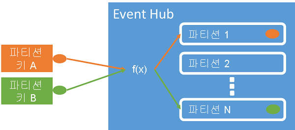
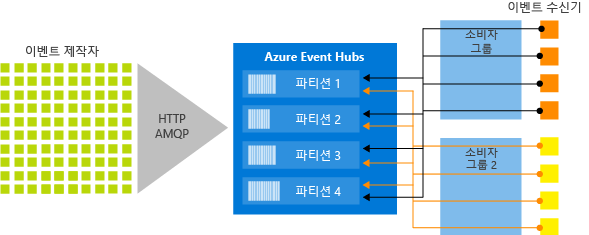
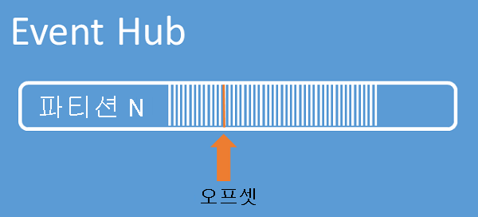

# <a name="features-and-terminology-in-azure-event-hubs"></a>Azure Event Hubs의 기능 및 용어

Azure Event Hubs는 확장 가능한 처리 서비스로 대량의 이벤트 및 데이터를 수집하여 처리하며, 대기 시간이 낮고 안정성이 우수합니다. 개요는 [Event Hubs란?](event-hubs-what-is-event-hubs.md)을 참조하세요.

이 문서는 [개요](event-hubs-what-is-event-hubs.md) 문서의 정보를 기반으로 하며, Event Hubs 구성 요소 및 기능에 대한 기술 정보와 구현 정보를 제공합니다.

## <a name="namespace"></a>네임스페이스
Event Hubs 네임스페이스는 [정규화된 도메인 이름](https://en.wikipedia.org/wiki/Fully_qualified_domain_name)으로 참조되는 고유한 범위 지정 컨테이너를 제공하며, 하나 이상의 이벤트 허브 또는 Kafka 항목을 만듭니다. 

## <a name="event-hubs-for-apache-kafka"></a>Apache Kafka용 Event Hubs

[이 기능](event-hubs-for-kafka-ecosystem-overview.md)은 고객이 Kafka 프로토콜을 사용하여 Event Hubs에 지시할 수 있는 엔드포인트를 제공합니다. 이 통합에서는 고객에게 Kafka 엔드포인트를 제공합니다. 이를 통해 Event Hubs에 지시하도록 기존 Kafka 애플리케이션을 구성하여 고유한 Kafka 클러스터를 실행하는 대안을 제공할 수 있습니다. Apache Kafka용 Event Hubs는 Kafka 프로토콜 1.0 이상을 지원합니다. 

이 통합을 사용 하 여 Kafka 클러스터를 실행 하거나 Zookeeper를 사용 하 여 관리할 필요가 없습니다. 캡처, 자동 확장 및 지리적 재해 복구 등의 까다로운 Event Hubs 기능 중 일부를 사용할 수도 있습니다.

이 통합을 사용하면 Mirror Maker와 같은 애플리케이션 또는 Kafka Connect와 같은 프레임워크를 구성만 변경하여 클러스터 없이 작동시킬 수 있습니다. 

## <a name="event-publishers"></a>이벤트 게시자

Event Hub로 데이터를 전송하는 모든 엔터티는 이벤트 생산자 또는 *이벤트 게시자*입니다. 이벤트 게시자는 HTTPS 또는 AMQP 1.0 또는 Kafka 1.0 이상을 사용하여 이벤트를 게시할 수 있습니다. 이벤트 게시자는 SAS(공유 액세스 서명) 토큰을 사용하여 자신을 Event Hub로 식별하고 고유 ID를 구성하거나 일반적인 SAS 토큰을 사용합니다.

### <a name="publishing-an-event"></a>이벤트 게시

AMQP 1.0, Kafka 1.0 이상 또는 HTTPS를 통해 이벤트를 게시할 수 있습니다. Event Hubs는 .NET 클라이언트에서 Event Hub로 이벤트를 게시하기 위한 [클라이언트 라이브러리 및 클래스](event-hubs-dotnet-framework-api-overview.md)를 제공합니다. 다른 런타임 및 플랫폼의 경우, [Apache Qpid](https://qpid.apache.org/)와 같은 모든 AMQP 1.0 클라이언트를 사용할 수 있습니다. 이벤트를 개별적으로 게시하거나 일괄처리할 수 있습니다. 단일 게시(이벤트 데이터 인스턴스)는 단일 이벤트 또는 일괄 처리인지에 관계 없이 1MB로 제한됩니다. 이 임계값보다 큰 이벤트를 게시하면 오류가 발생합니다. 게시자가 Event Hub 내 파티션을 모르고 *파티션 키* (다음 섹션에서 도입된) 또는 해당 SAS 토큰을 통해 자신의 ID를 지정하는 것이 가장 좋습니다.

AMQP 또는 HTTPS 사용 선택은 사용량 시나리오에 해당됩니다. 전송 수준 보안(TLS) 또는 SSL/TLS 외에 AMQP는 영구 양방향 소켓을 설정해야 합니다. AMQP에서는 세션을 초기화할 때 네트워크 비용이 높지만, HTTPS에는 모든 요청에 대해 추가 SSL 오버헤드가 필요합니다. AMQP는 빈번한 게시자에게 더 높은 성능을 제공합니다.



Event Hubs는 파티션 키 값을 공유하는 모든 이벤트가 동일한 파티션으로 순서대로 배달되도록 합니다. 파티션 키가 게시자 정책과 함께 사용되는 경우 게시자 ID와 파티션 키 값이 일치해야 합니다. 그렇지 않은 경우 오류가 발생합니다.

### <a name="publisher-policy"></a>게시자 정책

Event Hubs는 *게시자 정책*을 통한 이벤트 게시자에 대한 세부적 제어를 사용합니다. 게시자 정책은 많은 수의 독립 이벤트 게시자를 지원하도록 설계된 런타임 기능입니다. 게시자 정책을 사용하여 다음 메커니즘을 사용하여 Event Hub로 이벤트를 게시하는 경우 각 게시자는 자체 고유 식별자를 사용합니다.

```http
//[my namespace].servicebus.windows.net/[event hub name]/publishers/[my publisher name]
```

시간에 앞서 게시자 이름을 미리 만들 필요가 없지만, 독립 게시자 ID를 보장하기 위해 이벤트를 게시하는 경우 사용하는 SAS 토큰과 일치해야 합니다. 게시자 정책을 사용하는 경우 **PartitionKey** 값이 게시자 이름으로 설정됩니다. 제대로 작동하려면 이 값이 일치해야 합니다.

## <a name="capture"></a>캡처

[Event Hubs 캡처](event-hubs-capture-overview.md)를 사용하면 Event Hubs의 스트리밍 데이터를 자동으로 캡처하고 선택한 Blob Storage 계정 또는 Azure Data Lake 서비스 계정에 저장할 수 있습니다. Azure Portal에서 캡처를 사용하도록 설정하고 캡처를 수행할 최소 크기와 기간을 지정할 수 있습니다. Event Hubs 캡처를 사용하여 자신의 Azure Blob Storage 계정 및 컨테이너 또는 Azure Data Lake 서비스 계정을 지정합니다. 이 중 하나는 캡처된 데이터를 저장하는 데 사용됩니다. 캡처된 데이터는 Apache Avro 형식으로 기록됩니다.

## <a name="partitions"></a>파티션

Event Hubs는 각 소비자만이 특정 하위 집합, 파티션 또는 메시지 스트림을 읽는 파티션된 소비자 패턴을 통해 메시지 스트리밍을 제공합니다. 이 패턴은 이벤트 처리를 위한 가로 눈금을 사용하며 큐 및 항목에 사용할 수 없는 기타 스트림 중심 기능을 제공합니다.

파티션은 Event Hub에서 보유하는 순서가 지정된 이벤트 시퀀스입니다. 최신 이벤트가 도착하면 이 시퀀스의 끝에 추가됩니다. 파티션을 "커밋 로그"로 생각할 수 있습니다.


Event Hubs는 Event Hub의 모든 파티션에 적용되도록 구성된 보존 시간에 대한 데이터를 유지합니다. 시간 단위로 이벤트가 만료됩니다. 명시적으로 삭제할 수 없습니다. 파티션은 독립적이며 자체 데이터 시퀀스를 포함하기 때문에 종종 다른 속도로 증가합니다.


파티션 수는 만들 때 지정되며 2와 32 사이여야 합니다. 파티션 수는 변경할 수 없으므로 파티션 수를 설정할 때 장기적인 규모를 고려해야 합니다. 파티션은 애플리케이션을 사용하는 데 필요한 다운스트림 병렬 처리와 관련된 데이터 구성 메커니즘입니다. Event Hub의 파티션 수는 예상되는 동시 판독기의 수와 직접적으로 관련이 있습니다. Event Hubs 팀에 문의하여 32개를 초과하는 파티션 수를 늘릴 수 있습니다.

파티션은 식별 가능하고 직접 보낼 수 있지만 파티션으로 직접 보내는 방법은 권장하지 않습니다. 대신에 도입 된 더 높은 수준의 구문을 사용할 수 있습니다 합니다 [이벤트 게시자](#event-publishers) 및 용량 섹션입니다. 

파티션은 이벤트 본문, 사용자 정의 속성 모음 및 파티션의 오프셋과 스트림 시퀀스의 번호와 같은 메타데이터를 포함하는 이벤트 데이터 시퀀스로 채워집니다.

파티션 및 가용성과 안정성 간의 균형에 대한 자세한 내용은 [Event Hubs 프로그래밍 가이드](event-hubs-programming-guide.md#partition-key) 및 [Event Hubs의 가용성 및 일관성](event-hubs-availability-and-consistency.md) 문서를 참조하세요.

### <a name="partition-key"></a>파티션 키

[파티션 키](event-hubs-programming-guide.md#partition-key)를 사용하여 들어오는 이벤트 데이터를 데이터 구성을 위한 특정 파티션에 매핑할 수 있습니다. 파티션 키는 Event Hub로 전달된 발신자가 제공하는 값입니다. 이 키는 파티션 할당을 만드는 정적 해싱 기능을 통해 처리됩니다. 이벤트를 게시할 때 파티션 키를 지정하지 않으면 라운드 로빈 할당이 사용됩니다.

이벤트 게시자는 이벤트를 게시하는 파티션이 아니라 파티션 키만 인식합니다. 이렇게 키와 파티션을 분리하면 발신자가 다운스트림 처리에 대해 너무 많이 알 필요가 없습니다. 장치 단위 또는 사용자 공유 ID는 좋은 파티션 키가 되지만 지리와 같은 다른 특성은 단일 파티션으로 관련 이벤트를 그룹화하는 데도 사용할 수 있습니다.

## <a name="sas-tokens"></a>SAS 토큰

Event Hubs는 네임스페이스 및 Event Hubs 수준에서 사용할 수 있는 *공유 액세스 서명*을 사용합니다. SAS 토큰은 SAS 키에서 생성되고 특정 형식으로 인코딩된 URL의 SHA 해시입니다. 키(정책)와 토큰의 이름을 사용하는 경우 Event Hubs는 해시를 다시 생성하여 발신자를 인증할 수 있습니다. 일반적으로 이벤트 게시자에 대한 SAS 토큰은 특정 Event Hub에 대한 **전송** 권한만으로 작성됩니다. 이 SAS 토큰 URL 메커니즘은 게시자 정책에 도입된 게시자 ID에 대한 기반이 됩니다. SAS 작업에 대한 자세한 내용은 [Service Bus를 사용한 공유 액세스 서명 인증](../service-bus-messaging/service-bus-sas.md)을 참조하세요.

## <a name="event-consumers"></a>이벤트 소비자

Event Hubs에서 이벤트 데이터를 읽는 모든 엔터티는 *이벤트 소비자*입니다. 모든 Event Hubs 소비자는 AMQP 1.0 세션을 통해 연결되며, 사용 가능한 상태가 되면 이 세션을 통해 이벤트가 전달됩니다. 클라이언트는 데이터 가용성에 대해 폴링할 필요가 없습니다.

### <a name="consumer-groups"></a>소비자 그룹

Event Hubs의 게시/구독 메커니즘은 *소비자 그룹*을 통해 사용할 수 있습니다. 소비자 그룹은 전체 Event Hub의 보기(상태, 위치, 또는 오프셋)입니다. 소비자 그룹은 여러 소비 애플리케이션을 사용하여 이벤트 스트림의 별도 보기가 있으며 자신의 속도 및 자신의 오프셋으로 독립적으로 스트림을 읽을 수 있습니다.

스트림 처리 아키텍처에서 각 다운스트림 애플리케이션은 소비자 그룹에 해당합니다. 이벤트 데이터를 장기 저장소에 기록하려는 경우, 해당 저장소 기록기 애플리케이션은 소비자 그룹입니다. 복합 이벤트 처리는 별도의 다른 소비자 그룹에서 수행될 수 있습니다. 소비자 그룹을 통해서만 파티션을 액세스할 수 있습니다. Event Hub에는 항상 기본 소비자 그룹이 있으며 표준 계층 Event Hub에 대해 최대 20개의 소비자 그룹을 만들 수 있습니다.

소비자 그룹당 파티션에는 최대 5개의 동시 판독기가 있을 수 있습니다. 하지만 **소비자 그룹당 파티션에는 활성 수신기를 하나만 포함하는 것이 좋습니다.** 각 판독기는 단일 파티션 내에서 모든 메시지를 받습니다. 동일한 파티션에 여러 판독기가 있는 경우 중복 메시지를 처리합니다. 사소하지 않을 수도 있는 이 문제는 코드에서 처리해야 합니다. 그러나 일부 시나리오에서는 유효한 방법입니다.


다음은 소비자 그룹 URI 규칙의 예입니다.

```http
//[my namespace].servicebus.windows.net/[event hub name]/[Consumer Group #1]
//[my namespace].servicebus.windows.net/[event hub name]/[Consumer Group #2]
```

다음 그림에서는 아키텍처를 처리하는 Event Hubs 스트림을 보여 줍니다.



### <a name="stream-offsets"></a>스트림 오프셋

*오프셋*은 파티션 내의 이벤트 위치입니다. 오프셋을 클라이언트 쪽 커서로 생각할 수 있습니다. 오프셋은 이벤트의 바이트 번호입니다. 오프셋을 사용하여 이벤트 소비자(판독기)가 이벤트를 읽기 시작할 이벤트 스트림의 위치를 지정할 수 있습니다. 타임스탬프 또는 오프셋 값으로 오프셋을 지정할 수 있습니다. 소비자는 Event Hubs 서비스 외부에 자신의 오프셋 값을 저장하는 일을 담당합니다. 파티션 내에서 각 이벤트는 오프셋을 포함합니다.



### <a name="checkpointing"></a>검사점 설정

*검사점* 은 판독기가 파티션 이벤트 시퀀스 내에서 위치를 표시하거나 커밋하는 프로세스입니다. 검사점은 소비자의 책임으로 소비자 그룹 내에서 파티션별로 발생합니다. 이러한 책임은 각 소비자 그룹에 대해 각 파티션 판독기는 이벤트 스트림의 현재 위치를 추적해야 하며 데이터 스트림이 완료된 것으로 간주되면 서비스를 알릴 수 있다는 것을 의미합니다.

판독기가 파티션에서 연결을 끊은 경우 다시 연결하면 해당 소비자 그룹에서 해당 파티션의 마지막 판독기에서 이전에 제출한 검사점에서 읽기 시작합니다. 판독기가 연결하면, 오프셋을 이벤트 허브로 전달하여 읽기 시작할 위치를 지정합니다. 이러한 방식으로, 서로 다른 머신에서 실행되는 판독기 간의 장애 조치(failover)가 발생하는 경우 복원력을 제공하고 다운스트림 애플리케이션에서 이벤트를 "완료"로 표시하는 데 검사점을 사용할 수 있습니다. 이 검사점 프로세스에서 더 낮은 오프셋을 지정하면 이전 데이터로 돌아갈 수 있습니다. 이 메커니즘을 통해 검사점을 지정하면 장애 조치 복원력 및 제어된 이벤트 스트림 재생 모두를 사용할 수 있습니다.

### <a name="common-consumer-tasks"></a>일반 소비자 작업

모든 Event Hubs 소비자는 상태 인식 양방향 통신 채널인 AMQP 1.0 세션을 통해 연결됩니다. 각 파티션에는 AMQP 1.0 세션이 있어 파티션별로 분리된 이벤트를 쉽게 전송할 수 있습니다.

#### <a name="connect-to-a-partition"></a>파티션에 연결

파티션에 연결할 때 일반적으로 임대 메커니즘을 사용하여 판독기 연결을 특정 파티션으로 조정합니다. 이러한 방식으로, 소비자 그룹의 모든 파티션에 활성 판독기가 하나만 있을 수 있습니다. .NET 클라이언트의 [EventProcessorHost](/dotnet/api/microsoft.azure.eventhubs.processor.eventprocessorhost) 클래스를 사용하면 판독기의 검사점 지정, 임대 및 관리가 간편해집니다. 이벤트 프로세서 호스트는 지능형 소비자 에이전트입니다.

#### <a name="read-events"></a>읽기 이벤트

AMQP 1.0 세션 및 링크는 특정 파티션에 대해 열린 후, 이벤트는 이벤트 허브 서비스에서 AMQP 1.0 클라이언트로 전달됩니다. 이 배달 메커니즘은 HTTP GET과 같은 풀 기반 메커니즘보다 더 낮은 대기 시간 및 더 높은 처리량을 사용합니다. 이벤트가 클라이언트에 전송되므로, 각 이벤트 데이터 인스턴스는 이벤트 시퀀스에서 검사점을 용이하게 하는데 사용되는 오프셋 및 시퀀스 번호와 같은 중요한 메타데이터를 포함합니다.

이벤트 데이터:
* Offset
* 시퀀스 번호
* 본문
* 사용자 속성
* 시스템 속성

사용자의 책임 하에 오프셋을 관리해야 합니다.

## <a name="scaling-with-event-hubs"></a>Event Hubs를 사용 하 여 크기 조정

Event Hubs를 사용 하 여 크기 조정에 영향을 줄 수 있는 두 가지 요인이 있습니다.
*   처리량 단위
*   파티션

### <a name="throughput-units"></a>처리량 단위

Event Hubs의 처리량 용량은 *처리량 단위*로 제어됩니다. 처리량 단위는 미리 구입한 용량의 단위입니다. 단일 처리량을 수 있습니다.

* 수신: 초당 최대 1MB 또는 초당 1,000회 이벤트(둘 중 빠른 쪽 적용)
* 송신: 초당 최대 2MB 또는 4096개의 이벤트

구입한 처리량 단위의 용량을 초과하면 수신이 제한되며 [ServerBusyException](/dotnet/api/microsoft.azure.eventhubs.serverbusyexception)이 반환됩니다. 송신은 제한 예외를 생성하지 않지만 구입한 처리량 단위의 용량으로 제한됩니다. 게시 속도 예외를 수신하거나 더 높은 송신을 예상하는 경우 네임스페이스에 대해 구입한 처리량 단위의 수를 확인해야 합니다. [Azure Portal](https://portal.azure.com)에서 네임스페이스의 **크기 조정** 블레이드에서 처리량 단위를 관리할 수 있습니다. [Event Hubs API](event-hubs-api-overview.md)를 사용하여 프로그래밍 방식으로 처리량 단위를 관리할 수도 있습니다.

처리량 단위는 미리 구입하는 방식이며 시간당 요금이 청구됩니다. 구입하면, 처리량 단위는 최소 한시간으로 청구됩니다. Event Hubs 네임스페이스에 대해 최대 20개의 처리량 단위를 구입할 수 있으며, 네임스페이스의 모든 Event Hubs에서 공유할 수 있습니다.

### <a name="partitions"></a>파티션

파티션을 통해 규모 확장 다운스트림 처리에 대 한 합니다. 파티션이 있는 Event Hubs에서 제공 하는 분할 된 소비자 모델을 인해 있습니다 스케일 아웃할 수 이벤트를 동시에 처리 하는 동안. 이벤트 허브에는 최대 32 개의 파티션이 있을 수 있습니다.

최적의 크기를 달성 하려면 1:1 처리량 단위와 파티션 분산 하는 것이 좋습니다. 단일 파티션에 보장 된의 수신 및 발신 최대 1 개 처리량 단위는 합니다. 파티션의 처리량을 높이기 위해 할 수 있지만, 성능 보장 되지 않습니다. 이 때문에 이벤트 허브의 파티션 수가 되도록 보다 크거나 처리량 단위 수가 같은 것이 좋습니다.

필요 하려는 총 처리량을 지정 해야 하는 처리량 단위 수 및 최소 파티션 수를 하지만 파티션 수는 알 수 있을까요? 사용자가 원하는 다운스트림 병렬 처리 뿐만 아니라 향후 처리량 요구에 따라 파티션 수를 선택 합니다. 이벤트 허브 내에 있는 파티션 수에 대 한 요금은 없습니다.

Event Hubs 가격에 대한 자세한 내용은 [Event Hubs 가격](https://azure.microsoft.com/pricing/details/event-hubs/)을 참조하세요.

## <a name="next-steps"></a>다음 단계

Event Hubs에 대한 자세한 내용은 다음 링크를 방문하세요.

* [Event Hubs 자습서][Event Hubs tutorial] 시작
* [Event Hubs 프로그래밍 가이드](event-hubs-programming-guide.md)
* [Event Hubs의 가용성 및 일관성](event-hubs-availability-and-consistency.md)
* [Event Hubs FAQ](event-hubs-faq.md)
* [Event Hubs 샘플][]

[Event Hubs tutorial]: event-hubs-dotnet-standard-getstarted-send.md
[Event Hubs 샘플]: https://github.com/Azure/azure-event-hubs/tree/master/samples
