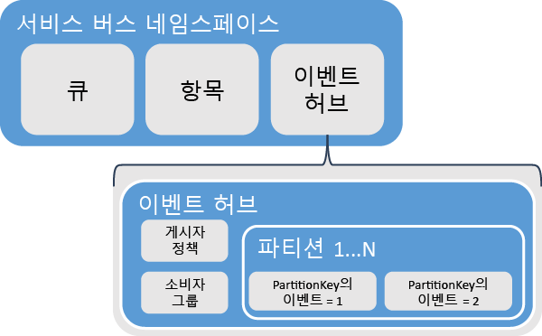
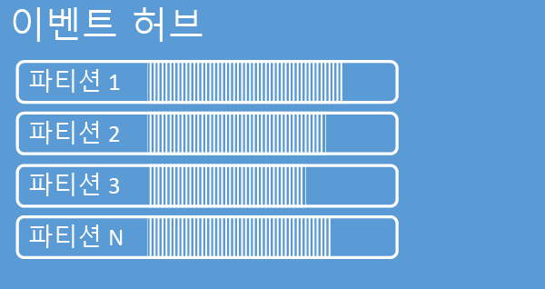
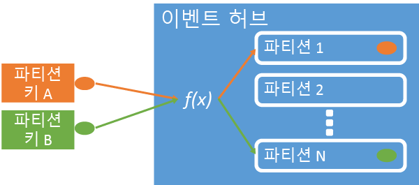
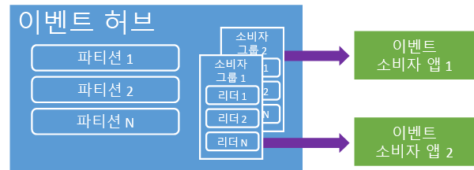
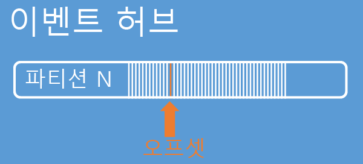
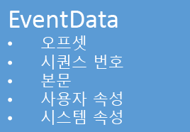

<properties 
   pageTitle="이벤트 허브 개요"
   description="Azure 이벤트 허브의 소개 및 개요."
   services="event-hubs"
   documentationCenter="na"
   authors="sethmanheim"
   manager="timlt"
   editor="" />
<tags 
   ms.service="event-hubs"
   ms.devlang="na"
   ms.topic="article"
   ms.tgt_pltfrm="na"
   ms.workload="tbd"
   ms.date="06/09/2015"
   ms.author="sethm" />

# Azure 이벤트 허브 개요

대부분의 최신 솔루션은 적응 고객 환경을 제공하거나 연속 피드백 및 자동화된 원격 분석을 통해 제품을 향상시킵니다. 이러한 솔루션은 안전하고 안정적으로 매우 많은 양의 정보를 여러 동시 게시자에게서 처리하는 방법에 대한 문제에 직면하게 됩니다. Microsoft Azure 이벤트 허브는 다양한 시나리오에서에서 대규모 데이터 유입에 대 한 기반을 제공하는 관리 대상 플랫폼 서비스입니다. 이러한 시나리오의 예로는 모바일 앱에서 동작 추적, 웹 팜에서 트래픽 정보, 콘솔 게임에서 게임 내 이벤트 캡처 또는 산업 컴퓨터 또는 연결된 차량에서 수집된 원격 분석 데이터가 있습니다. 이벤트 허브가 솔루션 아키텍처에서 수행 하는 일반적인 역할은 *이벤트 ingestor*라고도 하는 벤트 파이프라인에 대한 "현관"으로서의 역할입니다. 이벤트 ingestor는 이러한 이벤트에서에서 이벤트 스트림의 프로덕션을 분리하는 이벤트 공급자와 이벤트 소비자 간에 작용하는 구성 요소 또는 서비스입니다.

Azure 이벤트 허브는 짧은 대기 시간 및 높은 안정성으로 이벤트 및 원격 분석을 엄청난 규모의 클라우드에 제공하는 이벤트 ingestor 서비스입니다. 다른 다운스트림 서비스와 함께 사용되는 이 서비스는 응용 프로그램 계측, 사용자 경험 또는 워크플로 처리 및 사물 인터넷(IoT) 시나리오에서 특히 유용합니다. 이벤트 허브는 메시지 스트림 처리 기능을 제공하지만 이벤트 허브는 큐 및 항목과 유사한 엔터티이며, 기존 엔터프라이즈 메시징과 매우 다른 특징을 제공합니다. 엔터프라이즈 메시징 시나리오는 시퀀싱, 배달 못한 편지 처리, 트랜잭션 지원 및 강력한 배달 보증과 같은 복잡한 여러 기능을 일반적으로 필요로 하지만, 이벤트 유입에 대한 주요 관심사는 높은 처리량 및 이벤트 스트림에 대한 유연성 처리입니다. 따라서 Azure 이벤트 허브 기능은 높은 처리량 및 이벤트 처리 시나리오에 대해 편향된 서비스 버스 항목과 다릅니다. 이와 같이, 이벤트 허브는 항목에 사용할 수 있는 메시징 기능 중 일부를 구현하지 않습니다. 이러한 기능이 필요한 경우 가장 적합한 선택 항목이 유지됩니다.

이벤트 허브는 큐 및 항목과 유사하게 서비스 버스의 네임스페이스 수준에서 만들어집니다. 이벤트 허브는 기본 API 인터페이스로 AMQP 및 HTTP를 사용합니다. 다음 다이어그램에서는 이벤트 허브 및 서비스 버스 간의 관계를 보여줍니다.

## 개념적 개요

이벤트 허브는 분할된 소비자 패턴을 통해 스트리밍 메시지를 제공합니다. 큐 및 항목은 각 소비자가 동일한 큐 또는 리소스에서 읽으려고 하는 [경쟁 소비자](https://msdn.microsoft.com/library/dn568101.aspx) 모델을 사용합니다. 궁극적으로 리소스에 대한 이 경합으로 스트림 처리 응용 프로그램에 대한 복잡성 및 규모 제한이 발생합니다. 이벤트 허브는 각 소비자만이 특정 하위 집합, 파티션 또는 메시지 스트림을 읽는 파티션된 소비자 패턴을 사용합니다. 이 패턴은 이벤트 처리를 위한 가로 눈금을 사용하며 큐 및 항목에 사용할 수 없는 기타 스트림 중심 기능을 제공합니다.

### 파티션

파티션은 이벤트 허브에서 보유하는 순서가 지정된 이벤트 시퀀스입니다. 최신 이벤트가 도착하면 이 시퀀스의 끝에 추가됩니다. 파티션을 "커밋 로그"로 생각할 수 있습니다.

파티션은 이벤트 허브 수준에서 설정된 구성 보존 시간에 대한 데이터를 보존합니다. 이 설정은 이벤트 허브의 모든 파티션에 적용됩니다. 시간 단위로 이벤트가 만료됩니다. 명시적으로 삭제할 수 없습니다. 이벤트 허브는 여러 파티션을 포함합니다. 각 파티션은 독립적이며 자체 일련의 데이터를 포함합니다. 결과적으로, 파티션은 종종 서로 다른 속도로 증가합니다.

파티션 수가 이벤트 허브 작성 시간에 지정되고 8에서 32 사이여야 합니다. 파티션은 데이터 조직 메커니즘이며 이벤트 허브 처리량보다 응용 프로그램 사용에 필요한 다운스트림 병렬 처리 수준과 더 관련이 있습니다. 있을 것으로 예상되는 동시 판독기의 수와 직접 관련된 이벤트 허브에서 파티션 수를 선택합니다. 이벤트 허브를 만든 후 파티션 수를 변경할 수 있습니다. 장기간의 예상된 크기로 이 숫자를 고려해야 합니다. Azure 서비스 버스 팀에 문의하여 32개의 파티션 제한을 늘릴 수 있습니다.

파티션을 식별할 수 있고 직접 보낼 수 있지만, 일반적으로 특정 파티션에 데이터를 보내는 것을 방지하는 것이 좋습니다. 대신에, [이벤트 게시자](#Event-publisher) 및 [게시자 정책](#Capacity-and-security) 섹션에. 도입된 더 높은 수준의 구문을 사용할 수 있습니다.

이벤트 허브의 컨텍스트에서 메시지는 *이벤트 데이터*라고 합니다. 이벤트 데이터가 이 이벤트의 본문, 사용자 정의 속성 모음 및 스트림 시퀀스의 해당 숫자 및 파티션의 해당 오프셋과 같은 다양한 메타 데이터를 포함합니다. 파티션은 일련의 이벤트 데이터로 채워집니다.

## 이벤트 게시자

이벤트 허브로 이벤트나 데이터를 전송하는 모든 엔터티는 *이벤트 게시자*입니다. 이벤트 게시자는 HTTPS 또는 AMQP 1.0을 사용하여 이벤트를 게시할 수 있습니다. 이벤트 게시자는 공유 액세스 서명(SAS) 토큰을 사용하여 이벤트 허브로 자신을 식별하고 고유 ID를 구성하거나 시나리오의 요구 사항에 따라 일반적인 SAS 토큰을 사용합니다.

SAS 작업에 대한 자세한 내용은 [서비스 버스를 사용한 공유 액세스 서명 인증](https://msdn.microsoft.com/library/dn170477.aspx)을 참조하세요.

### 일반적인 게시자 작업

이 섹션에서는 이벤트 게시자에 대한 일반적인 작업을 설명합니다.

#### SAS 토큰 획득

공유 액세스 서명(SAS)는 이벤트 허브에 대한 인증 메커니즘입니다. 서비스 버스는 네임스페이스 및 이벤트 허브 수준에서 SAS 정책을 제공합니다. SAS 토큰은 SAS 키에서 생성되고 특정 형식으로 인코딩된 URL의 SHA 해시입니다. 키(정책)와 토큰의 이름을 사용하여, 서비스 버스는 해시를 다시 생성하여 발신자를 인증할 수 있습니다. 일반적으로 이벤트 게시자에 대한 SAS 토큰은 특정 이벤트 허브에 대한 **전송** 권한만으로 작성됩니다. 이 SAS 토큰 URL 메커니즘은 게시자 정책에 도입된 게시자 ID에 대한 기반이 됩니다. SAS 작업에 대한 자세한 내용은 [서비스 버스를 사용한 공유 액세스 서명 인증](https://msdn.microsoft.com/library/dn170477.aspx)을 참조하세요.

#### 이벤트 게시

AMQP 1.0 또는 HTTPS를 통해 이벤트를 게시할 수 있습니다. 서비스 버스는 .NET 클라이언트에서 이벤트 허브로 이벤트를 게시하기 위한 [EventHubClient](https://msdn.microsoft.com/library/microsoft.servicebus.messaging.eventhubclient.aspx) 클래스를 제공합니다. 다른 런타임 및 플랫폼의 경우, [Apache Qpid](http://qpid.apache.org/)와 같은 모든 AMQP 1.0 클라이언트를 사용할 수 있습니다. 이벤트를 개별적으로 게시하거나 일괄처리할 수 있습니다. 단일 게시(이벤트 데이터 인스턴스)는 단일 이벤트 또는 일괄 처리인지에 관계 없이 256KB로 제한됩니다. 이보다 큰 이벤트를 게시하면 오류가 발생합니다. 게시자가 이벤트 허브 내 파티션을 모르고 *파티션 키*(다음 섹션에서 도입된) 또는 해당 SAS 토큰을 통해 자신의 ID를 지정하는 것이 가장 좋습니다.

AMQP 또는 HTTPS 사용 선택은 사용량 시나리오에 해당됩니다. 전송 수준 보안(TLS) 또는 SSL/TLS 외에 AMQP는 영구 양방향 소켓을 설정해야 합니다. 이 네트워크 트래픽 측면에서 비용이 많이 드는 작업일 수는 있지만 AMQP 세션의 시작 부분에만 발생합니다. HTTPS는 초기 오버 헤드가 낮지만 모든 요청에 대한 추가 SSL 오버 헤드가 필요 합니다. 이벤트를 자주 게시하는 게시자의 경우, AMQP는 중요한 성능, 대기 시간 및 처리량 절감을 제공합니다.

### 파티션 키

파티션 키는 데이터 구성의 용도로 특정 파티션으로 들어오는 이벤트 데이터를 매핑할 때 사용 되는 값입니다. 파티션 키는 이벤트 허브로 전달된 발신자가 제공하는 값입니다. 정적 해시 함수를 통해 처리되며, 그 결과 파티션을 할당합니다. 이벤트를 게시하는 경우 파티션 키를 지정 하지 않으면, 라운드 로빈 할당이 사용됩니다. 파티션 키를 사용하는 경우, 이벤트 게시자는 이벤트가 게시되는 파티션이 아닌 파티션 키만을 인식합니다. 키와 파티션의 분리로 전송자가 다운스트림 처리 및 이벤트의 저장소에 대해 너무 많이 알 필요가 없도록 없습니다. 파티션 키는 다운스트림을 처리하기 위한 데이터를 구성하기에 중요하지만 근본적으로 파티션 자체와는 관련이 없습니다. 장치 단위 또는 사용자 공유 ID는 좋은 파티션 키가 되지만 지리와 같은 다른 특성은 단일 파티션으로 관련 이벤트를 그룹화하는 데도 사용할 수 있습니다. 다음 이미지는 파티션 키를 가리키도록 파티션 키를 사용하여 이벤트 발신자를 보여줍니다.

Azure 이벤트 허브는 동일한 파티션 키 값을 공유하는 모든 이벤트가 순서대로 동일한 파티션으로 배달되도록 합니다. 중요한 점은 다음 섹션에서 설명한 것과 같이 파티션 키가 게시자 정책과 함께 사용된 경우, 게시자의 ID 및 파티션 키의 값이 일치해야 합니다. 그렇지 않은 경우 오류가 발생합니다.

### 이벤트 소비자

이벤트 허브에서 이벤트 데이터를 읽는 모든 엔터티는 이벤트 소비자입니다. 모든 이벤트 소비자가 소비자 그룹에서 파티션을 통해 이벤트 스트림을 읽습니다. 각 파티션에서 한번에 하나의 활성 판독기만 사용해야 합니다. 모든 이벤트 허브 소비자는 AMQP 1.0 세션을 통해 연결하며, 사용 가능해지면 이벤트가 전달됩니다. 클라이언트는 데이터 가용성에 대해 폴링할 필요가 없습니다.

#### 소비자 그룹

이벤트 허브의 게시/구독 메커니즘은 소비자 그룹을 통해 사용할 수 있습니다. 소비자 그룹은 전체 이벤트 허브의 보기 (상태, 위치, 또는 오프셋)입니다. 소비자 그룹은 여러 소비 응용 프로그램을 사용하여 이벤트 스트림의 별도 보기가 있으며 자신의 속도 및 자신의 오프셋으로 독립적으로 스트림을 읽을 수 있습니다. 스트림 처리 아키텍처에서 각 다운스트림 응용 프로그램은 소비자 그룹에 해당합니다. 이벤트 데이터를 장기 저장소에 기록하려는 경우, 해당 저장소 기록기 응용 프로그램은 소비자 그룹입니다. 복합 이벤트 처리는 다른 별도의 소비자 그룹에서 수행합니다. 소비자 그룹을 통해서만 파티션을 액세스할 수 있습니다. 이벤트 허브에는 항상 기본 소비자 그룹이 있으며 표준 계층 이벤트 허브에 대해 최대 20개의 소비자 그룹을 만들 수 있습니다.

다음은 소비자 그룹 URI 규칙의 예입니다.

	//<my namespace>.servicebus.windows.net/<event hub name>/<Consumer Group #1>
	//<my namespace>.servicebus.windows.net/<event hub name>/<Consumer Group #2>

다음 이미지는 소비자 그룹 내에서 이벤트 소비자를 보여줍니다.

#### 스트림 오프셋

오프셋은 파티션 내의 이벤트 위치입니다. 오프셋을 클라이언트 쪽 커서로 생각할 수 있습니다. 오프셋은 이벤트의 바이트 번호입니다. 이벤트 소비자(판독기)가 이벤트를 읽기 시작할 이벤트 스트림의 위치를 지정할 수 있습니다. 타임스탬프 또는 오프셋 값으로 오프셋을 지정할 수 있습니다. 소비자는 이벤트 허브 서비스 외부에 자신의 오프셋 값을 저장하는 일을 담당합니다.

파티션 내에서 각 이벤트는 오프셋을 포함합니다. 이 오프셋은 지정된 파티션에 대한 이벤트 시퀀스의 위치를 표시하기 위해 소비자에서 사용됩니다. 오프셋은 판독기를 연결할 때 숫자 또는 타임스탬프 값으로 이벤트 허브에 전달될 수 있습니다.

#### 검사점 설정

*검사점*은 판독기가 파티션 이벤트 시퀀스 내에서 위치를 표시하거나 커밋하는 프로세스입니다. 검사점은 소비자의 책임으로 소비자 그룹 내에서 파티션별로 발생합니다. 즉, 각 소비자 그룹에 대해 각 파티션 판독기는 이벤트 스트림의 현재 위치를 추적해야 하며 데이터 스트림이 완료된 것으로 간주되면 서비스를 알릴 수 있다는 것을 의미합니다. 판독기가 파티션에서 연결을 끊은 경우 다시 연결하면 해당 소비자 그룹에서 해당 파티션의 마지막 판독기에서 이전에 제출한 검사점에서 읽기 시작합니다. 판독기가 연결하면, 이 오프셋을 이벤트 허브로 전달하여 읽기 시작할 위치를 지정합니다. 이러한 방식으로, 서로 다른 컴퓨터에서 실행되는 판독기 간의 장애 조치 시 복원 력을 제공하고 다운스트림 응용 프로그램에서 이벤트를 "완료"로 표시하는 데 검사점을 사용할 수 있습니다. 이벤트 허브를 만들 때 지정한 보존 간격으로 이벤트 데이터가 유지되기 때문에,이 검사점 프로세스에서 더 낮은 오프셋을 지정하여 오래된 데이터를 반환할 수 있습니다. 이 메커니즘을 통해 검사점은 장애 조치 복원력 및 제어된 이벤트 스트림 재생 모두를 사용할 수 있습니다.

#### 일반 소비자 작업

이 섹션에서는 이벤트 허브 이벤트 소비자나 판독기에 대한 일반적인 작업을 설명합니다. 모든 이벤트 허브 소비자는 AMQP 1.0을 통해 연결합니다. AMQP 1.0은 세션 및 상태를 인식하는 양방향 통신 채널입니다. 각 파티션에는 파티션으로 분리하는 이벤트의 전송을 용이하게 하는 AMQP 1.0 링크 세션이 있습니다.

##### 파티션에 연결

이벤트 허브에서 이벤트를 소비하려면 소비자가 파티션에 연결되어야 합니다. 이전에 설명한 것처럼 항상 소비자 그룹을 통해 파티션에 액세스합니다. 분할된 소비자 모델의 일부로, 소비자 그룹 내에서 한번에 하나의 판독기만 파티션에서 활성이어야 합니다. 특정 파티션에 대한 판독기 연결을 조정하기 위해 임대 메커니즘을 사용하여 파티션에 직접 연결하는 경우가 일반적입니다. 이러한 방식으로, 소비자 그룹의 모든 파티션에 활성 판독기가 하나만 있을 수 있습니다. 판독기에 대한 시퀀스에서의 위치 관리는 검사점을 통해 이루어지는 중요한 작업입니다. 이 기능은 .NET 클라이언트에 대해 [EventProcessorHost](https://msdn.microsoft.com/library/microsoft.servicebus.messaging.eventprocessorhost.aspx) 클래스를 사용하여 단순화됩니다. [EventProcessorHost](https://msdn.microsoft.com/library/microsoft.servicebus.messaging.eventprocessorhost.aspx)는 지능형 소비자 에이전트이며 다음 섹션에서 설명됩니다.

##### 이벤트 읽기

AMQP 1.0 세션 및 링크는 특정 파티션에 대해 열린 후, 이벤트는 이벤트 허브 서비스에서 AMQP 1.0 클라이언트로 전달됩니다. 이 배달 메커니즘은 HTTP GET과 같은 풀 기반 메커니즘보다 더 낮은 대기 시간 및 더 높은 처리량을 사용합니다. 이벤트가 클라이언트에 전송되므로, 각 이벤트 데이터 인스턴스는 이벤트 시퀀스에서 검사점을 용이하게 하는데 사용되는 오프셋 및 시퀀스 번호와 같은 중요한 메타 데이터를 포함합니다.

스트림을 처리하는 방식으로 이 오프셋을 관리하는 것은 사용자의 책임입니다.

## 용량 및 보안

이벤트 허브는 스트림 수신에 대한 확장성이 뛰어난 병렬 아키텍처입니다. 이와 같이, 이벤트 허브를 기반으로 하는 크기 조정 시 고려해야 할 주요 측면이 있습니다. 이러한 용량 제어의 첫 번째는 *처리량 단위*이며, 다음 섹션에서 설명됩니다.

### 처리량 단위

이벤트 허브의 처리량 용량은 처리량 단위로 제어됩니다. 처리량 단위는 미리 구입한 용량의 단위입니다. 단일 처리량 단위는 다음을 포함합니다.

- 수신: 초당 1MB 또는 초당 1000개의 이벤트.

- 송신: 초당 최대 2MB.

수신은 구입한 처리량 단위 수로 제공된 용량의 크기로 제한됩니다. 이 크기 이상으로 데이터를 보내면 "할당량 초과" 예외가 발생합니다. 이 크기는 초당 1MB 또는 초당 1000개의 이벤트로, 둘 중 하나가 먼저입니다. 송신은 제한 예외를 생성하지는 않지만 구매한 처리량 단위로 제공되는 데이터 전송의 크기로 제한됩니다. 처리량 단위당 초당 2MB입니다. 게시 속도 예외를 수신하거나 더 높은 송신을 보기를 예상하는 경우, 이벤트 허브가 만들어진 네임스페이스에 대해 구입한 처리량 단위의 수를 확인해야 합니다. 더 많은 처리량 단위를 얻으려면, Azure 관리 포털의 **구성** 탭에서 **네임 스페이스** 페이지의 설정을 조정할 수 있습니다. Azure API를 사용하여 이 설정을 변경할 수도 있습니다.

파티션은 데이터 조직 개념이지만, 처리량 단위는 순수하게 용량 개념입니다. 처리량 단위는 시간당 요금이 청구되며 미리 구입됩니다. 구입하면, 처리량 단위는 최소 한시간으로 청구됩니다. 최대 20 처리량 단위는 서비스 버스네임 스페이스에 대해 구입할 수 있으며 20개 처리량 단위의 Azure 계정 제한입니다. 이러한 처리량 단위는 지정된 네임스페이스에의 모든 이벤트 허브에서 공유됩니다.

처리량 단위는 최상의 노력으로 프로비전되며 항상 즉시 구매할 수는 없습니다. 특정 용량이 필요한 경우 미리 이러한 처리량 단위를 구입하는 것이 좋습니다. 20개 이상의 처리량 단위를 필요로 하는 경우, 처음 최대 100개까지 20개 블록의 약정 기반으로 더 많은 처리량 단위 구입을 지원하려면 Microsoft Azure 서비스 버스 지원에 문의할 수 있습니다. 이보다 많은 경우, 100개의 처리량 단위 블록도 구입할 수 있습니다.

이벤트 허브로 최적의 크기를 달성하려면 신중하게 처리량 단위 및 파티션의 균형을 맞추는 것이 좋습니다. 단일 파티션에는 처리량 단위 하나의 최대 크기가 있습니다. 처리량 단위 수는 이벤트 허브의 파티션 수보다 작거나 동일해야 합니다.

자세한 가격 정보는 [이벤트 허브 가격](http://azure.microsoft.com/pricing/details/event-hubs/)을 참조하세요.

### 게시자 정책

이벤트 허브는 *게시자 정책*을 통한 이벤트 생산자에 대한 세부적 제어를 사용합니다. 게시자 정책은 많은 수의 독립 이벤트 공급자를 촉진하도록 설계된 런타임 기능 집합입니다. 게시자 정책을 사용하여 다음 메커니즘을 사용하여 이벤트 허브로 이벤트를 게시하는 경우 각 게시자는 자체 고유 식별자를 사용합니다.

	//<my namespace>.servicebus.windows.net/<event hub name>/publishers/<my publisher name>

시간에 앞서 게시자 이름을 미리 만들 필요가 없지만, 독립 게시자 ID를 보장하기 위해 이벤트를 게시하는 경우 사용하는 SAS 토큰과 일치해야 합니다. SAS에 대한 자세한 내용은 [서비스 버스를 사용한 공유 액세스 서명 인증](https://msdn.microsoft.com/library/dn170477.aspx)을 참조하세요. 게시자 정책을 사용하는 경우 **PartitionKey** 값이 게시자 이름으로 설정됩니다. 제대로 작동하려면, 이 값이 일치해야 합니다.

## 요약

Azure 이벤트 허브는 규모에 관계 없이 모니터링하는 일반 응용 프로그램 및 사용자 워크플로에 대해 사용할 수 있는 서비스를 처리 하는 원격 분석 및 하이퍼 눈금 이벤트를 제공합니다. 짧은 대기 시간과 엄청난 규모로 게시-구독 기능을 제공하는 기능을 사용하여 이벤트 허브는 빅 데이터에 대해 "램프"로 제공합니다. 게시자 기반 ID 및 해지 목록을 사용하여 이 기능은 일반 사물 인터넷 시나리오로 확장됩니다. 이벤트 허브 응용 프로그램 개발에 대한 자세한 내용은 [이벤트 허브 프로그래밍 가이드](https://msdn.microsoft.com/library/dn789972.aspx)를 참조하세요.

## 다음 단계

지금 이벤트 허브 개념에 대해 알아보았으므로 다음 시나리오로 이동할 수 있습니다.

- [이벤트 허브 자습서]로 시작합니다.
- [이벤트 허브를 사용하는 샘플 응용 프로그램] 전체.
- 서비스 버스 큐를 사용하는 [큐 메시징 솔루션].

[이벤트 허브 자습서]: service-bus-event-hubs-csharp-ephcs-getstarted.md
[이벤트 허브를 사용하는 샘플 응용 프로그램]: https://code.msdn.microsoft.com/windowsazure/Service-Bus-Event-Hub-286fd097
[큐 메시징 솔루션]: ../cloud-services-dotnet-multi-tier-app-using-service-bus-queues.md
 

<!---HONumber=August15_HO6-->