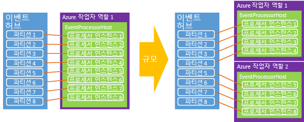

# <a name="programming-guide-for-azure-event-hubs"></a>Azure Event Hubs에 대한 프로그래밍 가이드
이 문서에서는 Azure Event Hubs를 사용하여 코드를 작성하는 몇 가지 일반적인 시나리오를 설명합니다. Event Hubs에 대한 예비 이해가 있다고 가정합니다. Event Hubs의 개요에 대한 개념은 [Event Hubs 개요](event-hubs-what-is-event-hubs.md)를 참조하세요.

## <a name="event-publishers"></a>이벤트 게시자

HTTP POST를 사용하거나 AMQP 1.0 연결을 통해 이벤트 허브에 이벤트를 보냅니다. 해결할 구체적인 시나리오에 따라 무엇을 언제 사용할지 선택합니다. AMQP 1.0 연결은 영구 메시징 채널을 제공하기 때문에 Service Bus에서 조정된 연결로 계량되며 시나리오에서 자주 높은 메시지 볼륨 및 낮은 대기 시간 요구 사항에 적절합니다.

.NET 관리 API를 사용하는 경우 Event Hubs에 데이터를 게시하기 위한 기본 구조는 [EventHubClient][] 및 [EventData][] 클래스입니다. [EventHubClient][]는 이벤트가 이벤트 허브로 전송되는 AMQP 통신 채널을 제공합니다. [EventData][] 클래스는 이벤트를 나타내며 이벤트 허브에 메시지를 게시하는데 사용됩니다. 이 클래스는 이벤트에 대한 본문, 일부 메타데이터 및 헤더 정보를 포함합니다. [EventData][] 개체가 이벤트 허브를 통과할 때 여기에 다른 속성이 추가됩니다.

## <a name="get-started"></a>시작하기
Event Hubs를 지원하는 .NET 클래스는 [Microsoft.Azure.EventHubs](https://www.nuget.org/packages/Microsoft.Azure.EventHubs/) NuGet 패키지에 제공됩니다. Visual Studio 솔루션 탐색기 또는 Visual Studio의 [패키지 관리자 콘솔](https://docs.nuget.org/docs/start-here/using-the-package-manager-console)을 사용하여 설치할 수 있습니다. 이렇게 하려면 [패키지 관리자 콘솔](https://docs.nuget.org/docs/start-here/using-the-package-manager-console) 창에서 다음 명령을 발급합니다.

```shell
Install-Package Microsoft.Azure.EventHubs
```

## <a name="create-an-event-hub"></a>이벤트 허브 만들기

Azure Portal, Azure PowerShell 또는 Azure CLI를 사용하여 Event Hubs를 만들 수 있습니다. 자세한 내용은 [Azure Portal을 사용하여 Event Hubs 네임스페이스 및 이벤트 허브 만들기](event-hubs-create.md)를 참조하세요.

## <a name="create-an-event-hubs-client"></a>Event Hubs 클라이언트 만들기

Event Hubs와 상호 작용하기 위한 기본 클래스는 [Microsoft.Azure.EventHubs.EventHubClient][EventHubClient]입니다. 다음 예와 같이 [CreateFromConnectionString](/dotnet/api/microsoft.azure.eventhubs.eventhubclient.createfromconnectionstring) 메서드를 사용하여 이 클래스를 인스턴스화할 수 있습니다.

```csharp
private const string EventHubConnectionString = "Event Hubs namespace connection string";
private const string EventHubName = "event hub name";

var connectionStringBuilder = new EventHubsConnectionStringBuilder(EventHubConnectionString)
{
    EntityPath = EventHubName

};
eventHubClient = EventHubClient.CreateFromConnectionString(connectionStringBuilder.ToString());
```

## <a name="send-events-to-an-event-hub"></a>이벤트 허브로 이벤트 보내기

[EventHubClient][] 인스턴스를 만들고 [SendAsync](/dotnet/api/microsoft.azure.eventhubs.eventhubclient.sendasync) 메서드를 통해 비동기적으로 보내서 이벤트를 이벤트 허브로 보냅니다. 이 메서드는 단일 [EventData][] 인스턴스 매개 변수를 가져오고 비동기적으로 이벤트 허브로 보냅니다.

## <a name="event-serialization"></a>이벤트 직렬화

[EventData][] 클래스에는 이벤트 데이터 페이로드를 나타내는 다양한 매개 변수, 바이트 또는 바이트 배열을 사용하는 [2개의 오버로드된 생성자](/dotnet/api/microsoft.azure.eventhubs.eventdata.-ctor)가 있습니다. [EventData][]와 함께 JSON을 사용하는 경우 **Encoding.UTF8.GetBytes()** 를 사용하여 JSON으로 인코딩된 문자열에 대한 바이트 배열을 검색할 수 있습니다. 예를 들면 다음과 같습니다.

```csharp
for (var i = 0; i < numMessagesToSend; i++)
{
    var message = $"Message {i}";
    Console.WriteLine($"Sending message: {message}");
    await eventHubClient.SendAsync(new EventData(Encoding.UTF8.GetBytes(message)));
}
```

## <a name="partition-key"></a>파티션 키

이벤트 데이터를 보낼 때 파티션 할당을 생성하기 위해 해시되는 값을 지정할 수 있습니다. 파티션은 [PartitionSender.PartitionID](/dotnet/api/microsoft.azure.eventhubs.partitionsender.partitionid) 속성을 사용하여 지정합니다. 단, 파티션을 사용하기로 결정한다는 것은 가용성과 일관성 중 하나를 선택한다는 것을 의미합니다. 

### <a name="availability-considerations"></a>가용성 고려 사항

파티션 키 사용은 선택 사항이며 사용 여부를 신중하게 고려해야 합니다. 이벤트를 게시할 때 파티션 키를 지정하지 않으면 라운드 로빈 할당이 사용됩니다. 대부분의 경우에서 이벤트 순서 지정이 중요한 경우 파티션 키를 사용 하는 것이 좋습니다. 파티션 키를 사용할 경우 이러한 파티션은 단일 노드에서 가용성이 필요하며 시간이 지나면 중단이 발생할 수 있습니다(예: 계산 노드를 재부팅하고 패치할 경우). 따라서 파티션 ID를 설정하고 해당 파티션을 어떠한 이유로 사용할 수 없게 되면 해당 파티션의 데이터에 액세스하지 못하게 됩니다. 고가용성이 가장 중요한 경우에는 파티션 키를 지정하지 마십시오. 이러한 경우 이벤트는 이전에 설명한 라운드 로빈 모델을 사용하는 파티션으로 보내집니다. 이 시나리오에서는 가용성(파티션 ID 없음)과 일관성(파티션 ID에 이벤트 고정) 간에 명시적인 선택을 합니다.

이벤트 처리에서 지연을 처리하는 것도 고려해야 할 사항입니다. 경우에 따라, 잠재적으로 추가 다운스트림 처리 지연을 일으킬 수 있으므로 처리를 계속 진행하도록 하는 것보다 데이터를 삭제한 다음 다시 시도하는 것 나을 수 있습니다. 예를 들어 주식 시세 표시기 사용 시 완벽한 최신 데이터를 기다리는 것이 좋지만, 실시간 채팅 또는 VOIP 시나리오에서는 완벽하지는 않아도 데이터를 빨리 보유하는 것이 낫습니다.

이러한 가용성을 고려해 볼 때 이러한 시나리오에서는 다음 오류 처리 전략 중 하나를 선택할 수 있습니다.

- 중지(문제가 해결될 때까지 Event Hubs에서 읽기 중지)
- 삭제(메시지가 중요하지 않을 경우에는 삭제)
- 다시 시도(적합하게 보이도록 메시지를 다시 시도)

가용성과 일관성 간의 절충에 대한 자세한 내용은 [Event Hubs의 가용성 및 일관성](event-hubs-availability-and-consistency.md)을 참조하세요. 

## <a name="batch-event-send-operations"></a>Batch 이벤트가 작업을 보냅니다

배치에서 이벤트를 보내면 처리량을 향상시키는 데 도움을 줄 수 있습니다. [CreateBatch](/dotnet/api/microsoft.azure.eventhubs.eventhubclient.createbatch) API를 사용하여 [SendAsync](/dotnet/api/microsoft.azure.eventhubs.eventhubclient.sendasync) 호출에 대해 데이터 개체를 나중에 추가할 수 있는 일괄 처리를 만들 수 있습니다.

단일 일괄 처리는 이벤트의 1MB 제한을 초과하지 말아야 합니다. 또한 배치의 각 메시지는 동일한 게시자 id를 사용합니다. 배치가 최대 이벤트 크기를 초과하지 않도록 확인하는 것은 보낸 사람의 책임입니다. 그런 경우 클라이언트 **보내기** 오류가 생성됩니다. 도우미 메서드 [EventHubClient.CreateBatch](/dotnet/api/microsoft.azure.eventhubs.eventhubclient.createbatch)를 사용하면 일괄 처리가 1MB를 초과하지 않도록 할 수 있습니다. [CreateBatch](/dotnet/api/microsoft.azure.eventhubs.eventhubclient.createbatch) API에서 빈 [EventDataBatch](/dotnet/api/microsoft.azure.eventhubs.eventdatabatch)를 얻은 다음 [TryAdd](/dotnet/api/microsoft.azure.eventhubs.eventdatabatch.tryadd)를 사용하여 이벤트를 추가하여 일괄 처리를 구성합니다. 

## <a name="send-asynchronously-and-send-at-scale"></a>비동기적으로 보내고 규모로 보내기

비동기적으로 이벤트를 이벤트 허브로 보낼 수 있습니다. 비동기적으로 보내기는 클라이언트가 이벤트를 보낼 수 있는 속도를 증가시킵니다. [SendAsync](/dotnet/api/microsoft.azure.eventhubs.eventhubclient.sendasync)는 [Task](https://msdn.microsoft.com/library/system.threading.tasks.task.aspx) 개체를 반환합니다. 클라이언트에서 [RetryPolicy](/dotnet/api/microsoft.servicebus.retrypolicy) 클래스를 사용하여 클라이언트 다시 시도 옵션을 제어할 수 있습니다.

## <a name="event-consumers"></a>이벤트 소비자
[EventProcessorHost][] 클래스는 Event Hubs에서 데이터를 처리합니다. .NET 플랫폼에서 이벤트 판독기를 작성할 때 이 구현을 사용해야 합니다. [EventProcessorHost][] 는 검사점 및 파티션 임대 관리를 제공하는 이벤트 처리기 구현에 대한 스레드 안전, 다중 프로세스, 안전한 런타임 환경을 제공합니다.

[EventProcessorHost][] 클래스를 사용하려면 [IEventProcessor](/dotnet/api/microsoft.azure.eventhubs.processor.ieventprocessor)를 구현할 수 있습니다. 이 인터페이스는 네 가지 메서드를 포함합니다.

* [OpenAsync](/dotnet/api/microsoft.azure.eventhubs.processor.ieventprocessor.openasync)
* [CloseAsync](/dotnet/api/microsoft.azure.eventhubs.processor.ieventprocessor.closeasync)
* [ProcessEventsAsync](/dotnet/api/microsoft.azure.eventhubs.processor.ieventprocessor.processeventsasync)
* [ProcessErrorAsync](/dotnet/api/microsoft.azure.eventhubs.processor.ieventprocessor.processerrorasync)

이벤트 처리를 시작하려면 이벤트 허브에 대한 적절한 매개 변수를 제공하여 [EventProcessorHost][]를 인스턴스화합니다. 예를 들면 다음과 같습니다.

> [!NOTE]
> EventProcessorHost 및 관련된 클래스에 제공 되는 **Microsoft.Azure.EventHubs.Processor** 패키지 있습니다. 지침에 따라 Visual Studio 프로젝트에 패키지를 추가 [이 문서](event-hubs-dotnet-framework-getstarted-send.md#add-the-event-hubs-nuget-package) 에서 다음 명령을 실행 하 여 또는 합니다 [패키지 관리자 콘솔](https://docs.nuget.org/docs/start-here/using-the-package-manager-console) 창:`Install-Package Microsoft.Azure.EventHubs.Processor`합니다.

```csharp
var eventProcessorHost = new EventProcessorHost(
        EventHubName,
        PartitionReceiver.DefaultConsumerGroupName,
        EventHubConnectionString,
        StorageConnectionString,
        StorageContainerName);
```

그런 다음, [RegisterEventProcessorAsync](/dotnet/api/microsoft.azure.eventhubs.processor.eventprocessorhost.registereventprocessorasync)를 호출하여 런타임에 [IEventProcessor](/dotnet/api/microsoft.azure.eventhubs.processor.ieventprocessor) 구현을 등록합니다.

```csharp
await eventProcessorHost.RegisterEventProcessorAsync<SimpleEventProcessor>();
```

이 시점에서 호스트는 "greedy" 알고리즘을 사용하여 허브 이벤트의 모든 파티션에서 임대를 획득하려 합니다. 이러한 임대는 지정된 시간 프레임 동안 지속되며 갱신되어야 합니다. 새 노드(이 경우 작업자 인스턴스)가 온라인 상태가 되면 임대 예약을 놓고 더 많은 임대를 획득하기 위해 시간이 지남에 따라 노드 간에 부하가 이동합니다.



시간이 지남에 따라 평형이 설정됩니다. 이 동적 기능을 사용하면 확장 및 축소 모두에 대해 소비자에게 적용할 CPU 기반 자동 크기 조정을 할 수 있습니다. Event Hubs에 메시지 개수의 직접 개념이 없기 때문에 평균 CPU 사용률은 백 엔드 또는 소비자 규모를 측정하는 최적의 메커니즘인 경우가 많습니다. 소비자가 처리할 수 있는 것 보다 더 많은 이벤트를 게시자가 게시하기 시작하는 경우 소비자에게 CPU 증가를 사용하여 작업자 인스턴스 수의 크기를 자동으로 조정할 수 있습니다.

또한 [EventProcessorHost][] 클래스는 Azure 저장소 기반 검사점 메커니즘을 구현합니다. 이 메커니즘은 파티션 당 오프셋을 저장하므로 각 소비자가 이전 소비자의 마지막 검사점 무엇인지를 결정할 수 있습니다. 임대를 통해 노드 간에 파티션이 전환되면 이동하는 부하를 용이하게 하는 동기화 메커니즘입니다.

## <a name="publisher-revocation"></a>게시자 해지

[EventProcessorHost][]의 고급 런타임 기능 외에도 Event Hubs는 이벤트 허브로 이벤트를 보내는 특정 게시자를 차단하기 위해 게시자를 해지할 수 있습니다. 이러한 기능은 게시자의 토큰이 손상되거나 소프트웨어 업데이트가 부적절하게 동작을 일으킨 경우 유용합니다. 이러한 상황에서 해당 SAS 토큰의 일부인 게시자의 id가 이벤트 게시에서 차단될 수 있습니다.

게시자 해지 및 게시자로 Event Hubs에 보내는 방법에 대한 자세한 내용은 [Event Hubs 대규모 보안 게시](https://code.msdn.microsoft.com/Service-Bus-Event-Hub-99ce67ab) 샘플을 참조하세요.

## <a name="next-steps"></a>다음 단계

Event Hubs 시나리오에 대한 자세한 내용은 다음 링크를 방문하십시오.

* [Event Hubs API 개요](event-hubs-api-overview.md)
* [Event Hubs의 정의](event-hubs-what-is-event-hubs.md)
* [Event Hubs의 가용성 및 일관성](event-hubs-availability-and-consistency.md)
* [이벤트 프로세서 호스트 API 참조](/dotnet/api/microsoft.servicebus.messaging.eventprocessorhost)

[NamespaceManager]: /dotnet/api/microsoft.servicebus.namespacemanager
[EventHubClient]: /dotnet/api/microsoft.azure.eventhubs.eventhubclient
[EventData]: /dotnet/api/microsoft.azure.eventhubs.eventdata
[CreateEventHubIfNotExists]: /dotnet/api/microsoft.servicebus.namespacemanager.createeventhubifnotexists
[PartitionKey]: /dotnet/api/microsoft.servicebus.messaging.eventdata#Microsoft_ServiceBus_Messaging_EventData_PartitionKey
[EventProcessorHost]: /dotnet/api/microsoft.azure.eventhubs.processor
