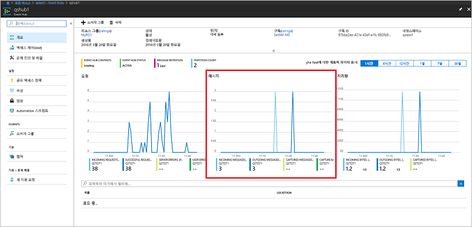

# <a name="quickstart-process-event-streams-using-azure-cli-and-java"></a>Azure 빠른 시작 - Azure CLI 및 Java를 사용한 이벤트 스트림 처리

Azure Event Hubs는 초당 수백만 개의 이벤트를 수신하고 처리할 수 있는 확장성이 뛰어난 데이터 스트리밍 플랫폼 및 수집 서비스입니다. 이 빠른 시작에서는 Azure CLI를 사용하여 Event Hubs 리소스를 만든 다음, Java 코드를 사용하여 이벤트 허브에서 이벤트 스트림을 송수신하는 방법을 보여 줍니다.

이 빠른 시작을 완료하려면 Azure 구독이 필요합니다. 구독이 없으면 시작하기 전에 [계정][]을 만드세요.

## <a name="prerequisites"></a>필수 조건

[!INCLUDE [cloud-shell-try-it.md](../../includes/cloud-shell-try-it.md)]

Azure CLI를 로컬로 설치하여 사용하도록 선택한 경우 이 자습서에서 Azure CLI 버전 2.0.4 이상을 실행해야 합니다. `az --version`을 실행하여 버전을 확인합니다. 설치 또는 업그레이드해야 하는 경우 [Azure CLI 2.0 설치]( /cli/azure/install-azure-cli)를 참조하세요.

## <a name="log-on-to-azure"></a>Azure 로그온

Cloud Shell에서 명령을 실행하는 경우에는 다음 단계가 필요하지 않습니다. CLI를 로컬로 실행하는 경우 다음 단계를 수행하여 Azure에 로그온하고 현재 구독을 설정합니다.

다음 명령을 실행하여 Azure에 로그온합니다.

```azurecli-interactive
az login
```

현재 구독 컨텍스트를 설정합니다. `MyAzureSub`를 사용할 Azure 구독의 이름으로 바꿉니다.

```azurecli-interactive
az account set --subscription MyAzureSub
``` 

## <a name="provision-resources"></a>리소스 프로비전

다음 명령을 실행하여 Event Hubs 리소스를 프로비전합니다. `myResourceGroup`, `namespaceName`, `eventHubName` 및 `storageAccountName` 자리 표시자를 적절한 값으로 바꿔야 합니다.

```azurecli-interactive
# Create a resource group
az group create --name myResourceGroup --location eastus

# Create an Event Hubs namespace
az eventhubs namespace create --name namespaceName --resource-group myResourceGroup -l eastus2

# Create an event hub
az eventhubs eventhub create --name eventHubName --resource-group myResourceGroup --namespace-name namespaceName

# Create a general purpose standard storage account
az storage account create --name storageAccountName --resource-group myResourceGroup --location eastus2 --sku Standard_RAGRS --encryption blob

# List the storage account access keys
az storage account keys list --resource-group myResourceGroup --account-name storageAccountName

# Get namespace connection string
az eventhubs namespace authorization-rule keys list --resource-group myResourceGroup --namespace-name namespaceName --name RootManageSharedAccessKey
```

나중에 사용하기 위해 이 연결 문자열을 임시 위치(예: 메모장)에 복사하여 붙여넣습니다.

## <a name="stream-into-event-hubs"></a>Event Hubs로 스트림

다음 단계는 이벤트를 이벤트 허브로 스트리밍하고 이벤트 처리기 호스트를 사용하여 그러한 이벤트를 수신하는 샘플 코드를 다운로드하는 것입니다. 먼저 메시지를 보냅니다.

다음 명령을 실행하여 [Event Hubs GitHub 리포지토리](https://github.com/Azure/azure-event-hubs)를 복제합니다.

```bash
git clone https://github.com/Azure/azure-event-hubs.git
```

**SimpleSend** 폴더: `\azure-event-hubs\samples\Java\Basic\SimpleSend\src\main\java\com\microsoft\azure\eventhubs\samples\SimpleSend`로 이동합니다 SimpleSend.java 파일을 열고 `"Your Event Hubs namaspace name"` 문자열을 이 문서의 "Event Hubs 네임스페이스 만들기"에서 구한 Event Hubs 네임스페이스로 바꿉니다.

`"Your event hub"`를 해당 네임스페이스 안에 만든 이벤트 허브의 이름으로, `"Your policy name"`을 네임스페이스에 대한 공유 액세스 정책 이름으로 바꿉니다. 새 정책의 만들지 않는 한 기본값은 **RootManageSharedAccessKey**입니다. 

마지막으로, `"Your primary SAS key"`를 이전 단계의 정책에 대한 SAS 키의 값으로 바꿉니다.

### <a name="build-the-application"></a>응용 프로그램 빌드 

`\azure-event-hubs\samples\Java\Basic\SimpleSend` 폴더로 다시 돌아가 다음 빌드 명령을 실행합니다.

```shell
mvn clean package -DskipTests
```

### <a name="receive"></a>수신

이제 방금 보낸 메시지를 수신하는 이벤트 처리기 호스트 샘플을 다운로드합니다. **EventProcessorSample** 폴더: `\azure-event-hubs\samples\Java\Basic\EventProcessorSample\src\main\java\com\microsoft\azure\eventhubs\samples\eventprocessorsample`로 이동합니다.

EventProcessorSample.java 파일에서 `----EventHubsNamespaceName-----` 값을 이 문서의 "Event Hubs 네임스페이스 만들기" 섹션에서 구한 Event Hubs 네임스페이스로 바꿉니다. 

이 파일의 다른 문자열 값을 바꿉니다. `----EventHubName-----`를 해당 네임스페이스 안에 만든 이벤트 허브의 이름으로, `-----SharedAccessSignatureKeyName-----`을 네임스페이스에 대한 공유 액세스 정책 이름으로 바꿉니다. 새 정책의 만들지 않는 한 기본값은 **RootManageSharedAccessKey**입니다.

`---SharedAccessSignatureKey----`는 이전 단계의 정책에 대한 SAS 키 값으로, `----AzureStorageConnectionString----`은 만든 저장소 계정에 대한 연결 문자열로, `----StorageContainerName----`은 만든 저장소 계정에 있는 컨테이너의 이름으로 바꿉니다.  

마지막으로 `----HostNamePrefix----`를 저장소 계정 이름으로 바꿉니다.

### <a name="build-the-receiver"></a>수신기 빌드 

수신 응용 프로그램을 빌드하려면 `\azure-event-hubs\samples\Java\Basic\EventProcessorSample` 폴더로 이동하고 다음 명령을 실행합니다.

```shell
mvn clean package -DskipTests
```

### <a name="run-the-apps"></a>앱 실행

빌드가 완료되면 이벤트를 송수신할 수 있습니다. 먼저 **SimpleSend** 응용 프로그램을 실행하고 이벤트가 전송되는 것을 관찰합니다. 프로그램을 실행하려면 `\azure-event-hubs\samples\Java\Basic\SimpleSend` 폴더로 이동하고 다음 명령을 실행합니다.

```shell
java -jar ./target/simplesend-1.0.0-jar-with-dependencies.jar
```

다음으로 **EventProcessorSample** 앱을 실행하고 이벤트가 수신되는 것을 관찰합니다. 프로그램을 실행하려면 `\azure-event-hubs\samples\Java\Basic\EventProcessorSample` 폴더로 이동하고 다음 명령을 실행합니다.
   
```shell
java -jar ./target/eventprocessorsample-1.0.0-jar-with-dependencies.jar
```

두 프로그램을 모두 실행한 후 Azure Portal 개요 페이지의 이벤트 허브에서 송수신 메시지 수를 확인합니다.



## <a name="clean-up-resources"></a>리소스 정리

다음 명령을 실행하여 리소스 그룹, 네임스페이스, 저장소 계정 및 모든 관련된 리소스를 제거합니다. 만든 리소스 그룹의 이름으로 `myResourceGroup`을 바꿉니다.

```azurecli
az group delete --resource-group myResourceGroup
```

## <a name="understand-the-sample-code"></a>샘플 코드 이해

이 섹션에는 샘플 코드의 기능에 대한 자세한 내용이 포함되어 있습니다.

### <a name="send"></a>보내기

SimpleSend.java 파일에서 대부분의 작업은 main() 메서드에서 수행됩니다. 먼저 코드가 `ConnectionStringBuilder` 인스턴스를 사용하여 네임스페이스 이름, 이벤트 허브 이름, SAS 키 이름, SAS 키 자체에 사용자 정의 값을 사용하는 연결 문자열을 구성합니다.

```java
final ConnectionStringBuilder connStr = new ConnectionStringBuilder()
        .setNamespaceName("Your Event Hubs namespace name")
        .setEventHubName("Your event hub")
        .setSasKeyName("Your policy name")
        .setSasKey("Your primary SAS key");
```

그러면 이벤트 페이로드를 포함하는 Java 개체가 Json으로 변환됩니다.

```java
final Gson gson = new GsonBuilder().create();

final PayloadEvent payload = new PayloadEvent(1);
byte[] payloadBytes = gson.toJson(payload).getBytes(Charset.defaultCharset());
EventData sendEvent = EventData.create(payloadBytes);  
```

이 코드 줄에 Event Hubs 클라이언트가 만들어집니다.

```java
final EventHubClient ehClient = EventHubClient.createSync(connStr.toString(), executorService);
```

Try/finally 블록은 비특정 파티션에 하나의 이벤트 라운드 로빈을 보냅니다.

```java
try {
    for (int i = 0; i < 100; i++) {

        String payload = "Message " + Integer.toString(i);
        //PayloadEvent payload = new PayloadEvent(i);
        byte[] payloadBytes = gson.toJson(payload).getBytes(Charset.defaultCharset());
        EventData sendEvent = EventData.create(payloadBytes);

        // Send - not tied to any partition
        // Event Hubs service will round-robin the events across all EventHubs partitions.
        // This is the recommended & most reliable way to send to EventHubs.
        ehClient.sendSync(sendEvent);
    }

    System.out.println(Instant.now() + ": Send Complete...");
    System.in.read();
} finally {
    ehClient.closeSync();
    executorService.shutdown();
}
```

### <a name="receive"></a>수신 

수신 작업은 EventProcessorSample.java 파일에서 발생합니다. 먼저 Event Hubs 네임스페이스 이름 및 기타 자격 증명을 저장하는 상수를 선언합니다.

```java
String consumerGroupName = "$Default";
String namespaceName = "----NamespaceName----";
String eventHubName = "----EventHubName----";
String sasKeyName = "----SharedAccessSignatureKeyName----";
String sasKey = "----SharedAccessSignatureKey----";
String storageConnectionString = "----AzureStorageConnectionString----";
String storageContainerName = "----StorageContainerName----";
String hostNamePrefix = "----HostNamePrefix----";
```

그런 다음, SimpleSend 프로그램과 유사하게 코드가 ConnectionStringBuilder 인스턴스를 만들어 연결 문자열을 구성합니다.

```java
ConnectionStringBuilder eventHubConnectionString = new ConnectionStringBuilder()
    .setNamespaceName(namespaceName)
    .setEventHubName(eventHubName)
    .setSasKeyName(sasKeyName)
    .setSasKey(sasKey);
```

*이벤트 처리기 호스트*는 영구적 검사점을 관리하여 Event Hubs의 이벤트 수신을 간소화하고 이러한 Event Hubs에서 병렬 수신하는 클래스입니다. 이제 코드가 `EventProcessorHost`의 인스턴스를 만듭니다.

```java
EventProcessorHost host = new EventProcessorHost(
    EventProcessorHost.createHostName(hostNamePrefix),
    eventHubName,
    consumerGroupName,
    eventHubConnectionString.toString(),
    storageConnectionString,
    storageContainerName);
```

일부 오류 처리 코드를 선언한 다음, 앱이 `IEventProcessor` 인터페이스 구현인 `EventProcessor` 클래스를 정의합니다. 이 클래스는 수신된 이벤트를 처리합니다.

```java
public static class EventProcessor implements IEventProcessor
{
    private int checkpointBatchingCount = 0;
    ...
```

이벤트 허브의 이 파티션에서 이벤트가 수신되면 `onEvents()` 메서드가 호출됩니다.

```java
@Override
public void onEvents(PartitionContext context, Iterable<EventData> events) throws Exception
{
    System.out.println("SAMPLE: Partition " + context.getPartitionId() + " got event batch");
    int eventCount = 0;
    for (EventData data : events)
    {
        try
        {
         System.out.println("SAMPLE (" + context.getPartitionId() + "," + data.getSystemProperties().getOffset() + "," +
                data.getSystemProperties().getSequenceNumber() + "): " + new String(data.getBytes(), "UTF8"));
             eventCount++;
                
         // Checkpointing persists the current position in the event stream for this partition and means that the next
         // time any host opens an event processor on this event hub+consumer group+partition combination, it will start
         // receiving at the event after this one. Checkpointing is usually not a fast operation, so there is a tradeoff
         // between checkpointing frequently (to minimize the number of events that will be reprocessed after a crash, or
         // if the partition lease is stolen) and checkpointing infrequently (to reduce the impact on event processing
         // performance). Checkpointing every five events is an arbitrary choice for this sample.
         this.checkpointBatchingCount++;
         if ((checkpointBatchingCount % 5) == 0)
         {
            System.out.println("SAMPLE: Partition " + context.getPartitionId() + " checkpointing at " +
                    data.getSystemProperties().getOffset() + "," + data.getSystemProperties().getSequenceNumber());
            // Checkpoints are created asynchronously. It is important to wait for the result of checkpointing
            // before exiting onEvents or before creating the next checkpoint, to detect errors and to ensure proper ordering.
            context.checkpoint(data).get();
         }
    }
        catch (Exception e)
        {
            System.out.println("Processing failed for an event: " + e.toString());
        }
    }
    System.out.println("SAMPLE: Partition " + context.getPartitionId() + " batch size was " + eventCount + " for host " + context.getOwner());
}
```

## <a name="next-steps"></a>다음 단계

이 문서에서는 이벤트 허브에서 이벤트를 보내고 받는 데 필요한 Event Hubs 네임스페이스 및 기타 리소스를 만들었습니다. 자세히 알아보려면 다음 자습서를 계속합니다.

> [!div class="nextstepaction"]
> [Event Hubs 데이터 스트림에서 잘못된 데이터 시각화](event-hubs-tutorial-visualize-anomalies.md)

[계정]: https://azure.microsoft.com/free/?ref=microsoft.com&utm_source=microsoft.com&utm_medium=docs&utm_campaign=visualstudio
[Install Azure CLI 2.0]: /cli/azure/install-azure-cli
[az group create]: /cli/azure/group#az_group_create
[fully qualified domain name]: https://wikipedia.org/wiki/Fully_qualified_domain_name
